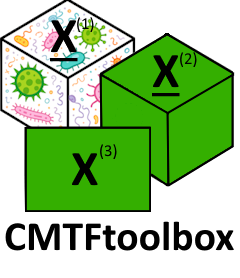

<!-- README.md is generated from README.Rmd. Please edit that file -->

# CMTFtoolbox <a href="https://grvanderploeg.com/CMTFtoolbox/"></a>

<!-- badges: start -->

[](https://app.codecov.io/gh/GRvanderPloeg/CMTFtoolbox?branch=master)
[](https://github.com/GRvanderPloeg/CMTFtoolbox/actions/workflows/R-CMD-check.yaml)

<!-- badges: end -->

## Overview

The `CMTFtoolbox` package provides R users with two data fusion methods
that have previously been presented in the MATLAB sphere.

- `cmtf_opt`: Coupled Matrix and Tensor Factorization (CMTF)
  (<doi:10.48550/arXiv.1105.3422>).
- `acmtf_opt`: Advanced Coupled Matrix and Tensor Factorization (ACMTF)
  (<doi:10.1186/1471-2105-15-239>).
- `acmtfr_opt`: ACMTF-regression (ACMTF-R) as described in van der Ploeg
  et al., 2025 (see citation below).

Both of these methods were implemented using the all-at-once
optimization approaches as described in the papers above. This
implementation was achieved using the S4 Tensor object from `rTensor`
and the various conjugate gradient approaches from `mize`. Other
features of the package include:

- `ACMTF_modelSelection`: Combined random initialization and
  cross-validation approach for determining the correct number of
  components in ACMTF.
- `ACMTFR_modelSelection`: Combined random initialization and
  cross-validation approach for determining the correct number of
  components in ACMTF-R.
- `npred`: Prediction of Y for a new sample using an existing ACMTF-R
  model.
- `Georgiou2025`: An example dataset containing a tensor of inflammatory
  mediator data and a matrix of tooth microbiome data in a cohort of
  apical periodontitis patients (<doi:10.1111/iej.13854> and
  <doi:10.1111/iej.13912>).

## Installation

The `CMTFtoolbox` package can be installed from CRAN using:

``` r
install.packages("CMTFtoolbox")
```

## Development version

You can install the development version of `CMTFtoolbox` from
[GitHub](https://github.com/) with:

``` r
# install.packages("devtools")
devtools::install_github("GRvanderPloeg/CMTFtoolbox")
```

## Citation

Please use the following citation when using this package:

- van der Ploeg, G. R., White, F. T. G., Jakobsen, R. R., Westerhuis,
  J., Heintz-Buschart, A., & Smilde, A. (2024). ACMTF-R: supervised
  multi-omics data integration uncovering shared and distinct
  outcome-associated variation. bioRxiv. 2025.07.28.667162;
  <doi:10.1101/2025.07.28.667162>

## Usage

``` r
library(CMTFtoolbox)

set.seed(123)
numComponents = 3
I = 108
J = 100
K = 10
L = 100
A = array(rnorm(I*numComponents), c(I, numComponents))  # shared subject mode
B = array(rnorm(J*numComponents), c(J, numComponents))  # distinct feature mode of X1
C = array(rnorm(K*numComponents), c(K, numComponents))  # distinct condition mode of X1
D = array(rnorm(L*numComponents), c(L, numComponents))  # distinct feature mode of X2
Y = matrix(A[,1])
lambdas = array(c(1, 1, 1, 0, 0, 1), c(2,3))

df1 = array(0L, c(I, J, K))
df2 = array(0L, c(I, L))
for(i in 1:numComponents){
  df1 = df1 + lambdas[1,i] * reinflateTensor(A[,i], B[,i], C[,i])
  df2 = df2 + lambdas[2,i] * reinflateMatrix(A[,i], D[,i])
}
datasets = list(df1, df2)
modes = list(c(1,2,3), c(1,4))
Z = setupCMTFdata(datasets, modes, normalize=TRUE)

cmtf_model = cmtf_opt(Z, 3)
acmtf_model = acmtf_opt(Z, 3)
acmtfr_model = acmtfr_opt(Z, Y, 3)
```
