```{r setup, include = FALSE}
# show grouped code output instead of single lines
# use '#>' for R outputs
knitr::opts_chunk$set(collapse = TRUE, comment = "#>")
library(data.table)
library(ggplot2)
```

# Initial Situation and Goal

In many cases, measurement curves are provided in groups. Data for the drop in concentration in a
liquid over time grouped by different materials are shown in the following graph, for example.

```{r GroupedData, echo=FALSE, fig.cap="Grouped Linear Data"}
n = 40
dtLinData = data.table(Material = rep(LETTERS[1:3], each = n)
                       , Time = rep(seq(0, 5, length.out = n), 3)
                       , Intercept = rep(10, 3*n)
                       , Slope = rep(c(-0.1, -0.3, -0.4), each = n)
                       )
dtLinData[, Measurement := Intercept + Time*Slope + rnorm(3*n, sd = 0.05)]
ggplot(data = dtLinData, mapping = aes(Time, Measurement, colour = Material)) + 
  geom_point()
```

A function, in this case a linear function, is to be fitted to each of these curves. The result is
shown in the next diagram.

```{r GroupedDataFun, echo=FALSE, fig.cap="Grouped Linear Data with Fitted Function"}
ggplot(data = dtLinData, mapping = aes(Time, Measurement, colour = Material)) + 
  geom_point() + 
  geom_abline(aes(colour = Material, slope = Slope, intercept = Intercept))
```

If possible, the fits should be made in one step and calculate quality measures for each group.

How do we realize this result in 'Cornerstone' using 'Fit Function' from 'CornerstoneR'?

# Fit Preselected Function

In this example, we will start with the 'Cornerstone' sample data set 'run01' to 'run26'. The data
contains 26 different voltage measurements over time, each in a separate file. After we have read
all files into a single dataset (see Fundamentals.pdf chapter 7.2.1.3 and 7.2.3) a scatterplot
shows the following graph.

```{r fitPreFunRunData, echo=FALSE, fig.cap="Fit Preselectable Function: Run Data"}
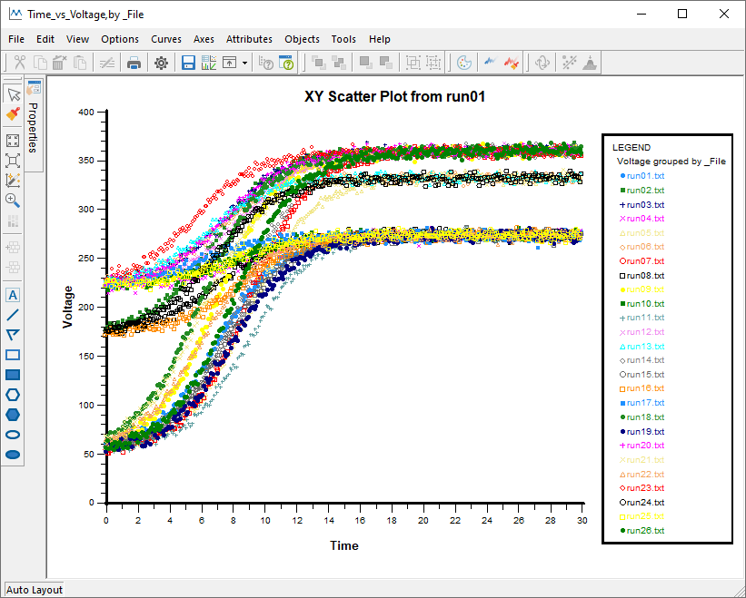
```

We open the corresponding dataset in 'Cornerstone' and choose the menu 'Analysis' -> 
'CornerstoneR' -> 'Fit Function via Nonlinear Regression' as shown in the following screenshot.

```{r fitPreFunMenu, echo=FALSE, fig.cap="Fit Preselectable Function: Menu"}
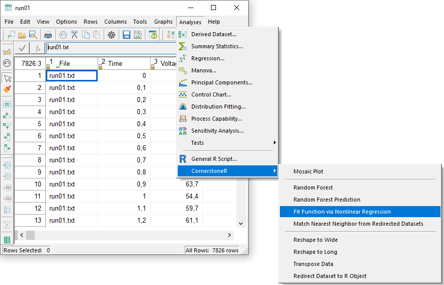
```

In the appearing dialog select variable 'Time' to predictors. 'Voltage' is the response variable.
We want a fit for each group in the variable '_File' and select it as group by.

```{r fitPreFunVarSel, echo=FALSE, fig.cap="Fit Preselectable Function: Variable Selection"}
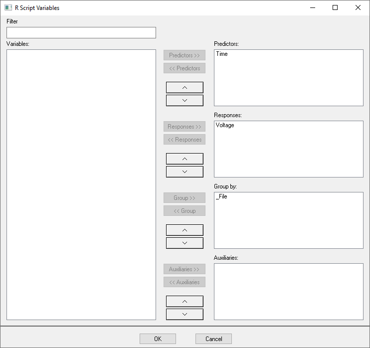
```

'OK' confirms your selection and the following window appears.

```{r fitPreFunRScript, echo=FALSE, fig.cap="Fit Preselectable Function: R Script"}
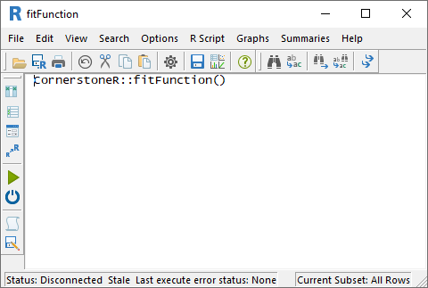
```

Before we start the script it is necessary to select the function we want to fit. To do this we
open the menu 'R Script' -> 'Script Variables'. 

```{r fitPreFunRScriptVarsMenu, echo=FALSE, fig.cap="Fit Preselectable Function: R Script Variables Menu"}
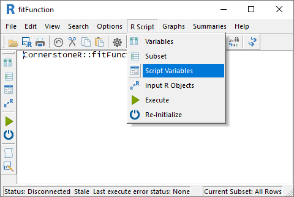
```

In the appearing dialog we select the logistic function 'Logistic' instead of 'User Defined'.

```{r fitPreFunRScriptVars, echo=FALSE, fig.cap="Fit Preselectable Function: R Script Variables"}
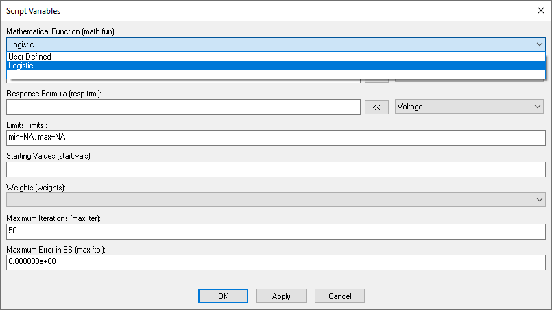
```

A selected function other than 'User defined' gets its settings like predictor and response from 
the variable selection at the start. Additional settings like starting values use integrated 
calculations. Limits and Weights are topics in the 'Special Situations' chapter. 'Maximum 
Iterations' and 'Maximum Error in SS' are stop criteria and can be adjusted if needed.

Now close this dialog via 'OK' and clicking the execute button (green arrow) or choose the menu 
'R Script' -> 'Execute' and all calculations are done via 'R'. Calculations are done if the text 
at the lower left status bar contains 'Last execute error state: OK'. Our result is available 
via the menus 'Summaries' as shown in the following screenshot.

```{r fitPreFunSummaries, echo=FALSE, fig.cap="Fit Preselectable Function: Result Menu"}
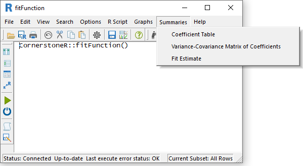
```

The menu 'Fit Estimate' opens a dataset with the group ('_File'), the original response 
('Voltage'), the fitted value ('Fitted'), and the corresponding residuals ('Residuals'). To create 
a graph with the function fit we have to add the predictor ('Time') from the parent dataset via 
the menu 'Columns' -> 'Add' -> 'From Parent'. A line graph with 'Time' as predictor, 'Fitted' as 
response, and '_File' as grouping variable results in the following graph.

```{r fitPreFunFitted, echo=FALSE, fig.cap="Fit Preselectable Function: Fitted Data"}
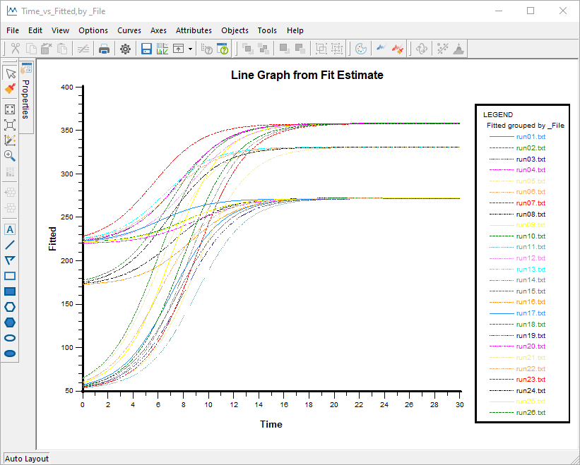
```

To visualize the start end end of each logistic function we can also use a scatter plot of the 
coefficients 'a' and 'b' as shown in the following graph.

```{r fitPreFunCoeffAB, echo=FALSE, fig.cap="Fit Preselectable Function: Scatterplot of Coefficients 'a' and 'b'."}
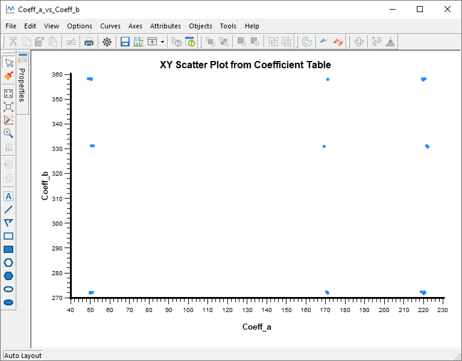
```


# Fit User Defined Function

For this example we open the 'Dissolution' sample dataset in 'Cornerstone' from the 'Regression'
subdirectory. This dataset is in wide format and we converted to long format using [reshape 
grouped data to long](reshape.html). As a result we get a dataset like in the following screenshot.
I renamed the columns 'variable1' and 'variable2' to 'group1' and 'group2' for a better 
identification.

```{r fitUserFunData, echo=FALSE, fig.cap="Fit User Defined Function: Dissolution Data"}
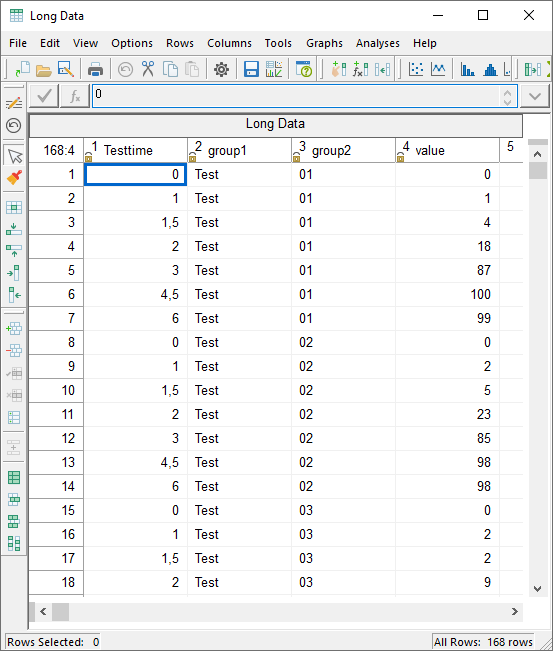
```

From this dataset in 'Cornerstone' we start the to fit a function like in the first example via 
the menu 'Analysis' -> 'CornerstoneR' -> 'Fit Function via Nonlinear Regression'. In the 
appearing dialog we select 'Testtime' as predictor, 'value' as response, and 'group1' and 'group2' 
as grouping variables like in the following screenshot.

```{r fitUserFunVarSel, echo=FALSE, fig.cap="Fit User Defined Function: Variable Selection"}
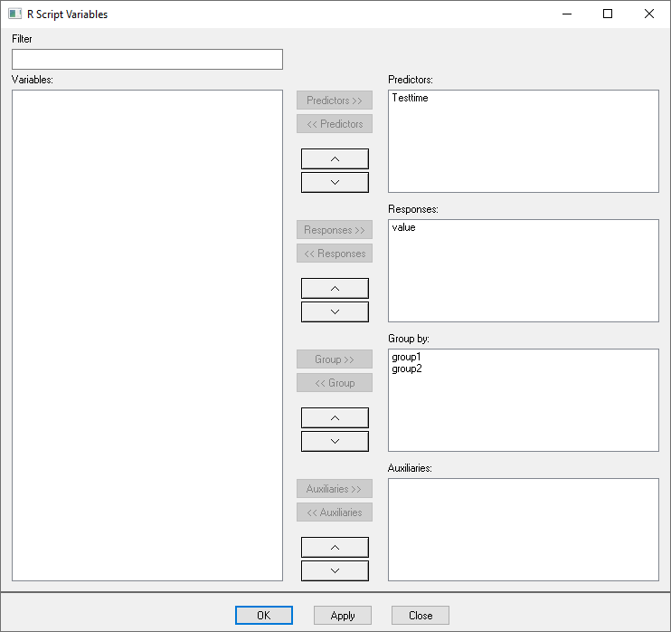
```

After 'OK' the known 'R Script' dialog appears. Here we select the menu 'R Script' -> 'Script 
Variables' and use now the default setting 'User Defined' to fit a Weibull model to the 
Dissolution data.

```{r fitUserFunScriptVars, echo=FALSE, fig.cap="Fit User Defined Function: Script Variables"}
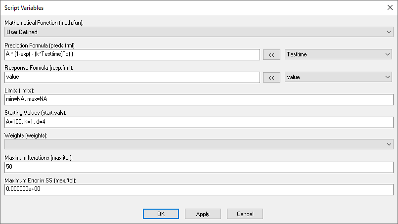
```

The influence and target formula together form an equation of the form f(y)=g(x). In our case 
we set the prediction formula (right-hand side g(x)) to the formula of the Weibull model as shown 
in the screenshot. The response formula (left-hand side f(y)) is solely our response. For both 
text boxes we can use the button '<<' and the drop-down box arranged on the left to add variables 
in a simple way. We can also add a function to the response formula like 'log(value)' if it 
improves the fit. As last step we set start values for each variable.

Now we close this dialog via 'OK' and execute the script (green arrow) by the menu 'R Script' -> 
'Execute'. One result is the dataset with all coefficients for the 24 groups as shown in the 
following screenshot.

```{r fitUserFunCoeffDS, echo=FALSE, fig.cap="Fit User Defined Function: Coefficient Table"}
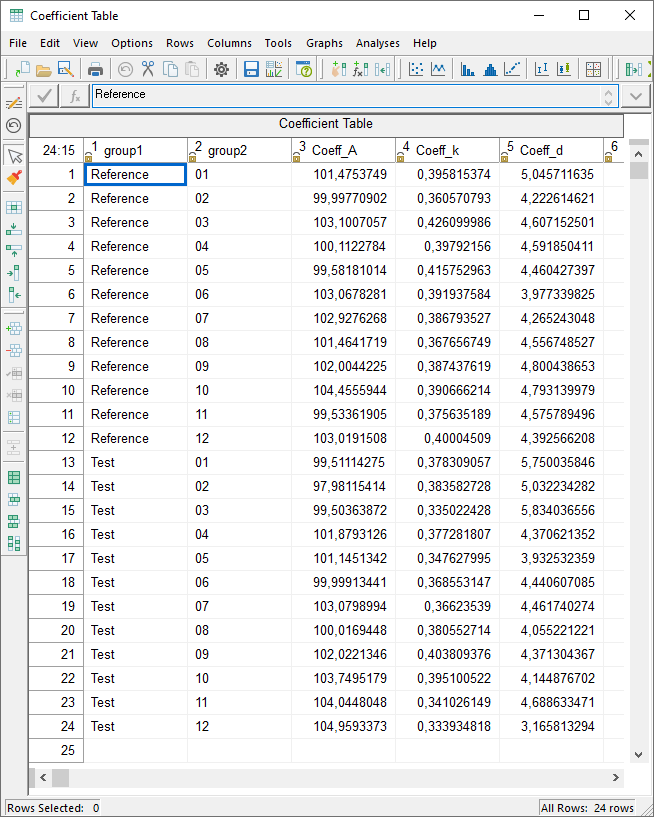
```

From this dataset it is possible, for example, to create a multi-vari chart of the first 
coefficient, as shown in the following graph.

```{r fitUserFunMulitVari, echo=FALSE, fig.cap="Fit User Defined Function: Multi-Vari Chart Coefficient 'A'"}
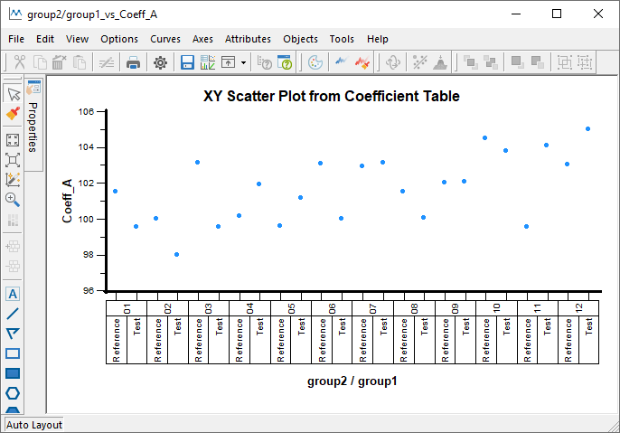
```

# Special Situations

This chapter briefly discusses special situations which can be handled via 'fitFunction'.

## Limits: Flattened Sinusoidal Oscillation

Assume a situation where your data looks like the curve in the following graph.

```{r fitFunLimitsDataGraph, echo=FALSE, fig.cap="Fit Function: Flattened Sinusoidal Oscillation"}
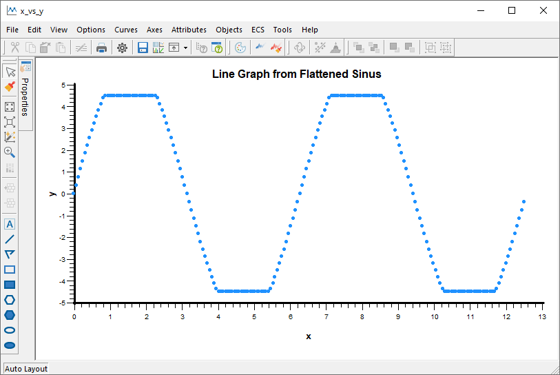
```

Obviously the data is based on a sinusoidal oscillation which was censored, e.g., by a measuring 
instrument. The poor fit of a sinusoidal function is shown in the next graph.

```{r fitFunLimitsSinGraph, echo=FALSE, fig.cap="Fit Function: Fitted Sinusoidal Oscillation"}
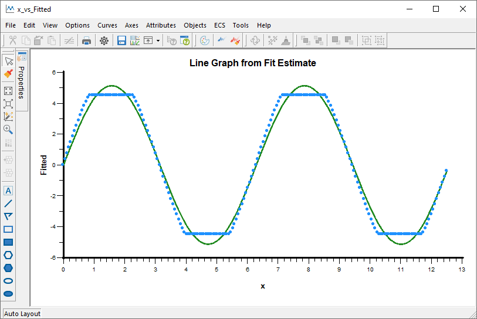
```

Limits reflect this behavior and can be handled like an additional coefficient. The following 
screenshot shows the use of a coefficient 'c' for the 'min' and 'max' limit.

```{r fitFunLimitsScriptVariables, echo=FALSE, fig.cap="Fit Function: Script Variables"}
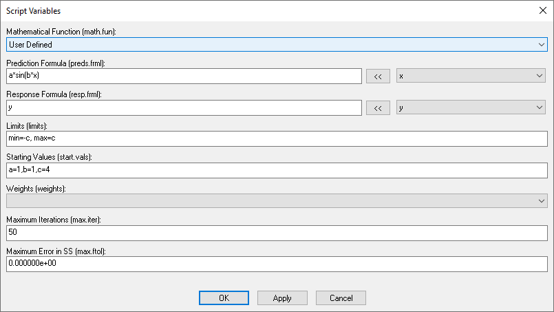
```

The resulting fit is shown in the final graph.

```{r fitFunLimitsSinLimitGraph, echo=FALSE, fig.cap="Fit Function: Fitted Sinusoidal Oscillation with Limits"}
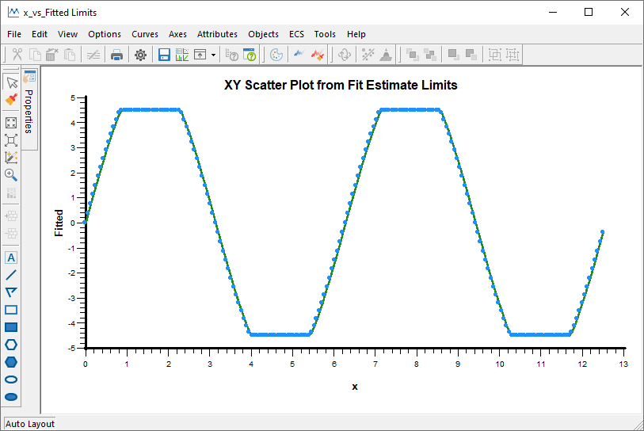
```


## Weights: Small Example

Fitting a linear function (green) to data in a hyperbolic form (blue) results in the following 
graph.

```{r fitFunWeightsExample, echo=FALSE, fig.cap="Fit Function: Fit Linear Function on Hyperbolic Data"}
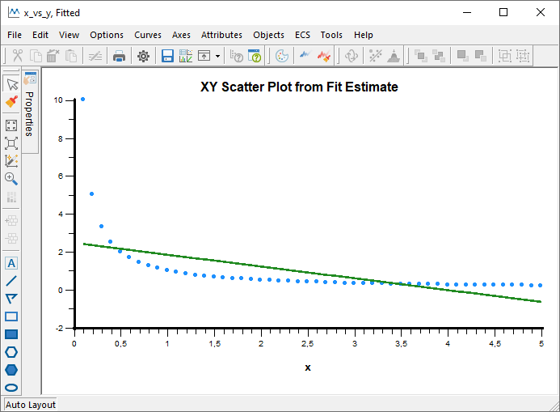
```

Generalizing the nonlinear least square algorithm to a weighted fit is done when you select a 
'Weight' variable in the 'Script Variables' dialog as shown in the following screenshot.

```{r fitFunWeightsScriptVars, echo=FALSE, fig.cap="Fit Function: Script Variables"}
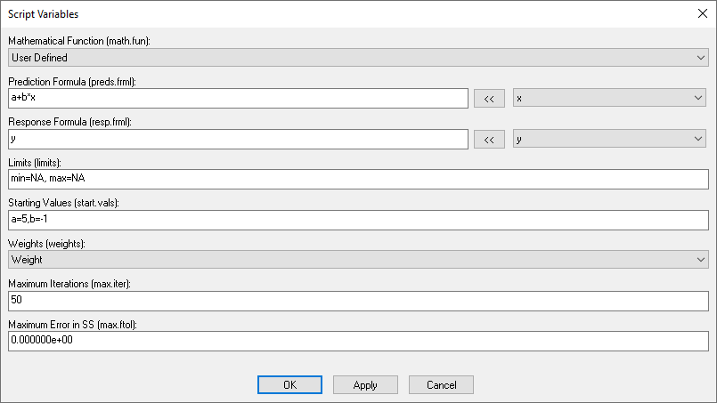
```

The underlying variable contains a high weighting of data in the margin and a low weighting of 
data in the middle. This results in the following graph.

```{r fitFunWeightsWeight, echo=FALSE, fig.cap="Fit Function: Weighted Linear Fit on Hyperbolic Data"}
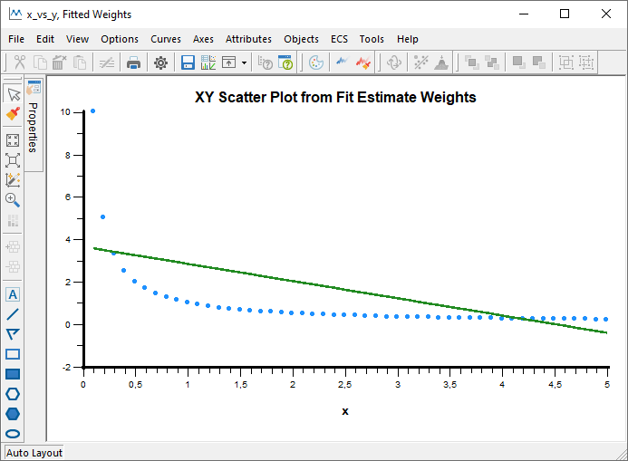
```

The line is shifted accordingly by the weighting in the margin.
