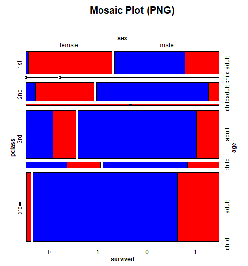
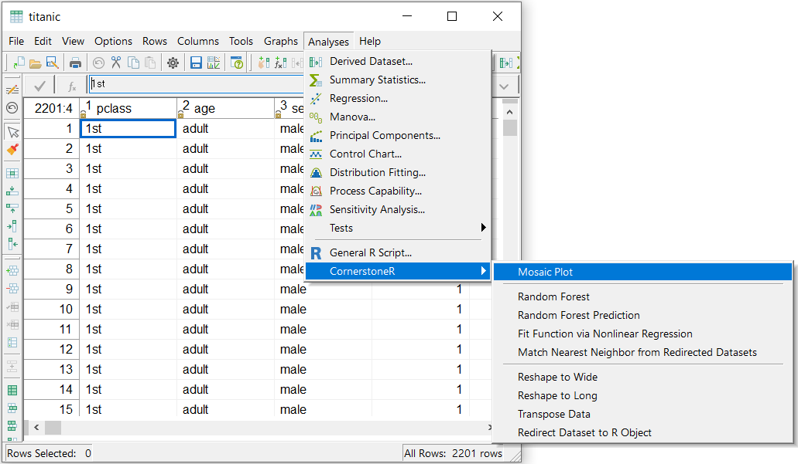
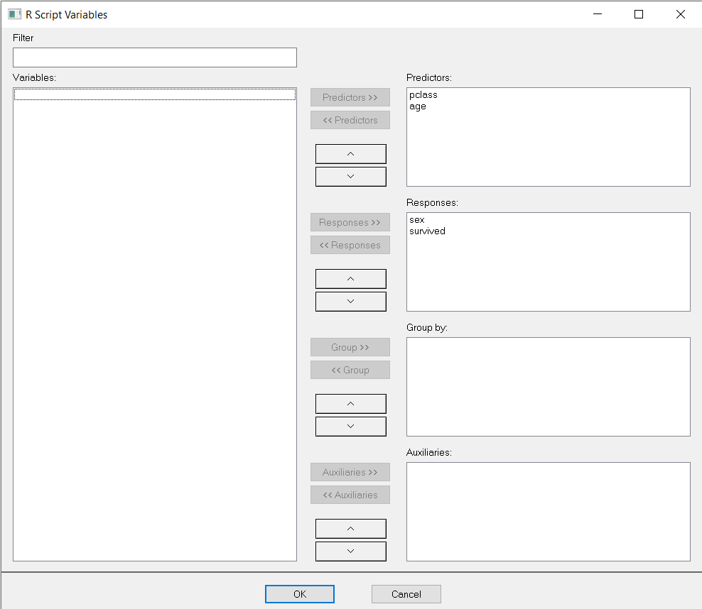
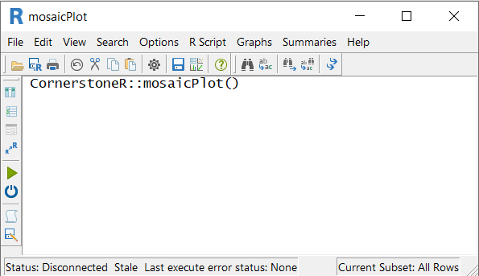
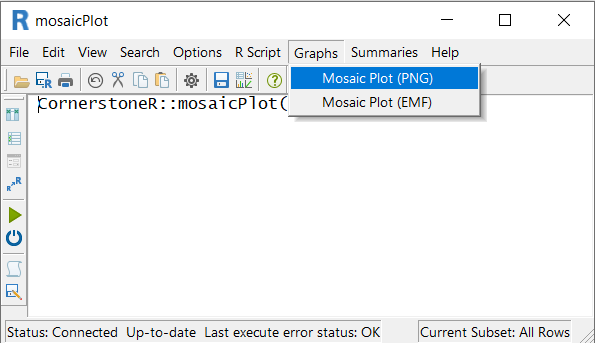

```{r setup, include = FALSE}
# show grouped code output instead of single lines
# use '#>' for R outputs
knitr::opts_chunk$set(collapse = TRUE, comment = "#>")
```

# Initial Situation and Goal

One way to get a view on the structure in categorical data is the mosaic plot.
An example of this type of data is the dataset 'Titanic' which is available in the demo data
within 'Cornerstone'. A possible result is the following graph.

```{r mosaicPlotTitanic, echo=FALSE, fig.cap="Mosaic Plot of 'Titanic' data"}

```

How do we realize this result in 'Cornerstone' using 'Mosaic Plot' from 'CornerstoneR'?


# Cornerstone Workflow

To achieve this result in 'Cornerstone' open a dataset, e.g. 'Titanic' and choose menu 
'Analysis' -> 'CornerstoneR' -> 'Mosaic Plot' as shown in the following screenshot.

```{r mosaicPlotMenu, echo=FALSE, fig.cap="Mosaic Plot: Menu"}

```

In the appearing dialog select variable 'pclass' and 'age' to predictors. 'sex' and 'survived' are
the response variables.

```{r mosaicPlotVariables, echo=FALSE, fig.cap="Mosaic Plot: Variable Selection"}

```

'OK' confirms your selection and the following window appears.

```{r mosaicPlotRScript, echo=FALSE, fig.cap="Mosaic Plot: R Script"}

```

Now, click the execute button (green arrow) or choose the menu 'R Script' -> 'Execute' and
all calculations are done via 'R'. Calculations are done if the text at the lower left status
bar contains 'Last execute error state: OK'. Our result is available via the menu 'Graphs'
-> 'Mosaic Plot (PNG)' or 'Mosaic Plot (EMF)' as shown in the following screenshot.

```{r mosaicPlotResultMenu, echo=FALSE, fig.cap="Mosaic Plot: Result Menu"}

```

After clicking this menu a 'Cornerstone' graph with the mosaic plot from R opens.

```{r mosaicPlotResultGraph, echo=FALSE, fig.cap="Mosaic Plot: Result Graph"}

```
