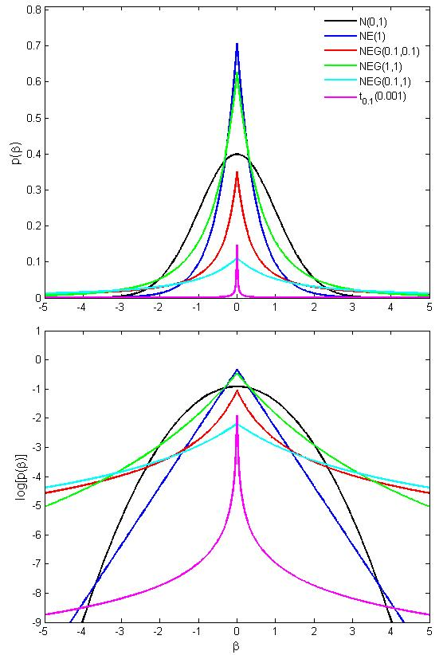

---
title: "EBglmnet Vignette"
author: 
  - Anhui Huang
  - Dianting Liu
date: "Jan. 15, 2016"
output:
  pdf_document:
    fig_caption: yes
    toc: yes
    toc_depth: 3
vignette: >
  %\VignetteIndexEntry{EBglmnet Vignette}
  %\VignetteEngine{knitr::rmarkdown}
  %\usepackage[utf8]{inputenc}    
---

<!-- 
%\VignetteEngine{knitr::knitr} 
%\VignetteIndexEntry{An Introduction to EBglmnet}
--> 

<a id="top"></a>


> [Introduction](#intro)

> [Installation](#install)

> [Quick Start](#qs)

> [GLM Family](#glm)

> [Prior, Hyperparameters and Epistasis](#prior)

> [Example of p>n Data](#example)


<a id="intro"></a>

## Introduction 

#### Acronyms and Concepts 
<br>  
<br>
EBglmnet is a package that implements the empirical Bayesian Lasso (EBlasso) and Elastic Net (EBEN) method for generalized linear models (GLMs). Additionally, in `EBlasso`, two different prior distributions are also developed: one with two-level hierarchical Normal + Exponential prior (denoted as `NE`), and the other one with three-level Normal + Exponential + Gamma prior (denoted as `NEG`). The major difference of the prior distributions are the probability density around zero and two tails:
\begin{itemize}
\item{Probability density around zero: higher probability density around zero will enforce stronger shrinkage effect, resulting in more sparse model (i.e., the model set the coefficients of predictors with small or noise prediction power to zero);}
\item{Probability density on tails: higher probability density around tails leave enough room for strong predictors to stay with none-zero coefficients.}
\end{itemize}


A good prior distribution is a balance of the aforementioned properties as shown in the Figure 1. Generally, `NE prior` leads to more non-zero predictors with smaller absolute coefficient values, while `NEG prior` leads to less non-zero predictors with stronger signals in terms of both absolute coefficient values as well as significance level.

{width=50%, height=55%}

The following names should not be confused with the `lasso` and `elastic net`  method from the comparison package `glmnet`:

`EBglmnet`: package that implements `EBlasso` and `EBEN` methods.

`EBlasso`: empirical Bayesian method with `lasso` prior distribution, which includes two sets of prior distributions: `NE` and `NEG`.

`EBEN`: empirical Bayesian method with `elastic net` prior distribution.

`lasso` prior: the hierarchical prior distribution that is equivalent with `lasso` penalty term when the marginal probability distribution for the regression coefficients is considered.

`elastic net` prior: the hierarchical prior distribution that is equivalent with `elastic net` penalty term when the marginal probability distribution for the regression coefficients is considered.

`EBlasso-NE`: `EBlasso` method with `NE` prior.

`EBlasso-NEG`: `EBlasso` method with `NEG` prior.


#### Generalized Linear Models (GLMs) 
<br>
<br>

In a GLM 

$$
 \boldsymbol{\eta}=\mu\mathit{\boldsymbol{I}}+\mathbf{X}\boldsymbol{\beta},
$$
where $\bf X$ is an $\it{n}\times\it{p}$ matrix containing $\it{p}$ variables for $\it{n}$ samples ($\it{p}$ can be $\gg \it{n}$). $\boldsymbol{\eta}$ is an $\it{n}\times 1$ linear predictor and is related to the response variable  $\mathit{\boldsymbol{y}}$ through a link function $\it{g}$: E($\mathit{\mathbf{y}} |\bf X$)=$\it{g}^{-1}$($\mu\mathit{\boldsymbol{I}} +\mathbf{X}\boldsymbol{\beta}$), and $\boldsymbol{\beta}$ is a $\it{p}\times 1$ vector of regression coefficients.
Depending on certain assumption of the data distribution on $\mathit{\boldsymbol{y}}$, the GLM is generally inferred through finding the set of model parameters that maximize the model likelihood function  $\mathit{p}$($\mathit{\boldsymbol{y}}|\mu, \boldsymbol{\beta}, \varphi$), where $\varphi$ denotes the other model parameters of the data distribution. However, such Maximum Likelihood (ML) approach is no longer applicable when $\it{p}\gg \it{n}$. With Bayesian lasso and Bayesian elastic net (EN) prior distribution on $\boldsymbol{\beta}$, `EBglmnet` solves the problem by inferring a sparse posterior distribution for  $\hat{\boldsymbol{\beta}}$, which includes exactly zero regression coefficients for irrelevant variables and both posterior mean and variance for non-zero ones. Comparing with the `glmnet` package, not only does `EBglmnet` provide features including both sparse outcome and hypothesis testing, simulation study and real data analysis in the reference papers also demonstrates the better performance in terms of Power of Detection (PD), False Discovery Rate (FDR), as well as Power Detecting Group Effects when applicable. While mathematical details of the `EBlasso` and `EBEN` methods can be found in the reference papers, the principle of the methods and differences on the prior distributions will be briefly introduced here.


### Lasso and its Bayesian Interpretation

Lasso applies a penalty term on the log likelihood function and solves for $\hat{\boldsymbol{\beta}}$ by maximizing the following penalized likelihood:

$$
\hat{\boldsymbol{\beta}} = \arg_{\boldsymbol{\beta}}\max\left[\log\mathit{p}(\mathit{\boldsymbol{y}}|\mu, \boldsymbol{\beta}, \varphi) -\lambda||\boldsymbol{\beta}||_1\right].
$$

The $\it{l_1}$ penalty term can be regarded as a mixture of hierarchical prior distribution:

$$
\beta_j  \sim \mathit{N}(0,\sigma_j^2),\\
\sigma_j^2  \sim \exp(\lambda), j = 1, \dots, p,
$$

and maximizing the penalized likelihood function is equivalent to maximizing the marginal posterior distribution of $\boldsymbol{\beta}$ :

$$
\hat{\boldsymbol{\beta}} = \arg_{\boldsymbol{\beta}}\max \log \mathit{p}(\boldsymbol{\beta}|\mathit{\boldsymbol{y}},\mathbf{X},\mu,\lambda, \varphi)\\
\approx\arg_{\boldsymbol{\beta}}\max \log\int\left[\mathit{p}(\mathit{\boldsymbol{y}}|\mu, \boldsymbol{\beta}, \varphi)\cdot (2\pi)^{-p/2}\lvert\mathbf{A}\rvert^{1/2}\exp\{-\frac{1}{2}\boldsymbol{\beta}^T\mathbf{A}\boldsymbol{\beta}\}\cdot \prod^p_{j=1}\lambda\exp\{-\lambda\sigma_j^2\}\right]d\boldsymbol{\sigma}^2,
$$

where $\mathbf{A}$ is a diagonal matrix with $\boldsymbol{\sigma}^{-2}$ on its diagonal. Of note, `lasso` integrates out the variance information $\boldsymbol{\sigma}^2$ and estimates a posterior mode $\hat{\boldsymbol{\beta}}$. The $\it{l_1}$ penalty ensures that a sparse solution can be achieved. In Bayesian lasso (Park and Casella, 2008), the prior probability distribution is also conditional on the residual variance so that it has a unique mode.

### Empirical Bayesian Lasso (`EBlasso`)

`EBglmnet` keeps the variance information, while still enjoying the sparse property by taking a different and slightly complicated approach as showed below using `EBlasso-NE` as an example:

In contrary to the marginalization on  $\boldsymbol{\beta}$, the first step in `EBlasso-NE` is to obtain a marginal posterior distribution for  $\boldsymbol{\sigma}^2$ :

$$
\mathit{p}(\boldsymbol{\sigma}^2|\mathit{\boldsymbol{y}},\mathbf{X},\mu,\lambda, \varphi) = \int c \left[\mathit{p}(\mathit{\boldsymbol{y}}|\mu, \boldsymbol{\beta}, \varphi)\cdot (2\pi)^{-p/2}\lvert\mathbf{A}\rvert^{1/2}\exp\{-\frac{1}{2}\boldsymbol{\beta}^T\mathbf{A}\boldsymbol{\beta}\}\cdot \prod^p_{j=1}\lambda\exp\{-\lambda\sigma_j^2\}\right]d\boldsymbol{\beta},
$$

where $c$ is a constant.
While the integral in `lasso` is achieved through the conjugated Normal + Exponential (NE) prior, the integral in `EBlasso-NE` is completed through mixture of two normal distributions:  $\it{p}$($\boldsymbol{\beta}|\boldsymbol{\sigma}^2$) and  $\mathit{p}$($\mathit{\boldsymbol{y}}|\mu, \boldsymbol{\beta}, \varphi$), and the latter one is typically approximated to a normal distribution through Laplace approximation if itself is not a normal PDF. Then the estimate $\hat{\boldsymbol{\sigma}}^2$ can be obtained by maximizing this marginal posterior distribution, which has the following form:

$$
\hat{\boldsymbol{\sigma}}^2 = \arg_{\boldsymbol{\sigma}^2}\max \log \mathit{p}(\boldsymbol{\sigma}^2|\mathit{\boldsymbol{y}},\mathbf{X},\mu,\lambda, \varphi)\\
= \arg_{\boldsymbol{\sigma}^2}\max \left[
\log\mathit{p}(\mathit{\boldsymbol{y}}|\mu, \boldsymbol{\sigma}^2, \varphi,\lambda)-\sum^p_{j=1}\lambda\sigma_j^2 + c\right].
$$

Given the constraint that $\boldsymbol{\sigma}^2 > 0$, the above equation essentially maximizes the $\it{l_1}$ penalized marginal likelihood function of $\boldsymbol{\sigma}^2$, which images the $\it{l_1}$ penalty in `lasso` with the beauty of producing a sparse solution for $\hat{\boldsymbol{\sigma}}^2$. Note that if $\hat{\sigma}_j^2 = 0$, $\hat{\beta}_j$ will also be zero and variable $\mathit{x}_j$ will be excluded from the model.  Finally, with the sparse estimate of $\hat{\boldsymbol{\sigma}}^2$, the posterior estimate of $\hat{\boldsymbol{\beta}}$ and other nuance parameters can then be obtained accordingly.


### Hierarchical Prior Distributions in `EBglmnet`

#### Prior 1: EBlasso-NE

$$
\beta_j  \sim \mathit{N}(0,\sigma_j^2),\\
\sigma_j^2  \sim \exp(\lambda), j = 1, \dots, p
$$

As illustrated above, assuming a Normal + Exponential hierarchical prior distribution on $\boldsymbol{\beta}$ (`EBlasso-NE`) will yield exactly the lasso prior. `EBlasso-NE` accommodates the properties of sparse solution and hypothesis testing given both the estimated mean and variance information in  $\hat{\boldsymbol{\beta}}$ and $\hat{\boldsymbol{\sigma}}^2$.  The NE prior is "peak zero and flat tails", which can select variables with relatively small effect size while shrinking most of irrelevant effects to exactly zero. `EBlasso-NE` can be applied to natural population analysis when effect sizes are relatively small.

#### Prior 2: EBlasso-NEG
The prior in `EBlasso-NE` has a relatively large probability mass on the nonzero tails, resulting in a large number of non-zero small effects with large $p$-values in simulation and real data analysis. We further developed another well studied conjugated hierarchical prior distribution under the empirical Bayesian framework, the Normal + Exponential + Gamma (NEG) prior:

$$
\beta_j  \sim \mathit{N}(0,\sigma_j^2),\\
\sigma_j^2  \sim \exp(\lambda),  \\
\lambda \sim gamma(a,b), j = 1, \dots,p
$$

Comparing with `EBlasso-NE`, the NEG prior has both large probability density centered at 0 and two tails, and will only yield nonzero regression coefficients for effects having relatively large signal to noise ratio. 

#### Prior 3: Elastic Net Prior for Grouping Effect

Similar to `lasso`, `EBlasso` typically selects one variable out of a group of correlated variables. While `elastic net` was developed to encourage a grouping effect by incorporating an $\it{l_2}$ penalty term, `EBglmnet` implemented an innovative `elastic net` hierarchical prior:

$$
\beta_j  \sim \mathit{N}\left[0,(\lambda_1 + \tilde{\sigma}_j^{-2})^{-1}\right], \\
\tilde{\sigma_j}^2  \sim generalized\ gamma(\lambda_1,\lambda_2), j = 1, \dots, p.
$$

The generalized gamma distribution has PDF: $f(\tilde{\sigma_j}^2|\lambda_1, \lambda_2) = c(\lambda_1\tilde{\sigma_j}^2 + 1)^{-1/2}\exp\{-\lambda_2\tilde{\sigma_j}^2\}, j=1,\dots,p$, with c being a normalization constant. The property of this prior can be appreciated from the following aspects:

##### (1): $\lambda_1 = 0$

When $\lambda_1 = 0$, the generalized gamma distribution becomes an exponential distribution: $f(\tilde{\sigma_j}^2|\lambda_2) = c\exp\{-\lambda_2\tilde{\sigma_j}^2\}, j=1,\dots,p$, with $c= \lambda_2$, and the elastic net prior is reduced to the two level `EBlasso-NE` prior.

##### (2): $\lambda_1 > 0$

When $\lambda_1 > 0$, the generalized gamma distribution can be written as a shift gamma distribution having the following PDF: $f(\tilde{\sigma_j}^2|a,b,\gamma) = \frac{b^a}{\Gamma(a)}(\tilde{\sigma_j}^2 - \gamma)^{a-1}\exp\{-b(\tilde{\sigma_j}^2 - \gamma)\}$, where $a=1/2, b = \lambda_2$, and $\gamma = -1/\lambda_1$. In (Huang A. 2015), it is proved that the marginal prior distribution of $\beta_j$ can be obtained as $p(\beta_j)\propto\exp\{-\frac{\lambda_1}{2}\beta_j^2 - \sqrt{2\lambda_2}|\beta_j|\}$, which is equivalent to the `elastic net` method in `glmnet`.  

##### (3): structure of $\boldsymbol{\sigma}^2$ and interpretation of the `elastic net` prior

Note that the prior variance for the regression coefficients has this form: $\boldsymbol{\sigma}^2=\tilde{\boldsymbol{\sigma}}^{2}/(\lambda_1\tilde{\boldsymbol{\sigma}}^2+\mathit{\boldsymbol{I}})$. This structure seems counter-intuitive at first glance. However, if we look at it from precision point of view, i.e.,  $\boldsymbol{\alpha} = \boldsymbol{\sigma}^{-2}$, and $\tilde{\boldsymbol{\alpha}} = \tilde{\boldsymbol{\sigma}}^{-2}$, then we have:


$$
\boldsymbol{\alpha} =\lambda_1\mathit{\boldsymbol{I}} +  \tilde{\boldsymbol{\alpha}}.
$$

The above equation demonstrates that we actually decompose the precision of the normal prior into a fixed component $\lambda_1$ shared by all explanatory variables and a random component $\tilde{\boldsymbol{\alpha}}$ that is unique for each explanatory variable. This design represents the mathematical balance between the inter-group independence and intra-group correlation among explanatory variables, and is aligned with the objective of sparseness while encouraging grouping effects.

The empirical Bayesian elastic net (EBEN) in `EBglmnet` is solved similarly as `EBlasso` using the aforementioned empirical Bayesian approach. Research studies presented in the reference papers demonstrated that `EBEN` has better performance comparing with `elastic net`, in terms of PD, FDR, and most importantly, Power of Detecting Groups. 

### `EBglmnet` Implementation and Usage

The `EBglmnet` algorithms use greedy coordinate descent, which successively optimizes the objective function over each parameter with others fixed, and cycles repeatedly until convergence. Key algorithms are implemented in C/C++ with matrix computation using the BLAS/LAPACK packages.  Due to closed form solutions for $\hat{\boldsymbol{\sigma}}^2$ in all prior setups and other algorithmic and programming techniques, the algorithms can compute the solutions very fast.

We recommend using `EBlasso-NEG` when there are a large number of candidate effects (eg., $\ge 10^6$ number of effects such as whole-genome epistasis analysis and GWAS), and using `EBEN` when groups of highly correlated variables are of interest.

The authors of `EBglmnet` are Anhui Huang  and Dianting Liu. This vignette describes the principle and usage of `EBglmnet` in R. Users are referred to the papers in the Reference section for details of the algorithms.

<a id="install"></a>

## Installation
 
`EBglmnet` can be installed directly from CRAN using the following command in R console:

```{r, eval=FALSE}
install.packages("EBglmnet", repos = "http://cran.us.r-project.org")
```

which will download and install the package to the default directory. Alternatively, users can download the pre-compiled binary file from CRAN and install it from local package.

[Back to Top](#top)

<a id="qs"></a>

## Quick Start
 
We will give users a general idea of the package by using a simple example that demonstrates the basis package usage. Through running the main functions and examining the outputs, users may have a better idea on how the package works, what functions are available, which parameters to choose, as well as where to seek help. More details are given in later sections.

Let us first clear up the workspace and load the `EBglmnet` package:
```{r}
rm(list = ls())
library(EBglmnet)
```
We will use an R built-in dataset `state.x77` as an example, which includes a matrix with 50 rows and 8 columns giving the following measurements in the respective columns: Population, Income, Illiteracy, Life Expectancy, Murder Rate, High School Graduate Rate, Days Below Freezing Temperature, and Land Area. The default model used in the package is the Gaussian linear model, and we will demonstrate it using Life Expectancy as the response variable and the remaining as explanatory variables. We create the input data as showed below, and users can load their own data and prepare variable `y` and `x` following this example.
```{r, eval=FALSE}
varNames = colnames(state.x77);
varNames
y= state.x77[,"Life Exp"]
xNames = c("Population","Income","Illiteracy", "Murder","HS Grad","Frost","Area")
x = state.x77[,xNames]
```
We fit the model using the most basic call to  `EBglmnet` with default prior
```{r, eval=FALSE}
set.seed(1)
output = EBglmnet(x,y,hyperparameters = c(0.1, 0.1))
```
"output" is a list containing all the relevant information of the fitted model. Users can examine the output by directly looking at each element in the list. Particularly, the sparse regression coefficients can be extracted as showed below:
```{r, eval=FALSE}
glmfit = output$fit
variables = xNames[glmfit[,1,drop=FALSE]]
cbind(variables,as.data.frame(round(glmfit[,2:5,drop=FALSE],4)))
```
The hyperparameters in each of the prior distributions control the number of non-zero effects to be selected, and  cross-validation (CV) is perhaps the simplest and most widely used method in deciding their values. `cv.EBglmnet` is the main function to do cross-validation, which can be called using the following code.
```{r, eval=FALSE}
cvfit = cv.EBglmnet(x, y)
```
`cv.EBglmnet` returns a `cv.EBglmnet` object, which is a list with all the ingredients of CV and the final fit results using CV selected hyperparameters. We can view the CV results, selected hyperparameters and the corresponding coefficients. For example, result using different hyperparameters and the corresponding prediction errors are shown below:
```{r, eval=FALSE}
cvfit$CrossValidation
```
The selected parameters and the corresponding fitting results are:
```{r, eval=FALSE}
cvfit$hyperparameters
cvfit$fit
```
[Back to Top](#top)

<a id="glm"></a>

## GLM Family

 
Two families of models have been developed in `EBglmnet`, the  `gaussian` family and the `binomial` family, which are essentially different probability distribution assumptions on the response variable `y`.

### Gaussian Model
`EBglmnet` assumes a Gaussian distribution on `y` by default, i.e., $\mathit{p}(\mathit{\boldsymbol{y}}|\mu, \boldsymbol{\beta}, \varphi) = N( \mu\mathit{\boldsymbol{I}} + \mathbf{X}\boldsymbol{\beta}, \sigma_0^2\boldsymbol{I})$, where $\varphi= \sigma_0^2$ is the residual variance. In the above example, both $\hat{\mu}$ and $\hat{\sigma_0}^2$ are listed in the output: 
```{r, eval=FALSE}
output$Intercept
output$residual
```
### Binomial Model
 
If there are two possible outcomes in the response variable, a binomial distribution assumption on `y` is available in `EBglmnet`, which has $\mathit{p}(\mathit{\boldsymbol{y}}|\mu, \boldsymbol{\beta}, \varphi)$ following a binomial distribution and $\varphi\in\emptyset$. Same as the widely-used logistic regression model, the link function is $\eta_i = logit(p_i)=\log(\frac{Pr(y_i)=1}{1-Pr(y_i=1)}), i = 1, \dots, n$. To run `EBglmnet` with binomial models, users need to specify the parameter `family` as `binomial`:
```{r, eval=FALSE}
yBinary = y>mean(y);
output = EBglmnet(x,yBinary,family="binomial", hyperparameters = c(0.1, 0.1))
```
For illustration purpose, the above codes created a binary variable `yBinary` by set the cutoff at the mean Life Expectancy value. 

[Back to Top](#top)

<a id="prior"></a>

## Prior and Hyperparameters

The three sets of hierarchical prior distribution can be specified by `prior` option in `EBglmnet`. By default, `EBglmnet` assumes the `lassoNEG` prior. The following example changes the prior via `prior` parameter:
```{r, eval=FALSE}
output = EBglmnet(x,yBinary,family="binomial", prior = "elastic net", hyperparameters = c(0.1, 0.1))
output$fit
```
Note that the hyperparameters setup is associated with a specific prior. In `lasso` prior, only one hyperparameter $\lambda$ is required, while in `elastic net` and `lassoNEG`, two hyperparameters need to be specified. For `EBEN` having the `elastic net` prior distribution, the two hyperparameters $\lambda_1$ and $\lambda_2$ are defined in terms of other two parameters $\alpha \in [0,1]$ and $\lambda>0$ same as in `glmnet` package, such that $\lambda_1 = (1-\alpha)\lambda$ and  $\lambda_2 = \alpha\lambda$. Therefore, users are asked to specify $hyperparameters=c(\alpha, \lambda)$. 


[Back to Top](#top)


<a id="example"></a>

## Example of p>n Data
### Gaussian Model with Main Effects
 We will demontrate the application of EBglmnet in multiple QTL mapping using a simulated F2 population, which is available along with EBglmnet package. The genotype of the F2 population is simulated  from cross of two inbred lines. A total of $p=481$ gentic markers were simulated to be evenly spaced on a large chromosome of 2400 centi-Morgan (cM) with an interval of d = 5 cM. Theoretically, two adjacent markers have a correlation coefficient $R = e^{-2d} = 0.9048$ since the Haldane map function is assumed. The dummy variable for the three genotypes, AA, Aa and aa of individual i at marker j was defined as $x_{ij} = 1, 0, -1$, respectively.  
```{r, eval=TRUE}
data(BASIS)#this is the predictors matrix
N = nrow(BASIS)
p = ncol(BASIS)
j = sample((p-2),1)
cor(BASIS[,c(j,j+1,j+2)]) #Correlation structure among predictors 
```

Let us first simulate a quantitative phenotype with population mean 100 and residual variance that contribute to 10% of population variance. Ten QTLs were simulated from the 481 markers, and effect sizes are randomly generated from [2,3]. We assume that QTLs were coincided with markers. If QTLs were not on markers, they may still be detected given the above correlation structure, although a slightly larger sample size may be needed to give the same PD:

```{r, eval=TRUE}
set.seed(1);
Mu = 100; #population mean;
nTrue = 10; # we assume 10 out of the 481 predictors are true causal ones
trueLoc	= sort(sample(p,nTrue));
trueEff = runif(nTrue,2,3); #effect size from 2-3
xbeta = BASIS[,trueLoc]%*%trueEff;
s2 =  var(xbeta)*0.1/0.9 #residual variance with 10% noise
residual = rnorm(N,mean=0,sd=sqrt(s2))
y = Mu + xbeta + residual;  
```

To demonstrate the performance of EBglmnet in analyzing dataset with $p>n$, we will analyze the simulated dataset using a smaller sample size $n=300$:
```{r, eval=FALSE}
n = 300;
index = sample(N,n); 
CV = cv.EBglmnet(x=BASIS[index,],y=y[index],family="gaussian",prior= "lassoNEG",nfold= 5)
```

With 5 fold CV, EBlasso-NEG identified the following effects:
```{r, eval=FALSE}
CV$fit
trueLoc
```

Comparing with the true QTL locations, EBlasso-NEG successfully identified all QTLs. Of note, an identified marker that is <20cM from a true QTL is generally not considered as a false effect, given the small distance and high genotype correlation. Since there is limited prior information in this simulation, other methods in EBglmnet will yield similar results. 


###  Binomial Model and Separation Problem
In many genetics and population analysis such as binary QTL mapping or GWAS, both genetic effects (eg., $\mathbf{X}$ takes values of 1, 0, -1 denoting three genotype values AA, Aa, aa) and response variable (eg., $\mathit{\boldsymbol{y}}$ takes values of 0 and 1 denoting the two phenotype classes) are discrete values. Separation problem (complete separation and semi-complete separation) occurs often in such data, especially when epistasis is considered due to the larger number of variables $p'=p(p+1)/2$. Of note, separation is a problem in logistic regression where there exist some coefficients $\boldsymbol{\beta}$ such that  $y_i=1$ whenever $\mathbf{x}_i^T\boldsymbol{\beta} >0$, and $y_i=0$ whenever $\mathbf{x}_i^T\boldsymbol{\beta} < 0,  i = 1, \dots, n$. Unless the phenotype is a Mendelian trait, finding a genetic factor/set of factors that perfectly predict the phenotype outcome is too good to be true. While separation problem has been well documented in many statiscal textbook (eg., Ch9 of Altman M, Gill J, Mcdonald M P. (2005)), it is less studied in high dimensional sparse modeling methods. We next examine the problem using lasso as an example.

####  Benchmarking using EBglmnet
In the simulated F2 population, if we consider both main and epistatic effects, there will be a total number $p' = 115,921$ candidate effects. We will randomly select 10 main and 10 interaction effects as true effects. we will use sample size $n = 300$, and also randomly generate effect sizes from unif[2,3]. Note that an epistatic effect is generated by dot product of two interacting main effects:
```{r, eval=TRUE}
n = 300;
set.seed(1)
index = sample(nrow(BASIS),n)
p = ncol(BASIS);
m = p*(p+1)/2;
#1. simulate true causal effects
nMain = 10;
nEpis  = 10;
mainLoc = sample(p,nMain);
episLoc = sample(seq((p+1),m,1),nEpis);
trueLoc = sort(c(mainLoc,episLoc)); #a vector in [1,m]
nTrue = length(trueLoc);
trueLocs = ijIndex(trueLoc, p); #two columns denoting the pair (i,j)
#2. obtain true predictors
basis = matrix(0,n,nTrue);
for(i in 1:nTrue)
{
	if(trueLocs[i,1]==trueLocs[i,2])
	{
		basis[,i] = BASIS[index,trueLocs[i,1]]
	}else
	{
		basis[,i] = BASIS[index,trueLocs[i,1]]*BASIS[index,trueLocs[i,2]]
	}
}
#3. simulate true effect size	
trueEff  = runif(nTrue,2,3);
#4. simulate response variables
xbeta = basis%*%trueEff;
vary = var(xbeta);
Pr = 1/(1+ exp( -xbeta));
y = rbinom(n,1,Pr);

```

Now we have the phenotype simulated. Let us demonstrate the data analysis using EBlasso-NE as an example. Given the significant larger number of candidate effects (200 times more effects), this will take a longer time for CV to finish  $(n_{folds} \times n_{hyperparameters} + 1)$ times of calling EBglmnet algorithm. In fact, the computational time is mostly determined by the number of nonzero effects selected by the model. This can be seen if a larger sample size is used (note: if you set $n=1000$, this will take several more hours to finish the $(n_{folds} \times n_{hyperparameters} + 1)$ times computation (Altough a higher PD will be obtained).
```{r}
CV = cv.EBglmnet(x=BASIS[index,],y=y,family="binomial",prior="lasso",nfold=5)
ind = which(CV$fit[,5]<=0.1)#p-value cutoff
CV$fit[ind,]
```
As discussed earlier, lasso prior assigns a large probability mass in the two tails, resulting in a large number of small effects with large $p$-values.


#### Separation Problem
Compared with `EBglmnet`, `glmnet` does not have a reasonable result in analyzing this dataset, partially because of the separation problem. Let us first show the result using lasso approach.

Since glmnet has no built-in facility for epistasis analysis, we will manually create a genotype matrix $\mathbf{X}$ containing all main and epistasis effects. 
```{r}
X = matrix(0,n,m);
X[,1:p] = BASIS[index,];
kk = p + 1;
for(i in 1:(p-1))
{
	for(j in (i+1):p)
	{
		X[,kk] = BASIS[index,i] * BASIS[index,j];
		kk = kk + 1;
	}
}
```

Let us analyze the dataset using lasso, examine the lasso selection path:
```{r}
library(glmnet);
alpha = 1
lambdaRatio = 1e-4; #same as in EBlasso
cv = cv.glmnet(X, y, alpha = alpha,family="binomial",nfolds = 5,lambda.min.ratio=lambdaRatio)
nLambda = length(cv$lambda)
nLambda
nbeta = rep(0,nLambda);
fit0 = cv$glmnet.fit;
for(i in 1:nLambda)
{
  nbeta[i] = length(which(fit0$beta[,i]!=0))
}
plot(nbeta,xlab=expression(paste(lambda, " in lasso selection path(n=300,p=115,921)")),
     ylab="No. of nonzero effects",xaxt="n")#
ticks = seq(1,nLambda,10)
axis(side=1, at= ticks,labels=round(cv$lambda[ticks],5), las=1,cex.axis = 0.5)
title("Number of nonzero effects in lasso selection path")
```


The result above demonstrated that lasso was not able to complete the selection path, and exited at the 81 out of 100 candidate $\lambda$s. From the scatterplot, it is shown that the number of nonzero effects has stablized after the 25th $\lambda$ due to semi-complete separation that fewer candidate variables can be selected, even lambda is decreasing exponentially (will be explained in lasso discarding rule in the ensuing section). See the `glmnet` user manual for the built-in exit mechanism.

We can also take  a closer look by re-fitting the lasso selected effects in an ordinary logistic regression model, which will explicitly print out the warning message of separation:

```{r}
lambda= cv$lambda.min
coefs = fit0$beta
ind = which(cv$lambda==cv$lambda.min)
beta = coefs[,ind]
betaij = which(beta!=0)
Xdata = X[,betaij];
colnames(Xdata) = betaij; 
refit = glm(y ~ Xdata, family = binomial(link = "logit"))#separation occurs
```

The warning message describes that separation occurs. Separation problem is detrimental to lasso/elastic net due to the discarding rules (Tibshirani et al., 2012). Of note, the lasso discarding rule for logistic regression states that variable $\boldsymbol{x}_j$ can be discarded if:

$$
|\mathit{\boldsymbol{x}}_j^T(\mathit{\boldsymbol{y}} - \boldsymbol{p}(\hat{\boldsymbol{\beta}}_{\lambda_{k-1}}))| < 2\lambda - \lambda_{k-1}, \forall j
$$

where $\hat{\boldsymbol{\beta}}_{\lambda_{k-1}}$ is the nonzero coefficients found by lasso using $\lambda_{k-1}$ at the $k-1$ step. Suppose with $\lambda_{k-1}$, lasso selected a set of variables $\tilde{\boldsymbol{X}}$ that perfectly separate $\mathit{\boldsymbol{y}}$, which lead to $\mathit{\boldsymbol{y}} - \boldsymbol{p}(\hat{\boldsymbol{\beta}}_{\lambda_{k-1}}) \approx 0$. Then, the above discarding rule will have most of the remaining variables discarded. Note that $\mathit{\boldsymbol{y}} - \boldsymbol{p}(\hat{\boldsymbol{\beta}}_{\lambda_{k-1}})$ will not be exactly 0 due to numerical estimations, and as $\lambda$ decreases exponentially, a few variables can still pass the discarding rule (shown from 25th - 81st $\lambda$ in the above example). However, finding a genetic factor/set of factors that perfectly predict the phenotype outcome is unlikely, and it is the case given the simulation setup. With the perfect separation provided by $\tilde{\boldsymbol{X}}$, other true effects cannot be selected into the zon-zero set, resulting in limited PD.

EBglmnet doesn't implement such type of discarding rule and is more numerically stable. In the above simulation, EBglmnet can still identify several true effects with reasonable FDR. More simulation results using EBglmnet are available in (Huang et al., 2013) and the EBglmnet Application Note.


## References
 
### EBglmnet Algorithms:

<p>Anhui Huang, Shizhong Xu, and Xiaodong Cai. (2015). <br>
Empirical Bayesian elastic net for multiple quantitative trait locus mapping.</a><br>
<em>Heredity</em>, Vol. 114(1), 107-115.</p>
<p>Anhui Huang, Shizhong Xu, and Xiaodong Cai. (2014a).<br>
Whole-genome quantitative trait locus mapping reveals major role of epistasis on yield of rice.</a><br>
<em>PLoS ONE</em>, Vol. 9(1) e87330.</p>
<p>Anhui Huang, Eden Martin, Jeffery Vance, and Xiaodong Cai (2014b).<br>
Detecting genetic interactions in pathway-based genome-wide association studies.</a><br>
<em>Genetic Epidemiology</em>, 38(4), 300-309.</p>
<p> Anhui Huang, Shizhong Xu, and Xiaodong Cai. (2013). <br>
Empirical Bayesian LASSO-logistic regression for multiple binary trait locus mapping. </a><br>
<em>BMC Genetics</em>, 14(1),5.</p>
<p>Xiaodong Cai, Anhui Huang, and Shizhong Xu (2011). <br>
Fast empirical Bayesian LASSO for multiple quantitative trait locus mapping. </a><br>
<em>BMC Bioinformatics</em>, 12(1),211.</p>

## Lasso and glmnet package
<p>Tibshirani, R., Bien, J., Friedman, J., Hastie, T., Simon, N., Taylor, J.,and Tibshirani, R.J., 2012. Strong rules for discarding predictors in lasso-type problems.  J. R. Stat. Soc. Series B. Stat. Methodol. 74, 245-266.</p>
<p>Friedman, J., T. Hastie, et al. (2010).  Regularization paths for generalized linear models via coordinate descent.  J. Stat. Softw. 33(1): 1-22.</p>
<p>Park, T. and G. Casella (2008). The Bayesian lasso. J. Am. Stat. Assoc. 103(482): 681-686.</p>
<p>Yi, N., and S. Xu (2008).  Bayesian LASSO for quantitative trait loci mapping. Genetics 179(2): 1045-1055.</p>
<p>Zou, H., and T. Hastie (2005). Regularization and variable selection via the elastic net. J. Roy. Stat. Soc. B. Met. 67(2): 301-320.</p>
<p>Tibshirani, R. (1996). Regression shrinkage and selection via the lasso. J. Roy. Stat. Soc. B. Met. 58(1): 267-288.</p>

