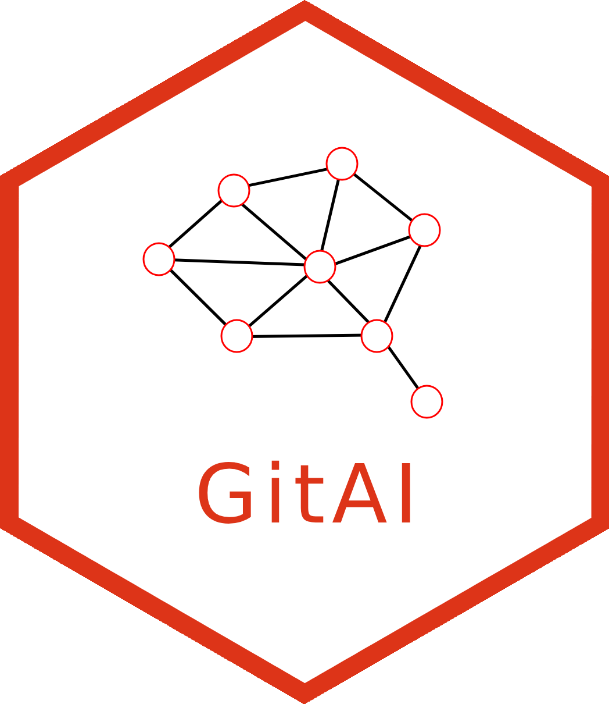

<!-- README.md is generated from README.Rmd. Please edit that file -->

# GitAI 

<!-- badges: start -->

[](https://app.codecov.io/gh/r-world-devs/GitAI)
[](https://github.com/r-world-devs/GitAI/actions/workflows/R-CMD-check.yaml)
<!-- badges: end -->

> The goal of `GitAI` is to **extract knowledge from Git repositories**
> with the use of AI/LLM (Large Language Models).

## Motivation

Large organizations need to deal with massive number of git repositories
(both internal and external). Those repositories can be hosted on
different platforms (like `GitHub` and `GitLab`).

It is very difficult or even impossible to review all those repositories
manually, especially if one needs to perform an exploratory search, not
knowing the exact keywords that should be used.

Because of that the reusability of the knowledge (and code) hidden in
the repositories is a constant challenge.

## Solution

We propose the `GitAI` framework written in R.

It is applicable to multiple use cases related to extracting knowledge
from Git repositories. At the same time, is IT infrastructure agnostic.
It is designed to work with different backends, LLMs, embeddings models,
and vector databases. Adapting to particular backends may need
implementation of new classes, but the core functionality stays the
same.

## Workflow

Typical `GitAI` workflow looks like that:

1.  Set up your project.
    1.  Set up your project scope (Git repositories).
    2.  Select content type of interest (files and file types).
    3.  Choose your LLM backend.
    4.  Define the LLM prompts.
    5.  (Optional) Choose embedding model and vector database provider.
2.  Process content of all repositories with a single function call.
    1.  (Optional) If vector database is setup, the results will be
        stored there.
3.  Use the information extracted from files content from git
    repositories.
    1.  (Optional) If results are stored in vector database, they can be
        searched using *semantic search* or used as a part of a RAG
        (*Retrieval Augmented Generation*) prompt.

## Installation

You can install the development version of `GitAI` from
[GitHub](https://github.com/) with:

``` r
# install.packages("pak")
pak::pak("r-world-devs/GitAI")
```

## Simplified example (without vector database usage)

``` r
library(GitAI)
```

Let’s set up a project `fascinating_project` that will extract some
summaries from the content of the `README.md` files in the few selected
git repositories.

``` r
options(ellmer_timeout_s = 120)
verbose_off()
my_project <- initialize_project("fascinating_project") |>
  set_github_repos(
    repos = c(
      "r-world-devs/GitStats", 
      "r-world-devs/GitAI", 
      "openpharma/DataFakeR"
    )
  ) |>
  add_files(files = "README.md") |>
  set_llm() |>
  set_prompt("Write one-sentence summary for a project based on given input.")
#> Warning: The `seed` argument of `chat_openai()` is deprecated as of ellmer 0.2.0.
#> ℹ Please use the `params` argument instead.
#> ℹ The deprecated feature was likely used in the GitAI package.
#>   Please report the issue to the authors.
#> This warning is displayed once every 8 hours.
#> Call `lifecycle::last_lifecycle_warnings()` to see where this warning was
#> generated.
```

Now, let’s get the results and print them.

``` r
results <- process_repos(my_project)

purrr::walk(results, function(result) {
  result$text |> stringr::str_wrap(width = 80) |> cat("\n\n")
})
#> GitStats is an R package that allows users to uniformly extract and analyze
#> git data from GitHub and GitLab, including repositories, commits, issues, and
#> R package usage, enabling the generation of basic statistics and insights into
#> version control activities. 
#> 
#> `GitAI` is an R-based framework designed to harness AI and Large Language
#> Models for extracting and summarizing knowledge from multiple Git repositories
#> efficiently, addressing the challenges of manual review and knowledge
#> reusability in large organizations. 
#> 
#> DataFakeR is an R package that enables users to generate realistic fake datasets
#> while preserving specific attributes and dependencies based on a configurable
#> schema, facilitating data simulation for testing and validation purposes.
```

## See also

Our `GitAI` uses under the hood the `GitStats` R package. If you want to
use it directly for pulling git data, check out:
<https://r-world-devs.github.io/GitStats/>
