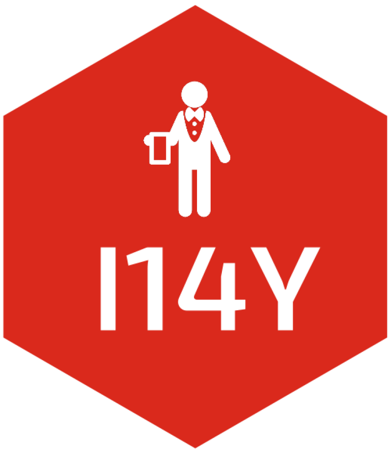

<!-- README.md is generated from README.Rmd. Please edit that file -->

# I14Y 

<!-- badges: start -->

[](https://CRAN.R-project.org/package=I14Y)
[](https://cran.r-project.org/package=I14Y)
[](https://github.com/lgnbhl/I14Y/actions/workflows/R-CMD-check.yaml)
[](https://www.linkedin.com/in/FelixLuginbuhl)
[](https://app.codecov.io/gh/lgnbhl/I14Y?branch=main)
<!-- badges: end -->

Search and download official Swiss metadata from the [I14Y
interoperability plateform](https://www.i14y.admin.ch) of Switzerland
using its public [IOP API](https://www.i14y.admin.ch/api/index.html) and
[Console API](https://apiconsole.i14y.admin.ch/public/v1/index.html) in
any language (“en”, “de”, “fr” or “it”).

## Install

``` r
install.packages("I14Y")

# development version from GitHub:
#remotes::install_github("lgnbhl/I14Y")
```

## Usage

``` r
library(I14Y)
```

### Get concepts and codelists

You can get the full concept public catalog with
`i14y_search_concept()`:

``` r
i14y_search_concept()
#> # A tibble: 500 × 31
#>    accessRights businessEvents conceptValueType id        identifiers lifeEvents
#>    <lgl>        <list>         <chr>            <chr>     <list>      <list>    
#>  1 NA           <list [0]>     CodeList         08d92cdc… <chr [1]>   <list [0]>
#>  2 NA           <list [0]>     CodeList         08d92cdc… <chr [1]>   <list [0]>
#>  3 NA           <list [0]>     CodeList         08d92cdc… <chr [1]>   <list [0]>
#>  4 NA           <list [0]>     CodeList         08d92cdc… <chr [1]>   <list [0]>
#>  5 NA           <list [0]>     CodeList         08d92cdc… <chr [1]>   <list [0]>
#>  6 NA           <list [0]>     CodeList         08d9407c… <chr [1]>   <list [0]>
#>  7 NA           <list [0]>     CodeList         08d93fc7… <chr [1]>   <list [0]>
#>  8 NA           <list [0]>     CodeList         08d9407c… <chr [1]>   <list [0]>
#>  9 NA           <list [0]>     CodeList         08d92cdc… <chr [1]>   <list [0]>
#> 10 NA           <list [0]>     Numeric          08d93fba… <chr [1]>   <list [0]>
#> # ℹ 490 more rows
#> # ℹ 25 more variables: publicationLevel <chr>, publicationLevelProposal <lgl>,
#> #   registrationStatus <chr>, registrationStatusProposal <lgl>, status <chr>,
#> #   themes <list>, type <chr>, validFrom <chr>, validTo <chr>, version <chr>,
#> #   description.de <chr>, description.en <chr>, description.fr <chr>,
#> #   description.it <chr>, description.rm <lgl>, publisherName.de <chr>,
#> #   publisherName.en <chr>, publisherName.fr <chr>, publisherName.it <chr>, …
```

Search for a specific concept in a given language (“en”, “de”, “fr” or
“it”) with `i14y_search_concept()`:

``` r
i14y_search_concept(query = "noga", language = "en")
#> # A tibble: 10 × 31
#>    accessRights businessEvents conceptValueType id        identifiers lifeEvents
#>    <lgl>        <list>         <chr>            <chr>     <list>      <list>    
#>  1 NA           <list [0]>     CodeList         08d9f1f9… <chr [1]>   <list [0]>
#>  2 NA           <list [0]>     CodeList         08d94604… <chr [1]>   <list [0]>
#>  3 NA           <list [0]>     CodeList         08d94604… <chr [1]>   <list [0]>
#>  4 NA           <list [0]>     CodeList         08d94604… <chr [1]>   <list [0]>
#>  5 NA           <list [0]>     CodeList         08d94604… <chr [1]>   <list [0]>
#>  6 NA           <list [0]>     CodeList         08dc481b… <chr [1]>   <list [0]>
#>  7 NA           <list [0]>     CodeList         08dd28d2… <chr [1]>   <list [0]>
#>  8 NA           <list [0]>     CodeList         08d94603… <chr [1]>   <list [0]>
#>  9 NA           <list [0]>     CodeList         08d94604… <chr [1]>   <list [0]>
#> 10 NA           <list [0]>     CodeList         08d9f6dd… <chr [1]>   <list [0]>
#> # ℹ 25 more variables: publicationLevel <chr>, publicationLevelProposal <lgl>,
#> #   registrationStatus <chr>, registrationStatusProposal <lgl>, status <chr>,
#> #   themes <list>, type <chr>, validFrom <chr>, validTo <lgl>, version <chr>,
#> #   description.de <chr>, description.en <chr>, description.fr <chr>,
#> #   description.it <chr>, description.rm <lgl>, publisherName.de <chr>,
#> #   publisherName.en <chr>, publisherName.fr <chr>, publisherName.it <chr>,
#> #   publisherName.rm <chr>, title.de <chr>, title.en <chr>, title.fr <chr>, …
```

As showed in the `conceptType` column, some concepts have the type
“CodeList”. You can get the codelist (i.e. the “content”) of a concept
using `i14y_get_codelist()`, with the value from the `id` column.

``` r
i14y_get_codelist(
  id = "08d94604-e058-62a2-aa25-53f84b974201" # for DV_NOGA_DIVISION
)
#> # A tibble: 88 × 48
#>    Code  ParentCode Name_de       Name_fr Name_it Name_rm Name_en Description_de
#>    <chr> <lgl>      <chr>         <chr>   <chr>   <lgl>   <chr>   <lgl>         
#>  1 01    NA         Landwirtscha… Cultur… Produz… NA      Crop a… NA            
#>  2 02    NA         Forstwirtsch… Sylvic… Silvic… NA      Forest… NA            
#>  3 03    NA         Fischerei un… Pêche … Pesca … NA      Fishin… NA            
#>  4 05    NA         Kohlenbergbau Extrac… Estraz… NA      Mining… NA            
#>  5 06    NA         Gewinnung vo… Extrac… Estraz… NA      Extrac… NA            
#>  6 07    NA         Erzbergbau    Extrac… Estraz… NA      Mining… NA            
#>  7 08    NA         Gewinnung vo… Autres… Altre … NA      Other … NA            
#>  8 09    NA         Erbringung v… Servic… Attivi… NA      Mining… NA            
#>  9 10    NA         Herstellung … Indust… Indust… NA      Manufa… NA            
#> 10 11    NA         Getränkehers… Fabric… Produz… NA      Manufa… NA            
#> # ℹ 78 more rows
#> # ℹ 40 more variables: Description_fr <lgl>, Description_it <lgl>,
#> #   Description_rm <lgl>, Description_en <lgl>, Annotation_ABBREV_Type <chr>,
#> #   Annotation_ABBREV_Title <lgl>, Annotation_ABBREV_URI <lgl>,
#> #   Annotation_ABBREV_Identifier <lgl>, Annotation_ABBREV_Text_de <chr>,
#> #   Annotation_ABBREV_Text_fr <chr>, Annotation_ABBREV_Text_it <chr>,
#> #   Annotation_ABBREV_Text_rm <lgl>, Annotation_ABBREV_Text_en <chr>, …
```

You can also get all concept metadata using `i14_get_concept()`. Note
that the object returned is a list (not a data.frame).

``` r
concept_list <- i14y_get_concept(
  id = "08d94604-e058-62a2-aa25-53f84b974201"
)

concept_list$description
#> $cultureCode
#> [1] "de"
#> 
#> $text
#> [1] "Zweite Ebene der Allgemeinen Systematik der Wirtschaftszweige (NOGA), bestehend aus Rubriken, die durch einen zweistelligen numerischen Code gekennzeichnet sind. Diese zweite Ebene wird durch die International Standard Industrial Classification of All Economic Activities (ISIC Rev.4) bestimmt."
```

### A concrete example

When using an official Swiss dataset, you can use I14Y to get
translations or additional information for a given category. For
example, let’s get the monthly income by gender and profession in 2022
using the BFS R package.

``` r
library(BFS)

income_by_job_and_gender_meta <- BFS::bfs_get_metadata(
  number_bfs = "px-x-0304010000_201"
)

income_by_job_and_gender <- BFS::bfs_get_data(
  number_bfs = "px-x-0304010000_201", 
  language = "de",
  query = list(
    Jahr = "2022", 
    Geschlecht = c("1", "2"),
    Wirtschaftsabteilung = income_by_job_and_gender_meta$values[[3]],
    'Zentralwert und andere Perzentile' = "1"
  )
)

income_by_job_and_gender
#> # A tibble: 164 × 5
#>    Jahr  Wirtschaftsabteilung                  Geschlecht Zentralwert und ande…¹
#>    <chr> <chr>                                 <chr>      <chr>                 
#>  1 2022  Wirtschaftsabteilung - Total          Frauen     Zentralwert           
#>  2 2022  Wirtschaftsabteilung - Total          Männer     Zentralwert           
#>  3 2022  05-43 Sektor 2: Produktion            Frauen     Zentralwert           
#>  4 2022  05-43 Sektor 2: Produktion            Männer     Zentralwert           
#>  5 2022  > 8 Gewinnung von Steinen und Erden,… Frauen     Zentralwert           
#>  6 2022  > 8 Gewinnung von Steinen und Erden,… Männer     Zentralwert           
#>  7 2022  > 9 Erbringung von Dienstleistungen … Frauen     Zentralwert           
#>  8 2022  > 9 Erbringung von Dienstleistungen … Männer     Zentralwert           
#>  9 2022  > 10 Herstellung von Nahrungs- und F… Frauen     Zentralwert           
#> 10 2022  > 10 Herstellung von Nahrungs- und F… Männer     Zentralwert           
#> # ℹ 154 more rows
#> # ℹ abbreviated name: ¹​`Zentralwert und andere Perzentile`
#> # ℹ 1 more variable: `Monatlicher Bruttolohn` <dbl>
```

Using I14Y, you can get the English, French or Italian translation of
the German NOGA division categories (with a bit of extra data
transformations):

``` r
library(dplyr)
library(stringr)
library(readr)

noga_division <- i14y_get_codelist(
  id = "08d94604-e058-62a2-aa25-53f84b974201" # for DV_NOGA_DIVISION
) |>
  mutate(Code = as.numeric(Code))

income_by_job_and_gender |>
  filter(!str_detect(Wirtschaftsabteilung, "Sektor")) |> # remove sectors
  mutate(Code = readr::parse_number(Wirtschaftsabteilung)) |> # extract code
  left_join(noga_division, by = "Code") |>
  select(Wirtschaftsabteilung, Name_en, Name_fr, Name_it)
#> # A tibble: 160 × 4
#>    Wirtschaftsabteilung                                  Name_en Name_fr Name_it
#>    <chr>                                                 <chr>   <chr>   <chr>  
#>  1 Wirtschaftsabteilung - Total                          <NA>    <NA>    <NA>   
#>  2 Wirtschaftsabteilung - Total                          <NA>    <NA>    <NA>   
#>  3 > 8 Gewinnung von Steinen und Erden, sonstiger Bergb… Other … Autres… Altre …
#>  4 > 8 Gewinnung von Steinen und Erden, sonstiger Bergb… Other … Autres… Altre …
#>  5 > 9 Erbringung von Dienstleistungen für den Bergbau … Mining… Servic… Attivi…
#>  6 > 9 Erbringung von Dienstleistungen für den Bergbau … Mining… Servic… Attivi…
#>  7 > 10 Herstellung von Nahrungs- und Futtermitteln      Manufa… Indust… Indust…
#>  8 > 10 Herstellung von Nahrungs- und Futtermitteln      Manufa… Indust… Indust…
#>  9 > 11 Getränkeherstellung                              Manufa… Fabric… Produz…
#> 10 > 11 Getränkeherstellung                              Manufa… Fabric… Produz…
#> # ℹ 150 more rows
```

### Search and get datasets

You can search in the public catalog for datasets, data services or
public services with `i14y_search_catalog()`:

``` r
i14y_search_catalog()
#> # A tibble: 688 × 37
#>    businessEvents conceptValueType id    identifiers lifeEvents publicationLevel
#>    <list>         <chr>            <chr> <list>      <list>     <chr>           
#>  1 <df [0 × 0]>   <NA>             171b… <chr [1]>   <df>       Public          
#>  2 <df [0 × 0]>   <NA>             0aae… <chr [1]>   <df>       Public          
#>  3 <df [0 × 0]>   <NA>             15d7… <chr [1]>   <df>       Public          
#>  4 <df [0 × 0]>   <NA>             14e6… <chr [1]>   <df>       Public          
#>  5 <df [0 × 0]>   <NA>             1f97… <chr [1]>   <df>       Public          
#>  6 <df [0 × 0]>   <NA>             08b7… <chr [1]>   <df>       Public          
#>  7 <df [0 × 0]>   <NA>             17ec… <chr [1]>   <df>       Public          
#>  8 <df [0 × 0]>   <NA>             49fe… <chr [1]>   <df>       Public          
#>  9 <df [0 × 0]>   <NA>             4cfc… <chr [1]>   <df>       Public          
#> 10 <df [0 × 0]>   <NA>             6ef8… <chr [1]>   <df>       Public          
#> # ℹ 678 more rows
#> # ℹ 31 more variables: publicationLevelProposal <lgl>,
#> #   registrationStatus <chr>, registrationStatusProposal <lgl>, status <chr>,
#> #   themes <list>, type <chr>, validFrom <chr>, validTo <chr>, version <chr>,
#> #   accessRights.code <chr>, accessRights.uri <chr>,
#> #   accessRights.name.de <chr>, accessRights.name.en <chr>,
#> #   accessRights.name.fr <chr>, accessRights.name.it <chr>, …
```

Note that the “type” column returned by `i14y_search_catalog()` shows if
the content is a “Dataset”, a “DataService” or a “PublicService”.

You can get the description from the metadata of a given “Dataset” with
`i14y_get_dataset_metadata()`.

``` r
dataset_metadata <- i14y_get_dataset_metadata(
  id = "02e34f85-14df-45b5-a38b-2f063c999481"
)

# Add the language
dataset_metadata$description$en
#> [1] "The Swiss prosecution authorities and the Federal intelligence service (FIS) may order post and telecommunications surveillance measures for the purpose of investigating serious criminal offences based on the Swiss Criminal Procedure Code and the Federal Intelligence Service Act. The PTSS is obliged to produce statistics on surveillance measures based on  Art. 16 para. 1 let. k of the Federal Act on Post and Telecommunications Surveillance (SPTA).\r\n\r\nAlthough the number of monitoring measures has fallen this year, it is still slightly above the average of the last five years. While real-time monitoring is within this average, retrospective monitoring is slightly higher. However, emergency searches and tracing of persons show a strong increase compared to the above-mentioned average, while antenna searches are slightly lower.\r\n\r\nThe Articles 269bis and 269ter of the Swiss Criminal Procedure Code allow the use of special technical devices (IMSI catchers) and computer software (govware) for telecommunications surveillance. \r\n\r\nIn 2023, 9 operations used this special computer software (7 in the previous year). The number of operations using special technical devices (IMSI-Catcher) amounts to 160 compared to 120 in the previous year. \r\n\r\nNote: The numbers presented by FIS and those by the PTSS are not comparable due to a different counting method.\r\n"
```

Some datasets can be access directly using the I14Y API. But other
datasets are hosted only on partner websites. You can get the URL
downloads and formats of the dataset using in the distributions part:

``` r
# see "downloadUrl" and "format" columns
str(dataset_metadata$distributions, max.level = 1)
#> 'data.frame':    18 obs. of  46 variables:
#>  $ accessServices    :List of 18
#>  $ availability      : logi  NA NA NA NA NA NA ...
#>  $ byteSize          : int  0 0 0 0 0 0 0 0 0 0 ...
#>  $ checksum          : logi  NA NA NA NA NA NA ...
#>  $ conformsTo        :List of 18
#>  $ coverage          :List of 18
#>  $ documentation     :List of 18
#>  $ id                : chr  "051ce80d-5cc5-4bf4-874b-9626d55ae5a4" "123e09a1-2198-44af-aa2a-c4bf1cc1fd94" "16bc7686-a1c6-4cd9-8583-704f7922e647" "2ca8412c-3627-449f-b7fb-239889ade1a0" ...
#>  $ identifier        : chr  "Detaillierte_Statistik_UEPF_detaillierte_statistik_2023_-_auskünfte" "Detaillierte_Statistik_UEPF_detaillierte_statistik_2011" "Detaillierte_Statistik_UEPF_detaillierte_statistik_2015" "Detaillierte_Statistik_UEPF_detaillierte_statistik_2020_-_auskünfte" ...
#>  $ images            :List of 18
#>  $ issued            : chr  "2024-04-25T02:00:00+02:00" "2012-03-06T01:00:00+01:00" "2016-02-25T01:00:00+01:00" "2021-03-23T01:00:00+01:00" ...
#>  $ languages         :List of 18
#>  $ mediaType         : logi  NA NA NA NA NA NA ...
#>  $ modified          : chr  "2024-05-08T10:40:25.929+02:00" "2020-05-07T13:49:33.014+02:00" "2020-05-07T13:49:33.014+02:00" "2021-04-07T15:56:03.405+02:00" ...
#>  $ packagingFormat   : logi  NA NA NA NA NA NA ...
#>  $ rights            : logi  NA NA NA NA NA NA ...
#>  $ spatialResolution : logi  NA NA NA NA NA NA ...
#>  $ temporalResolution: chr  "" "" "" NA ...
#>  $ accessUrl.label   : logi  NA NA NA NA NA NA ...
#>  $ accessUrl.uri     : chr  "https://www.li.admin.ch/sites/default/files/2024-04/auskunfte-2023.xlsx" "https://www.li.admin.ch/sites/default/files/2019-05/Detaillierte_Statistik_des_Dienstes_2011.xlsx" "https://www.li.admin.ch/sites/default/files/2019-05/Detaillierte_Statistik_des_Dienstes_2015.xlsx" "https://www.li.admin.ch/sites/default/files/2021-03/auskuenfte_2020.xlsx" ...
#>  $ description.de    : chr  "Die Schweizer Strafverfolgungsbehörden und der Nachrichtendienst des Bundes (NDB) können zur Aufklärung von sch"| __truncated__ "Eine Echtzeitüberwachung ist die simultane, leicht verzögerte oder periodische Übertragung der Post- oder Fernm"| __truncated__ "Eine Echtzeitüberwachung ist die simultane, leicht verzögerte oder periodische Übertragung der Post- oder Fernm"| __truncated__ "Echtzeitüberwachung \r\nEine Echtzeitüberwachung ist die simultane, leicht verzögerte oder periodische Übertrag"| __truncated__ ...
#>  $ description.en    : chr  "The Swiss prosecution authorities and the Federal intelligence service (FIS) may order post and telecommunicati"| __truncated__ "" "" "" ...
#>  $ description.fr    : chr  "Les autorités suisses de poursuite pénale et le Service de renseignement de la Confédération (SRC) peuvent, en "| __truncated__ "Une surveillance en temps réel est l’interception en temps réel et la transmission simultanée, légèrement diffé"| __truncated__ "Une surveillance en temps réel est l’interception en temps réel et la transmission simultanée, légèrement diffé"| __truncated__ "Surveillance en temps réel \r\nUne surveillance en temps réel est l’interception en temps réel et la transmissi"| __truncated__ ...
#>  $ description.it    : chr  "Per indagare su reati gravi, le autorità di perseguimento penale svizzere e il Servizio delle attività informat"| __truncated__ "Una sorveglianza in tempo reale consiste nella trasmissione simultanea, leggermente ritardata o periodica di da"| __truncated__ "Una sorveglianza in tempo reale consiste nella trasmissione simultanea, leggermente ritardata o periodica di da"| __truncated__ "Sorveglianza in tempo reale \r\nUna sorveglianza in tempo reale consiste nella trasmissione simultanea, leggerm"| __truncated__ ...
#>  $ description.rm    : logi  NA NA NA NA NA NA ...
#>  $ downloadUrl.label : logi  NA NA NA NA NA NA ...
#>  $ downloadUrl.uri   : chr  "https://www.li.admin.ch/sites/default/files/2024-04/auskunfte-2023.xlsx" "https://www.li.admin.ch/sites/default/files/2019-05/Detaillierte_Statistik_des_Dienstes_2011.xlsx" "https://www.li.admin.ch/sites/default/files/2019-05/Detaillierte_Statistik_des_Dienstes_2015.xlsx" "https://www.li.admin.ch/sites/default/files/2021-03/auskuenfte_2020.xlsx" ...
#>  $ format.code       : chr  "XLS" "XLS" "XLS" "XLS" ...
#>  $ format.uri        : chr  "" "" "" "" ...
#>  $ format.name.de    : chr  "Excel XLS" "Excel XLS" "Excel XLS" "Excel XLS" ...
#>  $ format.name.en    : chr  "Excel XLS" "Excel XLS" "Excel XLS" "Excel XLS" ...
#>  $ format.name.fr    : chr  "Excel XLS" "Excel XLS" "Excel XLS" "Excel XLS" ...
#>  $ format.name.it    : chr  "Excel XLS" "Excel XLS" "Excel XLS" "Excel XLS" ...
#>  $ format.name.rm    : logi  NA NA NA NA NA NA ...
#>  $ license.code      : chr  "terms_open" "terms_open" "terms_open" "terms_open" ...
#>  $ license.uri       : chr  "http://dcat-ap.ch/vocabulary/licenses/terms_open" "http://dcat-ap.ch/vocabulary/licenses/terms_open" "http://dcat-ap.ch/vocabulary/licenses/terms_open" "http://dcat-ap.ch/vocabulary/licenses/terms_open" ...
#>  $ license.name.de   : chr  "Opendata OPEN: Freie Nutzung." "Opendata OPEN: Freie Nutzung." "Opendata OPEN: Freie Nutzung." "Opendata OPEN: Freie Nutzung." ...
#>  $ license.name.en   : chr  "Opendata OPEN: Open use." "Opendata OPEN: Open use." "Opendata OPEN: Open use." "Opendata OPEN: Open use." ...
#>  $ license.name.fr   : chr  "Opendata OPEN: Utilisation libre." "Opendata OPEN: Utilisation libre." "Opendata OPEN: Utilisation libre." "Opendata OPEN: Utilisation libre." ...
#>  $ license.name.it   : chr  "Opendata OPEN: Libero utilizzo." "Opendata OPEN: Libero utilizzo." "Opendata OPEN: Libero utilizzo." "Opendata OPEN: Libero utilizzo." ...
#>  $ license.name.rm   : logi  NA NA NA NA NA NA ...
#>  $ title.de          : chr  "Detaillierte Statistik 2023 - Auskünfte" "Detaillierte Statistik 2011" "Detaillierte Statistik 2015" "Detaillierte Statistik 2020 - Auskünfte" ...
#>  $ title.en          : chr  "" "" "" "" ...
#>  $ title.fr          : chr  "Statistique détaillée 2023 - Renseignements" "Statistique détaillée 2011" "Statistique détaillée 2015" "" ...
#>  $ title.it          : chr  "Statistica dettagliata 2023 - Informazioni" "Statistica dettagliata 2011" "Statistica dettagliata 2015" "" ...
#>  $ title.rm          : logi  NA NA NA NA NA NA ...
```

We see using `i14y_get_dataset_distributions()` that the dataset above
is accessible using the Nomenclatures endpoint of the I14Y API. You can
get a nomenclature dataset level with `i14y_get_nomenclature_level()`.

``` r
i14y_get_nomenclature_level(
  identifier = "HCL_NOGA",
  level = 2,
  language = "de"
)
#> # A tibble: 88 × 3
#>    Code  Parent Name_de                                                         
#>    <chr> <chr>  <chr>                                                           
#>  1 01    A      Landwirtschaft, Jagd und damit verbundene Tätigkeiten           
#>  2 02    A      Forstwirtschaft und Holzeinschlag                               
#>  3 03    A      Fischerei und Aquakultur                                        
#>  4 05    B      Kohlenbergbau                                                   
#>  5 06    B      Gewinnung von Erdöl und Erdgas                                  
#>  6 07    B      Erzbergbau                                                      
#>  7 08    B      Gewinnung von Steinen und Erden, sonstiger Bergbau              
#>  8 09    B      Erbringung von Dienstleistungen für den Bergbau und für die Gew…
#>  9 10    C      Herstellung von Nahrungs- und Futtermitteln                     
#> 10 11    C      Getränkeherstellung                                             
#> # ℹ 78 more rows
```

You can get nomenclature multi levels with
`i14y_get_nomenclature_level_multi()`:

``` r
# https://www.i14y.admin.ch/fr/catalog/datasets/HCL_CH_ISCO_19_PROF_1_2_2
i14y_get_nomenclature_level_multiple(
  identifier = "HCL_NOGA",
  levelFrom = 1,
  levelTo = 2,
  language = "de"
)
#> # A tibble: 109 × 4
#>    Abschnitt Abteilung Code  Name_de                                            
#>    <chr>     <chr>     <chr> <chr>                                              
#>  1 A         <NA>      A     LAND- UND FORSTWIRTSCHAFT, FISCHEREI               
#>  2 <NA>      01        01    Landwirtschaft, Jagd und damit verbundene Tätigkei…
#>  3 <NA>      02        02    Forstwirtschaft und Holzeinschlag                  
#>  4 <NA>      03        03    Fischerei und Aquakultur                           
#>  5 B         <NA>      B     BERGBAU UND GEWINNUNG VON STEINEN UND ERDEN        
#>  6 <NA>      05        05    Kohlenbergbau                                      
#>  7 <NA>      06        06    Gewinnung von Erdöl und Erdgas                     
#>  8 <NA>      07        07    Erzbergbau                                         
#>  9 <NA>      08        08    Gewinnung von Steinen und Erden, sonstiger Bergbau 
#> 10 <NA>      09        09    Erbringung von Dienstleistungen für den Bergbau un…
#> # ℹ 99 more rows
```

You can also search within a nomenclature:

``` r
i14y_search_nomenclature(
  identifier = "HCL_NOGA",
  query = "agriculture",
  language = "fr"
)
#>                                                                                                                                                                                                                                                                                                                                                                                                                                                                               annotations
#> 1                                                                                                              NA, NA, 0, 0, , , ABBREV, INCLUDES, , , fr, fr, AGRICULT., SYLVICULT. ET PÊCHE, Cette section couvre l'exploitation des ressources naturelles végétales et animales et comprend les activités de culture, d'élevage, de récolte de bois et d'autres plantes et de production d'animaux ou de produits animaux dans une exploitation agricole ou dans leur habitat naturel.
#> 2 NA, NA, 0, 0, , , ABBREV, INCLUDES, , , fr, fr, Activ. de soutien à l'agriculture, Ce groupe comprend les activités annexes à la production agricole et les activités similaires à l'agriculture qui ne sont pas effectuées à des fins de production (dans le sens de récolter des produits agricoles) et qui sont exercées pour le compte de tiers. Le traitement primaire des récoltes en vue de la préparation des produits agricoles pour le marché primaire est également compris.
#>                                                                                                   breadCrumbPath
#> 1                                                                                                           NULL
#> 2 A, A/01, fr, fr, AGRICULTURE, SYLVICULTURE ET PÊCHE, Culture et production animale, chasse et services annexes
#>   code name.cultureCode
#> 1    A               fr
#> 2  016               fr
#>                                                                  name.text
#> 1                                       AGRICULTURE, SYLVICULTURE ET PÊCHE
#> 2 Activités de soutien à l'agriculture et traitement primaire des récoltes
```

Note that other official Swiss datasets from the Swiss Federal
Statistical Office (BFS) can be accessed using the
[BFS](https://felixluginbuhl.com/BFS/) R package.

### Data structure

You can search for data structure of a dataset. Let’s search for example
for the SpiGes project:

``` r
i14y_search_catalog(query = "SpiGes")
#> # A tibble: 21 × 37
#>    businessEvents conceptValueType id    identifiers lifeEvents publicationLevel
#>    <list>         <chr>            <chr> <list>      <list>     <chr>           
#>  1 <list [0]>     CodeList         08db… <chr [1]>   <list [0]> Public          
#>  2 <list [0]>     <NA>             18d8… <chr [1]>   <list [0]> Public          
#>  3 <list [0]>     <NA>             0da6… <chr [1]>   <list [0]> Public          
#>  4 <list [0]>     <NA>             18e6… <chr [1]>   <list [0]> Public          
#>  5 <list [0]>     <NA>             27c1… <chr [1]>   <list [0]> Public          
#>  6 <list [0]>     <NA>             49d9… <chr [1]>   <list [0]> Public          
#>  7 <list [0]>     <NA>             4b6d… <chr [1]>   <list [0]> Public          
#>  8 <list [0]>     <NA>             6a26… <chr [1]>   <list [0]> Public          
#>  9 <list [0]>     <NA>             75d4… <chr [1]>   <list [0]> Public          
#> 10 <list [0]>     <NA>             7d41… <chr [1]>   <list [0]> Public          
#> # ℹ 11 more rows
#> # ℹ 31 more variables: publicationLevelProposal <lgl>,
#> #   registrationStatus <chr>, registrationStatusProposal <lgl>, status <chr>,
#> #   themes <list>, type <chr>, validFrom <chr>, validTo <chr>, version <chr>,
#> #   accessRights.code <chr>, accessRights.uri <chr>,
#> #   accessRights.name.de <chr>, accessRights.name.en <chr>,
#> #   accessRights.name.fr <chr>, accessRights.name.it <chr>, …
```

You can check first if the dataset has a data structure:

``` r
nomenclature_info <- i14y_get_content_information(
  identifier = "SpiGes_Erhebung_Administratives"
)

nomenclature_info$hasDataStructures
#> [1] TRUE
```

You can get its data structure with `i14y_get_data_structure()`:

``` r
library(tibble)

data_structure <- i14y_get_data_structure(identifier = "SpiGes_Erhebung_Administratives")

# get "data_structure$variables" data.frame
as_tibble(as.data.frame(data_structure$variables))
#> # A tibble: 33 × 9
#>    id    identifier position role  type  description.cultureC…¹ description.text
#>    <chr> <chr>         <int> <chr> <chr> <chr>                  <chr>           
#>  1 af3b… aufenthal…        1 Meas… Nume… de                     "Erfassung der …
#>  2 ae25… eintritts…        2 Meas… Code… de                     "Beschreibung d…
#>  3 9d33… einw_inst…        3 Meas… Code… de                     "Wer hat die In…
#>  4 d3cd… tarif             4 Meas… Code… de                     "Mit dieser Spe…
#>  5 5a6c… admin_url…        5 Meas… Nume… de                     "Verlässt ein P…
#>  6 fa36… nationali…        6 Meas… Code… de                     "ISO-Kode des H…
#>  7 4895… eintritts…        7 Meas… Date  de                     "Angabe des Ein…
#>  8 0f75… austritt_…        8 Meas… Code… de                     "Wohin wurde de…
#>  9 576e… wohnkanton        9 Meas… Code… de                     "Für Personen m…
#> 10 3669… chlz             10 Meas… Nume… de                     "Kumulierte chL…
#> # ℹ 23 more rows
#> # ℹ abbreviated name: ¹​description.cultureCode
#> # ℹ 2 more variables: name.cultureCode <chr>, name.text <chr>
```

Note that if you have a SpiGes XML file, you can extract the data using
the **[SpiGesXML](https://github.com/SwissStatsR/SpiGesXML)** R package.

## Acknowledgements

This R package is inspired by
[fso-metadata](https://gitlab.renkulab.io/dscc/metadata-auto-r-library)
and some [I14Y Python
tutorials](https://github.com/I14Y-ch/tutorials/blob/main/content/Public%20API's%20documentation.ipynb).

## Other information

This package is in no way officially related to or endorsed by the Swiss
Federal Statistical Office (Bundesamt für Statistik).
