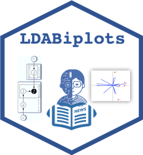

## {.tabset .tabset-pills}

### 

`LDABiplots` Es una herramienta de extracción, análisis y visualización para el análisis exploratorio de noticias publicadas en la web por periódicos digitales, mediante la extracción de datos de la web (Bradley et al. 2019), permite la implementación del modelo probabilístico Latent Dirichlet Allocation (LDA) (Blei, Ng y Jordán, 2003) y generar visualizaciones Biplot (Gabriel K.R, 1971) y HJ-Biplot (Galindo-Villardon P, 1986) de los temas principales de los titulares de las noticias publicadas en la web. LDABiplots permite optimizar la extracción de datos de la web, la rutina de modelado LDA y la generación de visualizaciones Biplot de forma interactiva para usuarios no adaptados al uso de R.

  Se recomienda antes de su uso revisar el tutorial o manual de usuario , el cual puede ser consultado en : https://github.com/Pilacuan-Bonete-Luis/LDABiplot 

### 

`LDABiplots` It is an extraction, analysis and visualization tool for the exploratory analysis of news published on the web by digital newspapers, by extracting data from the web (Bradley et al. 2019), allows the implementation of the Latent Dirichlet probabilistic model Allocation (LDA) (Blei, Ng and Jordán, 2003) and generate Biplot (Gabriel K.R, 1971) and HJ-Biplot (Galindo-Villardon P, 1986) visualizations of the main topics of the news headlines published on the web. LDABiplots allows to optimize the data extraction from the web, the LDA modeling routine and the generation of Biplot visualizations in an interactive way for users who are not adapted to the use of R.

  Before use, it is recommended to review the tutorial or user manual, which can be consulted at: https://github.com/Pilacuan-Bonete-Luis/LDABiplot

