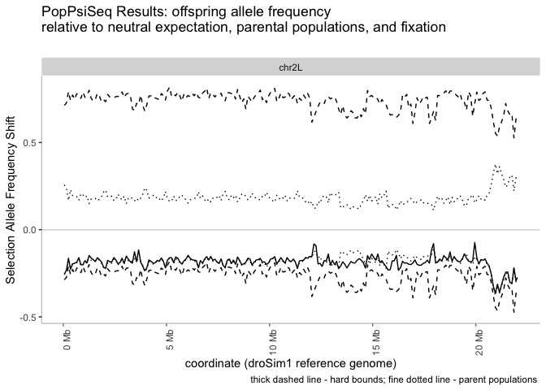

<!-- README.md is generated from README.Rmd. Please edit that file -->

# PopPsiSeqR

<!-- badges: start -->
<!-- badges: end -->

PopPsiSeqR is a package intended for analyzing the results of evolution
& resequencing experiments. It builds on previous software published in
@Earley2011. Offspring allele frequency spectrum is compared to the
parental populations’ spectra and their expected equilibrium, in order
to detect selected-for genomic regions.

## Installation

You can install the development version of PopPsiSeqR from
[GitHub](https://github.com/) with:

``` r
# install.packages("pak")
pak::pak("csoeder/PopPsiSeqR")
```

## Example

A table of allele frequencies is loaded and the frequency shift
calculated:

``` r
library("PopPsiSeqR")

merged_frequencies.filename <- system.file("extdata", 
  "merged_frequencies.example_data.tbl", package = "PopPsiSeqR")
merged_frequencies.bg <- import.freqtbl(merged_frequencies.filename)

frequency_shifts.bg <- freqShifter(merged_frequencies.bg)


head(frequency_shifts.bg %>% as.data.frame() 
     %>% dplyr::select(-c(ends_with("_count"), ends_with("_deltaF"),  "name", "score")) 
     %>% GenomicRanges::GRanges(), n=5)
#> GRanges object with 5 ranges and 10 metadata columns:
#>       seqnames    ranges strand |         ref         alt
#>          <Rle> <IRanges>  <Rle> | <character> <character>
#>   [1]    chr2L  10000208      * |           G           A
#>   [2]    chr2L  10000682      * |           T           C
#>   [3]    chr2L  10000709      * |           A           G
#>   [4]    chr2L  10000725      * |           G           A
#>   [5]    chr2L  10000933      * |           A           T
#>       selected_parent_alt_af backcrossed_parent_alt_af offspring_alt_af
#>                    <numeric>                 <numeric>        <numeric>
#>   [1]               0.277778                         0                0
#>   [2]               0.166667                         0                0
#>   [3]               0.250000                         0                0
#>   [4]               0.000000                         1                1
#>   [5]               0.000000                         1                1
#>         central mean_oriented_shift max_oriented_shift min_oriented_shift
#>       <numeric>           <numeric>          <numeric>          <numeric>
#>   [1] 0.1388890          -0.1388890           0.861111         -0.1388890
#>   [2] 0.0833335          -0.0833335           0.916667         -0.0833335
#>   [3] 0.1250000          -0.1250000           0.875000         -0.1250000
#>   [4] 0.5000000          -0.5000000           0.500000         -0.5000000
#>   [5] 0.5000000          -0.5000000           0.500000         -0.5000000
#>       AF_difference
#>           <numeric>
#>   [1]      0.277778
#>   [2]      0.166667
#>   [3]      0.250000
#>   [4]      1.000000
#>   [5]      1.000000
#>   -------
#>   seqinfo: 1 sequence from an unspecified genome; no seqlengths
```

The input data in this case is a table containing allele frequencies for
the selected and backcrossed parental population, and those of the
offspring population. This table was produced by joining the output of
VCFtools’ `--freq` utility, reformatted as BED files and filtered to
remove non-informative sites.

``` bash
# calculating allele frequencies and converting to BED format
vcftools --vcf {input.vcf_in} --out {output.report_out} --freq;
cat {output.report_out}.frq | tail -n +2 | awk -v OFS='\\t' \
  '{{print $1,$2,$2+1,$4,$5,$6}}' > {output.frq_out}
```

``` bash

# joining the frequency tables
bedtools intersect -wa -wb -a {input.slctd_frq} -b  {input.bckcrssd_frq} \
  | bedtools intersect -wa -wb -a - -b  {input.off_frq} \
  | cut -f 1,2,4-6,10,12,16,18 | tr ":" "\\t" \ 
  | awk -v OFS='\\t' '{{if(($6==$9) && ($9==$12) && ($7!=$10) ) 
  print $1,$2,$2+1,"0","0","+",$4,$6,$3,$7,$8,$10,$11,$13}}' \
  > {output.frqShft_out}.tmp
```

Once these frequencies have been collated, they can be loaded with
`import.freqtbl()`. The output can be easily written to disk with
`export.freqshft()`, where they can be averaged over genomic intervals
with utilities like `bedtools map`

``` bash
bedtools makewindows -w {wildcards.window_size} -s {wildcards.slide_rate} -g {fai_path} -i winnum \
  | bedtools sort -i - > {output.windowed}

bedtools map -c 7,8,9,10,11,12,12 -o sum,sum,sum,sum,sum,sum,count -null NA -a {input.windows_in} \
  -b <( tail -n +2  {input.frqShft_in}   | cut -f  1-3,15-20 | nl -n ln  | \
  awk -v OFS='\t' '{{if( $5!="NA" && $6!="NA")print $2,$3,$4,$1,"0",".",$5,$6,$7,$8,$9,$10}}' \
  | bedtools sort -i - ) > {output.windowed_out}
```

These smoothed data can be reloaded with `import.smvshift()`. A default
plot of these smoothed data can be produced with the
`windowedFrequencyShift.plotter()` function.

``` r
windowed_shifts.filename <- system.file("extdata", "windowed_shifts.example_data.bed", 
  package = "PopPsiSeqR")

windowed_shifts.bg <- import.smvshift(windowed_shifts.filename, selected_parent = "sim",
  backcrossed_parent = "sech")

windowedFrequencyShift.plotter(windowed_shifts.bg, 
  selected_parent = "sim", backcrossed_parent = "sech", main_title = 
  "PopPsiSeq Results: offspring allele frequency\nrelative to neutral expectation, parental populations, and fixation")
#> Registered S3 method overwritten by 'GGally':
#>   method from   
#>   +.gg   ggplot2
```



Finally, a simple comparison can be made between the results from
different experiments by calculating their arithmetic difference using
the `subTractor()` function:

``` r

lab_sechellia.filename <- system.file("extdata", 
  "wild_sechellia.example_data.bed", package = "PopPsiSeqR")
lab.bg <- import.smvshift(lab_sechellia.filename)
lab.bg$sechellia <- "lab"


wild_sechellia.filename <- system.file("extdata",
  "lab_sechellia.example_data.bed", package = "PopPsiSeqR")
wild.bg <- import.smvshift(wild_sechellia.filename)
wild.bg$sechellia <- "wild"


sub.traction <- subTractor(lab.bg, wild.bg ,treament_name = "sechellia")

# autoplot(sub.traction, aes(y=lab_minus_wild), geom="line"
#   ) + labs(y="Difference in Allele Frequency Shift\n(lab - wild)", 
#   title = "Difference between PopPsiSeq analyses based on lab-reared and wild-caught sechellia",
#   subtitle = "", caption ="",x= "coordinate (droSim1 reference genome)" 
#   ) + theme_clear()  
```
