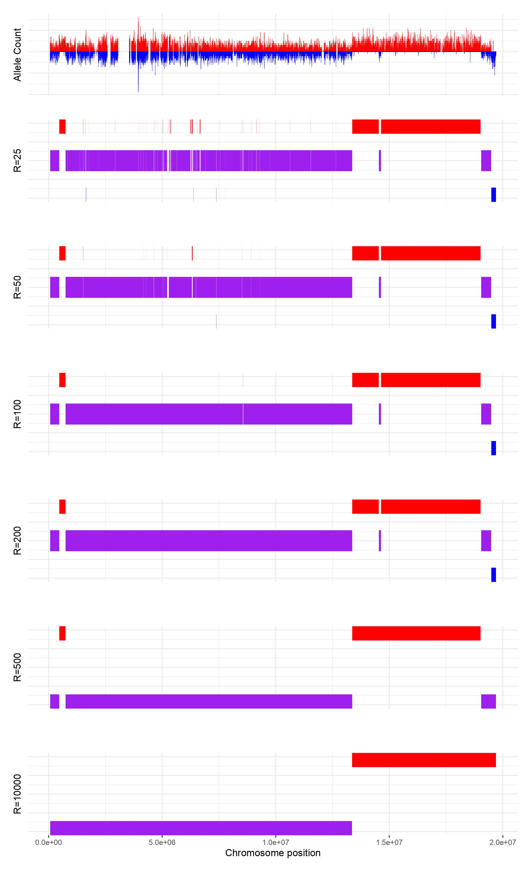

```{r, include = FALSE}
knitr::opts_chunk$set(
  collapse = TRUE,
  comment = "#>",
  echo = TRUE
)
```

## Introduction
Accurate identification of meiotic crossing-over sites (COs) is essential for correct genotyping of recombining samples. RTIGER is a method for predicting genome-wide COs using allele-counts at pre-defined SNP marker positions. RTIGER trains a rigid Hidden Markov Model (rHMM^[Longer description: https://kups.ub.uni-koeln.de/37286/]) where each genomic state (homozygous parent 1, homozygous parent 2 or heterozygous) corresponds to respectively one hidden state and the allele-counts as the observed variable. COs are identified as transitions in the HMM state.

To account for sparse sampling of individual marker positions in the sequencing data, RTIGER uses Viterbi Path Algorithm and the `rigidity` parameter. This parameter defines the minimum number of SNP markers required to support a state-transition. This filters out low-confidence state-transitions, improving COs identification performance.

<!-- ################################################################################ -->
## Installation
### Pre-Requisites
* R: Version > 3.6
* Julia: Julia needs to be installed and available in the environment^[https://www.geeksforgeeks.org/how-to-setup-julia-path-to-environment-variable/?ref=lbp]. Tested for Julia v1.0.5.
* Some bioconductor libraries require manual installation. Use the following code in the R console to install them:

```{r echo= TRUE, eval=FALSE}
if (!require("BiocManager", quietly = TRUE))
    install.packages("BiocManager")
BiocManager::install(version = "3.14")

BiocManager::install(c("GenomicRanges", "GenomeInfoDb", "TailRank", "IRanges", "Gviz"))
```
### Install
RTIGER can be installed directly from CRAN using:

```{r echo= TRUE, eval=FALSE}
install.packages("RTIGER")
```

Additionally, the development version (with the most recent features and bug-fixes) can be downloaded from GitHub using the following:
```{r echo= TRUE, eval=FALSE}
install.packages("devtools")
library(devtools)
install_github("rfael0cm/RTIGER", ref = 'main')
```

<!-- ################################################################################ -->
## Preparing input data
RTIGER uses the allele-count information at the SNP marker positions. The SNP markers correspond to differences between the two genotypes (i.e. parent_1 vs parent_2). RTIGER requires as input one allele-count file for each sample. The allele-count file should be in tab-separated value format, where each row corresponds to a SNP marker. For example:
```{r echo=FALSE, results='asis'}
library(knitr)
chrom = paste0(rep('Chr'), c(1,1,2,2,2,3))
pos = c("37388", "71348", "18057", "38554", "75348", "32210")
ref = c("C", "T", "A", "G", "A", "T")
refC = c(0, 1, 0, 0 , 1, 2)
alt = c("T", "G", "C", "A", "T", "G")
altC = c(2, 3, 1, 2 , 0, 0)
df = data.frame(chrom, pos, ref, refC, alt, altC)
colnames(df) <- NULL
kable(df, align = "l", caption='Example allele frequency file', justify='centred', width='minimum')
```
Here the columns are:

* Chromosome ID
* Position of the SNP marker
* Reference allele
* Reference allele read-count
* Alternate allele
* Alternate allele read-count

The SNPs can be identified using any generic SNP identification pipeline^[For example: https://www.ebi.ac.uk/sites/ebi.ac.uk/files/content.ebi.ac.uk/materials/2014/140217_AgriOmics/dan_bolser_snp_calling.pdf].


SNPs in repetitive regions should be filtered out. Further, as crossing-over usually takes place in syntenic regions between the two genomes, for best results, only SNPs in syntenic regions should be selected as markers. If whole genome assemblies are present for both genomes, then this can be easily achieved using methods like SyRI^[https://genomebiology.biomedcentral.com/articles/10.1186/s13059-019-1911-0].

### Notes
* RTIGER assumes that all samples have similar sequencing coverage and, hence, similar distribution of the allele-count values. It does not check or normalise for sequencing coverage variation arising due to strong differences in sequencing coverage. Cases with extremely low coverage may result in suboptimal results and should be filtered out.
* Cossing-over resolution depends on sequenced marker density. Low sequencing coverage could result in few informative markers, which in turn could decrease resolution CO prediction.
* Although RTIGER is designed to be robust against individual outliers, the user should check for "bad" markers, i.e. marker positions that are prone to mismapping. These markers result in high allele-count at that position as well as in a high, artificial agreement in this position across samples.


<!-- ################################################################################ -->
## Using RTIGER
### Setting up Julia environment
RTIGER uses Julia to perform computationally intensive model training. All Julia packages that are used by RTIGER can be installed using using:
```{r echo= TRUE, eval=FALSE}
library(RTIGER)
setupJulia()
```
This step is **necessary** when using RTIGER for the first time, but can be skipped for later analysis as all required Julia packages would already be installed.

The Julia functions need to be loaded in the R environment using:
```{r echo=TRUE, eval=FALSE}
sourceJulia()
```
This step is required every time when using RTIGER.

### Creating input objects
The primary input for RTIGER is a data-frame termed `expDesign`. The first column of `expDesign` should have paths to allele-count files for all samples and the second column should have unique samples IDs^[Avoid use of special characters or spaces in file-names as that may result in errors.].

```{r echo = TRUE}
# Get paths to example allele count files originating from a
# cross between Col-0 and Ler accession of the A.thaliana
file_paths = list.files(system.file("extdata",  package = "RTIGER"), full.names = TRUE)

# Get sample names
sampleIDs <- basename(file_paths)

# Create the expDesign object
expDesign = data.frame(files=file_paths, name=sampleIDs)

print(expDesign)
```

RTIGER also requires chromosome lengths for the parent 1. These need to be provided as a named vector where the values are chromosome lengths and the names are chromosome ids.

``` {r echo=TRUE}
# Get chromosome lengths for the example data included in the package
chr_len <- RTIGER::ATseqlengths
names(chr_len) <- c('Chr1' , 'Chr2', 'Chr3', 'Chr4', 'Chr5')
print(chr_len)
```

#### Finding crossing-over sites using RTIGER
RTIGER does model training, CO identification, and creates summary plots using the `RTIGER` function.
```{r echo=TRUE, eval=FALSE}
myres = RTIGER(expDesign = expDesign,
               outputdir = "/PATH/TO/OUTPUT/DIRECTORY",
               seqlengths = chr_len,
               rigidity = 200)
```

The `rigidity` parameter defines the required minimum number of continuous markers that together support a state change of the HMM model (Figure 1). Smaller `rigidity` values increase the sensitivity in detecting COs that are close to each other, but may result in false-positive CO identification because of variation in sequencing coverage. Larger `rigidity` values improve precision but COs that are close to each other might not be identified. **Users are supposed to test and adjust `rigidity` based on their specific experimental setup**.

```{r fig.cap="Effect of different R values on CO identificaion. The top panel shows the allele count for parent 1 (red) and parent 2 (blue) at the marker positions on a chormosomes. Remaining panels show the annotation of genomic regions by RTIGER for different values of R. Here, red blocks are regions that are homozygous for parent 1, purple blocks are for heterozygous regions, and blue blocks are for regions homozygous for parent 2.", out.width = "300px", fig.align='center', echo=FALSE}
# knitr::include_graphics("rtiger_out_bt2_3647_AA_run513_GTAGAGGA_S20_L007_PE_MQ05.pdf")

```


<!-- ################################################################################ -->

## RTIGER Output
RTIGER identifies COs for each sample level and provides summary plots and statistics for each sample as well as for the entire population.

### Per sample output
RTIGER creates a folder for each sample in the `outputdir`. This folder contains:

* `GenotypePlot.pdf`: Graphical representation of the allele-counts, allele-count ratio, and genotypes
* `CompleteBlock.bed`: BED file providing genomic regions corresponding to different genotypes
* `P1/P2/Het.bed`: BED files containing the markers present in genomic regions having genotype: homozygous parent 1, homozygous parent 2, or heterozygous, respectively
* `P1/P2.bw`: BigWig file containing the number of reads per marker position supporting parent 1 and parent 2, respectively
* `CountRatio.bw`: BigWig file containing the ratio of number of reads supporting parent 1 to number of reads supporting number 2 at the marker positions

### Summary plots
In addition to per sample output, RTIGER also generates three summary plots for the samples.

* `COs-per-Chromosome.pdf`: Distribution of number of cross-overs per chromosome
* `CO-count-perSample.pdf`: Number of cross-overs in each sample
* `Goodness-Of-fit.pdf`: The goodness of fit file contains the histograms of the count ratio distribution for each state. In other words, the count ratio (counts of reference allele/total number of allele count) for all the positions decoded as state i will be used to plot the histogram of the state i. For example, in the case of three states (paternal, heterozygous, and maternal), the first histogram is the paternal state for which the distribution of count ratio is close to one (since the reference allele is the allele inherited from the paternal line). On the other hand, the maternal state histogram has a distribution close to zero. Reasonably, the heterozygous state has a distribution close to 0.5 since the count ratio for the observations heterozygous regions should be half and half. Real-life experiments are more complex and might deviate from the theoretical values, i.e the heterozygous count ratio is skewed to 0 or 1 indicating preference in the annotation by one of the parents, contamination in some samples, the model did not converge adequately, or whether the number of states is correct. These plots help the user to decide if the model fitted for the data they have is adequate or needs to change the parameters.

### Analysing backcrossed populations
Backcrossed populations are formed by crossing a hybrid organism with one of its parent. These populations are different from the populations based on outcrossing as only two genomic states are possible (homozygous for the backrossed parent and heterozygous for both parents). To identify COs in such population, set `nstates=2` in the RTIGER command.
```{r echo=TRUE, eval=FALSE}
myres = RTIGER(expDesign = expDesign, 
               outputdir = "PATH/TO/OUTPUT/DIR",
               seqlengths = chr_len,
               rigidity = 200, 
               nstates=2)
```


################################################################################
## Citation
Campos-Martin R, *et al.*, Reliable genotyping of recombinant genomes using a robust hidden Markov Model, 2022


<!-- ################################################################################ -->
<!-- ## Appendix: -->

<!-- ### Effect of varying `rigidity (R)` on crossover identification: -->
<!-- <!-- Do we have estimates on how RTIGER performance varies with number of samples? Markers? Is it possible to use it for 1 sample with only 100 markers (rows in allele_count file)? Might be important to describe this here. -->


################################################################################
## Session info
```{r echo=FALSE, eval=TRUE}
sessionInfo()
```


