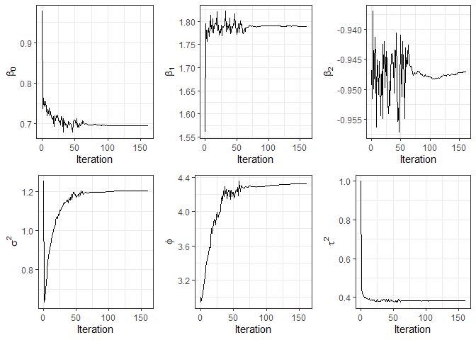

<!-- README.md is generated from README.Rmd. Please edit that file -->

## The `RcppCensSpatial` package

<!-- badges: start -->
<!-- badges: end -->

The `RcppCensSpatial` package fits spatial censored linear regression
models using the Expectation-Maximization (EM) (Dempster, Laird, and
Rubin 1977), Stochastic Approximation EM (SAEM) (Delyon, Lavielle, and
Moulines 1999), or Monte Carlo EM (MCEM) (Wei and Tanner 1990)
algorithm. These algorithms are widely used to obtain maximum likelihood
(ML) estimates in the presence of incomplete data. The EM algorithm can
be applied when a closed-form expression for the conditional expectation
of the complete-data log-likelihood is available. In the MCEM algorithm,
this conditional expectation is replaced by a Monte Carlo approximation
based on multiple independent simulations of the partially observed
data. In contrast, the SAEM algorithm decomposes the E-step into
simulation and stochastic approximation steps.

The package also provides approximate standard errors for the parameter
estimates using the method proposed by Louis (1982), and it supports
missing values in the response variable. In addition, it includes
functions for spatial prediction at new locations, as well as for
computing covariance and distance matrices. For further details on model
formulation and estimation procedures, see Ordoñez et al. (2018) and
Valeriano et al. (2021).

The `RcppCensSpatial` library provides the following functions:

- `CovMat`: computes the spatial covariance matrix.
- `dist2Dmatrix`: computes the Euclidean distance matrix for a set of
  coordinates.
- `EM.sclm`: fits a spatial censored linear regression model using the
  EM algorithm.
- `MCEM.sclm`: fits a spatial censored linear regression model using the
  MCEM algorithm.
- `SAEM.sclm`: fits a spatial censored linear regression model using the
  SAEM algorithm.
- `predict.sclm`: performs spatial prediction at a set of new locations.
- `rCensSp`: simulates censored spatial data under a specified censoring
  rate.

The generic functions `print`, `summary`, `predict`, and `plot` are also
available for objects of class `sclm`.

In the following sections, we describe how to install the package and
demonstrate the use of its main functions through an artificial example.

### Installation

The released version of `RcppCensSpatial` from
[CRAN](https://CRAN.R-project.org) can be installed with:

``` r
install.packages("RcppCensSpatial")
```

### Example

In the following example, we simulate a dataset of size n = 220 from a
spatial linear regression model with three covariates and an exponential
correlation function to account for spatial dependence. To evaluate
predictive performance, the dataset is split into training and testing
sets. The training set consists of 200 observations, with 5%
left-censored responses, while the test set contains the remaining 20
observations.

``` r
library(RcppCensSpatial)

set.seed(12341)
n = 220
x = cbind(1, runif(n), rnorm(n))
coords = round(matrix(runif(2*n, 0, 15), n, 2), 5)
dat = rCensSp(beta=c(1,2,-1), sigma2=1, phi=4, nugget=0.50, x=x, coords=coords,
              cens='left', pcens=.05, npred=20, cov.model="exponential")
# Proportion of censoring
table(dat$Data$ci)
#> 
#>   0   1 
#> 190  10
```

For comparison purposes, we fit the spatial censored linear model to the
simulated data using three approaches: the EM, MCEM, and SAEM
algorithms. Each method is run with the same maximum number of
iterations (`MaxIter = 300`) and uses the exponential spatial
correlation function (`type = "exponential"`), which is also the default
setting and was used in the data generation process.

Other available spatial correlation functions include `'matern'`,
`'gaussian'`, and `'pow.exp'`.

``` r
data1 = dat$Data

# EM estimation
fit1 = EM.sclm(data1$y, data1$x, data1$ci, data1$lcl, data1$ucl, data1$coords, 
               phi0=3, nugget0=1, MaxIter=300)
fit1$tab
#>       beta0  beta1   beta2 sigma2    phi   tau2
#>      0.6959 1.7894 -0.9477 1.2032 4.3018 0.3824
#> s.e. 0.4848 0.2027  0.0592 0.5044 2.2872 0.0793

# MCEM estimation
fit2 = MCEM.sclm(data1$y, data1$x, data1$ci, data1$lcl, data1$ucl, data1$coords, 
                 phi0=3, nugget0=1, MaxIter=300, nMax=1000)
fit2$tab
#>       beta0  beta1   beta2 sigma2    phi   tau2
#>      0.6952 1.7896 -0.9476 1.2069 4.3216 0.3828
#> s.e. 0.4868 0.2025  0.0592 0.5121 2.3144 0.0793

# SAEM estimation
fit3 = SAEM.sclm(data1$y, data1$x, data1$ci, data1$lcl, data1$ucl, data1$coords, 
                 phi0=3, nugget0=1, M=10)
fit3$tab
#>       beta0  beta1   beta2 sigma2    phi   tau2
#>      0.6959 1.7883 -0.9471 1.2060 4.3207 0.3811
#> s.e. 0.4865 0.2021  0.0590 0.5096 2.3125 0.0791
```

Note that the parameter estimates obtained from each method are similar
and generally close to the true values, except for the first regression
coefficient, which is estimated to be approximately 0.70, whereas its
true value is 1.

Moreover, the generic functions `print` and `summary` provide detailed
information about the fitted `sclm` object, including parameter
estimates, standard errors, the effective range, information criteria,
and convergence diagnostics.

``` r
print(fit3)
#> ----------------------------------------------------------------
#>            Spatial Censored Linear Regression Model   
#> ----------------------------------------------------------------
#> Call:
#> SAEM.sclm(y = data1$y, x = data1$x, ci = data1$ci, lcl = data1$lcl, 
#>     ucl = data1$ucl, coords = data1$coords, phi0 = 3, nugget0 = 1, 
#>     M = 10)
#> 
#> Estimated parameters:
#>       beta0  beta1   beta2 sigma2    phi   tau2
#>      0.6959 1.7883 -0.9471 1.2060 4.3207 0.3811
#> s.e. 0.4865 0.2021  0.0590 0.5096 2.3125 0.0791
#> 
#> The effective range is 12.9436 units.
#> 
#> Model selection criteria:
#>         Loglik     AIC     BIC
#> Value -251.323 514.645 534.435
#> 
#> Details:
#> Number of censored/missing values: 10 
#> Convergence reached?: TRUE 
#> Iterations: 161 / 300 
#> Processing time: 1.0391 mins
```

Additionally, the `plot` function can be used to visualize convergence
diagnostics of the parameter estimates.

``` r
plot(fit3)
```



Next, predicted values are obtained for each fitted model on the test
data, and their mean squared prediction errors (MSPE) are compared.

``` r
data2 = dat$TestData
pred1 = predict(fit1, data2$coords, data2$x)
pred2 = predict(fit2, data2$coords, data2$x)
pred3 = predict(fit3, data2$coords, data2$x)

# Cross-validation
mean((data2$y - pred1$predValues)^2)
#> [1] 1.595305
mean((data2$y - pred2$predValues)^2)
#> [1] 1.591421
mean((data2$y - pred3$predValues)^2)
#> [1] 1.594899
```

### References

<div id="refs" class="references csl-bib-body hanging-indent">

<div id="ref-delyon1999convergence" class="csl-entry">

Delyon, B., M. Lavielle, and E. Moulines. 1999. “Convergence of a
Stochastic Approximation Version of the EM Algorithm.” *The Annals of
Statistics* 27 (1): 94–128.

</div>

<div id="ref-dempster1977maximum" class="csl-entry">

Dempster, A. P., N. M. Laird, and D. B. Rubin. 1977. “Maximum Likelihood
from Incomplete Data via the EM Algorithm.” *Journal of the Royal
Statistical Society: Series B (Methodological)* 39 (1): 1–38.

</div>

<div id="ref-louis1982finding" class="csl-entry">

Louis, T. A. 1982. “Finding the Observed Information Matrix When Using
the EM Algorithm.” *Journal of the Royal Statistical Society: Series B
(Methodological)* 44 (2): 226–33.

</div>

<div id="ref-ordonez2018geostatistical" class="csl-entry">

Ordoñez, J. A., D. Bandyopadhyay, V. H. Lachos, and C. R. B. Cabral.
2018. “Geostatistical Estimation and Prediction for Censored Responses.”
*Spatial Statistics* 23: 109–23.
<https://doi.org/10.1016/j.spasta.2017.12.001>.

</div>

<div id="ref-valeriano2021likelihood" class="csl-entry">

Valeriano, K. L., V. H. Lachos, M. O. Prates, and L. A. Matos. 2021.
“Likelihood-Based Inference for Spatiotemporal Data with Censored and
Missing Responses.” *Environmetrics* 32 (3).

</div>

<div id="ref-wei1990monte" class="csl-entry">

Wei, G., and M. Tanner. 1990. “A Monte Carlo Implementation of the EM
Algorithm and the Poor Man’s Data Augmentation Algorithms.” *Journal of
the American Statistical Association* 85 (411): 699–704.
<https://doi.org/10.1080/01621459.1990.10474930>.

</div>

</div>
