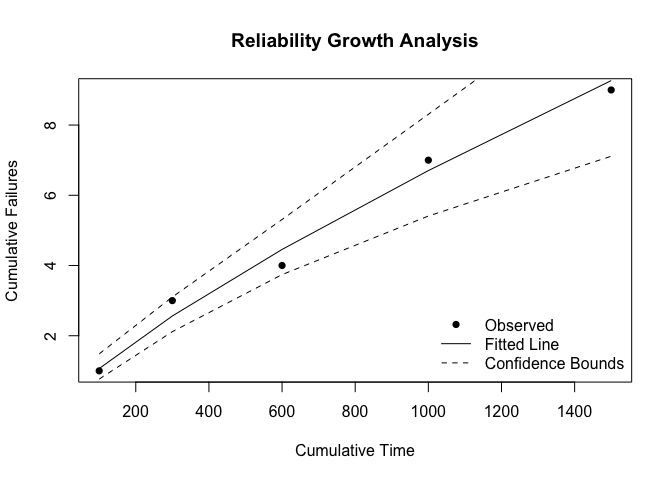

<!-- README.md is generated from README.Rmd. Please edit that file -->

# ReliaGrowR

<!-- badges: start -->

[](https://www.repostatus.org/#active)
[](https://CRAN.R-project.org/package=ReliaGrowR)
[](https://github.com/paulgovan/ReliaGrowR/actions/workflows/R-CMD-check.yaml)
[](https://app.codecov.io/gh/paulgovan/ReliaGrowR)
[](https://cran.r-project.org/package=ReliaGrowR)
[](https://cran.r-project.org/package=ReliaGrowR)
[](https://doi.org/10.32614/CRAN.package.ReliaGrowR)
<!-- badges: end -->

## Introduction

Welcome to **ReliaGrowR**! This package provides modeling and plotting
functions for Reliability Growth Analysis (RGA), including:

- Duane Analysis
- Crow-AMSAA
- Piecewise NHPP
- Piecewise NHPP with Change Point Detection

RGA is an important part of reliability engineering, focused on
improving reliability during development and testing of products. By
analyzing failure data, RGA helps engineers and researchers identify
trends, estimate reliability parameters, and track improvements over
time.

To learn more about RGA and this package, please view the
[vignette](https://paulgovan.github.io/ReliaGrowR/articles/RGA.html).

## Installation

To install the release version of ReliaGrowR, use:

``` r
install_packages('ReliaGrowR')
```

You can install the development version of ReliaGrowR like so:

``` r
devtools::install_github('paulgovan/ReliaGrowR')
```

## Example

Here is a basic example of Reliability Growth Analysis. First, load the
package.

``` r
library(ReliaGrowR)
```

Next, suppose a machine has failed at the following times with the
corresponding number of failures.

``` r
times <- c(100, 200, 300, 400, 500)
failures <- c(1, 2, 1, 3, 2)
```

To perform RGA, use the `rga` function and plot the results. The plot
displays the cumulative failures over time along with the fitted
reliability growth model.

``` r
result <- rga(times, failures)
plot(result, main = "Reliability Growth Analysis", xlab = "Cumulative Time", ylab = "Cumulative Failures")
```



## Code of Conduct

Please note that the ReliaGrowR project is released with a [Contributor
Code of
Conduct](https://contributor-covenant.org/version/2/1/CODE_OF_CONDUCT.html).
By contributing to this project, you agree to abide by its terms.
