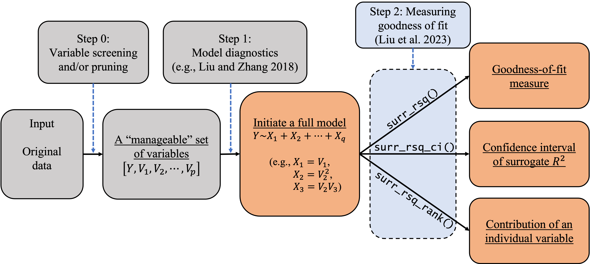

```{r, include = FALSE}
knitr::opts_chunk$set(
  collapse = TRUE,
  comment = "#>"
)
```

```{r setup, message=FALSE}
library(SurrogateRsq)
```

# Using R packages for categorical data modeling: a workflow

In empirical studies, goodness-of-fit analysis should be used jointly with other statistical tools, such as variable screening/selection and model diagnostics, in the model-building and refining process. In this section, we discuss how to follow the workflow in the following diagram to carry out statistical modeling for categorical data. We also discuss how to use the \(\textbf{SurrogateRsq}\) package with other existing R packages to implement this workflow. As Liu et al. (2023)'s method requires a full model, researchers and practitioners can also follow the process in Figure to initiate a full model so as to facilitate goodness-of-fit analysis.  

{width=90%}

1. In \(\texttt{Step-0}\), we can use the AIC/BIC/LASSO or any other variable selection methods deemed appropriate to trim or prune the set of explanatory variables to a ``manageable'' size (e.g., less than 20). The goal is to eliminate irrelevant variables so that  researchers can better investigate the model structure and assessment. The variable selection techniques have been studied extensively in the literature. Specifically, one can implement (i) the best subset selection using the function \(\texttt{regsubsets()}\) in the \(\textbf{leaps}\) package; (ii) the forward/backward/stepwise selection using the function \(\texttt{step()}\) in the R core; (iii) the shrinkage methods including the (adaptive) LASSO in the \textbf{glmnet} package; (iv) the regularized ordinal regression model with an elastic net penalty in the \textbf{ordinalNet} package; and (v) the penalized regression models with minimax concave penalty (MCP) or smoothly clipped absolute deviation (SCAD) penalty in the \textbf{ncvreg} package. When the dimension is ultrahigh, the sure independence screening method can be applied through the \textbf{SIS} package. When the variables are grouped, one can apply the group selection methods including the group lasso, group MCP, and group SCAD through the \textbf{grpreg} package. In some cases, \(\texttt{Step-0}\) may be skipped if the experiment only involves a (small) set of controlled variables. In these cases, the controlled variables should be modeled regardless of statistical significance or predictive power. We limit our discussion here because our focus is on goodness-of-fit analysis. 

2. In \(\texttt{Step-1}\), we can use diagnostic tools to inspect the model passed from \(\texttt{Step-0}\), adjust its functional form, and add additional elements if needed  (e.g., higher-order or interaction terms). For categorical data, we can use the function \(\texttt{autoplot.resid()}\) in the \textbf{sure} package to generate three types of 
diagnostic plots: residual Q-Q plot, residual-vs-covariate plot, and residual-vs-fitted plots. These plots can be used to visualize the discrepancy between the working model and the ``true'' model. Similar plots can be produced using the function \(\texttt{diagnostic.plot()}\) in the \textbf{PAsso} package. These diagnostic plots give practitioners insights on how to refine the model by possibly transforming the regression form or adding higher-order terms. At the end of this diagnosing and refining process, we expect to have a \textbf{full model} (\(\mathcal{M}_{full}\)) for subsequent inferences including goodness-of-fit analysis. 
  
3. In \(\texttt{Step-2}\), we can use the functions developed in our \textbf{SurrogateRsq} package to examine the goodness of fit of the full model \(\mathcal{M}_{full}\) and various reduced models of interest. Specifically, we can produce the point and interval estimates of the surrogate \(R^2\) by using the functions \(\texttt{surr_rsq()}\) and \(\texttt{surr_rsq_ci()}\). In addition, we can quantify the contribution of each individual variable to the overall surrogate \(R^2\) by using the function  \(\texttt{surr_rsq_rank()}\). Based on the percentage contribution, the function  \(\texttt{surr_rsq_rank()}\) also provides ranks of the explanatory  variables to show their relative importance. In the following section, we will show in a case study how our package can help us understand the relative importance of explanatory variables and compare the results across different samples. The ``comparability'' across different samples and/or models is an appealing feature of the surrogate \(R^2\), which will be discussed in detail along with the R implementation. 
