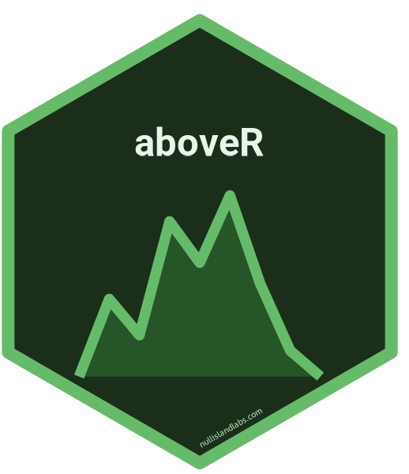

# aboveR



[](https://github.com/chrislyonsKY/aboveR/actions/workflows/R-CMD-check.yaml)
[](https://CRAN.R-project.org/package=aboveR)
[](https://lifecycle.r-lib.org/articles/stages.html#stable)
[](https://app.codecov.io/gh/chrislyonsKY/aboveR)
[](https://app.codacy.com/gh/chrislyonsKY/aboveR/dashboard?utm_source=gh&utm_medium=referral&utm_content=&utm_campaign=Badge_grade)

> LiDAR Terrain Analysis and Change Detection from Above

Terrain change detection, cut and fill volume estimation, terrain profiling, reclamation monitoring, and erosion analysis from LiDAR point clouds and DEMs. Built on 'lidR' for point cloud I/O and 'terra' for raster operations. Includes utilities for 'KyFromAbove' LiDAR data access.

## Installation

```r
# Install from CRAN (when available)
install.packages("aboveR")

# Or install the development version from GitHub
# install.packages("pak")
pak::pak("chrislyonsKY/aboveR")
```

## Quick Start

```r
library(aboveR)

# Load bundled sample DEMs
before <- sample_data("dem_before")
after  <- sample_data("dem_after")

# Detect terrain changes between two epochs
change <- terrain_change(before, after)
terra::plot(change[["change"]], main = "Elevation Change (m)")
```

## Examples

### Cut/Fill Volume Estimation

```r
reference <- sample_data("dem_reference")
boundary  <- sample_data("boundary")

vol <- estimate_volume(after, reference, boundary)
cat(sprintf("Cut: %.0f m³ | Fill: %.0f m³ | Net: %.0f m³\n",
            vol$cut_volume, vol$fill_volume, vol$net_volume))
```

### Change Summary by Zone

```r
zones <- sample_data("zones")

summary <- change_by_zone(change, zones, id_field = "zone_id")
print(summary[, c("zone_id", "mean_change", "cut_volume", "fill_volume")])
```

### Terrain Profiling

```r
line <- sample_data("profile_line")

prof <- terrain_profile(before, line)
plot(prof$distance, prof$elevation, type = "l",
     xlab = "Distance (m)", ylab = "Elevation (m)",
     main = "Terrain Profile")
```

### Surface Roughness

```r
roughness <- surface_roughness(after, window = 5)
terra::plot(roughness, main = "Surface Roughness (Std Dev)")
```

### KyFromAbove Access

```r
# Access Kentucky statewide LiDAR (requires network)
library(sf)
aoi <- st_point(c(-84.5, 38.0)) |>
  st_sfc(crs = 4326) |>
  st_buffer(1000)

tiles <- kfa_find_tiles(aoi, phase = 2)
dem   <- kfa_read_dem(tiles$tile_id[1], phase = 2)
```

## License

MIT

## Author

**Chris Lyons** — [GitHub](https://github.com/chrislyonsKY) | [LinkedIn](https://www.linkedin.com/in/williamclyons)
