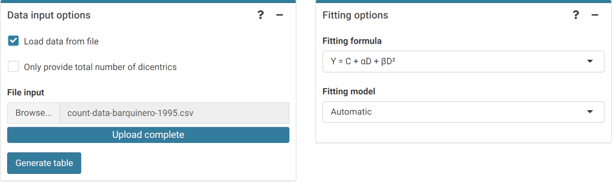
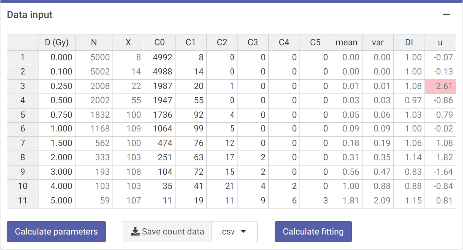
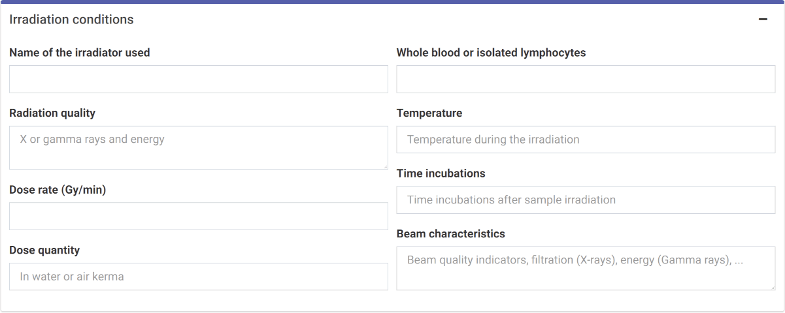
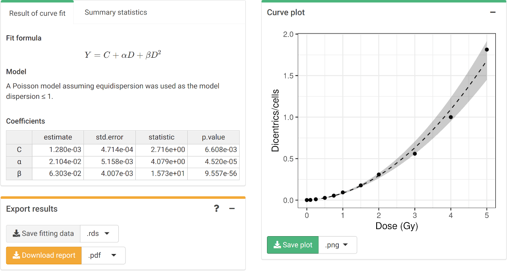

```{r, include = FALSE}
library(biodosetools)
knitr::opts_chunk$set(
  fig.dpi = 96,
  collapse = TRUE,
  comment = "#>"
)
```

## Input count data

The first step is to input the count data. On the {shiny} app, we can select to either load the count data from a file (supported formats are `.csv`, `.dat`, and `.txt`) or to input the data manually. Once the table is generated and filled, the "Calculate parameters" button will calculate the total number of cells ($N$), total number of aberrations ($X$), as well as mean ($\bar{y}$), variance ($\sigma^{2}$), dispersion index ($\sigma^{2}/\bar{y}$), and $u$-value.

```{r sc-dic-fit-01, echo=FALSE, out.width='100%', fig.align='center', fig.cap="'Data input options' and 'Fitting options' boxes in the dose-effect fitting module"}

```

```{r sc-dic-fit-03, echo=FALSE, out.width='75%', fig.align='center', fig.cap="'Data input' box in the dose-effect fitting module"}

```

This step is accomplished in R by calling the `calculate_aberr_table()` function:

```{r dic-count-data, tidy=TRUE, tidy.opts=list(width.cutoff=60)}
count_data <- system.file("extdata", "count-data-barquinero-1995.csv", package = "biodosetools") %>%
  utils::read.csv() %>%
  calculate_aberr_table(type = "count")
```

```{r}
count_data
```

## Irradiation conditions

Because irradiation conditions during calibration may influence future dose estimates, and for a better traceability, the user can input the conditions under which the samples used to construct the curve were irradiated. This option is only available in the Shiny app, so that these can be saved into the generated reports.

```{r sc-dic-fit-02, echo=FALSE, out.width='100%', fig.align='center', fig.cap="'Irradiation conditions' box in the dose-effect fitting module"}

```

## Perform fitting

To perform the fitting the user needs to select the appropriate fitting options to click the "Calculate fitting" button on the "Data input" box.

The fitting results and summary statistics are shown in the "Results" tabbed box, and the dose-effect curve is displayed in the "Curve plot" box.

The "Export results" box shows two buttons: (a) "Save fitting data", and (b) "Download report". The "Save fitting data" will generate an `.rds` file that contains all information about the count data, irradiation conditions, and options selected when performing the fitting. This file can be then loaded in the dose estimation module to load the dose-effect curve coefficients.

Similarly, the "Download report" will generate a `.pdf` or a `.docx` report containing all inputs and fitting results.

```{r sc-dic-fit-04, echo=FALSE, out.width='100%', fig.align='center', fig.cap="'Results' tabbed box, 'Curve plot' and 'Export results' boxes in the dose-effect fitting module"}

```


To perform the fitting in R we call the `fit()` function:

```{r dic-fit-results}
fit_results <- fit(
  count_data = count_data,
  model_formula = "lin-quad",
  model_family = "automatic",
  fit_link = "identity",
  aberr_module = "dicentrics"
)
```

The `fit_results` object is a list that contains all necessary information about the count data as well as options selected when performing the fitting. This is a vital step to ensure traceability and reproducibility. Below we can see its elements:

```{r}
names(fit_results)
```

In particular, we can see how `fit_coeffs` matches the results obtained in the UI:

```{r dic-fit-coeffs-r}
fit_results$fit_coeffs
```

To visualise the dose-effect curve, we call the `plot_fit_dose_curve()` function:

```{r dic-fit-dose-curve, fig.width=6, fig.height=3.5, fig.align='center', fig.cap="Plot of dose-effect curve generated by \\{biodosetools\\}. The grey shading indicates the uncertainties associated with the calibration curve."}
plot_fit_dose_curve(
  fit_results,
  aberr_name = "Dicentrics"
)
```
