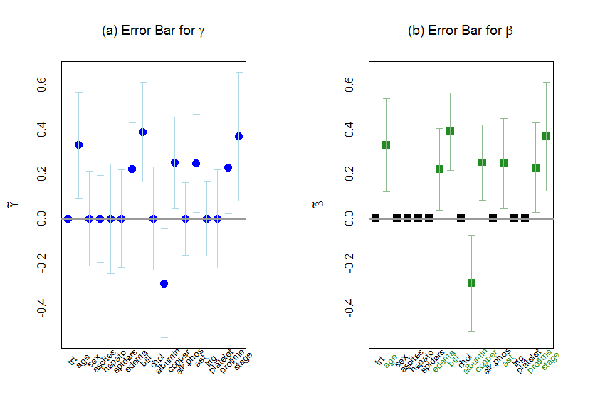

---
output:
  html_document: default
  pdf_document: default
---
Load **coxphMIC**
-----------------

The R package **coxphMIC** implements a sparse estimation method for Cox proportional hazards models by minimizing the approximated information criteria (BIC by default). To load the pacakge,

``` r
require(coxphMIC)
```

    ## Loading required package: coxphMIC

Bring in the `pbc` Data
-----------------------

To illsutrate, we consider the well-known `pbc` data from the **survival** package.

``` r
  library(survival); data(pbc);
  dat <- pbc; dim(dat);
```

    ## [1] 418  20

A couple preprocessing step is made, including listwise deletion for missing values:

``` r
  dat$status <- ifelse(pbc$status==2, 1, 0)
  dat$sex <- ifelse(pbc$sex=="f", 1, 0)
  dat <- na.omit(dat);
  dim(dat); head(dat)
```

    ## [1] 276  20

    ##   id time status trt      age sex ascites hepato spiders edema bili chol
    ## 1  1  400      1   1 58.76523   1       1      1       1   1.0 14.5  261
    ## 2  2 4500      0   1 56.44627   1       0      1       1   0.0  1.1  302
    ## 3  3 1012      1   1 70.07255   0       0      0       0   0.5  1.4  176
    ## 4  4 1925      1   1 54.74059   1       0      1       1   0.5  1.8  244
    ## 5  5 1504      0   2 38.10541   1       0      1       1   0.0  3.4  279
    ## 7  7 1832      0   2 55.53457   1       0      1       0   0.0  1.0  322
    ##   albumin copper alk.phos    ast trig platelet protime stage
    ## 1    2.60    156   1718.0 137.95  172      190    12.2     4
    ## 2    4.14     54   7394.8 113.52   88      221    10.6     3
    ## 3    3.48    210    516.0  96.10   55      151    12.0     4
    ## 4    2.54     64   6121.8  60.63   92      183    10.3     4
    ## 5    3.53    143    671.0 113.15   72      136    10.9     3
    ## 7    4.09     52    824.0  60.45  213      204     9.7     3

Sparse Estimation
-----------------

The function `coxphMIC()` does the sparse estimation and returns a S3 class object.

``` r
  fit.mic <- coxphMIC(formula=Surv(time, status)~.-id, data=dat, method="BIC", scale.x=TRUE)
  names(fit.mic)
```

    ##  [1] "opt.global" "opt.local"  "min.Q"      "gamma"      "beta"      
    ##  [6] "VCOV.gamma" "se.gamma"   "se.beta"    "BIC"        "result"    
    ## [11] "call"

The `print.coxphMIC()` provides a summary table that tabulates *β* estiamtes and the reparameterized *γ* estiamtes.

``` r
  print(fit.mic)
```

    ## 
    ## Call:
    ## coxphMIC(formula = Surv(time, status) ~ . - id, data = dat, method = "BIC", 
    ##     scale.x = TRUE)
    ## 
    ## Table of Estimated Coefficients via MIC:
    ## 
    ##            beta0   gamma se.gamma       LB       UB  z.stat p.value
    ## trt      -0.0622  0.0000   0.1071 -0.21000  0.21000  0.0000  1.0000
    ## age       0.3041  0.3309   0.1219  0.09191  0.56986  2.7138  0.0067
    ## sex      -0.1204  0.0000   0.1086 -0.21285  0.21280 -0.0002  0.9998
    ## ascites   0.0224  0.0000   0.0991 -0.19423  0.19423  0.0000  1.0000
    ## hepato    0.0128  0.0000   0.1259 -0.24684  0.24684  0.0000  1.0000
    ## spiders   0.0460  0.0000   0.1118 -0.21908  0.21907 -0.0001  1.0000
    ## edema     0.2733  0.2224   0.1066  0.01345  0.43139  2.0861  0.0370
    ## bili      0.3681  0.3909   0.1142  0.16713  0.61472  3.4237  0.0006
    ## chol      0.1155  0.0000   0.1181 -0.23144  0.23148  0.0002  0.9999
    ## albumin  -0.2999 -0.2901   0.1248 -0.53478 -0.04543 -2.3239  0.0201
    ## copper    0.2198  0.2518   0.1050  0.04605  0.45757  2.3986  0.0165
    ## alk.phos  0.0022  0.0000   0.0837 -0.16411  0.16412  0.0000  1.0000
    ## ast       0.2308  0.2484   0.1128  0.02732  0.46938  2.2023  0.0276
    ## trig     -0.0637  0.0000   0.0858 -0.16820  0.16820  0.0000  1.0000
    ## platelet  0.0840  0.0000   0.1129 -0.22134  0.22134  0.0000  1.0000
    ## protime   0.2344  0.2293   0.1046  0.02424  0.43428  2.1917  0.0284
    ## stage     0.3881  0.3692   0.1476  0.07983  0.65856  2.5007  0.0124
    ##          beta.MIC se.beta.MIC
    ## trt        0.0000          NA
    ## age        0.3309      0.1074
    ## sex        0.0000          NA
    ## ascites    0.0000          NA
    ## hepato     0.0000          NA
    ## spiders    0.0000          NA
    ## edema      0.2224      0.0939
    ## bili       0.3909      0.0890
    ## chol       0.0000          NA
    ## albumin   -0.2901      0.1103
    ## copper     0.2518      0.0868
    ## alk.phos   0.0000          NA
    ## ast        0.2484      0.1025
    ## trig       0.0000          NA
    ## platelet   0.0000          NA
    ## protime    0.2293      0.1022
    ## stage      0.3692      0.1243

The `plot.coxphMIC()` gives a bar-plot fo the fitting info.

``` r
 plot(fit.mic)
```


