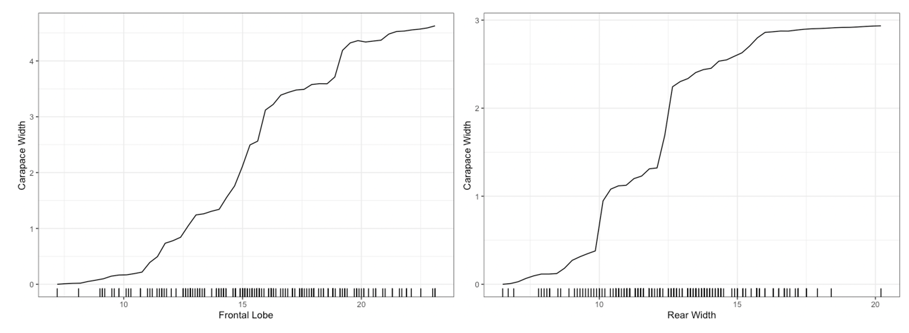
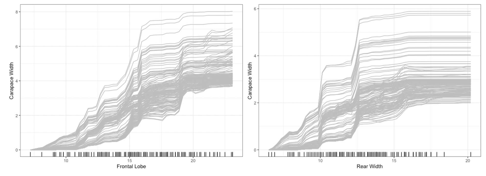
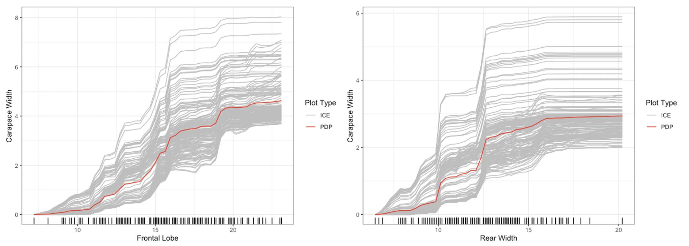
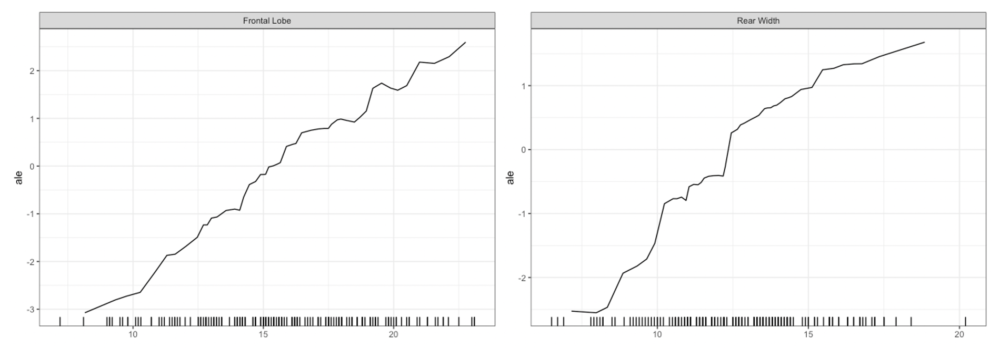
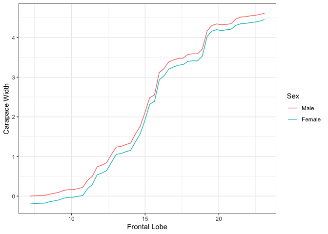
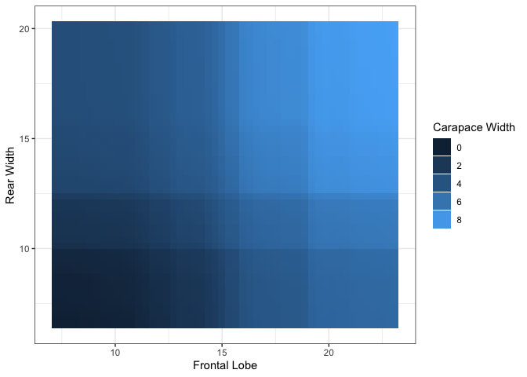
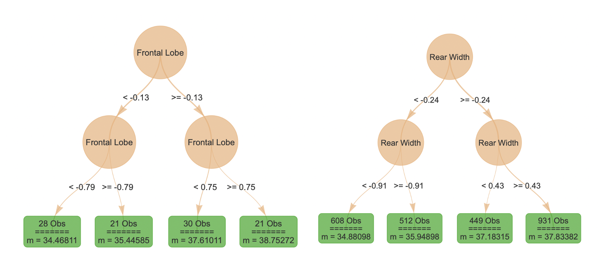
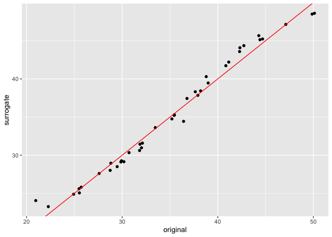

[](https://github.com/forestry-labs/distillML/actions/workflows/check-noncontainerized.yaml)

# distillML: Interpretable Machine Learning Methods and Surrogate Model Methods

`distillML` provides several methods for model distillation and
interpretability for general black box machine learning models. This
package provides implementations of the partial dependence plot (PDP),
individual conditional expectation (ICE), and accumulated local effect
(ALE) methods, which are model-agnostic interpretability methods (work
with any supervised machine learning model). This package also provides
a novel method for building a surrogate model that approximates the
behavior of its initial algorithm.

Below, we provide a simple example that outlines how to use this
package. For further details on surrogate distillation, advanced
interpretability features, or local surrogate methods, see the articles
provided on this page.

For documentation, see:
<https://forestry-labs.github.io/distillML/reference/index.html>

## A Simple Example: Predicting Carapace Width of Leptograpsus Crabs

Throughout this section, we provide a tutorial on using the package with
a random forest predictor for the Carapace Width of Leptograpsus Crabs.
We demonstrate how to plot PDP, ICE, and ALE curves for machine learning
interpretability, and show how to build the surrogate model that
approximates the behavior of the initial random forest predictor.

### General Prediction Wrapper

First we load in the crabs data set. This contains physical measurements
of several species of crabs collected at Fremantle, West Australia.

``` r
library(MASS)
library(distillML)
library(Rforestry)
library(ggplot2)

set.seed(491)

data <- MASS::crabs
levels(data$sex) <- list(Male = "M", Female = "F")
levels(data$sp) <- list(Orange = "O", Blue = "B")
colnames(data) <- c("Species","Sex","Index","Frontal Lobe",
                    "Rear Width", "Carapace Length","Carapace Width",
                    "Body Depth")
```

We can train a random forest to estimate the Carapace Width of the crabs
based on the other features. In order to use the interpretability
features, we must create a `Predictor` class for the estimator we want
to interpret. This class standardizes the predictions, tracks the
outcome feature, and stores the training data.

``` r
# Get training data set
set.seed(491)
test_ind <- sample(1:nrow(data), nrow(data)%/%5)
train_reg <- data[-test_ind,]
test_reg <- data[test_ind,]

# Train a random forest on the data set
forest <- forestry(x=train_reg[,-which(names(train_reg)=="Carapace Width")],
                   y=train_reg[,which(names(train_reg)=="Carapace Width")])

# Create a predictor wrapper for the forest
# this allows us to use a standard wrapper for querying any 
# trained estimator
forest_predictor <- Predictor$new(model = forest, 
                                  data=train_reg, 
                                  y="Carapace Width",
                                  task = "regression")
```

### Interpretability Wrapper

Once we have initialized a `Predictor` object for the forest, we can
pass this to the `Interpreter` class. By default, the `Interpreter`
class subsamples the training data to be at most 1000 samples in order
to speed up computation for interpretabilitiy methods. This class
provides the names and classes of the features, the indicies of the
sampled data points, lists of univariate and bivariate PDP functions,
and stores additional information for plot settings.

``` r
forest_interpret <- Interpreter$new(predictor = forest_predictor)

print(forest_interpret)
```

    ## <Interpreter>
    ##   Public:
    ##     ale.grid: list
    ##     center.at: list
    ##     clone: function (deep = FALSE) 
    ##     data.points: 17 59 105 8 18 51 157 37 102 44 119 131 107 75 7 148 60  ...
    ##     feat.class: factor factor integer numeric numeric numeric numeric
    ##     features: Species Sex Index Frontal Lobe Rear Width Carapace Lengt ...
    ##     features.2d: data.frame
    ##     grid.points: list
    ##     grid.size: 50
    ##     initialize: function (predictor = NULL, samples = 1000, data.points = NULL, 
    ##     pdp.1d: list
    ##     pdp.2d: list
    ##     predictor: Predictor, R6
    ##     saved: list

The PDP functions are stored in two lists, one for univariate PDP
functions and one for bivariate PDP functions.For any feature, we can
retrieve the pdp function by selecting the entry in the list with that
feature name. We can directly use these PDP functions by specifying
values for a specific feature. The functions then return the PDP curve’s
values. For univariate functions, we specify values through a vector of
values. For bivariate functions, we input a dataframe or matrix with two
columns, with each row providing a pair of values and each column
representing a specific feature.

``` r
# univariate PDP 
one_feat <- train_reg$`Frontal Lobe`[1:10]
preds_pdp <- forest_interpret$pdp.1d$`Frontal Lobe`(one_feat)
print(preds_pdp)
```

    ##  [1] 34.30249 34.41734 34.44234 34.44921 34.67518 35.00046 35.02284 35.11743
    ##  [9] 35.47968 35.47968

``` r
# bivariate PDP
two_feat <- cbind(train_reg$`Frontal Lobe`[1:10], 
                  train_reg$`Rear Width`[1:10])
preds_pdp_2d <- forest_interpret$pdp.2d$`Frontal Lobe`$`Rear Width`(two_feat)
print(preds_pdp_2d)
```

    ##  [1] 31.86542 32.27242 32.33959 32.35324 33.07650 33.29917 33.40389 34.38326
    ##  [9] 34.61258 34.78585

### Basic Plotting

For univariate and bivariate interpretability methods, we can use the
`plot` method for the Interpreter class. For univariate summaries of the
model’s behavior, we have three main options: PDP, ICE, and ALE curves.
For all univariate plots for a feature, `distillML` includes a histogram of 
the marginal distribution of that feature to show the support.
To plot a specific curve for a given set of feature, we simply specify
the `method` parameter in `plot` function, as shown below:

``` r
# plotting PDP functions
plot(forest_interpret,
     method = "pdp",
     features = c("Frontal Lobe", "Rear Width"))
```

<!-- -->

``` r
plot(forest_interpret,
     method = "ice",
     features = c("Frontal Lobe", "Rear Width"))
```

<!-- -->

``` r
## default option (does this without specifying method)
plot(forest_interpret,
     method = "pdp+ice",
     features = c("Frontal Lobe", "Rear Width"))
```

<!-- -->

``` r
plot(forest_interpret,
     method = "ale",
     features = c("Frontal Lobe", "Rear Width"))
```

<!-- -->

For bivariate summary plots, the package provides two distinct methods.
Given a continuous and categorical feature, the `plot` function provides
conditional PDP curves, which separates the mean values based on the
categorical feature value. For two continuous features, the `plot`
function provides a PDP heatmap. To input the pairs of features to plot, we
specify this in the form of a two-column dataframe of feature names,
where each row represents a single pair.

``` r
plot(forest_interpret,
     features.2d = data.frame(feat.1 = c("Frontal Lobe", "Frontal Lobe"),
                              feat.2 = c("Sex", "Rear Width")))
```

    ## $`Frontal Lobe.Sex`

<!-- -->

    ## 
    ## $`Frontal Lobe.Rear Width`

<!-- -->

For more advanced plotting features, such as clustering ICE curves or
specifying the number of points plotted, please refer to the article
“Advanced Plotting Features”.

### Local Surrogates

Even with a heatmap or conditional plots, two dimensional summaries may
be difficult to interpret. The function `localSurrogate` provides a
local summary of how changes in a pair of features affect the
predictions of the model by providing a simple decision tree summary. 
In the plots below, the left tree represents the "Frontal Lobe" and "Sex" pair, 
while the right tree represents the "Frontal Lobe" and "Rear Width" pair.

``` r
local.surr <- localSurrogate(forest_interpret,
                             features.2d = data.frame(feat.1 = c("Frontal Lobe", 
                                                                 "Frontal Lobe"),
                                                      feat.2 = c("Sex", 
                                                                 "Rear Width")))
plot(local.surr$models$`Frontal Lobe.Sex`)
plot(local.surr$models$`Frontal Lobe.Rear Width`)
```

<!-- -->


For additional details on the `localSurrogate` method, such as
specifying the depth or number of trees in the weak learner, please
refer to the article “Local Surrogate”.

### Distillation: Creating the Default Surrogate Model

In this package, we also provide an implementation of a new algorithm,
which creates a linear recombination of the univariate PDP curves to
generate a surrogate model. To do this, we use the `distill` method on
an interpeter object, which returns a surrogate model. With this
surrogate model, we can make predictions, and compare the original
predictions of the random forest and those of the surrogate model below.

``` r
forest_surrogate <- distill(forest_interpret)

predictions_forest <- predict(forest,
                              test_reg[,-which(names(test_reg) == "Carapace Width")])

# surrogate predictions are returned as a one-column dataframe
predictions_surrogate <- predict(forest_surrogate,
                                 test_reg[,-which(names(test_reg) == "Carapace Width")])

plot.comparison <- data.frame(original = predictions_forest,
                              surrogate = predictions_surrogate[,1])
ggplot(data = plot.comparison, aes(x = original, y = surrogate)) + 
  geom_point() + geom_abline(col = "red")
```

<!-- -->

For additional details on creating the distilled surrogate models,
please refer to the article “Distillation Methods”.
