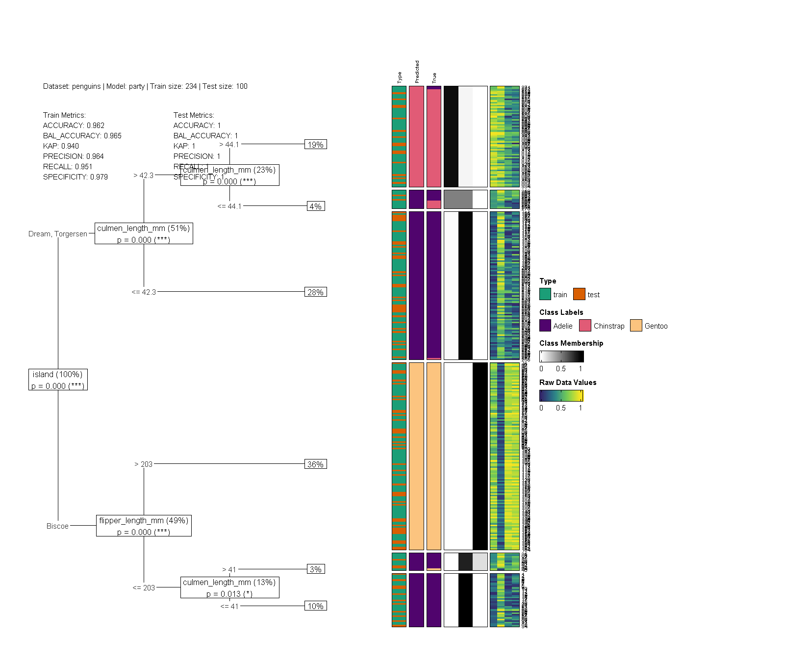
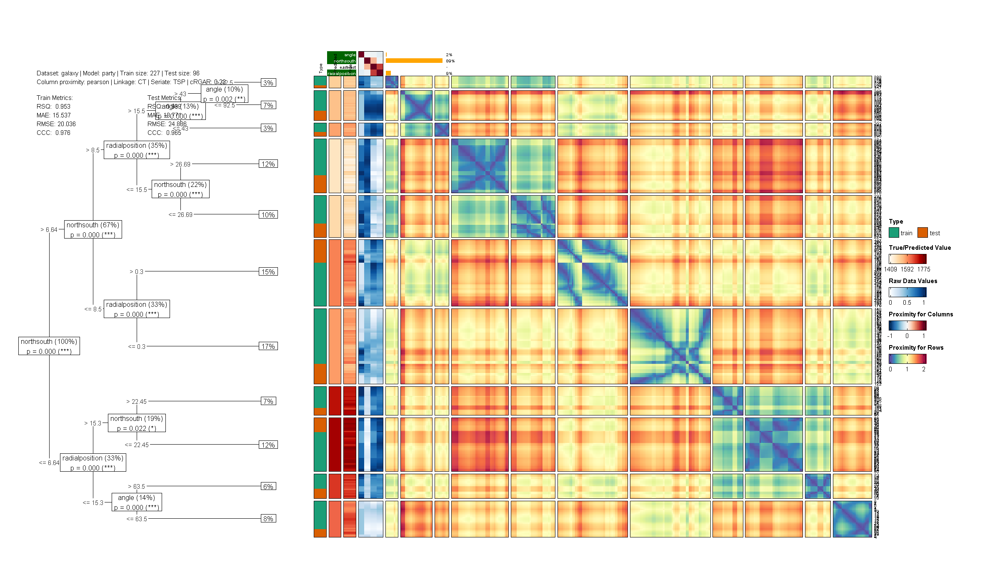

# dtGAP

**Supervised Generalized Association Plots Based on Decision Trees**

Decision trees are prized for their simplicity and interpretability but often fail to reveal underlying data structures. Generalized Association Plots (GAP) excel at illustrating complex associations yet are typically unsupervised. `dtGAP` bridges this gap by embedding **supervised correlation** and distance measures into GAP for enriched **decision-tree visualization**, offering confusion matrix maps, decision-tree matrix maps, predicted class membership maps, and evaluation panels.

**[View the full vignette](https://github.com/hanmingwu1103/dtGAP/releases/download/v0.0.2/dtGAP_intro.html)**

## Installation

```r
# Install from CRAN
install.packages("dtGAP")

# Or install the development version from GitHub
# install.packages("devtools")
devtools::install_github("hanmingwu1103/dtGAP")
```

## Quick Start

```r
library(dtGAP)

penguins <- na.omit(penguins)
dtGAP(
  data_all = penguins, model = "party", show = "all",
  trans_type = "percentize", target_lab = "species",
  simple_metrics = TRUE,
  label_map_colors = c(
    "Adelie" = "#50046d", "Gentoo" = "#fcc47f",
    "Chinstrap" = "#e15b76"
  ),
  show_col_prox = FALSE, show_row_prox = FALSE,
  raw_value_col = colorRampPalette(
    c("#33286b", "#26828e", "#75d054", "#fae51f")
  )(9)
)
```



## Features

### Tree Models

Choose between two tree models via the `model` argument:

- **`"rpart"`** (classic CART): Each node shows class-membership probabilities and the percentage of samples in each branch.
- **`"party"`** (conditional inference trees): Each internal node is annotated with its split-variable p-value and the percentage of samples in each branch.

### Data Subsets

Control which data to visualize with the `show` argument: `"all"`, `"train"`, or `"test"`.

### Row and Column Proximity

- **Column Proximity**: Combined conditional correlation matrix weighted by group memberships.
- **Row Proximity**: Supervised distance combining within-leaf dispersion and between-leaf separation using linkage `"CT"` (centroid), `"SG"` (single), or `"CP"` (complete).

Use any method from the `seriation` package to reorder rows and columns. The **cRGAR** score quantifies order quality (near 0 = good sorting, near 1 = many violations).

### Data Transformation

Choose a suitable transformation via `trans_type`: `"none"`, `"percentize"`, `"normalize"`, or `"scale"`.

### Evaluation Metrics

When `print_eval = TRUE`, an evaluation panel shows:

- **Data Information**: Dataset name, model, train/test sizes, proximity method, linkage, seriation algorithm, and cRGAR score.
- **Train/Test Metrics**:
  - Full confusion-matrix report (default, via `caret::confusionMatrix()`)
  - Simple metrics (`simple_metrics = TRUE`): Accuracy, Balanced Accuracy, Kappa, Precision, Recall, Specificity

### Train/Test Workflow

```r
dtGAP(
  data_train = train_covid, data_test = test_covid,
  target_lab = "Outcome", show = "test",
  label_map = c("0" = "Survival", "1" = "Death"),
  label_map_colors = c("Survival" = "#50046d", "Death" = "#fcc47f"),
  simple_metrics = TRUE
)
```

### Regression

`dtGAP` also supports regression tasks with metrics including R-squared, MAE, RMSE, and CCC:

```r
dtGAP(
  data_all = galaxy, task = "regression",
  target_lab = "target", show = "all",
  trans_type = "percentize", model = "party",
  simple_metrics = TRUE
)
```



### Variable Selection

Focus the heatmap on a subset of features while the tree is still trained on all variables:

```r
dtGAP(
  data_train = train_covid, data_test = test_covid,
  target_lab = "Outcome", show = "test",
  select_vars = c("LDH", "Lymphocyte")
)
```

### Custom Tree Input

Pass a pre-trained tree directly via the `fit` parameter. Supports `rpart`, `party`, and `train` (caret) objects with automatic model detection:

```r
library(rpart)
custom_tree <- rpart(Outcome ~ ., data = train_covid)

dtGAP(
  fit = custom_tree,
  data_train = train_covid, data_test = test_covid,
  target_lab = "Outcome", show = "test"
)
```

### Interactive Visualization

Set `interactive = TRUE` to launch a Shiny-based heatmap viewer powered by `InteractiveComplexHeatmap`:

```r
dtGAP(
  data_train = train_covid, data_test = test_covid,
  target_lab = "Outcome", show = "test",
  interactive = TRUE
)
```

### Multi-Model Comparison

Compare two or more tree models side-by-side with `compare_dtGAP()`:

```r
compare_dtGAP(
  models = c("rpart", "party"),
  data_train = train_covid, data_test = test_covid,
  target_lab = "Outcome", show = "test"
)
```

### Random Forest Extension

Visualize conditional random forests via `partykit::cforest`:

```r
# Ensemble summary: variable importance + representative tree
result <- rf_summary(
  data_train = train_covid, data_test = test_covid,
  target_lab = "Outcome", ntree = 50
)

# Visualize a single tree from the forest
rf_dtGAP(
  data_train = train_covid, data_test = test_covid,
  target_lab = "Outcome", show = "test",
  tree_index = result$rep_tree_index, ntree = 50
)
```

### Export Plots

Save visualizations to PNG, PDF, or SVG:

```r
save_dtGAP(
  file = "my_plot.png",
  data_train = train_covid, data_test = test_covid,
  target_lab = "Outcome", show = "test"
)
```

### Customization

- **Variable importance**: `col_var_imp`, `var_imp_bar_width`, `var_imp_fontsize`
- **Split variable labels**: `split_var_bg`, `split_var_fontsize`
- **Color palettes** (any `RColorBrewer` palette):
  - `Col_Prox_palette` / `Col_Prox_n_colors`
  - `Row_Prox_palette` / `Row_Prox_n_colors`
  - `sorted_dat_palette` / `sorted_dat_n_colors`
- **Label mapping**: `label_map`, `label_map_colors`
- **Proximity display**: `show_row_prox`, `show_col_prox`
- **Layout**: `tree_p` controls the proportion of canvas allocated to the tree

## Included Datasets

| Dataset | Description | Observations | Task |
|---------|-------------|-------------|------|
| `Psychosis_Disorder` | SAPS/SANS symptom ratings | 95 | Classification |
| `penguins` | Palmer penguins morphometrics | 344 | Classification |
| `wine` | Italian wine chemical analysis | 178 | Classification |
| `diabetes` | Pima Indians diabetes | 768 | Classification |
| `train_covid` / `test_covid` | Wuhan COVID-19 patient records | 375 / 110 | Classification |
| `wine_quality_red` | Portuguese red wine quality | 1599 | Regression |
| `galaxy` | Galaxy velocity data | 323 | Regression |

## Citation

Wu, H.-M., Chang, C.-Y., & Chen, C.-H. (2025). dtGAP: Supervised matrix visualization for decision trees based on the GAP framework. R package version 0.0.2. <https://CRAN.R-project.org/package=dtGAP>

### References

- Chen, C. H. (2002). Generalized association plots: Information visualization via iteratively generated correlation matrices. *Statistica Sinica*, 12, 7-29.
- Le, T. T., & Moore, J. H. (2021). Treeheatr: An R package for interpretable decision tree visualizations. *Bioinformatics*, 37(2), 282-284.
- Wu, H. M., Tien, Y. J., & Chen, C. H. (2010). GAP: A graphical environment for matrix visualization and cluster analysis. *Computational Statistics & Data Analysis*, 54(3), 767-778.

## License

MIT
