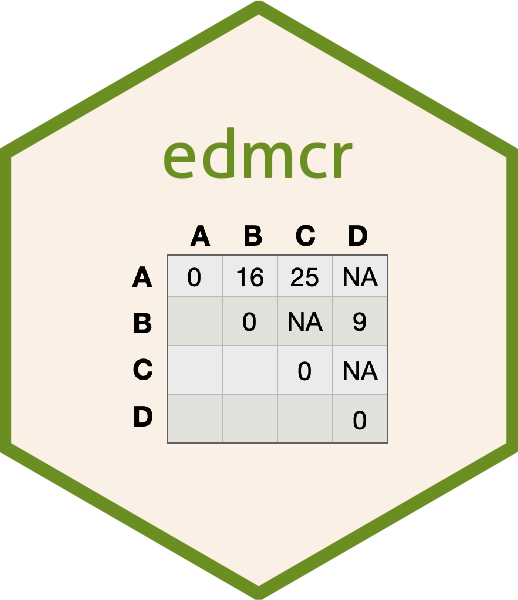

## edmcr 

An R package for Euclidean (squared) distance matrix completion (and determining point configurations based on the completed matrix.)

## Description
Implements various general algorithms to estimate missing elements of a Euclidean (squared) distance matrix.  
Includes optimization methods based on semi-definite programming, nonparametric position, and dissimilarity parameterization formulas.
   
When the only non-missing distances are those on the minimal spanning tree, the guided random search algorithm will complete the matrix while preserving the minimal spanning tree.
   
Point configurations in specified dimensions can be determined from the completions. 

Special problems such as the sensor localization problem and reconstructing
the geometry of a molecular structure can also be solved.

Online documentation: [https://great-northern-diver.github.io/edmcr/](https://great-northern-diver.github.io/edmcr/)  

## References

- Alfakih, Khandani, and Wolkowicz (1999) "Solving Euclidean Distance Matrix Completion Problems Via Semidefinite Programming", Computational Optimization and Applications, Volume 12, pages 13–30 [doi:10.1023/A:1008655427845](https://doi.org/10.1023/A:1008655427845)
- Trosset (2000) "Distance Matrix Completion by Numerical Optimization", Computational Optimization and Applications, Volume 17, pages 11–22 [doi:10.1023/A:1008722907820](https://doi.org/10.1023/A:1008722907820)
- Krislock and Henry Wolkowicz (2010) "Explicit sensor network localization using semidefinite representations and facial reductions", SIAM Journal on Optimization, Volume 20(5), pages 2679–2708 [doi:10.1137/090759392](https://doi.org/10.1137/090759392)
- Fang and O'Leary (2012) "Euclidean Matrix Completion Problems", Optimization Methods and Software, Volume 27, pages 695-717,  [doi:10.1080/10556788.2011.643888](https://doi.org/10.1080/10556788.2011.643888)
- Rahman and Oldford (2018) "Euclidean Distance Matrix Completion and Point Configurations from the Minimal Spanning Tree", SIAM Journal on Optimization, Volume 28, pages 528-550  [doi:10.1137/16M1092350](https://doi.org/10.1137/16M1092350)
- Rahman (2018) "Preserving Measured Structure During Generation and Reduction of Multivariate Point Configurations", Doctoral dissertation UWSpace theses [http://hdl.handle.net/10012/13365](https://hdl.handle.net/10012/13365)

Other source code:

- makes use of some `C` source code (sparse matrix column ordering authored by Stefan I. Larimore and Timothy A. Davis) from the Suite Sparse collection.