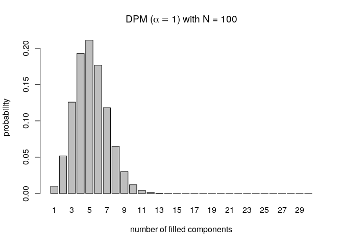

<!-- README.md is generated from README.Rmd. Please edit that file -->

# fipp

<!-- badges: start -->

<!-- badges: end -->

The goal of fipp is to provide tools to carry out sanity checks on
mixture models when used for Model-Based Clustering.

Specifically, it deals with characterizing implicit quantities obtained
from prior distributions of either of the following three models:
Dirichlet Process Mixtures (DPM), Static Mixture of Finite Mixtures
(Static MFM) and Dynamic Mixture of Finite Mixtures (Dynamic MFM).

## Installation

You can install the released version of fipp from
[CRAN](https://CRAN.R-project.org)
with:

``` r
install.packages("fipp")
```

## Example: the number of filled mixture components (in other words data clusters)

One of the functions in the package allows the user to obtain the number
of filled mixture components. Note that it shouldn’t be confused with
the number of mixture components. The former quantity is equal or less
than the latter where equality holds when at least one data point is
associated to any of the mixture components in the model. For details,
please refer to the vignette provided in the next section.

Here, we demonstrate how one can obtain the prior distribution of filled
mixture components for the DPM under a specific setting (the
concentration parameter \(\alpha = 1\) and when the sample size
\(N = 100\)).

``` r
library(fipp)
## DPM w/ alpha = 1, N = 100, evaluate up to 30
pmfDPM <- nClusters(Kplus = 1:30, type = "DPM", alpha = 1, N = 100)
barplot(pmfDPM(),
        main = expression("DPM (" * alpha == 1 * ") with N = 100"),
        xlab = "number of filled components", ylab = "probability")
```



## Details

For more detailed description regarding the functionality of the
package, please refer to the vignette below:

[fipp Crash
Course](https://CRAN.R-project.org/package=fipp/vignettes/fippCrashCourse.html)
