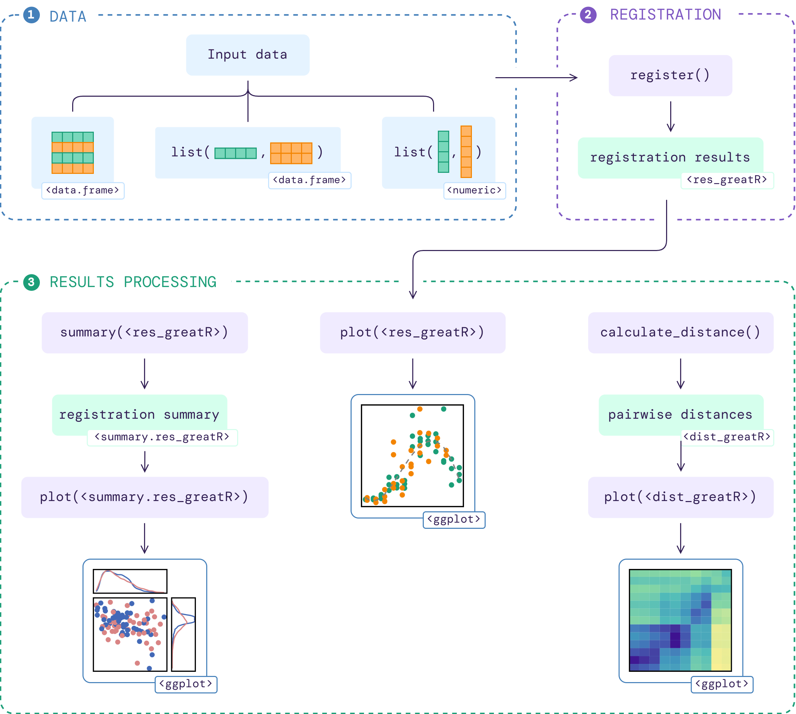

<!-- README.md is generated from README.Rmd. Please edit that file -->

# greatR 

<!-- badges: start -->

[](https://cran.r-project.org/package=greatR)
[](https://lifecycle.r-lib.org/articles/stages.html)
[](https://github.com/ruthkr/greatR/actions/workflows/R-CMD-check.yaml)
[](https://app.codecov.io/gh/ruthkr/greatR)
[](https://github.com/ruthkr/greatR/actions/workflows/pkgdown.yaml)
[](https://github.com/ruthkr/greatR/commits/master)
<!-- badges: end -->

`greatR` (**G**ene **R**egistration from **E**xpression **a**nd
**T**ime-courses in **R**) is a tool to register (align) two sets of
gene expression profiles that users wish to compare.

These gene profiles data will be referred as the **query** and the
**reference** data. To match the time point ranges between those
profiles, the time points of the **query** profiles will be transformed
through a stretching and shifting process. This tool uses a statistical
model comparison based on a Bayesian approach to evaluate the optimality
of the gene expression profiles alignment.

## Package workflow

The flowchart below illustrates the workflow of the package given an
input data:



More details on how to use this package are available on [function
documentations](https://ruthkr.github.io/greatR/reference/index.html)
and the following vignettes:

1.  [Input data
    requirements](https://ruthkr.github.io/greatR/articles/data-requirement.html)
2.  [Register
    data](https://ruthkr.github.io/greatR/articles/register-data.html)
3.  [Process registration
    results](https://ruthkr.github.io/greatR/articles/process-results.html)

## Installation

You can install the stable version of `greatR` from
[CRAN](https://CRAN.R-project.org) with:

``` r
install.packages("greatR")
```

And the development version of `greatR` from
[GitHub](https://github.com/) with:

``` r
# install.packages("devtools")
devtools::install_github("ruthkr/greatR")
```

## Usage - quick start

This is a basic example which shows you how to register (align) gene
expression profiles over time:

``` r
# Load the package
library(greatR)
```

``` r
# Load a data frame from the sample data
b_rapa_data <- system.file("extdata/brapa_arabidopsis_data.csv", package = "greatR") |>
  utils::read.csv()

# Running the registration
registration_results <- register(
  b_rapa_data,
  reference = "Ro18",
  query = "Col0",
  scaling_method = "z-score"
)
#> ── Validating input data ────────────────────────────────────────────────────────
#> ℹ Will process 10 genes.
#> ℹ Using estimated standard deviation, as no `exp_sd` was provided.
#> ℹ Using `scaling_method` = "z-score".
#>
#> ── Starting registration with optimisation ──────────────────────────────────────
#> ℹ Using L-BFGS-B optimisation method.
#> ℹ Using computed stretches and shifts search space limits.
#> ℹ Using `overlapping_percent` = 50% as a registration criterion.
#> ✔ Optimising registration parameters for genes (10/10) [2s]
```

## Reference

Calderwood, A., Hepworth, J., Woodhouse, … Morris, R. (2021).
Comparative transcriptomics reveals desynchronisation of gene expression
during the floral transition between Arabidopsis and Brassica rapa
cultivars. *Quantitative Plant Biology, 2*, E4.
[doi:10.1017/qpb.2021.6](https://www.cambridge.org/core/journals/quantitative-plant-biology/article/comparative-transcriptomics-reveals-desynchronisation-of-gene-expression-during-the-floral-transition-between-arabidopsis-and-brassica-rapa-cultivars/811BFDFA14F4BCC9C7F0ECC7CE103BB6)
