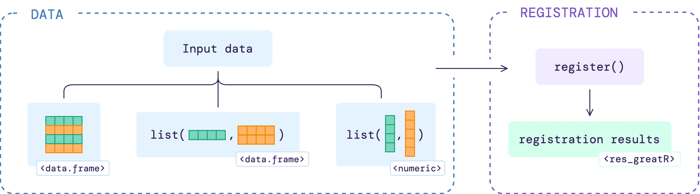

```{r, include = FALSE}
knitr::opts_chunk$set(
  collapse = TRUE,
  comment = "#>"
)
```

This article will show users how to register data using different types of input, as illustrated below.

```{r reg-data, echo=FALSE, fig.align='center', out.width='100%'}

```

## Using data frame input

### Loading sample data

`greatR` provides an example of data frame containing two different species *A. thaliana* and *B. rapa* with two and three different replicates, respectively. This data frame can be read as follows:

```{r load-greatR, message=FALSE}
# Load the package
library(greatR)
library(data.table)
```

```{r load-brapa-data, message=FALSE, warning=FALSE}
# Load a data frame from the sample data
b_rapa_data <- system.file("extdata/brapa_arabidopsis_data.csv", package = "greatR") |>
  data.table::fread()
```

Note that the data has all of five columns required by the package:

```{r brapa-data-kable-clean, eval=FALSE}
b_rapa_data |>
  knitr::kable()
```

```{r brapa-data-kable, echo=FALSE}
b_rapa_data[, .SD[1:6], by = accession][, .(gene_id, accession, timepoint, expression_value, replicate)] |>
  knitr::kable()
```

### Registering the data

To align gene expression time-course between *Arabidopsis* Col-0 and *B. rapa* Ro18, we can use the function `register()`. When using the default `use_optimisation = TRUE`, `greatR` will find the best stretch and shift parameters through optimisation. For more details on the other function arguments, go to `register()`.

```{r register-data-raw, message=FALSE, warning=FALSE, eval=FALSE}
registration_results <- register(
  b_rapa_data,
  reference = "Ro18",
  query = "Col0",
  scaling_method = "z-score"
)
#> ── Validating input data ────────────────────────────────────────────────────────
#> ℹ Will process 10 genes.
#> ℹ Using estimated standard deviation, as no `exp_sd` was provided.
#> ℹ Using `scaling_method` = "z-score".
#>
#> ── Starting registration with optimisation ──────────────────────────────────────
#> ℹ Using L-BFGS-B optimisation method.
#> ℹ Using computed stretches and shifts search space limits.
#> ℹ Using `overlapping_percent` = 50% as a registration criterion.
#> ✔ Optimising registration parameters for genes (10/10) [2s]
```

When dealing with thousands of genes, users may speed up the registration process by using the argument `num_cores` to run the registration using parallel processing.

```{r register-data-raw-detect-cores, message=FALSE, warning=FALSE, eval=FALSE}
parallel::detectCores()
#> 8
```

```{r register-data-raw-parallel, message=FALSE, warning=FALSE, eval=FALSE}
registration_results <- register(
  b_rapa_data,
  reference = "Ro18",
  query = "Col0",
  scaling_method = "z-score",
  num_cores = 8
)
```

### Registration results

The function `register()` returns a list with S3 class `res_greatR` containing three different objects:

- `data` is a data frame containing the expression data and an additional `timepoint_reg` column which is a result of registered time points by applying the registration parameters to the query data.
- `model_comparison` is a data frame containing (a) the optimal stretch and shift for each `gene_id` and (b) the difference between Bayesian Information Criterion for the separate model and for the combined model (`BIC_diff`) after applying optimal registration parameters for each gene. If the value of `BIC_diff < 0`, then expression dynamics between reference and query data can be registered (`registered = TRUE`). (Default S3 print).
- `fun_args` is a list of arguments used when calling the function (`reference`, `query`, `scaling_method`, ...).

To check whether a gene is registered or not, we can get the summary results by accessing the `model_comparison` table from the registration result.

```{r register-data, message=FALSE, warning=FALSE, include=FALSE}
# Load a data frame from the sample data
registration_results <- system.file("extdata/brapa_arabidopsis_registration.rds", package = "greatR") |>
  readRDS()
```

```{r get-model-summary-data, warning=FALSE}
registration_results$model_comparison |>
  knitr::kable()
```

From the sample data above, we can see that for nine out of ten genes, `registered = TRUE`, meaning that reference and query data between those nine genes can be aligned or registered. These data frame outputs can further be summarised and visualised; see the documentation on the [processing registration results](https://ruthkr.github.io/greatR/articles/process-results.html) article.

## Using other inputs

### Loading sample data

As noted in the [input data requirements](https://ruthkr.github.io/greatR/articles/data-requirement.html) article, `register()` also accepts a list of data frames or a list of reference and query vectors as `input`:

```{r load-input-vector, message=FALSE, warning=FALSE}
# Define expression value vectors
ref_expressions <- c(1.9, 3.1, 7.8, 31.6, 33.7, 31.5, 131.4, 107.5, 116.7, 112.5, 109.7, 57.4, 50.9)
query_expressions <- c(14, 12.1, 15.9, 47, 30.9, 50.5, 80.1, 67.4, 72.9, 61.7)

list_vector <- list(
  reference = ref_expressions,
  query = query_expressions
)
```

### Registering the data

As previously shown, to register the input list, users can run the function `register()`:

```{r register-data-list-vectors, message=FALSE, warning=FALSE}
registration_results_vectors <- register(
  list_vector,
  reference = "Ref",
  query = "Query",
  scaling_method = "z-score"
)
#> ── Validating input data ───────────────────────────────────────────────────────
#> ℹ Will process 1 gene.
#> ℹ Using estimated standard deviation, as no `exp_sd` was provided.
#> ℹ Using `scaling_method` = "z-score".
#> 
#> ── Starting registration with optimisation ─────────────────────────────────────
#> ℹ Using L-BFGS-B optimisation method.
#> ℹ Using computed stretches and shifts search space limits.
#> ℹ Using `overlapping_percent` = 50% as a registration criterion.
#> ✔ Optimising registration parameters for genes (1/1) [170ms]
```

### Registration results

The registration result object will have the same structure as when using a data frame as an input. Since no ID is explicitly defined in the input vector list, a unique `gene_id` will be automatically generated for the reference and query pair.

```{r get-model-summary-data-vectors, warning=FALSE}
registration_results_vectors$model_comparison |>
  knitr::kable()
```
