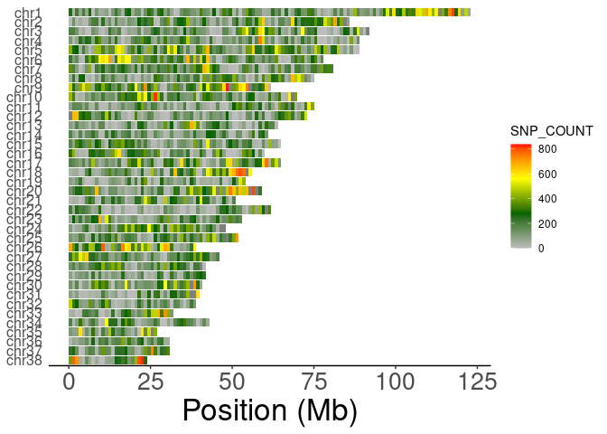

R package ‘handyFunctions’ version 0.1.0
================
Copyright (C) 2022, Hongfei Liu
2022/08/16

<!-- README.md is generated from README.Rmd. Please edit that file -->

# handyFunctions

<!-- badges: start -->


[](https://app.codecov.io/gh/LuffyLouis/handyFunctions?branch=main)
[](https://github.com/LuffyLouis/handyFunctions/actions/workflows/R-CMD-check.yaml)

<!-- badges: end -->

The goal of handyFunctions is to get rid of the barrier to deal with
non-standard data.frame format for R newbies, especially the user in
bioinformatics data analysis. Besides, there are also some required plot
functions for downstream analysis of dataset generated from vcftools and
plink.

## Table of contents

-   [Installation](#installation)
-   [Example](#example)
    -   [ReformatDataframe](#reformatdataframe)
    -   [InteractDataframe](#interactdataframe)
    -   [Post-VCF](#post-vcf)
        -   [plotSNVdensity](#plotsnvdensity)
-   [License](#license)

## Installation

You can install the development version of handyFunctions like so:

``` r
## Clone it from github and install it locally
git clone https://github.com/LuffyLouis/handyFunctions.git
## OR
## Install it in R
remotes::install_github("LuffyLouis/handyFunctions")
```

## Example

`handyFunctions`package contain three main sections, including
ReformatDataframe, InteractDataframe, and Post-VCF. There are some basic
examples which show you how to solve common problems in data analysis:

### ReformatDataframe

This section is designed to reformat data.frame with odd colnames,
rownames, or even inappropriate dtypes for each columns.

#### unifyDataframe

Based on the following example `unifyDataframe` function, you can change
the formats of raw data.frame to what you want. Especially for the
dtypes in data.frame, you can set `custom=FALSE` for automatically
changing into appropriate dtypes.

``` r
library('handyFunctions')
data("people")
head(people)
#>          ..name  ..sex ..age ..death..age
#> 1       Ming Li   male    12           34
#> 2    Zixuan Liu female    23       thirty
#> 3    Yizhen Zhu   male    NA           54
#> 4 Lingling Wang female    21           77
#> 5      Bang Wei   male    11         <NA>
#> 6   Xiaoyu Chen female    74           89
modifiedPeople <- unifyDataframe(people,rawColSep = '[.][.]')
head(modifiedPeople)
#>            name    sex  age death_age
#> 1       Ming Li   male   12        34
#> 2    Zixuan Liu female   23    thirty
#> 3    Yizhen Zhu   male <NA>        54
#> 4 Lingling Wang female   21        77
#> 5      Bang Wei   male   11      <NA>
#> 6   Xiaoyu Chen female   74        89
```

**Note**: due to the separation supporting regEx, please use the
`"[.][.]"` for reformatting `people` data.frame.

### InteractDataframe

The `InteractDataframe` section is designed for interaction between two
data.frame or one data.frame and another vector.

#### mergeCustom

Sometimes, we often find it fuzzy and tedious while we’d like to merge
two data.frame with different colnames. Therefore, `mergeCustom`
function may be the better solution to get it rid of.

``` r
library('handyFunctions')
data("people");data("grade")
head(people)
#>          ..name  ..sex ..age ..death..age
#> 1       Ming Li   male    12           34
#> 2    Zixuan Liu female    23       thirty
#> 3    Yizhen Zhu   male    NA           54
#> 4 Lingling Wang female    21           77
#> 5      Bang Wei   male    11         <NA>
#> 6   Xiaoyu Chen female    74           89
head(grade)
#>            name chinese math english physics biology chemistry
#> 1       Ming Li     120  130     145      80      90        99
#> 2    Zixuan Liu     109  120     110      85      99        88
#> 3    Yizhen Zhu      98  113     100      74     100        76
#> 4 Lingling Wang     138  145     126      55      89       100
#> 5      Bang Wei     119  105     139     100      78        99
#> 6   Xiaoyu Chen     119  105     120      69      80        77
merged <- mergeCustom(people,grade,xcol = '..name',ycol = 'name')
head(merged)
#>          ..name  ..sex ..age ..death..age chinese math english physics biology
#> 1      Bang Wei   male    11         <NA>     119  105     139     100      78
#> 2 Lingling Wang female    21           77     138  145     126      55      89
#> 3       Ming Li   male    12           34     120  130     145      80      90
#> 4   Xiaoyu Chen female    74           89     119  105     120      69      80
#> 5    Yizhen Zhu   male    NA           54      98  113     100      74     100
#> 6    Zixuan Liu female    23       thirty     109  120     110      85      99
#>   chemistry
#> 1        99
#> 2       100
#> 3        99
#> 4        77
#> 5        76
#> 6        88
```

### Post-VCF

#### plotSNVdensity

``` r
library('handyFunctions')
library('ggplot2')
data("SNV_1MB_density_data")
head(SNV_1MB_density_data)
#>   CHROM BIN_START SNP_COUNT VARIANTS.KB
#> 1     1         0       253       0.253
#> 2     1   1000000        31       0.031
#> 3     1   2000000       208       0.208
#> 4     1   3000000        77       0.077
#> 5     1   4000000       204       0.204
#> 6     1   5000000        75       0.075
ShowSNPDensityPlot(SNV_1MB_density_data,binSize=1e6,chromSet = c(38:1),withchr=T)+
  theme(axis.text.y = element_text(size=12))
#> ## Filtering the density data with specific chrom set...
#> ## Judging if it should be added the chr and factoring...
#> ## Reformatting the raw density data...
```



## License

This project is published under MIT license, see file `LICENSE`.
