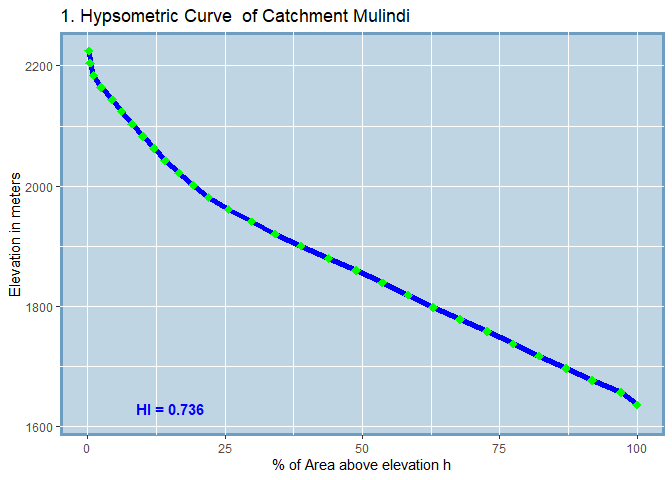
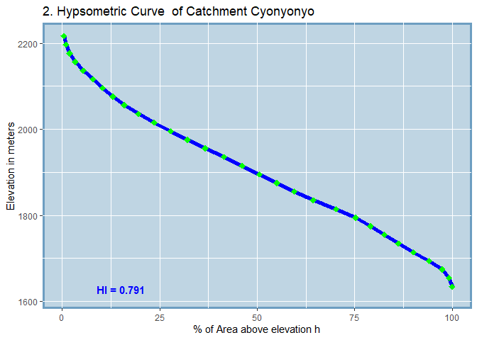
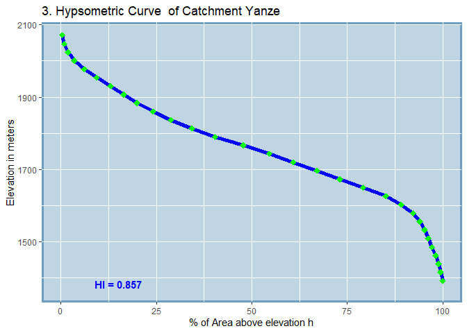

<!-- README.md is generated from README.Rmd. Please edit that file -->

# hypsoLoop

<!-- badges: start -->
<!-- badges: end -->

`hypsoLoop` has been developed as tool to automate the drawing of
hypsographic curves and the calculation of hypsometric curves for a
watershed that contains several sub-catchments.

## Installation

You can install the development version of `hypsoLoop` from
[GitHub](https://github.com/fgashakamba/hypsoLoop) with:

``` r
# devtools::install_github("fgashakamba/hypsoLoop")
```

and you can install the published beta version at
[CRAN](https://CRAN.R-project.org) with:

``` r
# Still in beta stage (version 0.2.0)
# Package currently under review by the CRAN team and it'll Soon be available at:
install.packages("hypsoLoop") 
```

## Example use of `hypsoLoop`

The workhorse function of `hypsoLoop` is called `drawHypsocurves()`. It
accepts two arguments: a watersheds boundary layer (an `sf` or `sp`
object) and an digital elevation model (DEM) covering the area of
interest (a `rasterLayer` object). Additionally, the user may specify
whether they want to get an output folder created in the root directory
or not. If not, the hypsometric curves are drawn in the viewer and a
summary table containing the hypsometric integers and other useful
information on the sub-catchments is returned.

``` r
library(hypsoLoop)
drawHypsoCurves(watersheds, DEM)
```



    #>   SUB_CATCHMENT_CODE MIN_ELEV MAX_ELEV TOTAL_AREA H_INTEGRAL
    #> 1            Mulindi     1616     2225    2576.38      0.736
    #> 2          Cyonyonyo     1614     2217     3673.1      0.791
    #> 3              Yanze     1368     2071    3435.65      0.857

Other two functions are exposed from this `hypsoLoop`. These are the
`generateHypsoTables()` which can be used to generate area-elevation
tables for the sub-catchments of a watersheds and whose input
requirements are the same as `drawHypsoCurves()`. The `calc_areas()`
function is a handy function that be used to calculate the areas covered
by each class of a categorical raster. It accepts one input argument
which has to be a categorical raster of type `rasterLayer` and returns a
table that summarizes the areas (in Hectares) covered by each class or
category defined in the input raster.

``` r
library(hypsoLoop)
calc_areas(lulcYanze)
#>   CLASS         AREA
#> 1     1 1375.4506114
#> 2     2  528.6022953
#> 3     3 6830.5717454
#> 4     5   93.0439997
#> 5     6    0.2003449
#> 6    10  422.4313268
#> 7    11  401.4568430
```
