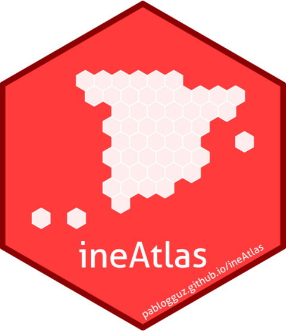

# ineAtlas 

<!-- badges: start -->
[](https://lifecycle.r-lib.org/articles/stages.html#experimental)
[](https://CRAN.R-project.org/package=ineAtlas)
[](https://cran.r-project.org/package=ineAtlas)
[](https://github.com/pablogguz/ineAtlas/actions/workflows/R-CMD-check.yaml)
[](https://github.com/pablogguz/ineAtlas/releases)
<!-- badges: end -->

The goal of `ineAtlas` is to provide easy access to granular socioeconomic indicators from the Spanish Statistical Office (INE) _Atlas de Distribución de Renta de los Hogares_ (Household Income Distribution Atlas). This dataset combines administrative tax data with population statistics to provide detailed information about the income distribution and related socioeconomic indicators at the municipal, district, and census tract levels.

## Data structure

The data is organized into several categories and is available at three geographic levels:

- Municipality (_Municipio_)
- District (_Distrito_)
- Census tract (_Sección censal_)

### Available datasets
| Dataset | Description |
|---------|------------|
| Income | Income indicators including net/gross (equivalised) income per capita |
| Income sources | Income indicators by source (wages, pensions, benefits, etc.) |
| Demographics | Population characteristics including age structure and household composition |
| Distribution by sex | Income distribution indicators disaggregated by sex |
| Distribution by sex and age | Income distribution indicators by sex and age categories |
| Distribution by sex, age and nationality | Income distribution indicators by sex and nationality status |
| Inequality indicators | Inequality metrics including Gini coefficient and P80/P20 ratio |

All the data is stored in the accompanying [`ineAtlas.data`](https://github.com/pablogguz/ineAtlas.data/) repository. You can find the data dictionary and more information about the data structure at [https://pablogguz.github.io/ineAtlas.data/](https://pablogguz.github.io/ineAtlas.data/).


## Installation

You can install the released version of `ineAtlas` from CRAN with:

``` r
install.packages("ineAtlas")
```

Alternatively, you can install the development version from [GitHub](https://github.com/) with:

``` r
# install.packages("pak")
pak::pak("pablogguz/ineAtlas")
```

## Example

Here's a basic example of fetching census tract-level income data:

``` r
library(ineAtlas)

# Get municipality-level income data
income_data <- get_atlas("income", "tract")

# View the first few rows
head(income_data)
```
## Contributing

Contributions are welcome! Please feel free to submit a pull request. For major changes, please open an issue first to discuss what you would like to change.

## References

**Spanish Statistical Office** (2024). *Household Income Distribution Atlas*. Retrieved from [https://www.ine.es/en/experimental/atlas/experimental_atlas_en.htm/](https://www.ine.es/en/experimental/atlas/experimental_atlas_en.htm/) [Accessed October 29, 2024]

Latest data release: October 29, 2024

## Author

**Pablo García Guzmán**  
EBRD
