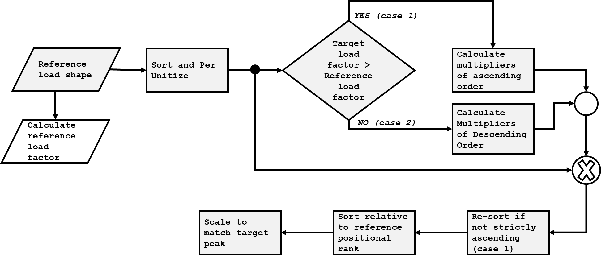
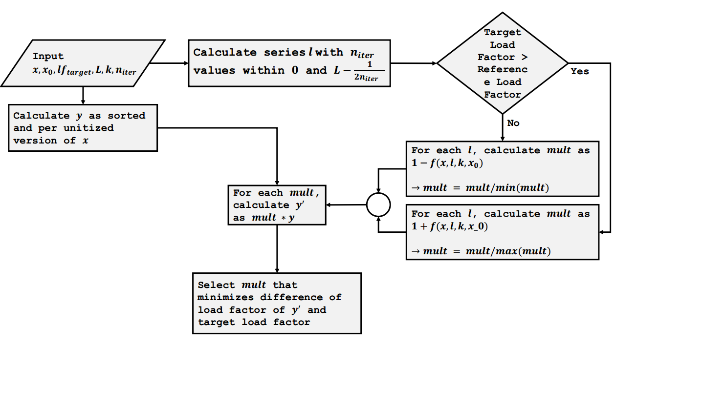

```{r setup, include = FALSE}
knitr::opts_chunk$set(
  collapse = TRUE,
  comment = "#>"
)
```


```{r ch1}
library(loadshaper)
```


# Introduction

## Electric Load Shape

Load shapes can be defined as the hourly pattern of loads for a given set of variables including equipment, operating characteristics, and other factors such as weather and demographics [@define_loadshape]. Electric load shape is the hourly pattern of 
electric load. It can be with for a day, week, month or a year with 24, 168, 720 and 8760 hourly load values. 


## Load Factor
A measure of utilization/efficiency of a given electric load 
shape is `load factor`. it is defined as the ratio of the average load of the profile to the maximum load of the system. If $x_1$, $x_2$, $x_3$,...,$x_n$ are $n$ hourly values from a system/grid, then load factor, $f_{load}$ can be derived as:

$$
f_{load} = \frac{\sum^{n}_{i=1}x_i/n}{max(x_1, x_2, x_3,...,x_n)}
$$

Load factor is a a measure of efficiency and always  falls in $[0, 1]$ interval. High load factor indicates high efficiency and vice versa. 

Load factor depends on various factors. For example, when considering a regional electric grid, it may vary by month, season, day type (weekday vs weekend), weather, customer class share (residential, commercial, industrial), length of the period and so on. Energy forecast and peak forecasts are used in various studies by the grid planners and preserving the load factor is important as it varies by different factors. Often a base load shape (for month, season, year etc.) is used and forecast energy and peak load (and hence the load factor) is applied to the base load shape. For example, in the grid reliability assessment study [@npcc_rna2021] conducted by Northeast Power Coordinating Council (NPCC) in 2021, 2002 load shape was as the base load shape and scaled to match the peak demand and energy forecast [@npcc_analysis]. 


## Package `loadshaper`

R package `loadshaper` provides functionality to scale a given load shape to hit the target peak, while preserving the desired load factor. In other words, a reference load shape can be scaled to hit the target peak and total energy for the given time period. Two methods have been utilized. Additionally, a metric has been developed to quantify how well the time series properties of the reference load shape had been preserved in the scaled load shape.


# Load Shape Scaling

Two methods, namely linear and logistic- have been developed and utilized to scale a reference shape to match the peak and load factor. 

```{r flow, echo=FALSE, fig.cap="Load Shape Scaling Process \\label{fig:flow}", out.width = '80%'}

```

Figure 1 shows a general flow diagram of  scaling process. The starting point is the per unit load duration curve (LDC). LDC is the load profile ordered in descending order of magnitude, rather than chronologically [@ldc_define]. For a target load factor smaller than the load factor of the reference profile, a series of multipliers of descending order are calculated, which is multiplied by the reference per unit LDC. The product then becomes the target per unit LDC. This is re-ordered relative to original positional rank to  derive the target per unit load shape. The per unit load shape is then scaled to match the target peak. For a target load factor greater than reference, the process is similar except for the multipliers are ordered in ascending order. 


The load factor matching process is baked in the stage of deriving the multipliers. The multipliers are derived in such a way so that the product (of multipliers and reference per unit LDC) hits the target peak. Neither re-ordering in later stage, nor multiplying by target peak alters the load factor.

The main difference is two methods (linear and logistic) is the pattern formed by the multipliers.  In linear method, the multipliers increased or decrease in linear fashion, whereas the multipliers derived by logistic method form a sigmoid line. The steepness and inflection point of the sigmoid can be controlled using parameters.


## Load Shape Scaling - Linear Method

In the linear method, the multipliers form a straight line with positive (case 1) or negative slope (case 2). Suppose $\textbf{y} = y_1,\ y_2,\ ...,\ y_n$ are the per unit LDC of the reference load shape. A set of multipliers $\textbf{m}=m_1,\ m_2,\ m_3,\ ...,\ m_n$ are derived so that 

$$
m_i = 1-(i-1)\beta
$$
where $\beta$ is a constant and can be  solved analytically. The $i_{th}$ element of the series $\textbf{y} \times \textbf{m}$ is $y_i m_i=y_i(1-(i-1)\beta)$. So, the load factor formed by $y_i m_i$ must be equal to the target load factor, $f_{target}$. So,

$$
\frac{avg(\textbf{y} \times \textbf{m})}{max(\textbf{y} \times \textbf{m})}=f_{target}
$$
Now, for $f_{target} < f_{load}$, $max(\textbf{y} \times \textbf{m})$ is always 1, as both $\textbf{y}$ and $\textbf{m}$ are decreasing. For $f_{target} > f_{load}$, the per unit LDC values are to be multiplied by increasing numbers starting from 1, arising the possibility of resulting a value $\gt 1$. However, for small deviance between $f_{target}$ and $f_{target}$, the likelihood is low and $max(\textbf{y} \times \textbf{m})=1$ holds true for most practical scenarios.


Setting $max(\textbf{y} \times \textbf{m})=1$, we get the following:

$$
avg(\textbf{y} \times \textbf{m})=f_{target}
$$
which is the basis of solving $\beta$. 


$$
avg(\textbf{y} \times \textbf{m})= \frac{\sum_{i=1}^n y_i (1-(i-1)\beta)}{n} = f_{target}
$$

$$
\sum_{i=1}^n y_i (1-(i-1)\beta) = n \times f_{target}
$$
$$
\sum_{i=1}^n y_i - \beta \sum_{i=1}^n (i-1)y_i = n \times f_{target}
$$

$$
\sum_{i=1}^n y_i - \beta \sum_{i=1}^n i\ y_i \
+ \beta \sum_{i=1}^ny_i
= n  \times f_{target}
$$
$$
\beta \left( \sum_{i=1}^n i\ y_i - \sum_{i=1}^ny_i\ \right)=
 \sum_{i=1}^ny_i - n  \times f_{target}
$$
$$
\beta = \frac{\sum_{i=1}^ny_i - n  \times f_{target}  }{ \sum_{i=1}^n i\ y_i - \sum_{i=1}^ny_i }
$$


## Load Shape Scaling - Logistic Method

In the logistic method, the multipliers form a S-shaped (or reversed S-shaped) curve. For case 1, where the target load factor is larger than the reference load factor, a set of increasing multipliers are derived which form a S-shaped curve. For case 2, where the target load factor is smaller than the reference load factor, the derived multipliers form an inverted/reversed S-shaped curve. This is done utilizing logistic function.

A sigmoid function can be written as, 

$$f(x)=\frac{L}{1- exp(-k(x-x_0))}$$

Parameter $k$ is shape parameter, shaping the "sigmoidness" of the function. Larger value of $k$ indicates more steepness in the function and lower value results in changes in multipliers in more linear fashion. Location parameter $x_0$ controls the inflection point of the function. 


```{r flow2, echo=FALSE, fig.cap="Load Shape Scaling Process Using Logistic Method \\label{fig:flow2}", out.width = '100%'}

```


Figure 2 shows the load shape scaling process of using logistic method. The process, with the input values, calculates a series (of lenght $n_{iter}$) of $L$ values. For each $L$ values, the process calculates a series of ascending/descending multipliers that follow a general S-shape through the use logistic function. Each multiplier series is then divided by min/max value so that the first multiplier becomes 1. From $n_{iter}$ set of multipliers, final set is selected which results in load factor closest to the target.


The sigmoidal method is implemented in `lslog` function, where $k$ is a user defined input argument. Parameter $x_0$ can be passed via `inf_pos` argument. A value of $0.5$ indicates the inflection point is halfway. 


## Scoring Load Shape

A diagnostic score was developed to score the derived load shape, in terms of how well time series properties are retained, when a base load shape is projected to a new load shape. 


The diagnostic measure is calculated as a weighted mean absolute percent error (MAPE) of auto correlation or partial auto correlation values of the derived series with respect to the original. The values are calculated for given lag. $Lag = 0$ is omitted from calculation for auto correlation as it would be always 1. If $o_i$ and $d_i$ are the correlation values of original and derived load shape at lag $i$, then weighted MAPE is calculated as:

$$
wmape = \sum _{i=1}^{lag} { w_i * |(o_i - d_i) / o_i|}
$$
where $w_i = \frac{|o_i|}{\sum _{i=1}^{lag}|o_i|}$


Since $wmape$ is a measure of error, lower value indicates better preservation of time series property.


# Using `loadshaper`
  
## Linear Scaling

```{r}
library(loadshaper)
# load ERCOT COAST load for the year 2019
loads <- ercot[ercot$Year == 2019, ]$COAST
# simple line plot
plot(loads, type = "l", col = "salmon", ylab = "Load (MW)")
grid()
```


Let us say that we want to hit a peak of $5000$ MW with a power factor of $0.5$, with this as a reference load shape using linear method. 


```{r}
lin_loadshape <- lslin(loads, target_lf = 0.5, 
                          target_max = 5000)
print(class(lin_loadshape))
```


The `lslin` function took the base load shape as an input argument, along with other arguments for target peak and target power factor. Often, power system planners have forecast/target yearly energy and  peak [@nyiso_GB2022], from which a target load factor can be calculated. The function returns an object of class `lslin`. A `summary` method can be applied to the `lslin` object. 


```{r}
summary(lin_loadshape)
```


The `summary` method shows a number of information about the input and the output load shape. First, it shows calculated $\beta$. Positive value indicates that target load factor is less than base shape load factor. The multipliers vary in between $1$ and $0.68$. Other information include base and target load factor and the load factor of the derived shape as well. It also shows the max and min values of the base and derived load shape. The derived max always matches the target peak. 

When $\beta > 0$, ($target\ load\ factor< base\ load\ factor$), the multipliers decrease linearly. If target load factor is too small, it results in negative multipliers (i.e negative load). So, projection of a base load shape to new peak and load factor is limited. It is possible to analytically solve the minimum possible target load factor by setting $m_n=0$.

$$
m_n=0
$$

$$
1-(n-1)\beta = 0
$$
$$
\beta=\frac{1}{n-1}=\frac{\sum_{i=1}^ny_i - n  \times f_{target}  }{ \sum_{i=1}^n i\ y_i - \sum_{i=1}^ny_i }
$$

$$
\sum_{i=1}^ny_i - n  \times f_{target} = 
\frac{\sum_{i=1}^n i\ y_i - \sum_{i=1}^ny_i}{n-1}
$$

$$
n  \times f_{target} = \sum_{i=1}^ny_i -
\frac{\sum_{i=1}^n i\ y_i - \sum_{i=1}^ny_i}{n-1}
$$
$$
f_{target} = 
\frac{\sum_{i=1}^ny_i- \big( \sum_{i=1}^n iy_i\big)/n}{n-1}
$$
For our case, we can calculate the minimum load factor.


```{r}
# ordered per unit load
x_opu <- sort(loads / max(loads), decreasing = TRUE)
n <- length(x_opu)

# minimum possible target load factor
min_lf <- (sum(x_opu) - mean(c(1:n) * x_opu))/(n-1)
print(round(min_lf, 3))

```

Setting the target load factor equal to theoretical minimum yields a zero multiplier. If target load factor is smaller than theoretical minimum, the system generates a warning. 

```{r}
# setting target load factor to theoretical minimum
summary(lslin(loads, target_lf = min_lf))


# setting target load factor less than theoretical minimum
summary(lslin(loads, target_lf =  0.2))                       
```

If the target load factor is much bigger than the base load factor, one/both of the followings can occur:

* As a linearly increasing function is multiplied by a decreasing function $(y')$, it is possible that the maximum of the product can exceed the maximum value of the base $(y')$, resulting in a different load factor.

* As a linearly increasing function is multiplied by a decreasing function $(y')$, it is possible that the product is not strictly decreasing. 

For the latter case, the product array is re-ordered to produce the final values. For both cases, the system generates warning. 

```{r}
# scenario 1
summary(lslin(loads, target_lf = 0.65))
```

```{r}
# scenario 2
summary(lslin(loads, target_lf = 0.95))
```
## Logistic Scaling


```{r}
log_loadshape <- lslog(loads, target_lf = 0.5, target_max = 100)
print(class(log_loadshape))
```
Like `lslin`, `lslog` function took the base load shape as an input argument, along with other arguments for target peak and target power factor. The function returns an object of class `lslog`, for which, summary method can be applied.

```{r}
summary(log_loadshape)
```


Likewise the linear method, there is an upper and lower limit of the target load factor. The system generates warning if the derived load factor differs from the target by more than $1\%$.


```{r}
summary(lslog(loads, target_lf = 0.9))
```


## Plotting Load Shape


`plot` method is available for both `lslin` and `lslog` objects. 


```{r}
# scatter plot, per unit load
plot(lin_loadshape, scatter = TRUE)
```


```{r}
# scatter plot, actual load
plot(lin_loadshape, scatter = TRUE, case = 3)
```

```{r}
# per unit load duration curve
plot(log_loadshape, case = 1)
```
```{r}
# per unit load d
plot(log_loadshape, case = 2)
```


## Derived load shape scoring

```{r}
# linear method, acf
print(lscore(lin_loadshape, type = "acf"))
```

```{r}
# logistic method, acf
print(lscore(log_loadshape, type = "acf"))
```


```{r}
# linear method, pacf
print(lscore(lin_loadshape, type = "pacf"))
```

```{r}
# logistic method, pacf
print(lscore(log_loadshape, type = "pacf"))
```


# References
