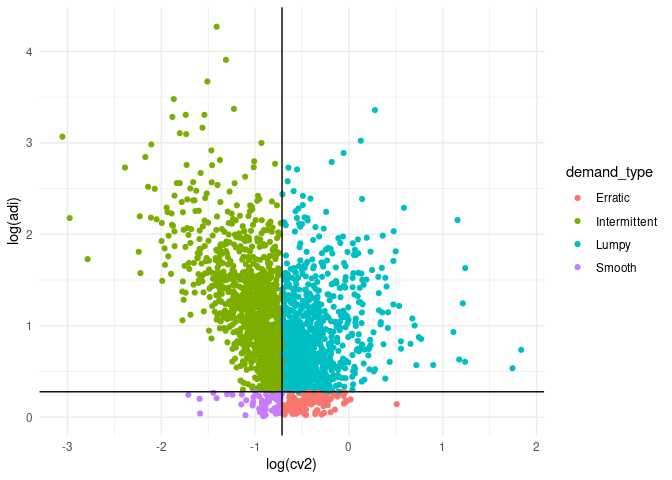

<!-- README.md is generated from README.Rmd. Please edit that file -->

# m5 

<!-- badges: start -->

[](https://CRAN.R-project.org/package=m5)
[](https://www.redbubble.com/i/sticker/m5-R-package-hex-by-krzjoa/122633859.EJUG5)
[](https://github.com/krzjoa/m5/actions)
<!-- badges: end -->

> M5 Walmart Challenge Data

## Installation

You can install the development version of m5 from
[GitHub](https://github.com/) with:

``` r
# install.packages("devtools")
devtools::install_github("krzjoa/m5")
```

## Usage

``` r
library(m5)
library(zeallot)
library(ggplot2)

DIR <- 'data'

# Downloading the data
m5_download(DIR)

# Loading the data
c(sales_train,
   sales_test,
   sell_prices,
   calendar,
   weights) %<-% m5_get_raw_evaluation(DIR)
   
# Preparing the data
m5_data  <-
   m5_prepare(sales_train, sales_test, calendar, sell_prices)

# Demand classification
m5_demand <- m5_demand_type(m5_data)

foods_1_demand <- 
  m5_demand[startsWith(as.character(m5_demand$item_id), "FOODS_1")]

plot <-
  ggplot(foods_1_demand) +
  geom_point(aes(log(cv2), log(adi),
                 item_id = item_id, col = demand_type)) +
  geom_hline(yintercept = log(1.32)) +
  geom_vline(xintercept = log(0.49)) +
  theme_minimal()

plot
```


