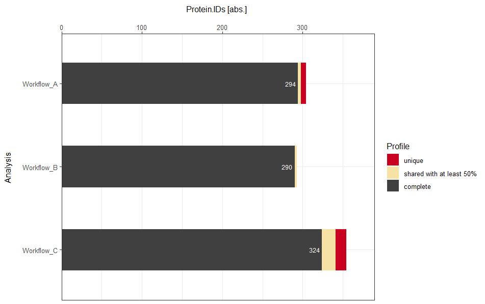
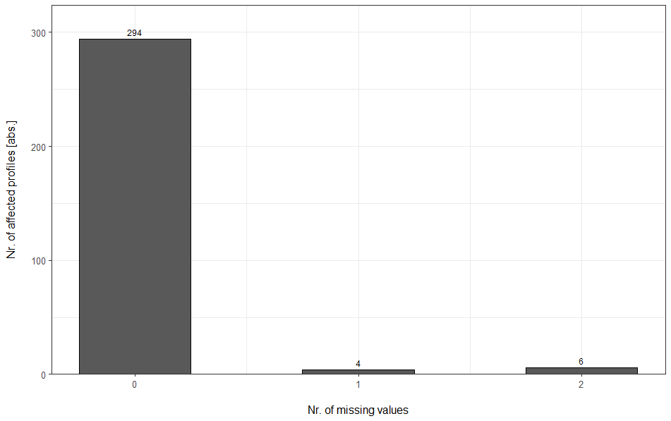
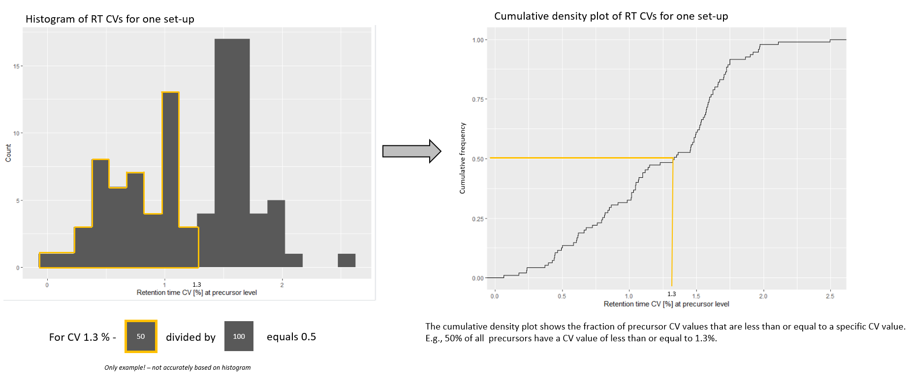

```{r, include = FALSE}
knitr::opts_chunk$set(
  echo = FALSE,
  collapse = TRUE,
  comment = "#>"
)
```

```{r setup, echo = FALSE}
library(mpwR)
```

# Introduction

This vignette showcases some of the plot outputs generated with **mpwR** and provides further explanations to the user.

# Data Completeness
The overview and individual plots apply both to absolute and relative comparisons. In the examples, absolute numbers are used. In detail, three workflows are compared on protein-level based on three replicate runs.

## Overview perspective

The stacked barplot is an overview plot. "Complete" profiles refer to identifications (IDs) present in each technical replicate. "Shared with at least 50%" refers to IDs, which are present in at least 50% of the technical replicates and which are not present in all replicates. "Unique" refers to IDs, which are only present in one replicate run. An additional category, which is not displayed in the example plot, is "sparse", which refers to a presence in more than 1 replicate and less than 50% of the replicates.
<p>&nbsp;</p>
```{r DC overview}

```
<p>&nbsp;</p>

## Individual perspective

For each respective workflow an individual barplot can be generated to further highlight details of the presence of IDs. The example shows the number of protein IDs in dependence of missing values for workflow A. In detail, 294 IDs have no missing values (are present in each technical replicate), 4 IDs have one missing value (are present in 2 technical replicates) and 6 IDs have two missing values (are present in only one replicate). 
<p>&nbsp;</p>
```{r DC individual}

```
<p>&nbsp;</p>

# Cumulative density plot

The cumulative density plot is used to display the coefficient of variation (CV) for retention time (RT) and for label-free quantitation (LFQ).
<p>&nbsp;</p>
```{r density plot}

```
<p>&nbsp;</p>

# Radar chart

A radar chart is used to highlight a relative comparison in percentage across categories. In this example, the number of achieved protein IDs are compared across three laboratories: LabA, LabB, LabC.
<p>&nbsp;</p>
```{r radarchart}
knitr::include_graphics("images/explanation_radarchart.PNG")
```
