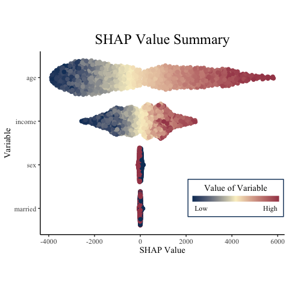
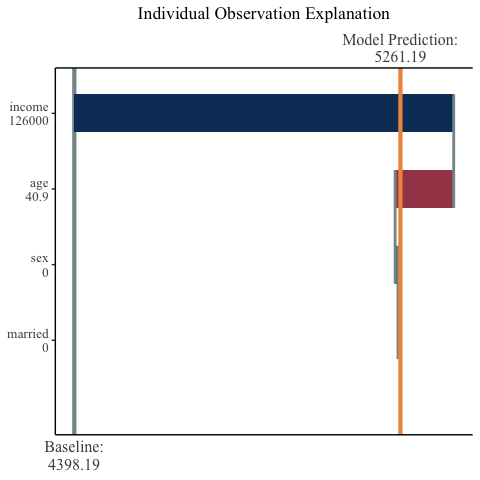

<!-- README.md is generated from README.Rmd. Please edit that file -->

# mshap

<!-- badges: start -->

[](https://travis-ci.com/srmatth/mshap)
[](https://codecov.io/gh/srmatth/mshap)
<!-- badges: end -->

The goal of mshap is to allow SHAP values for two-part models to be
easily computed. A two-part model is one where the output from one model
is multiplied by the output from another model. These are often used in
the Actuarial industry, but have other use cases as well.

This package is designed in `R` with the example use cases having models
and shap values calculated in python. It is the hope that the
interoperability between the two languages continues to grow, and the
example here makes a strong case for the ease of transitioning between
the two.

## Installation

Install mSHAP from CRAN with the following code:

``` r
install.packages("mshap")
```

Or the development version from github with:

``` r
# install.packages("devtools")
devtools::install_github("srmatth/mshap")
```

## Basic Use

We will demonstrate a simple use case on simulated data. Suppose that we
wish to be able to predict to total amount of money a consumer will
spend on a subscription to a software product. We might simulate 4
explanatory variables that looks like the following:

``` r
## R
set.seed(16)
age <- runif(1000, 18, 60)
income <- runif(1000, 50000, 150000)
married <- as.numeric(runif(1000, 0, 1) > 0.5)
sex <- as.numeric(runif(1000, 0, 1) > 0.5)
# For the sake of simplicity we will have these as numeric already, where 0 represents male and 1 represents female
```

Now because this is a contrived example, we will knowingly set the
response variables as follows (suppose here that `cost_per_month` is
usage based, so as to be continuous):

``` r
## R
cost_per_month <- (0.0006 * income - 0.2 * sex + 0.5 * married - 0.001 * age) + 10
num_months <- 15 * (0.001 * income  * 0.001 * sex * 0.5 * married - 0.05 * age)^2
```

Thus, we have our data. We will combine the covariates into a single
data frame for ease of use in python.

``` r
## R
X <- data.frame(age, income, married, sex)
```

The end goal of this exercise is to predict the total revenue from the
given customer, which mathematically will be
`cost_per_month * num_months`. Instead of multiplying these two vectors
together initially, we will instead create two models: one to predict
`cost_per_month` and the other to predict `num_months`. We can then
multiply the output of the two models together to get our predictions.

We now move over to python to create our two models and predict on the
training sets:

``` python
## Python
X = r.X
y1 = r.cost_per_month
y2 = r.num_months

cpm_mod = sk.RandomForestRegressor(n_estimators = 100, max_depth = 10, max_features = 2)
cpm_mod.fit(X, y1)
#> RandomForestRegressor(max_depth=10, max_features=2)
nm_mod = sk.RandomForestRegressor(n_estimators = 100, max_depth = 10, max_features = 2)
nm_mod.fit(X, y2)
#> RandomForestRegressor(max_depth=10, max_features=2)
cpm_preds = cpm_mod.predict(X)
nm_preds = nm_mod.predict(X)

tot_rev = cpm_preds * nm_preds
```

We will now proceed to use TreeSHAP and subsequently mSHAP to explain
the ultimate model predictions.

``` python
## Python

# because these are tree-based models, shap.Explainer uses TreeSHAP to calculate
# fast, exact SHAP values for each model individually
cpm_ex = shap.Explainer(cpm_mod)
cpm_shap = cpm_ex.shap_values(X)
cpm_expected_value = cpm_ex.expected_value

nm_ex = shap.Explainer(nm_mod)
nm_shap = nm_ex.shap_values(X)
nm_expected_value = nm_ex.expected_value
```

``` r
## R
final_shap <- mshap(
  shap_1 = py$cpm_shap, 
  shap_2 = py$nm_shap, 
  ex_1 = py$cpm_expected_value, 
  ex_2 = py$nm_expected_value
)

head(final_shap$shap_vals)
#> # A tibble: 6 x 4
#>       V1     V2     V3     V4
#>    <dbl>  <dbl>  <dbl>  <dbl>
#> 1  1149. -1200. 13.9   -11.8 
#> 2 -2711.  1149.  5.69  -11.2 
#> 3 -1027.  1301.  5.81    9.58
#> 4 -2064.  -879. -0.916 -22.7 
#> 5  3803.  2096. 37.7   -27.4 
#> 6 -2146.   897. 25.4   -14.3

final_shap$expected_value
#> [1] 4398.19
```

As a check, you can see that the expected value for mSHAP is indeed the
expected value of the model across the training data.

``` r
## R
mean(py$tot_rev)
#> [1] 4398.19
```

We now have calculated the mSHAP values for the multiplied model
outputs! This will allow us to explain our final model.

The mSHAP package comes with additional functions that can be used to
visualize SHAP values in R. What is show here are the default outputs,
but these functions return `{ggplot2}` objects that are easily
customizable.

``` r
## R
summary_plot(
  variable_values = X,
  shap_values = final_shap$shap_vals, 
  names = c("age", "income", "married", "sex") # this is optional, since X has column names
)
```



``` r
## R
observation_plot(
  variable_values = X[23,],
  shap_values = final_shap$shap_vals[23,],
  expected_value = final_shap$expected_value,
  names = c("age", "income", "married", "sex")
)
```



For another, more complex, use case run `vignette("mshap")`. For more
examples and options for plotting, run `vignette("mshap_plots")`.

## Citations

-   For more information about SHAP values in general, you can visit the
    [SHAP github page](https://github.com/slundberg/shap)
-   If you use `{mshap}`, please cite [*mSHAP: SHAP Values for Two-Part
    Models*](https://arxiv.org/abs/2106.08990)
