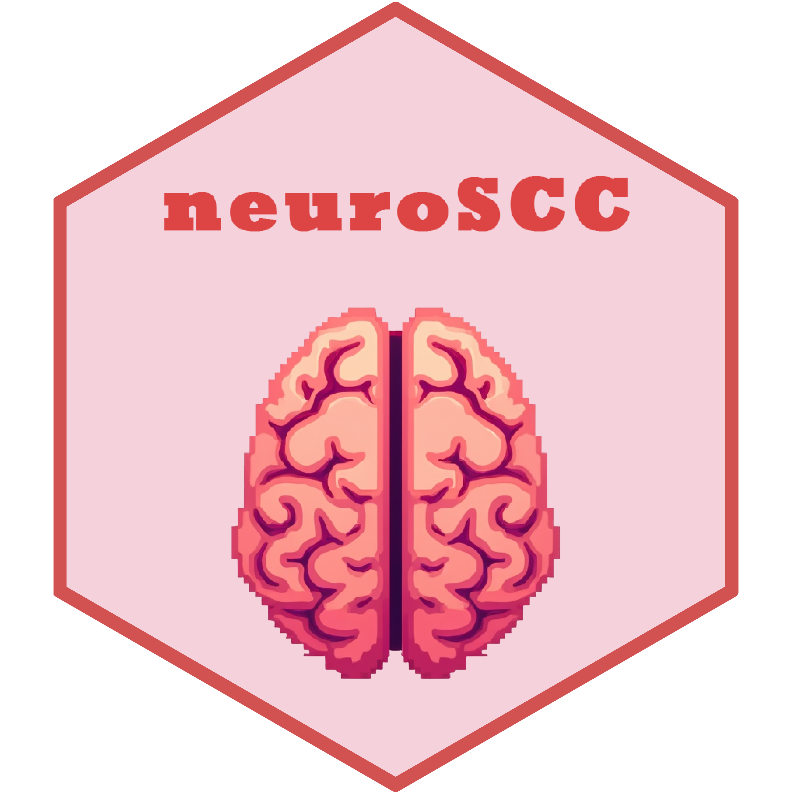
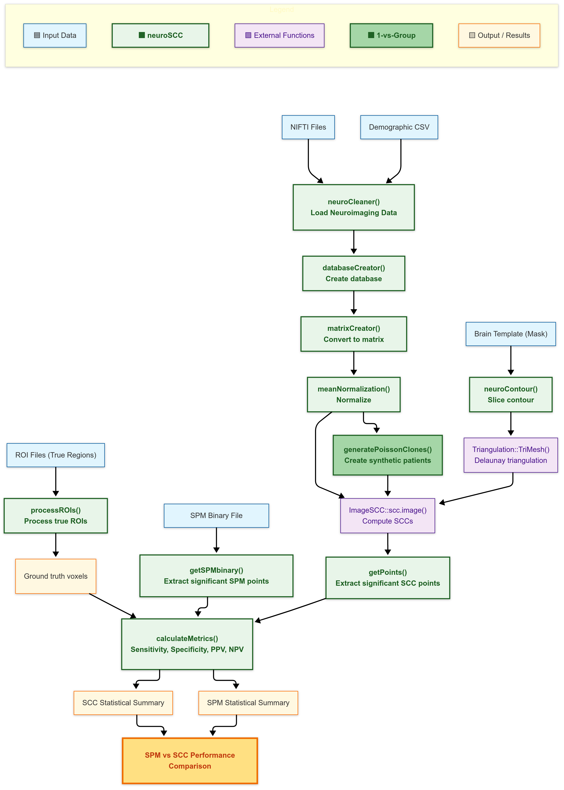

# neuroSCC 

[](https://www.repostatus.org/)
[](https://lifecycle.r-lib.org/articles/stages.html)
[](https://github.com/iguanamarina/neuroSCC/graphs/contributors)
[](https://github.com/iguanamarina/neuroSCC/commits/main)
[](https://github.com/iguanamarina/neuroSCC/issues)
[](https://github.com/iguanamarina/neuroSCC)

🚀 **`neuroSCC` Bridging Simultaneous Confidence Corridors and PET
Neuroimaging.** This package facilitates structured processing of PET
neuroimaging data for the estimation of Simultaneous Confidence
Corridors (SCCs). It integrates neuroimaging and statistical
methodologies to:

- 📥 **Load and preprocess** PET neuroimaging files.  
- 🔬 **Transform data** for a **Functional Data Analysis (FDA)**
  setup.  
- 🎯 **Extract meaningful contours** and identify significant SCC
  regions.  
- 📊 **Compare SCC-based analyses** with gold-standard methods like
  **SPM**.

The package bridges established **[neuroimaging
tools](https://github.com/bjw34032/oro.nifti)** (`oro.nifti`) with
advanced **[statistical
methods](https://github.com/FIRST-Data-Lab/ImageSCC)** (`ImageSCC`),
supporting **one-group, two-group, and single-patient vs. group
comparisons**.

📌 Developed as part of the **Ph.D. thesis**: *“Development of
statistical methods for neuroimage data analysis towards early diagnosis
of neurodegenerative diseases”*, by Juan A. Arias at **University of
Santiago de Compostela (Spain)**.

💡 This work was partially supported by an **internship grant awarded at
the 6th Conference of the Spanish National Biostatistics Network
(BIOSTATNET)** in 2025, as a prize for best poster presentation and
young researcher trajectory.

------------------------------------------------------------------------

# 📖 Table of Contents

- [About the Project](#about-the-project)
- [Installation](#installation)
- [Functions Overview](#functions-overview)
- [Vignette](#vignette)
- [Visual Workflow](#visual-workflow)
- [References](#references)
- [Contributing & Feedback](#contributing-feedback)

------------------------------------------------------------------------

# 1️⃣ About the Project <a name="about-the-project"></a>

## Why Use `neuroSCC`?

PET neuroimaging data is **complex**, requiring careful **processing and
statistical validation**. `neuroSCC` is designed to:

✔ **Automate Preprocessing**: Load, clean, and structure PET data 📂  
✔ **Standardize Analysis**: Convert images into FDA-compatible formats
🔬  
✔ **Evaluate SCC Estimations**: Identify **significant regions** with
confidence 🎯  
✔ **Enable Method Comparisons**: SCC vs SPM **performance evaluation**
📊

It is **particularly suited for**: - **Clinical neuroimaging research**
(Alzheimer’s disease, neurodegeneration). - **Statistical validation of
imaging methods**. - **Comparisons between SCC and other statistical
approaches**.

------------------------------------------------------------------------

# 2️⃣ Installation <a id="installation"></a>

## 🔹 Stable GitHub Release (Future)

``` r
# Install the latest stable release (Future)
remotes::install_github("iguanamarina/neuroSCC@1a91f8e")
library(neuroSCC)
```

## 📦 Development Version (Latest Features)

``` r
# Install the latest development version
remotes::install_github("iguanamarina/neuroSCC")
library(neuroSCC)
```

## 🔜 From CRAN (Future)

``` r
# Once available on CRAN
install.packages("neuroSCC")
library(neuroSCC)
```

------------------------------------------------------------------------

# 3️⃣ Functions Overview<a id="functions-overview"></a>

## 🧼 neuroCleaner(): Load & Clean PET Data

`neuroCleaner()` reads **NIFTI neuroimaging files**, extracts
**voxel-wise data**, and structures it into a **tidy data frame**.  
It is the **first preprocessing step**, ensuring that PET images are
cleaned and formatted for further analysis. It also integrates
demographic data when available.

*Example with Code:*
<details>
<summary>
Click to expand
</summary>

``` r
# Load a sample Control NIfTI file
niftiFile <- system.file("extdata", "syntheticControl1.nii.gz", package = "neuroSCC")
# Example Without demographic data
petData <- neuroCleaner(niftiFile)
petData[sample(nrow(petData), 10), ]  # Show 10 random voxels
```

</details>

## 📊 databaseCreator(): Convert Multiple Files into a Database

`databaseCreator()` scans a directory for **PET image files**, processes
each with `neuroCleaner()`, and compiles them into a **structured data
frame**.  
This function is **critical for batch analysis**, preparing data for
group-level SCC comparisons.

*Example with Code:*
<details>
<summary>
Click to expand
</summary>

``` r
#' @examples
#' # NOTE: To keep runtime below CRAN limits, this example processes only 1 subject.
#' # You can expand the pattern to include all subjects for real use.
#'
#' # Example: Create a database from a single synthetic PET image (control group)
#' controlPattern <- "^syntheticControl1\\.nii\\.gz$"
#' databaseControls <- databaseCreator(pattern = controlPattern, control = TRUE, quiet = TRUE)
#'
#' head(databaseControls)
```

</details>

## 📐 getDimensions(): Extract Image Dimensions

`getDimensions()` extracts the **spatial dimensions** of a neuroimaging
file, returning the number of **voxels in the x, y, and z axes**.  
This ensures proper alignment of neuroimaging data before further
processing.

*Example with Code:*
<details>
<summary>
Click to expand
</summary>

``` r
# Extract spatial dimensions of a PET scan
niftiFile <- system.file("extdata", "syntheticControl1.nii.gz", package = "neuroSCC")
dims <- getDimensions(niftiFile)
print(dims)
```

</details>

## 📊 matrixCreator(): Convert PET Data into a Functional Matrix

`matrixCreator()` transforms **PET imaging data into a matrix format**
for functional data analysis.  
Each row represents a subject’s PET data, formatted to align with FDA
methodologies.

*Example with Code:*
<details>
<summary>
Click to expand
</summary>

``` r
# NOTE: To keep example runtime short, only one synthetic PET file is used.
# For full analysis, expand the filename pattern accordingly.
# Step 1: Generate a database for a single subject
controlPattern <- "^syntheticControl1\\.nii\\.gz$"
databaseControls <- databaseCreator(pattern = controlPattern, control = TRUE, quiet = TRUE)
# Step 2: Convert the database into a matrix format
matrixControls <- matrixCreator(databaseControls, paramZ = 35, quiet = TRUE)
# Display dimensions of the matrix
dim(matrixControls)
```

</details>

## 📉 meanNormalization(): Normalize Data

`meanNormalization()` performs **row-wise mean normalization**,
adjusting intensity values across subjects.  
This removes global intensity differences, making datasets comparable in
**Functional Data Analysis (FDA)**.

*Example with Code:*
<details>
<summary>
Click to expand
</summary>

``` r
# Generate a minimal database and create a matrix (1 control subject)
dataDir <- system.file("extdata", package = "neuroSCC")
controlPattern <- "^syntheticControl1\\.nii\\.gz$"
databaseControls <- databaseCreator(pattern = controlPattern,
                                    control = TRUE,
                                    quiet = TRUE)
matrixControls <- matrixCreator(databaseControls, paramZ = 35, quiet = TRUE)
# Normalize the matrix (with diagnostics)
normalizationResult <- meanNormalization(matrixControls,
                                         returnDetails = TRUE,
                                         quiet = FALSE)
```

</details>

## 📈 neuroContour(): Extract Contours

`neuroContour()` extracts **region boundaries (contours) from
neuroimaging data**.  
It is particularly useful for defining **masks or Regions of Interest
(ROIs)** before SCC computation.

*Example with Code:*
<details>
<summary>
Click to expand
</summary>

``` r
# Get the file path for a sample NIfTI file
niftiFile <- system.file("extdata", "syntheticControl1.nii.gz", package = "neuroSCC")

# Extract contours at level 0
contours <- neuroContour(niftiFile, paramZ = 35, levels = 0, plotResult = TRUE)

# Display the extracted contour coordinates
if (length(contours) > 0) {
  head(contours[[1]])  # Show first few points of the main contour
}
```

</details>

## 🔺 getPoints(): Identify Significant SCC Differences

`getPoints()` identifies **regions with significant differences** from
an SCC computation.  
After `ImageSCC::scc.image()` computes SCCs, `getPoints()` extracts
**coordinates where group differences exceed confidence boundaries**.

*Example with Code:*
<details>
<summary>
Click to expand
</summary>

``` r
# Load precomputed SCC example
data("SCCcomp", package = "neuroSCC")

# Extract significant SCC points
significantPoints <- getPoints(SCCcomp)

# Show first extracted points (interpretation depends on SCC computation, see description)
head(significantPoints$positivePoints)  # Regions where Pathological is hypoactive vs. Control
head(significantPoints$negativePoints)  # Regions where Pathological is hyperactive vs. Control
```

</details>

## 🧩 getSPMbinary(): Extract SPM-Detected Significant Points

`getSPMbinary()` extracts **significant points** from an **SPM-generated
binary NIfTI file**.  
It returns voxel coordinates where **SPM detected significant
differences**, making it comparable to SCC results.

*Example with Code:*
<details>
<summary>
Click to expand
</summary>

``` r
# Load a sample binary NIfTI file (SPM result)
niftiFile <- system.file("extdata", "binary.nii", package = "neuroSCC")
detectedSPM <- getSPMbinary(niftiFile, paramZ = 35)

# Show detected points
head(detectedSPM)
```

</details>

## 🏷️ processROIs(): Process ROI Data

`processROIs()` processes **Regions of Interest (ROIs)** from
neuroimaging files.  
It extracts voxel coordinates for **predefined hypoactive regions**,
structuring them for SCC analysis.

*Example with Code:*
<details>
<summary>
Click to expand
</summary>

``` r
# Load and process a sample ROI NIfTI file (console output)
roiFile <- system.file("extdata", "ROIsample_Region2_18.nii.gz", package = "neuroSCC")
processedROI <- processROIs(roiFile, region = "Region2", number = "18", save = FALSE)
head(processedROI)
```

</details>

## 👥 generatePoissonClones(): Generate Synthetic PET Data

`generatePoissonClones()` creates **synthetic clones of PET neuroimaging
data** by adding Poisson-distributed noise. This function is essential
for **1 vs. Group SCC analyses**, where a single subject’s data needs to
be expanded to allow for valid statistical inference.

*Example with Code:*  
<details>
<summary>
Click to expand
</summary>

``` r
# Load example input matrix for Poisson cloning
data("generatePoissonClonesExample", package = "neuroSCC")
# Select 10 random voxel positions for display
set.seed(123)
sampledCols <- sample(ncol(generatePoissonClonesExample), 10)
# Generate 1 synthetic clone
clones <- generatePoissonClones(generatePoissonClonesExample, numClones = 1, lambdaFactor = 0.25)
# Show voxel intensity values after cloning
clones[, sampledCols]
```

</details>

## 📊 calculateMetrics(): Evaluate SCC Performance

`calculateMetrics()` assesses the accuracy of **SCC-detected significant
points** by comparing them to known **true ROI regions**. It computes
**Sensitivity, Specificity, PPV, and NPV**, allowing for a quantitative
evaluation of SCC performance.

*Example with Code:*  
<details>
<summary>
Click to expand
</summary>

``` r
data("calculateMetricsExample", package = "neuroSCC")
# Evaluate SCC and SPM detection performance
with(calculateMetricsExample, {
  metricsSCC <- calculateMetrics(detectedSCC, trueROI, totalCoords, "Region2_SCC")
  metricsSPM <- calculateMetrics(detectedSPM, trueROI, totalCoords, "Region2_SPM")
  print(metricsSCC)
  print(metricsSPM)
})
```

</details>

------------------------------------------------------------------------

# 4️⃣ Vignette <a id="vignette"></a>

A full walkthrough of using `neuroSCC` from start to finish is available
in the vignettes:

- 📌 **[Landing
  Vignette](https://iguanamarina.github.io/neuroSCC/articles/landing_vignette.html)**  
  *Covers data loading, matrix creation, and triangulations.*

- 📌 **[Two-group SCC Estimation &
  Comparison](https://iguanamarina.github.io/neuroSCC/articles/two_group_comparison.html)**  
  *Computes SCCs for the differences between two groups and identifies
  voxels outside of estimated confidence intervals.*

- 📌 **[1vsGroup SCC Estimation &
  Comparison](https://iguanamarina.github.io/neuroSCC/articles/one_vs_group.html)**  
  *Compares an individual patient to a control group using SCCs and
  identifies voxels outside of estimated confidence intervals.*

# 5️⃣ Visual Workflow <a id="visual-workflow"></a>

A complete visual overview of how `neuroSCC` functions interact with
data, the objects they return, and more, can be found in the Visual
Workflow:

<p align="center">

</p>

------------------------------------------------------------------------

# 6️⃣ References <a id="references"></a>

- Wang, Y., Wang, G., Wang, L., & Ogden, R.T. (2020). *Simultaneous
  Confidence Corridors for Mean Functions in Functional Data Analysis of
  Imaging Data*. Biometrics, 76(2), 427-437. <doi:10.1111/biom.13156>

- Arias-López, J. A., Cadarso-Suárez, C., & Aguiar-Fernández, P. (2021).
  *Computational Issues in the Application of Functional Data Analysis
  to Imaging Data*. In *International Conference on Computational
  Science and Its Applications* (pp. 630–638). Springer International
  Publishing, Cham. <doi:10.1007/978-3-030-86960-1_46>

- Arias-López, J. A., Cadarso-Suárez, C., & Aguiar-Fernández, P. (2022).
  *Functional Data Analysis for Imaging Mean Function Estimation:
  Computing Times and Parameter Selection*. *Computers*, 11(6), 91.
  MDPI. <doi:10.3390/computers11060091>

- **Ph.D. Thesis:** Arias-López, J. A. (Under development). *Development
  of Statistical Methods for Neuroimage Data Analysis Towards Early
  Diagnosis of Neurodegenerative Diseases*. University of Santiago de
  Compostela.

------------------------------------------------------------------------

# 📢 Contributing & Feedback <a id="contributing-feedback"></a>

We welcome **contributions, feedback, and issue reports** from the
community! If you would like to help improve `neuroSCC`, here’s how you
can get involved:

## 🐛 Found a Bug? Report an Issue

If you encounter a bug, incorrect result, or any unexpected behavior,
please:

1.  Check **[existing
    issues](https://github.com/iguanamarina/neuroSCC/issues)** to see if
    it has already been reported.  
2.  If not, [open a new
    issue](https://github.com/iguanamarina/neuroSCC/issues/new) and
    include:
    - A **clear description** of the problem.  
    - Steps to **reproduce** the issue.  
    - Any **error messages** or screenshots (if applicable).

## 💡 Have an Idea? Suggest a Feature

We are always looking to improve `neuroSCC`. If you have a **suggestion
for a new feature** or an enhancement, please:

1.  Browse the **[open
    discussions](https://github.com/iguanamarina/neuroSCC/discussions)**
    to see if your idea has already been suggested.  
2.  If not, start a **new discussion thread** with:
    - A **detailed explanation** of your idea.  
    - Why it would **improve** the package.  
    - Any **relevant references** or examples from similar projects.

## 🔧 Want to Contribute Code?

We love contributions! To submit **a pull request (PR)**:

1.  **Fork the repository** on GitHub.  

2.  **Clone your fork** to your local machine:

    ``` r
    git clone https://github.com/YOUR_USERNAME/neuroSCC.git
    cd neuroSCC
    ```

3.  **Create a new branch** for your feature or fix:

    ``` r
    git checkout -b feature-new-functionality
    ```

4.  **Make your changes** and commit them:

    ``` r
    git add .
    git commit -m "Added new functionality XYZ"
    ```

5.  **Push your changes** to your fork:

    ``` r
    git push origin feature-new-functionality
    ```

6.  **Submit a pull request** (PR) from your forked repository to the
    main `neuroSCC` repository.

Before submitting, please:  
✔ Ensure your code **follows the package style guidelines**.  
✔ Add **documentation** for any new functions or features.  
✔ Run **`devtools::check()`** to verify that all package tests pass.

## 📧 Contact & Support

For questions not related to bugs or feature requests, feel free to:  
📬 Email the maintainer: <juanantonio.arias.lopez@usc.es>  
💬 Join the discussion on **[GitHub
Discussions](https://github.com/iguanamarina/neuroSCC/discussions)**

------------------------------------------------------------------------
