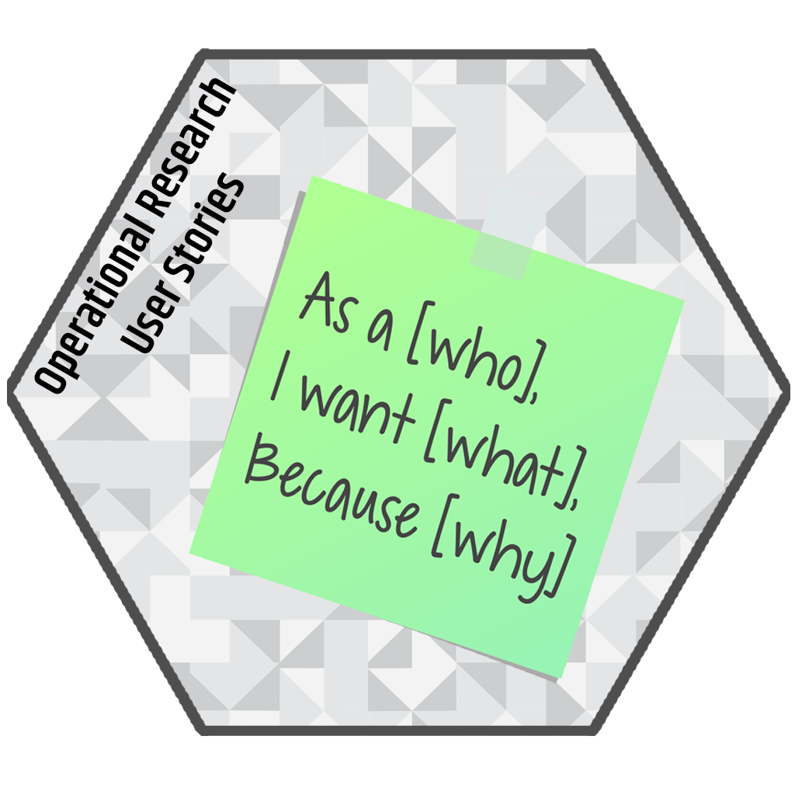

# oRus 

<!-- badges: start -->
[](https://cran.r-project.org/package=oRus)
[](https://cranlogs.r-pkg.org/badges/grand-total/oRus?color=yellow)
[](https://www.gnu.org/licenses/gpl-3.0)
[](https://doi.org/10.5281/zenodo.3750436)
<!-- badges: end -->


The **oRus** package implements a semi-automated process to pre-analyse and organise
user stories created to represent and document the functional requirements of
mathematical models in Operational Research.

Employing user stories for this purpose was proposed as part of the concept of 
\"Agile Operational Research\" [1], and later evaluated on its own [2].

You can find more information in the articles:

  - [How does oRus work?](https://melvidoni.github.io/oRus/articles/working.html)
  
  - [How do you use the package?](https://melvidoni.github.io/oRus/articles/example.html)

<br />


## Installation

You can install the development version of oRus from GitHub with:


```r
# install.packages("remotes")
remotes::install_github("melvidoni/oRus")
```

<br />


## References

Available at [References](https://melvidoni.github.io/oRus/articles/references.html)
