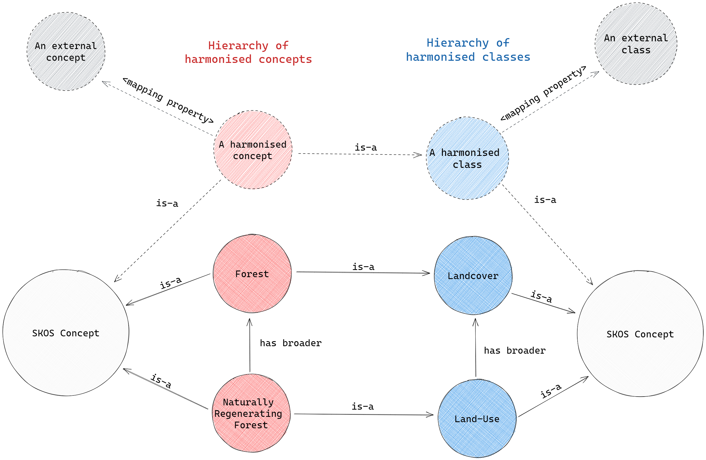

```{r, include = FALSE}
knitr::opts_chunk$set(
  collapse = TRUE,
  comment = "#>"
)
library(knitr)
```

```{r setup}
library(ontologics)
library(tibble)
library(dplyr, warn.conflicts = FALSE)
```


# Usage

To export the ontology as RDF just call `export_as_rdf()`. The ontology and the file name have to be specified. The format is optional and defaults to RDF-Turtle. Available formats are `rdfxml`, `nquads`, `ntriples`, `turtle` or `jsonld`.

```{r}
ontoDir <- system.file("extdata", "crops.rds", package = "ontologics")
onto <- load_ontology(path = ontoDir)

export_as_rdf(ontology = onto, filename = "onto.ttl")
```

# Conversion Rational

Conversion to an RDF (Resource Description Framework) serialization is integrated to render the built ontologies interoperable with the Semantic Web. This document gives a short introduction to the RDF concepts we need for the conversion. For a more comprehensive introduction the article [RDF, the semantic web, Jordan, Jordan and Jordan](http://eprints.gla.ac.uk/101484/) is recommended.

## IDs in RDF / Prefixes

The IDs that are used in an RDF database have to be IRIs (IRIs are a superset of URIs, which are in turn a superset of URLs). Typically, the structure of URLs is used. In this package, we generate the RDF-IDs of the concepts in the ontology by concatenating a _prefix_ (specified as `uri_prefix` in some of the functions) with internal package IDs. The homepage of the example ontology we created in [create an ontology](create_an_ontology.html) is `https://www.luckinet.org`. The internal ID of the concept with the label `Naturally Regenerating Forest` in this ontology is `.08.02`. The resulting IRI-ID for this concept therefore resolves to `https://www.luckinet.org#.08.02`. As you see, `#` is used as concatenation symbol. Another widely used option is `/`, in case the `homepage` string ends with `/` or `#`, which is then used by default.

The so-built IRI-IDs do not have to resolve to an actual resource on the Web, but it is highly recommended. If not possible, at least the prefix should resemble an actual Web page, as it is the case for the example.
<!-- (see [publishing an ontology](publishing_an_ontology.html)) -->

## RDF

In RDF every information is stored as a sentence like structure called triple. A triple has a subject, a predicate and an object. Every triple states a fact about it's subject and ends this statement with a period (`.`). The fact that the concept with the ID `<https://www.luckinet.org/.08.02>` has the label `"Naturally Regenerating Forest"` in RDF actually reads:

```
@prefix luckinet: <https://www.luckinet.org/> .
@prefix skos: <http://www.w3.org/2004/02/skos/core#> .

luckinet:.08.02 skos:prefLabel "Naturally Regenerating Forest" .
```

In this case `luckinet:.08.02` is the subject, `skos:prefLabel` is the predicate and `"Naturally Regenerating Forest"` is the object. Every subject and predicate in an RDF triple have to be resources (that means they are represented by an IRI); whilst object can be either a resource or a literal value (as in the example above). The definition of the IRI `skos:prefLabel` (<https://www.w3.org/2004/02/skos/core#prefLabel>) is given by the triple:

```
skos:prefLabel skos:definition "The preferred lexical label for a resource, in a given language." .
```

We can add some more facts from our ontology to the RDF database. The RDF representation that we use here is called RDF-Turtle. In RDF-Turtle a semicolon at the end of a triple indicates that the next statement also refers to the same subject (which is left out thereafter). A comma indicates that the next statement refers to the same subject and predicate.

```
@prefix luckinet: <https://www.luckinet.org/> .
@prefix skos: <http://www.w3.org/2004/02/skos/core#> .
@prefix rdf: <http://www.w3.org/1999/02/22-rdf-syntax-ns#> .

luckinet:.08.02 skos:prefLabel "Naturally Regenerating Forest" ;    
    skos:broader luckinet:.08 ;
    rdf:type luckinet:land-use ;
    skos:definition "Forest that regenerates naturally ..." . 

luckinet:.08 skos:prefLabel "Forests";
    rdf:type luckinet:landcover;

luckinet:land-use skos:prefLabel "Land-Use";
    skos:broader luckinet:landcover .

luckinet:landcover skos:prefLabel "Landcover" .
```

RDF is based on the open world assumption: in the above case that means that not stating a definition of the concept `.08` does not mean that no definition exists; it's simply not known whether a definition exists.

## RDS 2 RDF

Internally, the ontology is stored in an RDS objects that holds five tables (see [ontology database description](ontology_database_description.html)). If we take a look at subsets of the two particular tables _harmonised concepts_ and _harmonised classes_ from the ontology, we see that the first column holds an ID and in the other columns state facts about this ID:

__Concept table:__

|ID |label|description|class|has_broader|
|:---|:---|:---|:---|:---|
|.08 | Forests | NA | landcover | NA|
|.08.02 | Naturally Regenerating Forest | Forest that regenerates naturally | land-use | .08|

__Class table:__

|ID |label|description|has_broader|
|:---|:---|:---|:---|
|landcover | Landcover | NA | NA|
|land-use | Land-Use | NA | landcover|

RDF Triples for both tables can be generated according to the following scheme:

```
<Column[ID].at(index).value> <Column[...].columnName> <Column[...].at(index).value> .
```

In a particular row, the ID always represents the subject, the column names represent the predicates and the according values of these columns the objects. That means, for a row in a table with five columns (including an ID column), potentially four triples can be constructed; one per non-ID-column that holds a value for this row. Converting both tables to a single RDF-Turtle-pseudocode leads to:

```
.08 label "Forests" ;
    class landcover .

.08.02 label "Naturally Regenerating Forest" ;
    definition "Forest that regenerates naturally (this description needs revision)" ;
    class land-use ;
    has_broader .08 .

landcover label "Landcover" .

land-use label "Land-Use" ;
    has_broader landcover .
```

And with that we are back at the example from the section above.

Of course, in reality things are a little more complicated. Looking at the pseudocode above, we clearly see that the "IDs" are not IRIs by any means. They still have to be concatenated with their according prefix. The prefixes are stored in another table called sources, so we have to use the IDs as foreign keys to build the IRIs. Since this vignette's intention is to give an overview over the concepts behind the conversion, we won't go into any more detail here. Please feel encouraged to dive into the source code of `export_as_rdf.R`.

<!-- TODO: (or rather possibly interesting) XKOS -->
## SKOS

SKOS is shorthand for [Simple Knowledge Organization System](https://www.w3.org/TR/skos-primer/). It is a lightweight RDF vocabulary that can be used to express knowledge organisation systems (KOS) as RDF and thus make them interoperable with the Semantic Web. Popular KOS, such as [FAO Agrovoc](https://agrovoc.fao.org/agrovoc/agrovoc/en/) or the [UNESCO Thesaurus](https://vocabularies.unesco.org/browser/thesaurus/en/) are expressed with SKOS.

We'll now try to give a short introduction to the parts of SKOS that we use in this package; please also visit the [SKOS reference page](https://www.w3.org/TR/skos-reference/). It is assumed that the [ontology database description](ontology_database_description.html) document was read. From the SKOS vocabulary, we mainly use the [**semantic relations**](https://www.w3.org/TR/skos-reference/#semantic-relations) and the [**mapping properties**](https://www.w3.org/TR/skos-reference/#mapping).

The SKOS **semantic relations** are intended to be used to built links between concepts that are part of the expressed KOS. For this package, that means that they are only permitted between harmonised concepts. The semantic relations that are required here are `skos:broader` and `skos:narrower`. The Triple `ontology:concept_A skos:broader ontology:concept_B` states that *concept A* has the broader concept *concept B*. Both relations are inverse to each other. That means that if `ontology:concept_A skos:broader ontology:concept_B` then `ontology:concept_B skos:narrower ontology:concept_A`. For this very reason, we only describe one of both relations in the ontologies tables; `skos:broader`. In this package, the relation is indicated with `has_broader` in the tables _harmonised classes_ and _harmonised concepts_.  

The SKOS **mapping properties** are similar to the semantic relations, but they are used to construct relations between concepts that are part of the expressed KOS and concepts that are __not__ part of it. For this package that means all relations between harmonised classes or concepts and external classes or concepts have to be described with the SKOS mapping properties. We support four of the SKOS mapping relations: `skos:narrowMatch` and `skos:broadMatch` have similar meanings as the semantic relations introduces above. The property `skos:closeMatch` indicates "two concepts that are sufficiently similar that they can be used interchangeably in __some__ information retrieval applications" and `skos:exactMatch` denotes "a high degree of confidence that the concepts can be used interchangeably across a wide range of information retrieval applications", thus it allows transitive closure. In this package, the mapping properties are indicated with `has_narrow_match`, `has_broad_match`, `has_close_match` and `has_exact_match` in the tables _harmonised classes_ and _harmonised concepts_.

Finally, SKOS provides the property `skos:inScheme` that denotes that a concept is part of some KOS. In this package, the table _sources_ administers these KOS' (`skos:Scheme`s). Each concept and class in this package is assigned to a certain scheme listed in the *sources* table. For external concepts and classes the column `has_source` indicates that scheme. Harmonized concepts and classes are part of the harmonized scheme, which is typically described in the first row of the *sources* table.

<!-- TODO: -->
### Structure of exported SKOS

In the resulting document, both the harmonized classes and concepts are explicitly instantiated as SKOS-Concepts. The harmonized classes are additionally explicitly instantiated as RDF-Classes. Every harmonized concept is instantiated as an object of its according harmonized class. External concepts and classes are not explicitly instantiated as anything, although the use of the SKOS mapping properties allows to infer that they are instances of SKOS-Concept. 

Harmonized concepts relate to other harmonized concepts via the SKOS semantic relation `skos:broader`. Harmonized classes relate to other harmonized classes via the SKOS semantic relation `skos:broader`. Each harmonized concept that has a value in the `class` column is instantiated as a member of this class using `rdf:type`.

Harmonized Concepts relate to external concepts via the SKOS mapping properties. Harmonized Classes relate to external Classes via the SKOS mapping properties.



