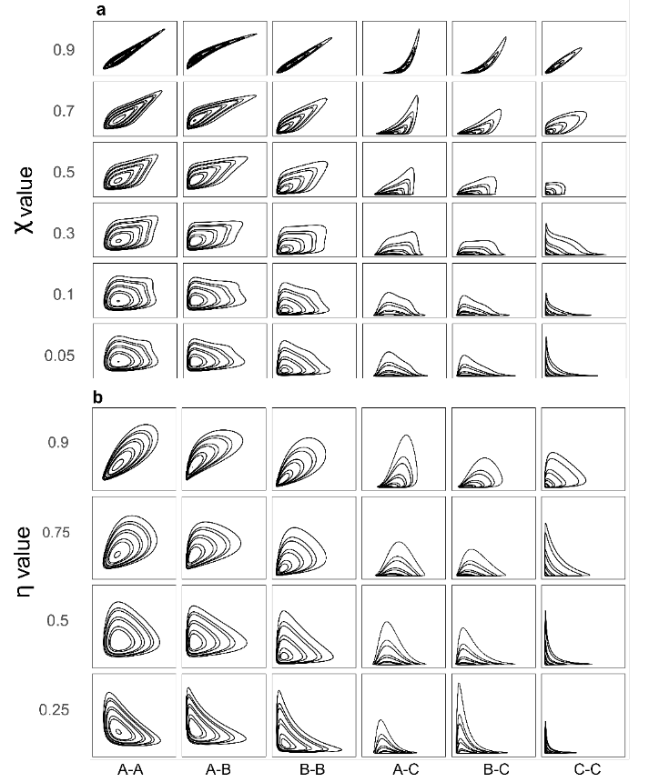

```{r, include = FALSE}
knitr::opts_chunk$set(
  collapse = TRUE,
  comment = "#>"
)
```

```{r setup}
library(mobirep)
```
# Package mobirep

This package is associated with the article "Evaluating the efficacy of bivariate extreme modelling approaches for multi-hazard scenarios" <https://nhess.copernicus.org/articles/20/2091/2020/nhess-20-2091-2020.html>
It includes 6 models, the joint tail KDE model derived from Cooley et al. (2019) <https://doi.org/10.1007%2Fs10687-019-00348-0>, the conditional extreme model initially developed by Heffernan and Tawn (2004) <https://doi.org/10.1111/j.1467-9868.2004.02050.x> and four copulae: Normal, Farlie-Gumbel-Morgenstern, Galambos and Gumbel.

## Selection of analogous synthetic datasets from Tilloy et al. (2020)
### 60 bivariate datasets

* Import data
example bivariate dataset of daily mean temperature (data from E-OBS; Cornes et al., 2018) and number of wildfire per day in Porto district (Portugal)
```
data(porto)
```
* Use function Analogsel to identify which synthetic datasets from Tilloy et al. (2020) are analogs of the imput data

```
AnalogSel(fire01meantemp)
```
## Model the marginal distributions of the dataset
select extreme threshold for the two margins
```
tr1=0.9
tr2=0.9
```
remove NA form the dataset
```
fire01meantemp=na.omit(fire01meantemp)
u=fire01meantemp
```
fit a GPD to both margins and create extrapolated time serie (useful to create level curves)
```
margins=Margins.mod(tr1,tr2,u=fire01meantemp)

```
## Fit bivariate models to the data
```
jtres<-JT.KDE.ap(u2=u,pb=0.01,pobj=upobj,beta=100,
vtau=vtau,kk=kk,devplot=F,mar1=uu[,1],mar2=uu[,2],
px=pp[,1],py=pp[,2],interh=interh)
```


## Create level curve with a given amount of point and compute the density of the curves (for most likely scenario)
```
jt.dens<-kde(u,gridsize = 200)
ltlo<-digit.curves.p(start=jtres$wq0ri[1,], as.matrix(wq0ri), nPoints=98, closed = FALSE)
ltl<-densi.curv.em(jt.dens,ltlo, tl="l", ltl)
```

