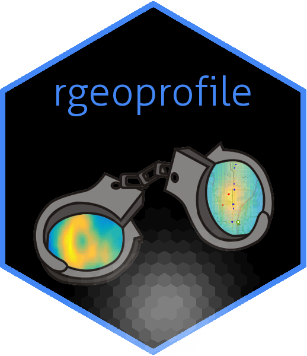
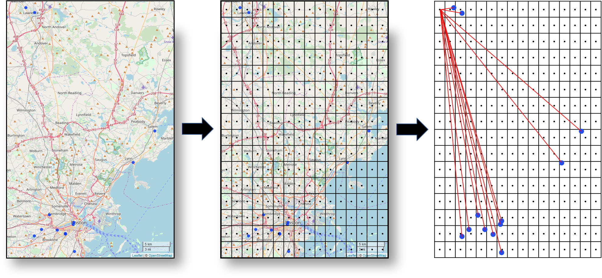

```{r, include = FALSE}
knitr::opts_chunk$set(
  collapse = TRUE,
  comment = "#>"
)

library(rgeoprofile)
library(leaflet)
require(leafsync)
load("vignette_results.RData")
```

The *rgeoprofile* package is designed for the analysis of serial crime incidents by policing and security agencies using various methods of geographic profiling. Geographic profiling is a technique used to predict the location of an offender's residence or anchor point given information regarding crime locations. Current methods for prediction of offender residence draw from theoretical approaches in psychology, criminology, and geography. The package was contributed to provide a viable open source platform consisting of several solutions which have been proposed, developed, and utilized to model and assess the potential residence of an offender given their serial incidents. The package includes methods for both centrographic point predictions (spatial distribution strategies) and distance decay functions (probability distance strategies).

Geographic profiling methods in the *rgeoprofile* package are based upon the 'CrimeStat' software^[Ned Levine. *CrimeStat: a spatial statistics program for the analysis of crime incident locations (v. 4.02)*. Ned Levine & Associates, Houston, Texas, 2015.], the 'Dragnet' software^[David Canter, Toby Coffey, Malcolm Huntley, and Christopher Missen. Predicting serial killers' home base using a decision support system. *Journal of Quantitative Criminology*, 16(4):457-478, 2000. <br/> Centre for Investigative Psychology. *Dragnet*, 2019.], and the criminal geographic targeting (CGT) model^[D. Kim Rossmo. *Geographic profiling: target patterns of serial murderers*. PhD thesis, Theses (School of Criminology)/Simon Fraser University, 1995. <br/> D. Kim Rossmo. *Geographic profiling*. CRC press, 1999.].

This document introduces you to the set of functions in the *rgeoprofile* package, and demonstrates the application of these functions to a dataset of serial crime incidents. 

## Package Installation <a></a>

* The *rgeoprofile* package can be installed from CRAN.

* The development version is also available from the author's GitHub repo. 

Installation is as follows:

```{r setup, eval = FALSE}
# Install from CRAN
install.packages("rgeoprofile")
# Install Development Version
devtools::install_github("JSSpaulding/rgeoprofile")
# After installation, load and attach the package
library(rgeoprofile)
```

## Data: `desalvo`

The *rgeoprofile* package contains a sample dataset `desalvo` which contains information from the Boston Strangler serial incidents, attributed to Albert DeSalvo. DeSalvo confessed to being the Boston Strangler and the murder of 13 women in the Boston area from 1962 to 1964. His murder confession has been disputed, however, upon being exhumed in 2013, his DNA was matched to seminal fluid found at the rape and murder of Mary Sullivan.

Details for the sample dataset are provided below:

```{r data}
data("desalvo")
desalvo
```

# Probability Distance Strategies (Distance Decay Functions)

There are six functions which utilize a distance decay methodology to develop a geographic profile. The general method for generating a geographic profile is:

1. Create a bounding box around the incidents using the following bounds:
    * $y_{\text{high}} = y_{\text{max}} + \frac{\Delta y}{2(n-1)}$
    * $y_{\text{low}} = y_{\text{min}} + \frac{\Delta y}{2(n-1)}$
    * $x_{\text{high}} = x_{\text{max}} + \frac{\Delta x}{2(n-1)}$
    * $x_{\text{low}} = x_{\text{min}} + \frac{\Delta x}{2(n-1)}$
  
2. Fit a 200 x 200 grid to the bounding box. Gives a resolution of 40,000 cells for the profile.

3. Identify the center of each cell in the grid.

4. Calculate the distance (*d*) between each grid point $g_{i,j}$ and crime incident coordinate $c_{i,j}$.
    * If there are 13 incidents, 13 values are computed per grid point
    * $d_{i,j}$ used in the selected distance decay function

5. Resultant values from the distance decay function are summed into single score (probability) for each grid cell.
    * Higher scores indicate greater probability of offender’s home

The following provides an illustration of the steps in the method:
<a></a>


## The `cgt_profile()` function
The `cgt_profile()` function is an implementation of the CGT model developed by DK Rossmo. This model utilizes Manhattan distance for the calculations and assumes the presence of a buffer zone around the incidents. The equation for the distance decay function is:

$$P_{(i,j)} = k \sum_{n=1}^{n} \frac{\phi_{(i,j)}}{(|X_{i}-x_{n}|+|Y_{i}-y_{n}|)^f} + \frac{(1-\phi_{(i,j)})(B^{g-f})}{(2B-|X_{i}-x_{n}|-|Y_{i}-y_{n}|)^g}$$
where:
$$\begin{aligned}
\phi_{(i,j)}  &= 1, \text{if}\ (|X_{i}-x_{n}|+|Y_{i}-y_{n}|) > B \\
              &= 0, \text{else}
\end{aligned}$$
and:
$$\begin{aligned}
P_{(i,j)}   &= \text{the resultant probability for point}\ ij \\
\phi        &= \text{a weighting factor} \\
k           &= \text{an empirically determined scaling constant} \\
B           &= \text{the radius of the buffer zone} = \frac{1}{2}\ \text{avg. nearest neighbor} \\
n           &= \text{the number of crime sites} \\
f           &= \text{empirically determined exponent} = 1.2 \\
g           &= \text{empirically determined exponent} = 1.2 \\
x_{i},y_{j} &= \text{the coordinates of point}\ ij \\
x_{n},y_{n} &= \text{the coordinates of the}\ n^{th}\ \text{incident location}
\end{aligned}$$

A plot of the distance decay function illustrates the two components of the formulae: the increase from zero to a maxima at the buffer zone distance, and an exponential decay as distance increases beyond the buffer zone.
<a></a>

The `cgt_profile()` function utilizes the above methodology and equation to create a geopraphic profile for the input incidents. The function has an integrated progress bar due to the computational demand of evaluating the function for each incident across all 40,000 cells. As a result, the function may take a few minutes to run. The following example calculates a geographic profile for the Boston Strangler series:

```{r, eval=FALSE}
data(desalvo)
cgt <- cgt_profile(desalvo$lat, desalvo$lon)
```

The results of the function are a data frame with the resultant sum and the coordinates of the cell within the grid. The following code can be used to map the resultant geographic profile/jeopardy surface in an interactive `leaflet` map widget, where the incidents are given by a black dot and the true residence of Albert DeSalvo is given by a green 'house' marker:

```{r}
# Code to map resultant geographic profile
g_map = sp::SpatialPixelsDataFrame(points = cgt[c("lons", "lats")], data = cgt)
g_map <- raster::raster(g_map)

# Assign a Coordinate Reference System for the Raster
raster::crs(g_map) <- sp::CRS("+proj=longlat +ellps=WGS84 +datum=WGS84 +no_defs")

# Define a Parula Color Pallete for Resultant Jeopardy Surface
library(leaflet) #for mapping the geographic profile
pal <- colorNumeric(pals::parula(200), raster::values(g_map),
                    na.color = "transparent")

# Map 
cgt_map <- leaflet(width = "100%") %>%
  addProviderTiles('Esri.WorldTopoMap', group = 'Topo') %>%
  addAwesomeMarkers(lng = -71.07357, lat = 42.41322, icon = awesomeIcons(
    icon = 'home', markerColor = 'green'), popup = 'Residence') %>%
  addRasterImage(g_map, colors = pal, opacity = 0.6) %>%
  addLegend(pal = pal, values = raster::values(g_map), title = 'Score') %>%
  addCircleMarkers(lng = desalvo$lon, lat = desalvo$lat, radius = 4, opacity = 1,
                   stroke = FALSE, fillOpacity = 0.75, weight = 2,
                   fillColor = "black")
```
```{r}
cgt_map
```

## The `neg_exp_profile()` Function
The neg_exp_profile function applies variations of the negative exponential decay model for serial crime analysis. In this model, the decline is at a constant rate, therefore the likelihood of the perpetrator's home base drops quickly from the incident locations until it approaches zero likelihood. The user can select different variants including the CrimeStat base model, the Dragnet model, or whether a buffer and plateau is present at the start of the decay function. This model assumes that the likelihood of the serial perpetrator's home base decreases in a exponential fashion as the distance increases from the crime incidents. This model utilizes Euclidean distance for the likelihood calculation. The negative exponential functions are:

If `Buffer = FALSE`:

$$P_{(i,j)} = Ce^{-bd_{i,j}}$$

If `Buffer = TRUE`:
$$\begin{aligned}
P_{(i,j)}   &= 0\ \text{if}\ d_{i,j} < A \\
            &= B\ \text{if}\ A \leq d_{i,j} < B \\
            &= Ce^{-bd_{i,j}}\ \text{if}\ d_{i,j} \geq B
\end{aligned}$$
where:
$$\begin{aligned}
P_{(i,j)}   &= \text{the resultant likelihood for each cell per incident}\ ij \\
A           &= \text{buffer zone}\ = \frac{1}{2}\ \text{avg. nearest neighbor} \\
B           &= \text{plateau transition} = 2 \times\text{buffer zone} \\
b           &= \text{exponential constant} \\
C           &= \text{constant} \\
d_{i,j}     &= \text{Euclidean distance from cell}\ ij\ \text{to incident}\ ij
\end{aligned}$$
and:

If `method = "CrimeStat"`
$$\begin{aligned}
a &= 1.89 \\
b &= -0.06
\end{aligned}$$

If `method = "Dragnet"`
$$\begin{aligned}
a &= 1 \\
b &= -1
\end{aligned}$$

If `method = "Custom"`, the user must specify the parameters for both $a$ and $b$.

The following figure illustrates the impact of the buffer zone on the negative exponential distance decay function. In this case, the `method = Dragnet` parameter was used. 
<a></a>

```{r, eval=FALSE}
#CrimeStat Default Neg. Exp.
ne_1 <- neg_exp_profile(desalvo$lat, desalvo$lon, method = "CrimeStat")
#Dragnet Default Neg. Exp.
ne_2 <- neg_exp_profile(desalvo$lat, desalvo$lon, method = "Dragnet")
#Dragnet Neg. Exp. with Buffer Zone
ne_3 <- neg_exp_profile(desalvo$lat, desalvo$lon, method = "Dragnet", buffer = TRUE)
```
```{r}
## Maps of Boston Strangler negative exponential geographic profiles
g_map1 = sp::SpatialPixelsDataFrame(points = ne_1[c("lons", "lats")], data = ne_1)
g_map1 <- raster::raster(g_map1)
g_map2 = sp::SpatialPixelsDataFrame(points = ne_2[c("lons", "lats")], data = ne_2)
g_map2 <- raster::raster(g_map2)
g_map3 = sp::SpatialPixelsDataFrame(points = ne_3[c("lons", "lats")], data = ne_3)
g_map3 <- raster::raster(g_map3)

# Assign a Coordinate Reference System for the Raster
raster::crs(g_map1) <- sp::CRS("+proj=longlat +ellps=WGS84 +datum=WGS84 +no_defs")
raster::crs(g_map2) <- sp::CRS("+proj=longlat +ellps=WGS84 +datum=WGS84 +no_defs")
raster::crs(g_map3) <- sp::CRS("+proj=longlat +ellps=WGS84 +datum=WGS84 +no_defs")

# Define a Parula Color Pallete for Resultant Jeopardy Surface
pal1 <- colorNumeric(pals::parula(200), raster::values(g_map1),
                    na.color = "transparent")
pal2 <- colorNumeric(pals::parula(200), raster::values(g_map2),
                    na.color = "transparent")
pal3 <- colorNumeric(pals::parula(200), raster::values(g_map3),
                    na.color = "transparent")

# Map 
ne_crimestat_map <- leaflet() %>%
  addProviderTiles('Esri.WorldTopoMap', group = 'Topo') %>%
  addAwesomeMarkers(lng = -71.07357, lat = 42.41322, icon = awesomeIcons(
    icon = 'home', markerColor = 'green'), popup = 'Residence') %>%
  addRasterImage(g_map1, colors = pal1, opacity = 0.6) %>%
  addLegend(pal = pal1, values = raster::values(g_map1), title = 'Score') %>%
  addCircleMarkers(lng = desalvo$lon, lat = desalvo$lat, radius = 4, opacity = 1,
                   stroke = FALSE, fillOpacity = 0.75, weight = 2,
                   fillColor = "black")
ne_dragnet_map <- leaflet() %>%
  addProviderTiles('Esri.WorldTopoMap', group = 'Topo') %>%
  addAwesomeMarkers(lng = -71.07357, lat = 42.41322, icon = awesomeIcons(
    icon = 'home', markerColor = 'green'), popup = 'Residence') %>%
  addRasterImage(g_map2, colors = pal2, opacity = 0.6) %>%
  addLegend(pal = pal2, values = raster::values(g_map2), title = 'Score') %>%
  addCircleMarkers(lng = desalvo$lon, lat = desalvo$lat, radius = 4, opacity = 1,
                   stroke = FALSE, fillOpacity = 0.75, weight = 2,
                   fillColor = "black")
ne_dbuffer_map <- leaflet() %>%
  addProviderTiles('Esri.WorldTopoMap', group = 'Topo') %>%
  addAwesomeMarkers(lng = -71.07357, lat = 42.41322, icon = awesomeIcons(
    icon = 'home', markerColor = 'green'), popup = 'Residence') %>%
  addRasterImage(g_map3, colors = pal3, opacity = 0.6) %>%
  addLegend(pal = pal3, values = raster::values(g_map3), title = 'Score') %>%
  addCircleMarkers(lng = desalvo$lon, lat = desalvo$lat, radius = 4, opacity = 1,
                   stroke = FALSE, fillOpacity = 0.75, weight = 2,
                   fillColor = "black")

# Multi-plot of Negative Exponential Maps				   
library(leafsync)
leafsync::latticeView(ne_crimestat_map, ne_dragnet_map, ne_dbuffer_map,
                      sync = "all")
```

The remaining distance decay functions are illustrated in the following figure relative to one another. Each function will be discussed further below.
<a></a>


## The `linear_profile()` Function
The `linear_profile()` function applies a linear decay model for serial crime analysis using the methodology from above. This model assumes that the likelihood of the serial perpetrator's home base decreases in a linear fashion as the distance increases from the crime incidents. This model utilizes Euclidean distance for the likelihood calculation. The linear equation is:

$$P_{(i,j)} = A+bd_{i,j}$$

where:
$$\begin{aligned}
P_{(i,j)}   &= \text{the resultant value for each cell per incident}\ ij \\
A           &= \text{intercept; if null}\ = 1.9 \\
b           &= \text{slope for linear decay; if null}\ = -0.06 \\
d_{i,j}     &= \text{Euclidean distance from cell}\ ij\ \text{to incident}\ ij
\end{aligned}$$

```{r, eval=FALSE}
linear <- linear_profile(desalvo$lat, desalvo$lon)
## Follow the mapping method under the `cgt_profile()` function
```
```{r, include=FALSE}
# Code to map resultant geographic profile
g_map = sp::SpatialPixelsDataFrame(points = linear[c("lons", "lats")], data = linear)
g_map <- raster::raster(g_map)

# Assign a Coordinate Reference System for the Raster
raster::crs(g_map) <- sp::CRS("+proj=longlat +ellps=WGS84 +datum=WGS84 +no_defs")

# Define a Parula Color Pallete for Resultant Jeopardy Surface
pal <- colorNumeric(pals::parula(200), raster::values(g_map),
                    na.color = "transparent")

# Map 
linear_map <- leaflet(width = "100%") %>%
  addProviderTiles('Esri.WorldTopoMap', group = 'Topo') %>%
  addAwesomeMarkers(lng = -71.07357, lat = 42.41322, icon = awesomeIcons(
    icon = 'home', markerColor = 'green'), popup = 'Residence') %>%
  addRasterImage(g_map, colors = pal, opacity = 0.6) %>%
  addLegend(pal = pal, values = raster::values(g_map), title = 'Score') %>%
  addCircleMarkers(lng = desalvo$lon, lat = desalvo$lat, radius = 4, opacity = 1,
                   stroke = FALSE, fillOpacity = 0.75, weight = 2,
                   fillColor = "black")
```
```{r}
## Map of Boston Strangler linear geographic profile
linear_map
```

## The `lognorm_profile()` Function
The `lognorm_profile()` function applies the lognormal decay model for serial crime analysis from CrimeStat. This model is very similar to the normal model except with more skew to either side. If there is reason to believe that the perpetrator's residence is closer to the incidents, this function can take the form of a very rapid increase near incident with a gradual decline from the peak likelihood. This model utilizes Euclidean distance for the likelihood calculation. The lognormal decay equation is:

$$P_{(i,j)} = A \frac{1}{d_{i,j}^2 S \sqrt{2\pi}}^\frac{-[\ln{d_{i,j}^2}- \overline{d}]^2}{2S^2}$$

where:
$$\begin{aligned}
P_{(i,j)}   &= \text{the resultant value for each cell per incident}\ ij \\
A           &= \text{constant}\ = 8.6 \\
d_{i,j}     &= \text{Euclidean distance from cell}\ ij\ \text{to incident}\ ij \\
\bar{d}     &= \text{mean distance} = 4.2 \\
S           &= \text{standard deviation of distance} = 4.6
\end{aligned}$$

```{r, eval=FALSE}
lognorm <- lognorm_profile(desalvo$lat, desalvo$lon)
## Follow the mapping method under the `cgt_profile()` function
```
```{r, include=FALSE}
# Code to map resultant geographic profile
g_map = sp::SpatialPixelsDataFrame(points = lognorm[c("lons", "lats")], data = lognorm)
g_map <- raster::raster(g_map)

# Assign a Coordinate Reference System for the Raster
raster::crs(g_map) <- sp::CRS("+proj=longlat +ellps=WGS84 +datum=WGS84 +no_defs")

# Define a Parula Color Pallete for Resultant Jeopardy Surface
pal <- colorNumeric(pals::parula(200), raster::values(g_map),
                    na.color = "transparent")

# Map 
lognorm_map <- leaflet(width = "100%") %>%
  addProviderTiles('Esri.WorldTopoMap', group = 'Topo') %>%
  addAwesomeMarkers(lng = -71.07357, lat = 42.41322, icon = awesomeIcons(
    icon = 'home', markerColor = 'green'), popup = 'Residence') %>%
  addRasterImage(g_map, colors = pal, opacity = 0.6) %>%
  addLegend(pal = pal, values = raster::values(g_map), title = 'Score') %>%
  addCircleMarkers(lng = desalvo$lon, lat = desalvo$lat, radius = 4, opacity = 1,
                   stroke = FALSE, fillOpacity = 0.75, weight = 2,
                   fillColor = "black")
```
```{r}
## Map of Boston Strangler lognormal geographic profile
lognorm_map
```


## The `norm_profile()` Function
The `norm_profile()` function applies the normal decay model for serial crime analysis from CrimeStat. This model assumes that there is a peak likelihood of the serial perpetrator's home base at some optimal distance from the crime incidents. The function rises in likelihood to that distance and then declines at an equal rate (both prior to and after the peak likelhihood) giving the symetrical normal distribution. This model utilizes Euclidean distance for the likelihood calculation. The normal equation is:

$$P_{(i,j)} = A \frac{1}{S\sqrt{2\pi}}e^{\frac{-1}{2} (\frac{(d_{i,j}- \overline{d})}{S})^2}$$

where:
$$\begin{aligned}
P_{(i,j)}   &= \text{the resultant value for each cell per incident}\ ij \\
A           &= \text{constant}\ = 29.5 \\
d_{i,j}     &= \text{Euclidean distance from cell}\ ij\ \text{to incident}\ ij \\
\bar{d}     &= \text{mean distance} = 4.2 \\
S           &= \text{standard deviation of distance} = 4.6
\end{aligned}$$

```{r, eval=FALSE}
normal <- norm_profile(desalvo$lat, desalvo$lon)
## Follow the mapping method under the `cgt_profile()` function
```
```{r, include=FALSE}
# Code to map resultant geographic profile
g_map = sp::SpatialPixelsDataFrame(points = normal[c("lons", "lats")], data = normal)
g_map <- raster::raster(g_map)

# Assign a Coordinate Reference System for the Raster
raster::crs(g_map) <- sp::CRS("+proj=longlat +ellps=WGS84 +datum=WGS84 +no_defs")

# Define a Parula Color Pallete for Resultant Jeopardy Surface
pal <- colorNumeric(pals::parula(200), raster::values(g_map),
                    na.color = "transparent")

# Map 
norm_map <- leaflet(width = "100%") %>%
  addProviderTiles('Esri.WorldTopoMap', group = 'Topo') %>%
  addAwesomeMarkers(lng = -71.07357, lat = 42.41322, icon = awesomeIcons(
    icon = 'home', markerColor = 'green'), popup = 'Residence') %>%
  addRasterImage(g_map, colors = pal, opacity = 0.6) %>%
  addLegend(pal = pal, values = raster::values(g_map), title = 'Score') %>%
  addCircleMarkers(lng = desalvo$lon, lat = desalvo$lat, radius = 4, opacity = 1,
                   stroke = FALSE, fillOpacity = 0.75, weight = 2,
                   fillColor = "black")
```
```{r}
## Map of Boston Strangler normal geographic profile
norm_map
```

## The `trun_neg_exp_profile()` Function
The `trun_neg_exp_profile()` function applies the truncated negative exponential decay model for serial crime analysis from CrimeStat. This is a joint function composed of both the linear and the negative exponential. For distances proximal to the incidents, a positive linear function is defined from zero likelihood at distance zero to a location of peak likelihood. At the peak likelihood the function takes the form of a negative exponential, rapidly declining as distance increases. This model utilizes Euclidean distance for the likelihood calculation. The joint equation is:

$$\begin{aligned}
P_{(i,j)}   &= Bd_{i,j}\ \text{for}\ 0 \leq d_{i,j} \leq d_{p} \\
            &= Ae^{-Cd_{i,j}}\ \text{for}\ d_{i,j} > d_{p}
\end{aligned}$$

where:
$$\begin{aligned}
P_{(i,j)}   &= \text{the resultant value for each cell per incident}\ ij \\
A           &= \text{peak likelihood}\ = 13.8 \\
B           &= \text{slope of linear function}\ = \frac{A}{d_{p}} \\
C           &= \text{exponential constant}\ = -0.06 \\
d_{i,j}     &= \text{Euclidean distance from cell}\ ij\ \text{to incident}\ ij \\
d_{p}       &= \text{distance of peak likelihood (Cutoff Value)} = 0.4
\end{aligned}$$

```{r, eval=FALSE}
tne <- trun_neg_exp_profile(desalvo$lat, desalvo$lon)
## Follow the mapping method under the `cgt_profile()` function
```
```{r, include=FALSE}
# Code to map resultant geographic profile
g_map = sp::SpatialPixelsDataFrame(points = tne[c("lons", "lats")], data = tne)
g_map <- raster::raster(g_map)

# Assign a Coordinate Reference System for the Raster
raster::crs(g_map) <- sp::CRS("+proj=longlat +ellps=WGS84 +datum=WGS84 +no_defs")

# Define a Parula Color Pallete for Resultant Jeopardy Surface
pal <- colorNumeric(pals::parula(200), raster::values(g_map),
                    na.color = "transparent")

# Map 
tne_map <- leaflet(width = "100%") %>%
  addProviderTiles('Esri.WorldTopoMap', group = 'Topo') %>%
  addAwesomeMarkers(lng = -71.07357, lat = 42.41322, icon = awesomeIcons(
    icon = 'home', markerColor = 'green'), popup = 'Residence') %>%
  addRasterImage(g_map, colors = pal, opacity = 0.6) %>%
  addLegend(pal = pal, values = raster::values(g_map), title = 'Score') %>%
  addCircleMarkers(lng = desalvo$lon, lat = desalvo$lat, radius = 4, opacity = 1,
                   stroke = FALSE, fillOpacity = 0.75, weight = 2,
                   fillColor = "black")
```
```{r}
## Map of Boston Strangler truncated negative exponential geographic profile
tne_map
```


# Spatial Distribution Strategies (Centrographic Point Predictions)
The following examples illustrate the usage of the various centrographic functions within the rgeoprofile package. All of the examples will be plotted at the conclusion of this section on a single map for comparison. 

## The `circle_center()` Function
The `circle_center()` function calculates the center of a circle which encompasses the set of incident coordinates. This function returns a singular coordinate for the center of the circle which can be used for geographic profiling or area prioritization under the assumption that the home base of the perpetrator is centrally located among the incidents.

```{r}
circle_center <- function(lat, lon){
  n <- length(lat)
  points <- data.frame(lat, lon)
  dat <- spatstat.geom::ppp(lon, lat, window = spatstat.geom::owin(xrange = c(min(lon), max(lon)),
                                     yrange = c(min(lat), max(lat))))
  nndists <- spatstat.geom::nndist.ppp(dat, k = n-1)
  fncases <- which(grepl(max(nndists), nndists))
  xi <- points[fncases[1],]
  xj <- points[fncases[2],]
  cc_lat <- mean(xi$lat, xj$lat)
  cc_lon <- mean(xi$lon, xj$lon)
  return(data.frame(lat = cc_lat, lon = cc_lon))
}

bs_cc <- circle_center(desalvo$lat, desalvo$lon)
```

## The `cmd_pred()` Function
The `cmd_pred function()` calculates the center of minimum distance (CMD) for a set of incident coordinates. This function returns a singular coordinate for the CMD which can be used for geographic profiling or area prioritization under the assumption that the home base of the perpetrator is centrally located among the incidents.

```{r}
bs_cmd <- cmd_pred(desalvo$lat, desalvo$lon)
```

## The `geom_mean_pred()` Function
The `geom_mean_pred()` function calculates the geometric mean for a set of incident coordinates. The geometric mean is similar to a traditional arithetic mean, but instead of adding, the numbers are multiplied and take the $n^{th}$ root is taken. It’s appropriate for numbers that are distributed widely. This function returns a singular coordinate.

```{r}
bs_geom <- cmd_pred(desalvo$lat, desalvo$lon)
```

## The `harm_mean_pred()` Function
The `harm_mean_pred()` function calculates the geometric mean for a set of incident coordinates. The harmonic mean is the reciprocal of the arithmetic mean of the reciprocals of the set of numbers: $\frac{n}{\frac{1}{n_1}+\frac{1}{n_2}+...+\frac{1}{n_n}}$. This function returns a singular coordinate.

```{r}
bs_harm <- cmd_pred(desalvo$lat, desalvo$lon)
```

The above functions will also be compared with the arithmetic mean and median of the coordinate set for comparison purposes. These functions were not integrated into the package since they already exist in base R.

```{r}
bs_mean <- data.frame(lat = mean(desalvo$lat), 
                      lon = mean(desalvo$lon))
bs_med <- data.frame(lat = median(desalvo$lat), 
                     lon = median(desalvo$lon))
```

Finally, all of these centrographic predictions are plotted relative to the residence of Albert DeSalvo for comparison purposes.
```{r}
leaflet(width = "100%") %>%
  addProviderTiles('Esri.WorldTopoMap', group = 'Topo') %>%
  addAwesomeMarkers(lng = -71.07357, lat = 42.41322, icon = awesomeIcons(
    icon = 'home', markerColor = 'green'), popup = 'Residence') %>%
  addCircleMarkers(lng = desalvo$lon, lat = desalvo$lat, radius = 4, opacity = 1,
                   stroke = FALSE, fillOpacity = 0.75, weight = 2, fillColor = "black") %>%
  addCircleMarkers(lng = bs_cc$lon, lat = bs_cc$lat, radius = 4, color = "red", 
                   stroke = TRUE, fillOpacity = 1, label = "Center of Circle", 
                   labelOptions = labelOptions(noHide = T, direction ="top")) %>%
  addCircleMarkers(lng = bs_cmd$lon, lat = bs_cmd$lat, radius = 4, color = "orange",
                   stroke = TRUE, fillOpacity = 1, label = "CMD", 
                   labelOptions = labelOptions(noHide = T, direction ="right")) %>%
  addCircleMarkers(lng = bs_geom$lon, lat = bs_geom$lat, radius = 4, color = "yellow",
                   stroke = TRUE, fillOpacity = 1, label = "Geometric Mean", 
                   labelOptions = labelOptions(noHide = T, direction ="left")) %>%
  addCircleMarkers(lng = bs_harm$lon, lat = bs_harm$lat, radius = 4, color = "green", 
                   stroke = TRUE, fillOpacity = 1, label = "Harmonic Mean", 
                   labelOptions = labelOptions(noHide = T)) %>%
  addCircleMarkers(lng = bs_mean$lon, lat = bs_mean$lat, radius = 4, color = "blue", 
                   stroke = TRUE, fillOpacity = 1, label = "Mean", 
                   labelOptions = labelOptions(noHide = T)) %>%
  addCircleMarkers(lng = bs_med$lon, lat = bs_med$lat, radius = 4, color = "purple", 
                   stroke = TRUE, fillOpacity = 1, label = "Median", 
                   labelOptions = labelOptions(noHide = T))
```

