```{r, include = FALSE}
knitr::opts_chunk$set(
  collapse = TRUE,
  comment = "#>"
)
```

# Introductory Vignette

The Panospheric Image Annotator in R (pannotator) software package provides an easy-to-use interface for visualising 360-degree camera images on satellite or map imagery and annotating the images with data selected from user-defined dropdown menus. It also allows the user to draw points, rectangles and complex polygons on 360-degree images and satellite or other map images, export geolocation and other annotation data for these geometries, and export geocoded cropped sub-images (patches) for use in other applications. It is designed for use in ecological and biogeographical research but can be used to extract data from any spatially explicit 360 degree camera imagery. This vignette provides an overview of the functionality of the package, including setup and configuration, interface layout, image selection, dropdown menu specification, annotation of image files, cropping sub-images and exporting data.

## Running the Package

To run the application use the following code.

```{r setup, echo=TRUE, eval=FALSE, results='hold', warning=FALSE, include=TRUE}
library(pannotator)

options(shiny.port = httpuv::randomPort(), shiny.launch.browser = .rs.invokeShinyWindowExternal)

run_app()
```

Once run, the above code will popup a browser window with the shiny application inside it.

## User Interface Layout

The pannotator graphical user interface contains three panels. The Mapping Panel (Figure 1, left) contains a button for selecting a .kmz file containing one or more images, a window for rendering the geolocation of images in the .kmz file onto satellite imagery or user-selectable maps, and several spatial mapping tools. The Image Panel (Figure 1, centre) contains a dropdown menu for navigating to individual image files and a window that loads the equirectangular image into 360-degree panoramic viewing mode using the Pannellum web viewer. It also allows the user to view and draw on flattened equirectangular images and export cropped sub-images. The Annotation Panel (right panel, Figure 1) contains a settings button (cog), image and annotation file information and a series of customisable dropdown menus that contain user names, help files, image annotation functionality, and export functions. This Shiny app relies on several R packages including leaflet, leaflet.extras, shinyFiles, exiftoolr and shinywidgets for key functionality.

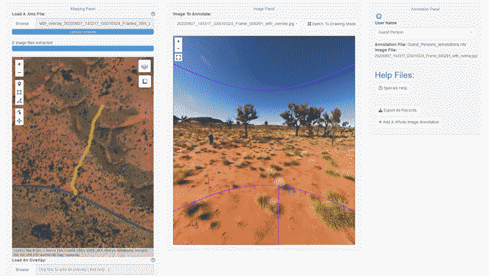{fig-align="center" width="95%"}

### Setup and Configuration

The pannotator application can be opened in any web browser. Once running, settings can be accessed using the cog icon at the top corner of the Annotation Panel. The drop down window contains three panels: a 'Main Settings' tab, a 'Lookups' tab, and an 'About This Software' tab (Figure 2, left). In the Main Settings tab you can change general settings. These are grouped into 1) *Layout Settings*, including the size of the Mapping, Image and Annotation Panels, turning on or off popup alert windows, and altering the theme for the entire application, 2) *Mapping Panel Settings*, which includes setting the background map, icons and markers for points, rectangles and polygons drawn on maps, and the colour, weight and opacity of the stroke (outline) and the fill of polygons and rectangles, 3) *Image Panel Settings*, which includes the same functionality for drawing and formatting shapes but on 360-degree flattened equirectangular images in the Image Panel, and the capacity to turn off borders and fill on the exported version of cropped sub-images ('Show Polygon Stroke/Fill in Cropped Image Export' checkboxes), and 4) *Annotation Panel Settings* which includes choosing a custom user name lookup file (Figure 2, centre & Figure 3, right) and defining the format of the annotation export file (e.g., .csv or .rds).

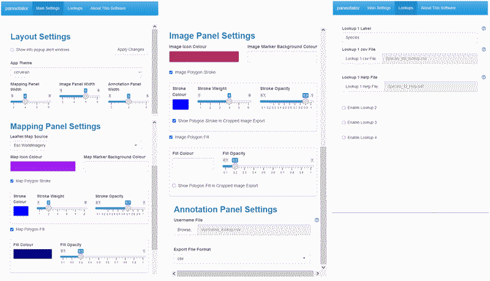{fig-align="center" width="95%"}

In the 'Lookups' Panel (Figure 2, right) you can specify up to four data fields that will be used to annotate the images. The name of the data field name can be specified in the 'Lookup Label' text boxes. The categories for the data field are specified in an accompanying .csv file which can be linked using the 'Lookup csv File' browse buttons. The Lookup csv file has two columns: 1) a 'display' column and 2) a 'value' column (Figure 3, left). The text in the 'display' column will appear in the Lookup drop down menu and the 'value' will saved to the annotation file. This way your 'display' category can differ from the data field in the export file if needed. An accompanying .pdf help file can be uploaded to assist the annotator using the Lookup Help File browse buttons. The help file can then be accessed using buttons created in the Annotation Panel (see below).

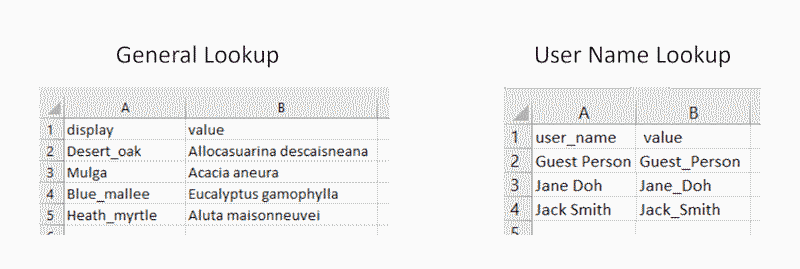{fig-align="center" width="95%"}

**Note**: once changes have been made to settings and configurations you can update them by clicking the 'Apply Settings' button.

**Warning! If you change and update Lookup tables while in the process of annotating images, the structure of the annotation dataframe and exported annotation data will also change. This may affect the validity of data.**

## Mapping Panel

The Mapping Panel allows the user to open a .kmz file and render it using the [Leaflet](https://leafletjs.com/) open source javascript library for mobile friendly interactive maps. This plots the geolocations of all images in the .kmz file (Figure 4, left), which is useful for visualising the layout of sampling transects or points associated with each .kmz file. The geolocation of the current image opened in the Image Panel is highlighted in purple (Figure 4, left). It also contains a button for adding overlays (e.g., fire history, vegetation types) to the satellite image for mapping purposes (Figure 4, right).

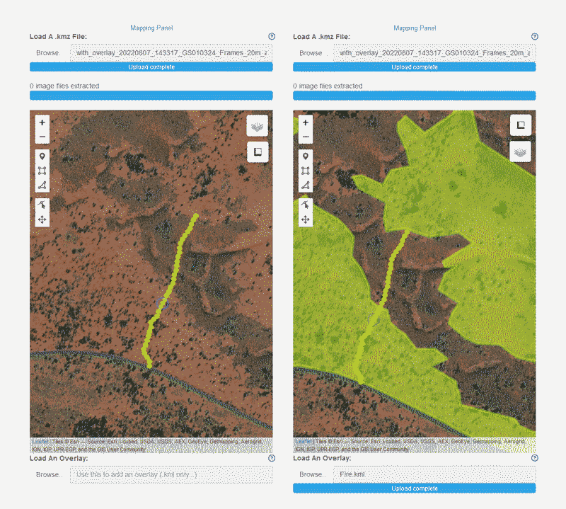{fig-align="center" width="95%"}

The window contains zoom in and zoom out buttons, a toolbar for drawing on the map and editing geometries, options for hiding various mapping layers, and the leaflet measure plugin (Figure 5A) which can be used to determine the distance of any feature from the location of a selected image or any other point on the map and calculate areas.

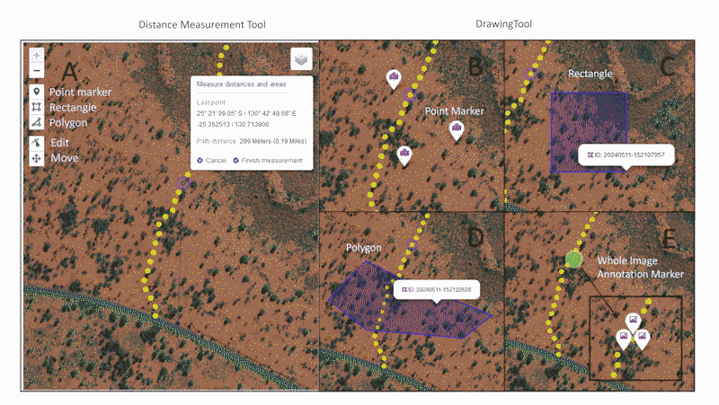{fig-align="center" width="95%"}

The drawing toolbar allows the user to drop specific geolocation point markers (Figure 5B), rectangles (Figure 5C) and complex polygons (Figure 5D) to which data may be then added using dropdown menus in the Annotation Panel. The appearance of these geometric objects (geometries) can be altered in the Mapping Panel Settings window. The toolbar also contains options to move and edit all geometric objects. Whole image annotation markers (Figure 5E) are added in the Annotation Panel.

When a geometry is created by the user a linked dropdown menu appears in the Annotation Panel (see below) in which you can add data annotations. An object ID is also automatically generated based on the timestamp. In the Mapping Panel separate icons are now provided for geolocation point markers (map pin icon), whole image markers (image card; whole image markers identify the geographic location of the 360-degree image presented in the Image Panel), and polygons/rectangles (draw polygon icon) (Figure 5B-E). These icons also appear in the accompanying dropdown menus in the Annotation Panel (see below). When any geometric object is rolled over in the Mapping Panel the object ID is shown as a label, and if the geometry is clicked on the coloured icon type (i.e., point, polygon) is shown as well as the object ID (examples in Figure 5C-D). If multiple whole image annotations are created (and hence multiple markers linked to one underlying image and location) these will cluster on the map; the number of annotations/markers is indicated inside the cluster. When the cluster is clicked, the icons will spiderfy (i.e., explode or pop out) so that the markers can be individually selected (Figure 5E). The geolocation of whole image annotations cannot be changed, they will always retain the geolocation of the image they were assigned to.

Finally, elements shown in the Mapping Panel are grouped according to (1) all 360 images from a .kmz file and the current image which has a small circle around it, (2) overlay, (3) whole image annotation markers, and (4) map annotation markers and polygons. Each group has a checkbox to toggle visibility.

## Image Panel

The Image Panel has two modes: 'Viewing Mode' and "Drawing Mode'. The user switches between these modes using a button in the top right corner ('Switch to Viewing Mode' / 'Switch to Drawing Mode').

### Viewing Mode

In Viewing Mode the Pannellum web viewer loads an equirectangular image selected from those in the .kmz file using the 'Image to Annotate' dropdown menu and renders it in interactive 360-degree viewing mode. The panel has buttons for zoom in, zoom out and full screen mode and also contains the compass bearing of the direction in which the image is being viewed (if present in metadata).

The 360-degree Viewing Mode allows the user to extract target information from each selected image. Figure 6 (below) shows several key ecological applications, including species identification and mapping (left), estimation of vertically projected ground-layer vegetation cover (centre), and estimation of crown health for individual trees (right). In each case data annotation is performed in the Annotation Panel using help files as visual and/or descriptive aids (see below).

Estimation of vertically projected ground layer cover may be assisted by overlaying sampling templates constructed from reference images (eg., camera images containing plots of specified size laid out using markers or tape etc.) onto each sample image. In this example (Figure 6 centre) a 10 m diameter plot is shown, centred on the vertically projected camera location. The plot has been broken into 4, 20 and 100 equal areal increments (90, 18 and 3.6 degrees) to assist with cover estimation of scattered and/or small taxa. The two orthogonal lines that divide the plot have been marked with 1 m increments to assist the user in estimating size and cover while taking into account image distortion.

One key benefit of sampling in transects or in a regular pattern is that objects may be viewed from multiple perspectives for identification and/or classification. This is advantageous when sampling objects with obstructed views or large, three-dimensional objects that are not entirely visible from a single perspective.

![Common ecological applications using the image panel. Left: species identification and mapping. Four candidate species are labelled (A-D). The plants labelled C and D can be located by dropping a pin in the Mapping Panel. Centre: cover estimation of ground layer vegetation. Cover may be assisted by comparison with example 25%, 5% and 1% areas. Right: Crown health classification. In this example the intent is to estimate the percentage of the potential crown that has healthy green leaves. Images can be drawn on and cropped and exported in Drawing Mode (below) .](Images/Figure6_small.png){fig-align="center" width="95%"}

### Drawing Mode

When the Drawing Mode is enabled by clicking the 'Switch to Drawing Mode' button the Leaflet plugin loads a flattened equirectangular image in the Image Panel (i.e., [not]{.underline} in 360-degree viewing format; Figure 7). A toolbar allows the user to draw point markers, rectangles and more complex polygons onto the equirectangular image, in the same way as the Mapping Panel. This allows the user to select sub-images ('patches' or 'crops') or locations on the original image that are of interest (e.g., vegetation or landforms; Figure 7). Any drawn geometric object can be moved and rectangles and polygons can be re-drawn. The display of geometric objects added in Drawing Mode (e.g., icon colour, marker colour, and the colour and opacity of the stroke (border) and fill of each rectangle or polygon) can be altered from the Image Panel Settings in the Main Settings tab.

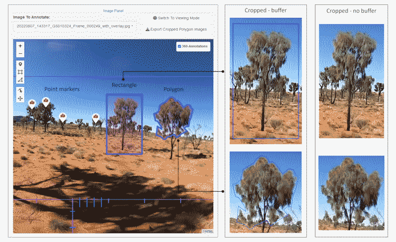{fig-align="center" width="95%"}

When a point or shape object is drawn onto the equirectangular image an ID number is created (based on timestamp) and added to the underlying annotation dataframe, along with its geometry (based on pixel-location(s)). A linked dropdown menu also opens in the Annotation Panel for adding data based on user-defined lookup tables (see below). Geometry icons and IDs are shown in both Annotation dropdowns and in the Image Panel (ID if rolled over, ID and icon if clicked). The metadata containing ID, geometry and annotations are automatically saved to the annotation dataframe and all records can be exported as a .csv/.rds using the 'Export All Records' button in the Annotation Panel.

Finally, rectangle and polygon geometries drawn on a selected image can be exported using the 'Export Cropped Polygon Images' button. This generates a cropped image file (.png) of the underlying equirectangular image based on the bounding box of the drawn geometries. If the geometry stroke (border) and fill are enabled the image is cropped to a bounding box with a small buffer, and if it is disabled the image is cropped to the exact dimensions of the geometry bounding box (Figure 7). The stroke and fill of polygons on the exported version of cropped sub-images can be turned on and off using the 'Show Polygon Stroke/Fill in Cropped Image Export' checkboxes in the Image Panel Settings of the Main Settings (Figure 2, centre).

The name of a cropped image consists of the associated geometric object's ID appended to the original 360-degree image name, while the geolocation of the underlying image is embedded in the metadata. Cropped images are saved in a user-selected folder.

## Annotation Panel

The purpose of the Annotation Panel is to generate data from camera images using pre-determined data fields and then export that data. The top of the panel (Figure 8, left) shows the user name dropdown menu, annotation file name, and the image file currently loaded in the Image Panel. The user name list is customisable and each user name generates a separate annotation file. The ability to add multiple users is essential because it allows for evaluation of classification or scoring reliability among different users.

### Adding Data Records

A new data record is added to a selected equirectangular image by clicking the 'Add A Whole Image Annotation' button (Figure 8). In the example provided the presence of the plant species (desert oak, *Allocasuarina decaisneana*) is added to the image annotation. Dropdown menus for adding records are user defined according to the requirements of the project. Multiple new records can be added to each whole image; these are clustered in the Mapping Panel and exploded by clicking the cluster icon.

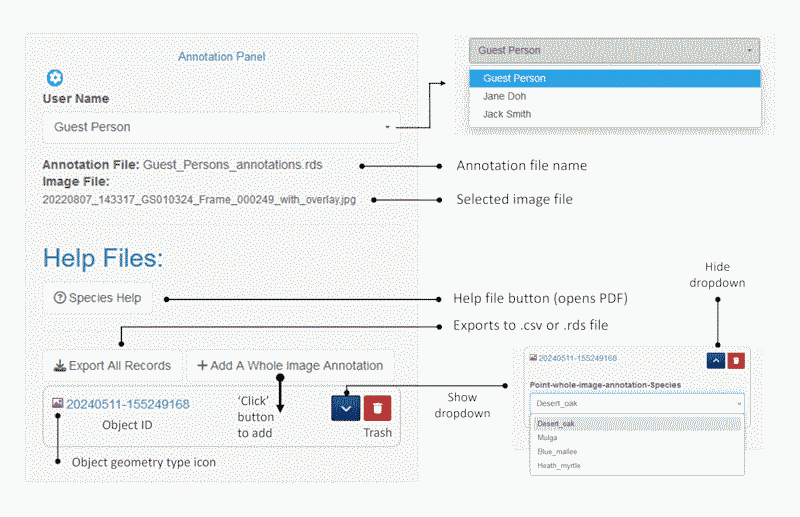{fig-align="center" width="95%"}

When point markers, rectangles or polygons are added to an image in either the Mapping Panel (e.g., on a satellite image) or the Image Panel (to an equirectangular image) a new data record is automatically generated in the Annotation Panel. All records contain an icon type (point-map, point-whole-image-annotation and polygon-map for objects in the Mapping Panel and point-360 and polygon-360 for objects in the Image Panel) to which the specific dropdown label name is appended (e.g., polygon-360-Species), and also an object ID (timestamp). Individual annotation records can be deleted using the 'trash' button and shown or hidden using the chevron button.

### Help files

Data records are added with the assistance of help files accessed using the associated button. In this example the help file provided contains images of species present in the study area (Figure 8). Help files developed by the user can be uploaded as required. Examples include reference images for species identity (Figure 9, top row), cover classes (Figure 9, centre row) and size class (Figure 9, bottom row).

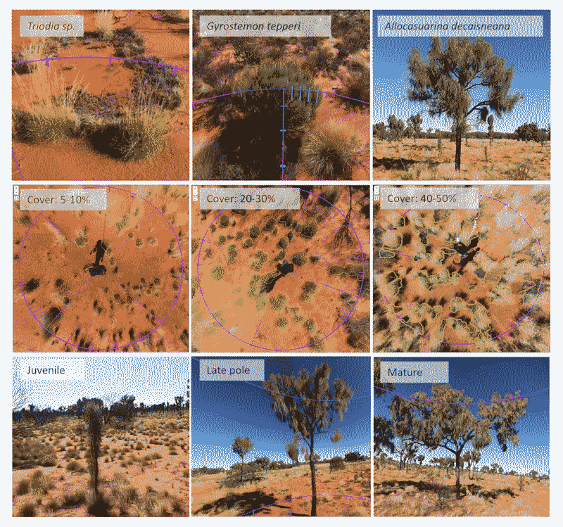{fig-align="center" width="95%"}

### Exporting Data

Data may be exported in .csv and .rds formats. An example .rds file viewed in R is provided below (Figure 9). The file contains user name, ID, image file, feature type (image marker or point marker), geometry and the four data fields specified in the Annotation Panel drop down menu.

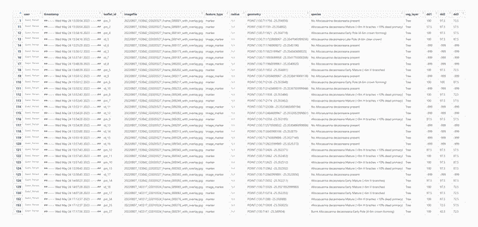{fig-align="center" width="95%"}

Rectangle and polygon geometries drawn on a selected image in Drawing Mode of the Image Panel can be exported using the 'Export Cropped Polygon Images' button. This generates a cropped image file(s) (.png) which is/are saved to a user-defined folder.

### Visualising and Validating Data

Below is a simple example of R code for visualising a sample of exported data using the R package mapview. Quarto files that contain a complete set of code for extracting and visualising species distribution data, cover data and tree crown health data, and that validate data extracted from images compared to data collected in the field are provided in the accompanying pannotator_examples and pannotator_data_validation files.

This example code generates a plot of scores on the variable dd2 (percentage of tree crown with live leaves) using the package mapview.

```{r echo=TRUE, eval=FALSE, results='hold', warning=FALSE, include=TRUE}

library(dplyr)
library(mapview)
library(RColorBrewer)
library(sf)


df_annotation <- readRDS("C:/user_1_annotations.rds") # read in the .rds file
df_annotation <- st_as_sf(df_annotation, wkt = "geometry",crs = 4326) #define 
#the geometry

df_annotation$dd2 <- as.numeric(df_annotation$dd2) # dd2 = -999 where crowns 
# have not been assessed for health (NA); range = 0 for no live leaves (entirely
# dead) to 100 for entire crown healthy with green leaves

df_annotation <- subset(df_annotation, dd2 > -1 ) # select only records where 
# Allocasuarina crowns have been assessed for health; that is, excluding NA records


mapviewOptions(basemaps = c("Esri.WorldImagery"),
               vector.palette = colorRampPalette(c("red","orange", "yellow", "green")),
               layers.control.pos = "topright")


mapview(df_annotation, zcol = "dd2 ", na.rm = TRUE)

```

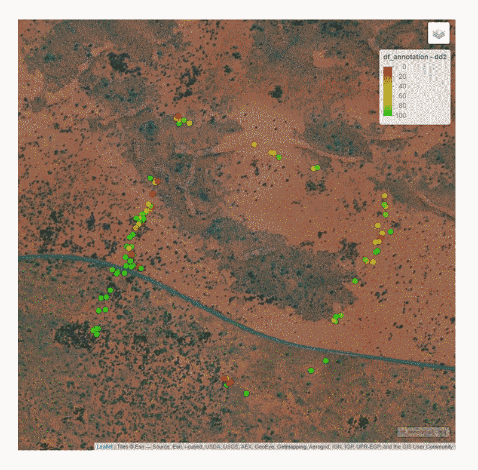{fig-align="center" width="95%"}

This example code generates a plot of scores of the relationship between the number of plant species (i.e., species richness) recorded in a field survey (x axis) and camera survey (y axis) of the same plots (n = 79). It also fits a linear model to the relationship, plots the line of best fit, and prints the model statistics.

```{r echo=TRUE, eval=FALSE, results='hold', warning=FALSE, include=TRUE}
#read in the species data file#

species_data <- read_csv("Calibration_species.csv", show_col_types = FALSE)

# confirm that there are 79 plots of species data
cat("The number of rows in the dataframe is", nrow(species_data), "\n")


# now determine the relationship between plot-level species counts in the field survey versus camera survey counts. abline adds a linear model to the plot   #

plot(species_data$No_Field_species, species_data$No_Camera_species,
     main = "Plot-level species richness",
     xlab = "No. of species (Field Survey)",
     ylab = "No. of species (Camera Survey)",
     pch = 16,  # Use filled circles as data points
     col = "black",  # Set point color 
     ylim = c(0, 8),  # Set y-axis limits
     xlim = c(0, 8))  # Set x-axis limits
abline(lm(No_Camera_species ~ No_Field_species, data = species_data), col = "red")

# view the linear model statistics #
model <- lm(No_Camera_species ~ No_Field_species, data = species_data)

model_summary <- summary(model)
print(model_summary)

```

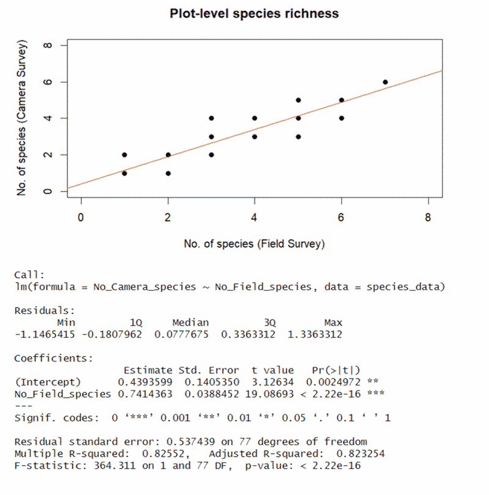{fig-align="center" width="95%"}
