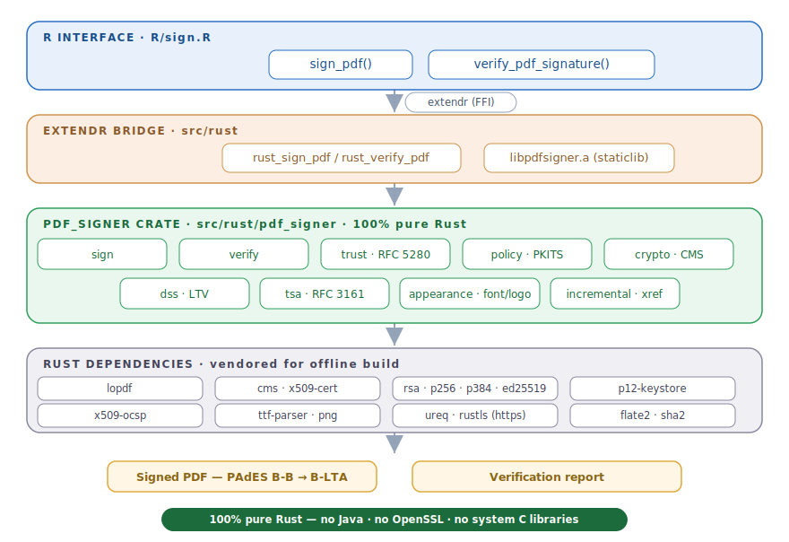

# pdfsigner <a href="https://github.com/StrategicProjects/pdfsigner"></a>

[](https://CRAN.R-project.org/package=pdfsigner)
[](https://CRAN.R-project.org/package=pdfsigner)
[](https://www.gnu.org/licenses/gpl-3.0)
[](https://github.com/StrategicProjects/pdf_signer)

**pdfsigner** is an R package to digitally **sign** PDF documents with a PKCS#12
keystore and **verify** their signatures.

The package is powered by a bundled, **pure-Rust backend** (the
[`pdf_signer`](https://github.com/StrategicProjects/pdf_signer) crate, wrapped
with [extendr](https://extendr.rs/)). It no longer shells out to Java
(`BatchPDFSignPortable.jar`) or Poppler (`pdfsig`): **no Java runtime, OpenSSL,
or external command-line tools are required** — only a Rust toolchain at install
time.

## Installation

Requires a Rust toolchain (`cargo`, `rustc`) to compile the bundled backend.
Install Rust from <https://rustup.rs>, then:

```r
# install.packages("remotes")
remotes::install_github("StrategicProjects/pdfsigner")
```

## What it does

- **PAdES** signatures up to **B-LTA** via `pades_level`: `"bb"` (CAdES
  `signing-certificate-v2`), `"bt"` (+ RFC 3161 signature timestamp), `"blt"`
  (+ a `/DSS` with the certificate chain and CRLs), `"blta"` (+ a document
  timestamp over the whole file). Levels `"bt"`+ need a `tsa_url`.
- **Incremental updates**: signing again appends only, so earlier signatures
  stay valid — multi-signature is supported.
- **Visible or invisible** signatures, with a custom text box + validation link.
- **Cryptographic verification** of every signature (re-derives the signed byte
  range, checks the message digest and the signer's RSA signature).

## Usage

### `sign_pdf()`

```r
library(pdfsigner)

sign_pdf(
  pdf_file          = "input.pdf",
  output_file       = "signed.pdf",
  keystore_path     = "keystore.p12",      # or env var KEYSTORE_PATH
  keystore_password = "password",          # or env var KEY_PASSWORD
  signtext          = "Document digitally signed by CastLab",
  validate_link     = "https://castlab.org/validate",
  reason            = "Approval",
  translate         = TRUE,                 # Portuguese date label
  font              = "Arial.ttf",          # embed a TrueType/OpenType font
  image             = "logo.png",           # draw a PNG/JPEG logo in the box
  tsa_url           = "http://timestamp.digicert.com",
  pades_level       = "blta"                # bb | bt | blt | blta
)
```

A *visible* signature box is drawn whenever `signtext` is non-empty; geometry is
controlled by `page`, `x`, `y`, `width`, `height`, `font_size` and `border`.
Pass `font` to embed a TrueType/OpenType font (WinAnsi/Latin-1 glyphs; the
default is Helvetica) and `image` to draw a PNG/JPEG logo in the box. Omit
`signtext` for an invisible signature.

### `verify_pdf_signature()`

```r
result <- verify_pdf_signature("signed.pdf")
length(result)                              # number of signatures
vapply(result, function(s) s$valid, logical(1))
result[[1]]$signer                          # signer distinguished name
```

Each entry is a named list: `valid`, `signer`, `chain_trusted`,
`covers_whole_document`, `signed_len`, `byte_range`, `detail`.

Pass `roots` (a PEM file of trusted roots, e.g. the ICP-Brasil AC Raiz set) to
validate each signer certificate chain; `chain_trusted` is then `TRUE`/`FALSE`
(and `NA` when no roots are given):

```r
verify_pdf_signature("signed.pdf", roots = "icp-brasil-roots.pem")
```

TSA / CRL endpoints over **HTTPS** are supported (the bundled Rust backend is
built with its `https` feature, using rustls).

## Generating a test certificate

```bash
openssl req -x509 -newkey rsa:2048 -keyout key.pem -out cert.pem -days 365 -nodes
openssl pkcs12 -export -inkey key.pem -in cert.pem -out keystore.p12
```

## Architecture



The R functions call a thin [extendr](https://extendr.rs/) bridge that links the
pure-Rust **`pdf_signer`** crate. Every Rust dependency is vendored under
`src/rust/vendor.tar.xz` so the package builds offline (CRAN policy:
`SystemRequirements: Cargo, rustc`).

## License

GPL-3. The bundled `pdf_signer` crate and its vendored Rust dependencies retain
their own licenses.
