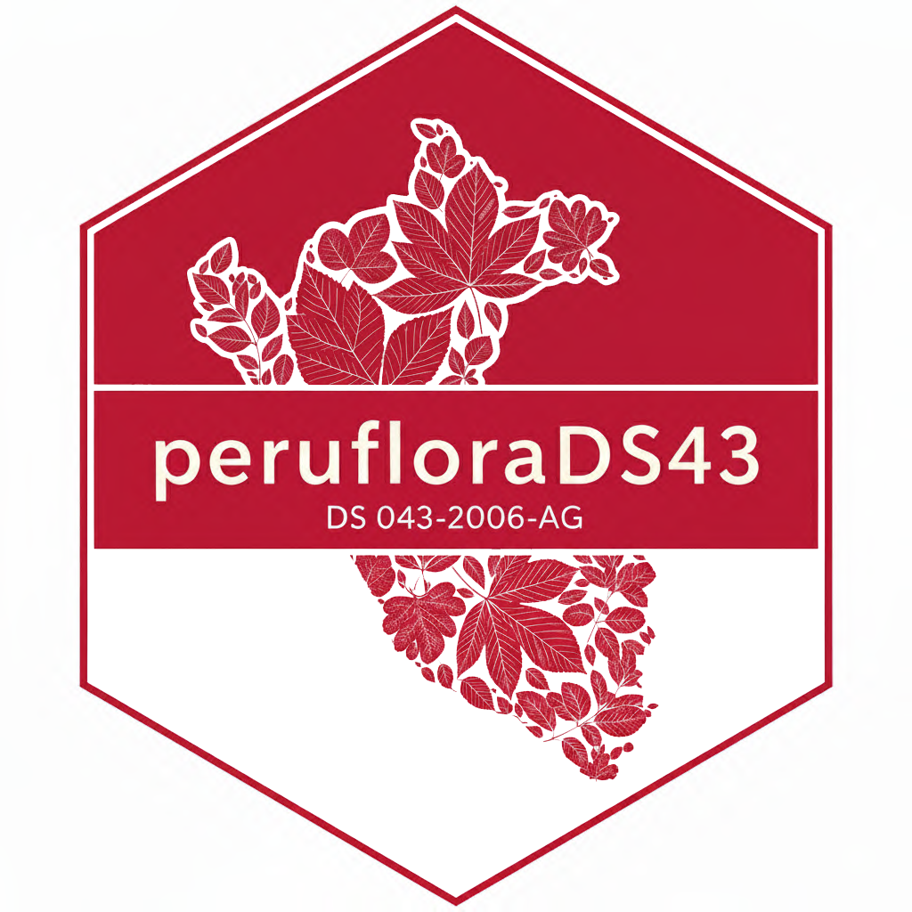

<!-- README.md is generated from README.Rmd. Please edit that file -->

# peruflorads43 

<!-- badges: start -->

[](https://lifecycle.r-lib.org/articles/stages.html#stable)
[](https://CRAN.R-project.org/package=peruflorads43)
[](https://cran.r-project.org/package=peruflorads43)
[](https://cran.r-project.org/package=peruflorads43)

<!-- badges: end -->

## Overview

**peruflorads43** provides comprehensive tools for working with Peru’s
official threatened plant species list as established by Supreme Decree
**DS 043-2006-AG** (July 13, 2006). The package enables researchers,
conservation practitioners, and environmental consultants to:

- **Validate species protection status** against the official decree
- **Match species names** with advanced algorithms handling taxonomic
  changes
- **Access complete threat data** for 776+ threatened plant species
- **Handle nomenclatural updates** automatically since 2006

## Key Features

### Intelligent Name Matching

- **Hierarchical matching pipeline**: Direct → Genus → Fuzzy → Suffix
  matching
- **Handles taxonomic complexity**: Works with binomial and
  infraspecific taxa
- **Automatic standardization**: Deals with variations in formatting and
  spelling
- **Ambiguity detection**: Identifies and reports uncertain matches for
  manual review

### Dual Database System

- **Original nomenclature (2006)**: Preserves names as published in DS
  043-2006-AG
- **Updated nomenclature (2025)**: Reflects current taxonomic consensus
  (WCVP/POWO)
- **Synonym resolution**: Links historical names to accepted names
  automatically

## Installation

Install the stable version from CRAN:

``` r
install.packages("peruflorads43")
```

Or install the development version from GitHub:

``` r
# Using pak (recommended)
pak::pak("PaulESantos/peruflorads43")

# Or using remotes
remotes::install_github("PaulESantos/peruflorads43")
```

## Quick Start

### Basic Usage

Check if species are threatened:

``` r
library(peruflorads43)

# Simple vector of species names
species_list <- c(
  "Cattleya maxima",           # Orchid - Endangered
  "Polylepis incana",          # Queñua tree - Vulnerable  
  "Persea americana"           # Avocado - Not threatened
)

# Check threat status
tibble::tibble(splist = species_list) |> 
  dplyr::mutate(ds43 = is_threatened_peru(splist))
#> # A tibble: 3 × 2
#>   splist           ds43          
#>   <chr>            <chr>         
#> 1 Cattleya maxima  CR            
#> 2 Polylepis incana CR            
#> 3 Persea americana Not threatened
```

### Detailed Matching Results

Get comprehensive matching information:

``` r
# Detailed results with matching metadata
results <- is_threatened_peru(species_list, return_details = TRUE)

# View key columns
results |> 
  dplyr::select(Orig.Name, Matched.Name, Threat.Status, Match.Level)
#> # A tibble: 3 × 4
#>   Orig.Name        Matched.Name     Threat.Status  Match.Level
#>   <chr>            <chr>            <chr>          <chr>      
#> 1 Cattleya maxima  Cattleya maxima  CR             Exact rank 
#> 2 Polylepis incana Polylepis incana CR             Exact rank 
#> 3 Persea americana ---              Not threatened No match
```

### DS 043-2006-AG Validation

Check protection status under the official decree:

``` r
# Species with nomenclatural changes
species <- c(
  "Haageocereus acranthus subsp. olowinskianus",  # Original name (2006)
  "Brassia ocanensis",                            # Updated name (was Ada)
  "Persea americana"                              # Not threatened
)

# Consolidated search across both databases
tibble::tibble(species) |> 
dplyr::mutate(status = is_ds043_2006_ag(species))
#> # A tibble: 3 × 2
#>   species                                     status           
#>   <chr>                                       <chr>            
#> 1 Haageocereus acranthus subsp. olowinskianus VU (synonym)     
#> 2 Brassia ocanensis                           VU (updated name)
#> 3 Persea americana                            Not threatened


# Detailed reconciliation
details <- is_ds043_2006_ag(species, return_details = TRUE)

details |>
  dplyr::select(Input.Name, Consolidated.Status, Final.Source, Nomenclature.Status)
#> # A tibble: 3 × 4
#>   Input.Name                Consolidated.Status Final.Source Nomenclature.Status
#>   <chr>                     <chr>               <chr>        <chr>              
#> 1 Haageocereus acranthus s… VU (synonym)        DS 043-2006… Synonym (name upda…
#> 2 Brassia ocanensis         VU (updated name)   DS 043-2006… Name updated since…
#> 3 Persea americana          Not threatened      Not in DS 0… Not applicable
```

### Handling Fuzzy Matches

The package automatically handles misspellings and variations:

``` r
# Species with typos
species_fuzzy <- c(
  "Catleya maxima",      # Missing 't' in Cattleya
  "Polylepys incana"     # Wrong spelling of Polylepis
)

results <- is_threatened_peru(species_fuzzy, return_details = TRUE)

# Check fuzzy matching quality
results |>
  dplyr::select(Orig.Name, Matched.Name, Threat.Status, 
         fuzzy_genus_dist, fuzzy_match_genus)
#> # A tibble: 2 × 5
#>   Orig.Name        Matched.Name Threat.Status fuzzy_genus_dist fuzzy_match_genus
#>   <chr>            <chr>        <chr>                    <dbl> <lgl>            
#> 1 Catleya maxima   Cattleya ma… CR                           1 TRUE             
#> 2 Polylepys incana Polylepis i… CR                           1 TRUE
```

### Reviewing Ambiguous Matches

When multiple candidates have identical match scores:

``` r
# Get ambiguous matches for quality control
ambiguous <- get_ambiguous_matches(results, type = "all")
#> No ambiguous all matches found.

# Save for manual curation
if (!is.null(ambiguous)) {
  get_ambiguous_matches(
    results, 
    type = "genus",
    save_to_file = TRUE
  )
}
```

## Database Structure

### Original Database (DS 043-2006-AG 2006)

``` r
# Access original nomenclature
db_original <- get_threatened_database(type = "original")

# Summary statistics
get_database_summary("original")
#> # A tibble: 1 × 10
#>   Database Total_Species    CR    EN    VU    NT Families Genera
#>   <chr>            <int> <int> <int> <int> <int>    <int>  <int>
#> 1 original           776   193    73   391   119       80    290
#> # ℹ 2 more variables: Has_Infraspecies <int>, Max_Rank <dbl>
```

**Key characteristics:**

- 776+ species as listed in 2006
- Includes both accepted names and synonyms
- Original infraspecific rank formatting

### Updated Database (Current Nomenclature)

``` r
# Access updated nomenclature
db_updated <- get_threatened_database(type = "updated")

# Compare with original
get_database_summary("both")
#> # A tibble: 2 × 10
#>   Database        Total_Species    CR    EN    VU    NT Families Genera
#>   <chr>                   <int> <int> <int> <int> <int>    <int>  <int>
#> 1 Original (2006)           776   193    73   391   119       80    290
#> 2 Updated                   179    44    16    93    26       30     85
#> # ℹ 2 more variables: Has_Infraspecies <int>, Max_Rank <dbl>
```

**Key characteristics:** - Current taxonomic consensus (WCVP/POWO) -
Supports trinomial names - Only accepted names (synonyms resolved) -
Updated to 2025 nomenclature

## Advanced Features

### Comparison Between Databases

``` r
# Side-by-side comparison
comparison <- comparison_table_ds043(species)

comparison |>
 dplyr::select(input_species, status_original, status_updated, 
         nomenclature_status, protected_by_ds_043)
#> # A tibble: 3 × 5
#>   input_species               status_original status_updated nomenclature_status
#>   <chr>                       <chr>           <chr>          <chr>              
#> 1 Haageocereus acranthus sub… VU              Not threatened Synonym (name upda…
#> 2 Brassia ocanensis           Not threatened  VU             Name updated since…
#> 3 Persea americana            Not threatened  Not threatened Not applicable     
#> # ℹ 1 more variable: protected_by_ds_043 <chr>
```

## Legal Framework

**Supreme Decree DS 043-2006-AG**  
*Aprueban Categorización de Especies Amenazadas de Flora Silvestre*

Issued by: Ministry of Agriculture, Peru  
Date: July 13, 2006

### IUCN Threat Categories

| Category | Code | Spanish | Description |
|----|----|----|----|
| Critically Endangered | **CR** | En Peligro Crítico | Extremely high risk of extinction |
| Endangered | **EN** | En Peligro | Very high risk of extinction |
| Vulnerable | **VU** | Vulnerable | High risk of extinction |
| Near Threatened | **NT** | Casi Amenazado | Close to qualifying for threatened status |

## Use Cases

### 1. Environmental Assessment

``` r
# Species list from field survey
field_species <- c("Achyrocline saturejoides", "Bouteloua simplex", 
                   "Jarava ichu", "Cenchrus clandestinus", "Grindelia boliviana",
                   "Tagetes filifolia", "Bidens pilosa", "Cumulopuntia boliviana",
                   "Ageratina sternbergiana", "Roca", "Nassella inconspicua", 
                   "Dalea sp", "Baccharis tricuneata", "Lepechinia meyenii", 
                   "Erodium cicutarium", "Suelo", "Ephedra rupestris", 
                   "Achyrocline saturejoides", "Ageratina sternbergiana", 
                   "Astragalus garbancillo", "Baccharis tola", "Bidens pilosa",
                   "Bouteloua simplex", "Cenchrus clandestinus", 
                   "Cumulopuntia boliviana", "Jarava ichu")

tibble::tibble(field_species) |> 
  dplyr::mutate(status = is_ds043_2006_ag(field_species)) |> 
  dplyr::filter(status != "Not threatened")
#> The species list (splist) should only include binomial names. The following names were submitted at the genus level: 'ROCA', 'SUELO'
#> The species list (splist) should only include binomial names. The following names were submitted at the genus level: 'ROCA', 'SUELO'
#> # A tibble: 1 × 2
#>   field_species     status
#>   <chr>             <chr> 
#> 1 Ephedra rupestris CR

# Check DS 043 protection status
results <- is_ds043_2006_ag(field_species, return_details = TRUE)
#> The species list (splist) should only include binomial names. The following names were submitted at the genus level: 'ROCA', 'SUELO'
#> The species list (splist) should only include binomial names. The following names were submitted at the genus level: 'ROCA', 'SUELO'

results
#> # A tibble: 26 × 14
#>    Input.Name        Consolidated.Name Consolidated.Status Consolidated.Category
#>    <chr>             <chr>             <chr>               <chr>                
#>  1 Achyrocline satu… ---               Not threatened      <NA>                 
#>  2 Bouteloua simplex ---               Not threatened      <NA>                 
#>  3 Jarava ichu       ---               Not threatened      <NA>                 
#>  4 Cenchrus clandes… ---               Not threatened      <NA>                 
#>  5 Grindelia bolivi… ---               Not threatened      <NA>                 
#>  6 Tagetes filifolia ---               Not threatened      <NA>                 
#>  7 Bidens pilosa     ---               Not threatened      <NA>                 
#>  8 Cumulopuntia bol… ---               Not threatened      <NA>                 
#>  9 Ageratina sternb… ---               Not threatened      <NA>                 
#> 10 Roca              ---               Not threatened      <NA>                 
#> # ℹ 16 more rows
#> # ℹ 10 more variables: Protected.DS043 <lgl>, Is.Synonym <lgl>,
#> #   Accepted.Name <chr>, Final.Source <chr>, Match.Scenario <chr>,
#> #   Nomenclature.Status <chr>, Original.Matched <chr>, Original.Status <chr>,
#> #   Updated.Matched <chr>, Updated.Status <chr>

# Generate report 
results |>
  dplyr::filter(Protected.DS043 == TRUE) |>
  dplyr::select(Input.Name, Consolidated.Status, Final.Source)
#> # A tibble: 1 × 3
#>   Input.Name        Consolidated.Status Final.Source             
#>   <chr>             <chr>               <chr>                    
#> 1 Ephedra rupestris CR                  DS 043-2006-AG (original)
```

### 2. Research and Monitoring

``` r
# Historical species records
historical_names <- c(
  "Lycaste locusta",     # Old name
  "Ida locusta"          # Current accepted name
)

# Check nomenclatural updates
nomenclature_check <- is_ds043_2006_ag(
  historical_names, 
  return_details = TRUE
)

# Identify synonyms
nomenclature_check |>
  dplyr::filter(Is.Synonym == TRUE) |>
  dplyr::select(Input.Name, Accepted.Name, Nomenclature.Status)
#> # A tibble: 1 × 3
#>   Input.Name      Accepted.Name Nomenclature.Status   
#>   <chr>           <chr>         <chr>                 
#> 1 Lycaste locusta Ida locusta   Synonym (name updated)
```

## Algorithm Details

### Hierarchical Matching Pipeline

1.  **Direct Match** (Node 1)
    - Exact matching for full scientific names
    - Handles binomial, trinomial, and quaternomial names
    - Fastest and most reliable method
2.  **Genus Match** (Nodes 2-3)
    - Exact genus matching
    - Fuzzy genus matching (Levenshtein distance ≤ 1)
    - Foundation for species-level matching
3.  **Species Match** (Nodes 4-5)
    - Direct species epithet matching within genus
    - Fuzzy species matching (Levenshtein distance ≤ 1)
4.  **Infraspecies Match** (Nodes 6-7)
    - Direct infraspecific rank matching (SUBSP., VAR., F., etc.)
    - Fuzzy infraspecific epithet matching
    - Support for two-level infraspecies (Rank 4, original database
      only)

### Rank Validation

The algorithm implements **strict rank validation** to prevent false
positives:

``` r
# Example: User inputs trinomial, database has binomial
# Input:  "Cattleya maxima var. alba" (Rank 3, doesn't exist)
# Database: "Cattleya maxima" (Rank 2, exists)
# Result: NO MATCH (correct) - prevents false positive
```

This ensures taxonomic precision and avoids inappropriate matches.

## Performance Considerations

### Duplicate Handling

The package automatically handles duplicate names efficiently:

``` r
# Input with duplicates
species_dup <- c(
  "Cattleya maxima", 
  "Polylepis incana", 
  "Cattleya maxima"  # Duplicate
)

results <- matching_threatenedperu(species_dup)
results
#>   sorter        Orig.Name     Matched.Name Threat.Status Author
#> 1      1  Cattleya maxima  Cattleya maxima            CR       
#> 2      2 Polylepis incana Polylepis incana            CR       
#> 3      3  Cattleya maxima  Cattleya maxima            CR       
#>   accepted_name_author Matched.Rank Comp.Rank Match.Level Orig.Genus
#> 1               Lindl.            2      TRUE  Exact rank   CATTLEYA
#> 2                Kunth            2      TRUE  Exact rank  POLYLEPIS
#> 3               Lindl.            2      TRUE  Exact rank   CATTLEYA
#>   Orig.Species Orig.Infraspecies Orig.Infraspecies_2 Rank Orig.Infra.Rank
#> 1       MAXIMA              <NA>                <NA>    2            <NA>
#> 2       INCANA              <NA>                <NA>    2            <NA>
#> 3       MAXIMA              <NA>                <NA>    2            <NA>
#>   Orig.Infra.Rank_2 matched direct_match Matched.Genus Matched.Species
#> 1              <NA>    TRUE         TRUE      CATTLEYA          MAXIMA
#> 2              <NA>    TRUE         TRUE     POLYLEPIS          INCANA
#> 3              <NA>    TRUE         TRUE      CATTLEYA          MAXIMA
#>   Matched.Infra.Rank Matched.Infraspecies Matched.Infra.Rank_2
#> 1               <NA>                 <NA>                 <NA>
#> 2               <NA>                 <NA>                 <NA>
#> 3               <NA>                 <NA>                 <NA>
#>   Matched.Infraspecies_2 genus_match fuzzy_match_genus fuzzy_genus_dist
#> 1                   <NA>          NA                NA               NA
#> 2                   <NA>          NA                NA               NA
#> 3                   <NA>          NA                NA               NA
#>   direct_match_species_within_genus suffix_match_species_within_genus
#> 1                                NA                                NA
#> 2                                NA                                NA
#> 3                                NA                                NA
#>   fuzzy_match_species_within_genus fuzzy_species_dist Matched.Rank.Calculated
#> 1                               NA                 NA                       2
#> 2                               NA                 NA                       2
#> 3                               NA                 NA                       2
#>   valid_rank direct_match_infra_rank fuzzy_match_infraspecies
#> 1       TRUE                      NA                       NA
#> 2       TRUE                      NA                       NA
#> 3       TRUE                      NA                       NA
#>   fuzzy_infraspecies_dist  tag infraspecies infraspecies_2 threat_category
#> 1                      NA <NA>         <NA>           <NA>              CR
#> 2                      NA <NA>         <NA>           <NA>              CR
#> 3                      NA <NA>         <NA>           <NA>              CR
```

## Citation

If you use **peruflorads43** in your research, please cite:

``` r
citation("peruflorads43")
#> To cite peruflorads43 in publications use:
#> 
#>   Santos-Andrade P.E. (2025). peruflorads43: Check Threatened Plant
#>   Species Status Against Peru's DS 043-2006-AG
#> 
#> A BibTeX entry for LaTeX users is
#> 
#>   @Manual{,
#>     title = {peruflorads43: Check Threatened Plant Species Status Against Peru's DS 043-2006-AG},
#>     author = {Paul E. Santos Andrade},
#>     year = {2025},
#>     url = {https://github.com/PaulESantos/peruflorads43},
#>   }
```

**Legal reference:**

Ministerio de Agricultura. (2006). Decreto Supremo N° 043-2006-AG:
Aprueban Categorización de Especies Amenazadas de Flora Silvestre. El
Peruano, July 13, 2006.

------------------------------------------------------------------------

**Disclaimer**: This package implements DS 043-2006-AG for research and
conservation purposes. For official legal determinations, consult the
original decree and relevant Peruvian authorities.
