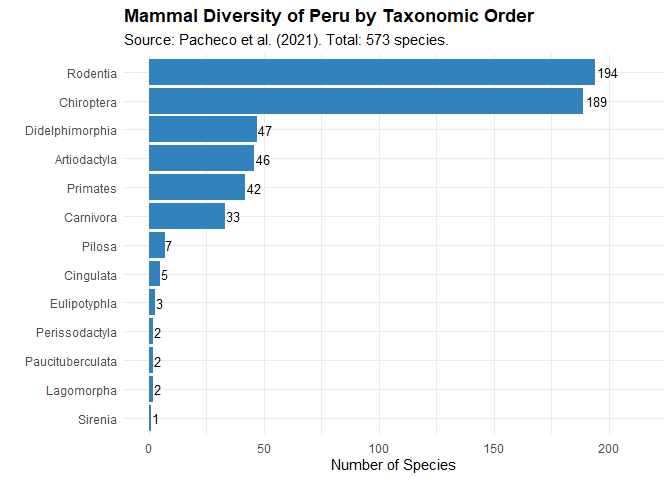
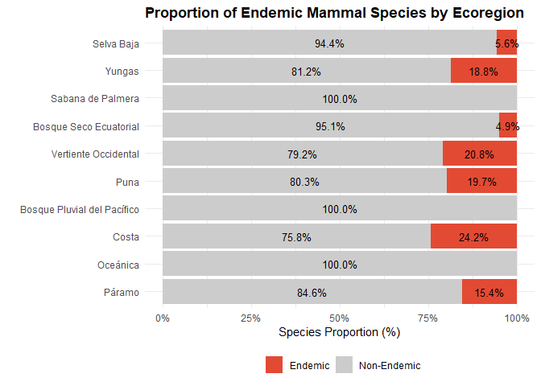

<!-- README.md is generated from README.Rmd. Please edit that file -->

# perumammals 

Taxonomic backbone and name validation tools for the mammals of Peru.

<!-- badges: start -->

[](https://lifecycle.r-lib.org/articles/stages.html)
[](https://CRAN.R-project.org/package=perumammals)
[](https://cran.r-project.org/package=perumammals)
[](https://cran.r-project.org/package=perumammals)
[](https://github.com/PaulESantos/perumammals/actions/workflows/R-CMD-check.yaml)
<!-- badges: end -->

------------------------------------------------------------------------

## Overview

**perumammals** provides a curated, standardized and programmatically
accessible version of the mammal diversity of Peru as compiled by
**Pacheco et al. (2021)**: *“Lista actualizada de la diversidad de los
mamíferos del Perú y una propuesta para su actualización”.*

This publication represents the most up-to-date and comprehensive
synthesis of Peruvian mammal diversity, integrating taxonomic revisions,
biogeographic information, distributional updates and the evaluation of
endemic taxa.

The package includes:

- A **backbone dataset of 573 mammal species** known for Peru
  (terrestrial, arboreal, aquatic and marine).
- **Taxonomic structure** (Order, Family, Genus, Species, authorship).
- **Endemism** information.
- **Ecoregional occurrence**, following the scheme used by Pacheco et
  al. (2021).
- **References and taxonomic notes** as listed in the source document.
- Data structures ready for **name validation**, **biodiversity
  assessments**, **environmental studies**, **species filtering**, and
  **ecoregional analyses**.

The goal of the package is not to replace authoritative taxonomic
databases, but to provide a **stable, Peruvian-focused backbone** and a
set of **reproducible tools** that can be used in ecological,
environmental, biogeographic and conservation workflows.

------------------------------------------------------------------------

## Context from Pacheco et al. (2021)

The backbone included in **perumammals** is derived directly from the
annex of **Pacheco et al. (2021)**, who synthesized decades of Peruvian
mammalogy work. This list is highly relevant as it incorporates recent
taxonomic updates up to November 2021, including the description of
species new to science (e.g., Thomasomys antoniobracki, Oligoryzomys
guille), the first Peruvian records for some bats (Eumops bonariensis),
and species re-validations (e.g., Neacomys carceleni), ensuring users
work with the most current classification.

### Mammalian Diversity

- **573 species** documented for Peru.  
- Representing **223 genera**, **51 families**, and **13 orders**.
- Includes both **terrestrial and marine** mammals.
- Peru ranks among the most mammal-diverse countries worldwide.



### Endemism

- **87 species** are recognized as **endemic to Peru**, emphasizing the
  country’s importance for global mammalian conservation.



### Biogeographic Ecoregions

The article assigns each species to one or more Peruvian ecoregions
using the classification widely used in biogeography and conservation
planning:

    #> ── Peruvian Mammal Ecoregions (Brack-Egg, 1986) ─────────────────────────────────────────────────────────────────────
    #> ℹ Number of ecoregions: 10
    #> ℹ Total mammal species in Peru: 573
    #> 
    #> Ecoregions by species richness:
    #> 
    #> SB - Selva Baja: 320 species (55.8%)
    #> YUN - Yungas: 256 species (44.7%)
    #> SP - Sabana de Palmera: 83 species (14.5%)
    #> BSE - Bosque Seco Ecuatorial: 81 species (14.1%)
    #> VOC - Vertiente Occidental: 72 species (12.6%)
    #> PUN - Puna: 71 species (12.4%)
    #> BPP - Bosque Pluvial del Pacífico: 69 species (12%)
    #> COS - Costa: 66 species (11.5%)
    #> OCE - Oceánica: 30 species (5.2%)
    #> PAR - Páramo: 26 species (4.5%)
    #> 
    #> Use pm_by_ecoregion() to filter species by ecoregion
    #> Use include_endemic = TRUE to see endemic species counts
    #> ─────────────────────────────────────────────────────────────────────────────────────────────────────────────────────

These codes are incorporated into the package as both:

- part of the main species table, and  
- a dedicated long-format table for analytical workflows.

### Taxonomic Notes and Updates

Pacheco et al. (2021) incorporate:

- New species records and recent taxonomic revisions.
- Updates resulting from molecular phylogenetics and integrative
  taxonomy.
- Clarifications regarding problematic or doubtful taxa.
- Contextual notes on species with uncertain distributions.

------------------------------------------------------------------------

## What the Package Provides

Although `perumammals` contains functions for name validation and
exploration.

The package includes four main datasets:

### **1. `peru_mammals`**

A species-level backbone with:

- Taxonomy (Order, Family, Genus, Species).
- Authorship information.
- Common names when available.
- Endemic status.
- Ecoregion assignments.
- Bibliographic notes.

### **2. `peru_mammals_ecoregions`**

A long-format dataset listing species–ecoregion pairs, ideal for:

- diversity summaries,
- mapping,
- ecoregional filters,
- conservation prioritization.

### **3. `peru_mammals_ecoregions_meta`**

Metadata describing the ecoregion codes used across the package.

### **4. `peru_mammals_backbone`**

Metadata describing:

- the source (Pacheco et al. 2021),
- year of publication,
- number of species,
- date of dataset creation during package build.

These datasets make `perumammals` a lightweight but powerful reference
for any workflow requiring curated and Peruvian-focused mammal
information.

### Core Functions and Name Validation

| Category | Functionality | Conceptual Code Example |
|----|----|----|
| Name Validation | Validate species names against database | `validate_peru_mammals(c("Thomasomys notatus", "Tapirus terrestris", "Unknown species"))` |
| Quick Checks | Check if species occurs in Peru | `is_peru_mammal("Tremarctos ornatus")` |
| Endemism Query | Check endemic status | `is_endemic_peru("Thomasomys notatus")` |
| Match Quality | Get validation match level | `match_quality_peru("Puma concolar")` |
| Family Summary | List families with species counts | `pm_list_families()` |
| Family Filter | Filter by specific family | `pm_species(family = "Cricetidae")` |
| Endemic Analysis | List endemic species statistics | `pm_list_endemic()` |
| Endemic by Family | Filter endemics by family | `pm_endemics(family = "Phyllostomidae")` |
| Endemic by Ecoregion | Filter endemics by ecoregion | `pm_by_ecoregion(ecoregion = "YUN", endemic = TRUE)` |

------------------------------------------------------------------------

## Installation

``` r
# Development version from GitHub
# Using pak (recommended)
pak::pak("PaulESantos/perumammals")

# Or using remotes
remotes::install_github("PaulESantos/perumammals")
```

## Citation

If you use this package, please cite:

The package:

``` r

citation("perumammals")
#> To cite perumammals in publications, please use:
#> 
#>   Santos Andrade, P. E., & Gonzales Guillen, F. N. (2025). perumammals: Taxonomic Backbone and Name
#>   Validation Tools for Mammals of Peru. R package version 0.0.0.1.
#>   https://paulesantos.github.io/perumammals/
#> 
#> The taxonomic backbone included in this package is based on:
#> 
#> Pacheco, V., Cadenillas, R., Zeballos, H., Hurtado, C. M., Ruelas, D., & Pari, A. (2021). Lista
#> actualizada de la diversidad de los mamíferos del Perú y una propuesta para su actualización. Revista
#> Peruana de Biología, 28(special issue), e21019. https://doi.org/10.15381/rpb.v28i4.21019
#> 
#> To see these entries in BibTeX format, use 'print(<citation>, bibtex=TRUE)', 'toBibtex(.)', or set
#> 'options(citation.bibtex.max=999)'.
```
