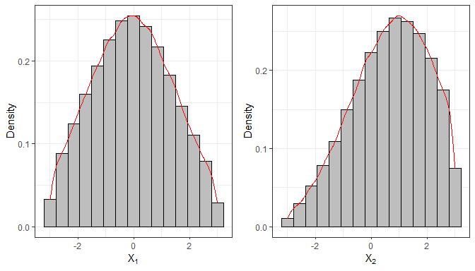
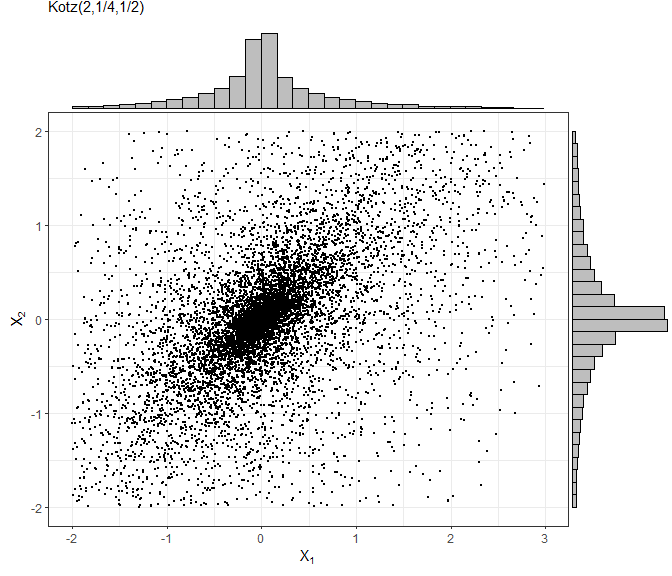
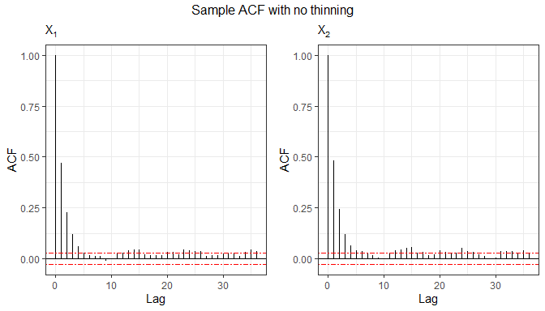
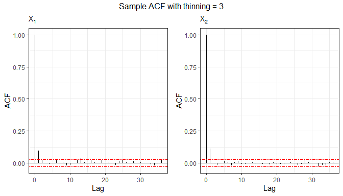

<!-- README.md is generated from README.Rmd. Please edit that file -->

## The `relliptical R` package

The `relliptical R` package provides a function for random number
generation from members of the truncated multivariate elliptical family
of distributions, including truncated versions of the Normal, Student-t,
Pearson type VII, Slash, Logistic, Kotz-type distributions, among
others. The package also allows users to define custom elliptical
distributions by explicitly specifying the density generating function.
In addition, it computes the first- and second-order moments, including
the covariance matrix, for some particular distributions. For more
details, see (Valeriano, Galarza, and Matos 2023).

Next, we describe the main functions available in the package.

## Random number generation

The function `rtelliptical` generates random observations from a
truncated multivariate elliptical distribution with location parameter
`mu`, scale matrix `Sigma`, and lower and upper truncation bounds
specified by `lower` and `upper`, respectively. Sampling is performed
using a Slice Sampling algorithm (Neal 2003) combined with Gibbs
sampling steps (Robert and Casella 2010).

The argument `dist` specifies the truncated elliptical distribution to
be used. The available options are `Normal`, `t`, `PE`, `PVII`, `Slash`,
and `CN`, corresponding to the truncated Normal, Student-t, Power
Exponential, Pearson type VII, Slash, and Contaminated Normal
distributions, respectively.

In the following example, we generate $n = 10^5$ samples from a
truncated bivariate Normal distribution.

``` r
library(relliptical)

# Sampling from the Truncated Normal distribution
set.seed(1234)
mu  = c(0, 1)
Sigma = matrix(c(3,0.6,0.6,3), 2, 2)
lower = c(-3, -3)
upper = c(3, 3)
sample1 = rtelliptical(n=1e5, mu, Sigma, lower, upper, dist="Normal")
head(sample1)
#>            [,1]       [,2]
#> [1,]  0.6643105  2.4005763
#> [2,] -1.3364441 -0.1756624
#> [3,] -0.1814043  1.7013605
#> [4,] -0.6841829  2.4750461
#> [5,]  2.0984490  0.1375868
#> [6,] -1.8796633 -1.2629126

library(ggplot2)
# Histogram and density for variable 1
f1 = ggplot(data.frame(sample1), aes(x=X1)) + 
  geom_histogram(aes(y=..density..), colour="black", fill="grey", bins=15) +
  geom_density(colour="red") + labs(x=bquote(X[1]), y="Density") + theme_bw()

# Histogram and density for variable 2
f2 = ggplot(data.frame(sample1), aes(x=X2)) + 
  geom_histogram(aes(y=..density..), colour="black", fill="grey", bins=15) +
  geom_density(colour="red") + labs(x=bquote(X[2]), y="Density") + theme_bw()

library(gridExtra)
grid.arrange(f1, f2, nrow=1)
#> Warning: The dot-dot notation (`..density..`) was deprecated in ggplot2 3.4.0.
#> ℹ Please use `after_stat(density)` instead.
#> This warning is displayed once every 8 hours.
#> Call `lifecycle::last_lifecycle_warnings()` to see where this warning was
#> generated.
```



This function also allows random number generation from truncated
elliptical distributions not explicitly listed in the `dist` argument,
by providing the density generating function (DGF) through either the
`expr` or `gFun` arguments. The DGF must be a non-negative and strictly
decreasing function on $(0, \infty)$. The simplest approach is to supply
the DGF to the `expr` argument as a character string. The notation used
in `expr` must be compatible with both the `Ryacas` package and the `R`
evaluation environment. For example, for the DGF $g(t)=e^{-t}$, the user
should specify `expr = "exp(-t)"`. The DGF expression must depend only
on the variable $t$; any additional parameters must be provided as fixed
values. When a character expression is supplied via `expr`, the
algorithm attempts to compute a closed-form expression for the inverse
function of $g(t)$. Since such an expression may not always exist, a
warning message is issued whenever the inversion cannot be obtained
analytically.

The following example generates random variates from a truncated
bivariate Logistic distribution, whose DGF is given by
$g(t) = e^{-t}/(1+e^{-t})^2, t \geq 0$, see (Fang, Kotz, and Ng 2018).

``` r
# Sampling from the Truncated Logistic distribution
mu  = c(0, 0)
Sigma = matrix(c(1,0.70,0.70,1), 2, 2)
lower = c(-2, -2)
upper = c(3, 2)
# Sample autocorrelation with no thinning
set.seed(5678)
sample2 = rtelliptical(n=5000, mu, Sigma, lower, upper, expr="exp(-t)/(1+exp(-t))^2")
tail(sample2)
#>               [,1]       [,2]
#> [4995,] -0.1838654  0.1705458
#> [4996,] -0.6290305  0.7899355
#> [4997,] -0.7046777 -0.4168683
#> [4998,]  0.3311000  0.7107361
#> [4999,]  0.7265892  0.8110315
#> [5000,]  0.2588786 -0.2191296
```

If it is not possible to generate random samples by supplying a
character expression to `expr`, the user may instead provide a custom
`R` function via the `gFun` argument. By default, the inverse of this
function is numerically approximated; however, for improved
computational efficiency, the user may optionally supply the inverse
function directly through the `ginvFun` argument. When `gFun` is
provided, the arguments `dist` and `expr` are ignored.

In the following example, we generate samples from a truncated Kotz-type
distribution, whose density generating function is given by

$$g(t) = t^{N-1} e^{-r t^s}, \quad t\geq 0, \quad r>0, \quad s>0, \quad 2N+p>2.$$

As required, this function is strictly decreasing when
$(2-p)/2 < N \leq 1$; see (Fang, Kotz, and Ng 2018).

``` r
# Sampling from the Truncated Kotz-type distribution
set.seed(9876)
mu  = c(0, 0)
Sigma = matrix(c(1,0.70,0.70,1), 2, 2)
lower = c(-2, -2)
upper = c(3, 2)
sample4 = rtelliptical(n=1e4, mu, Sigma, lower, upper, gFun=function(t){ t^(-1/2)*exp(-2*t^(1/4)) })
f1 = ggplot(data.frame(sample4), aes(x=X1, y=X2)) + geom_point(size=0.50) +
     labs(x=expression(X[1]), y=expression(X[2]), subtitle="Kotz(2,1/4,1/2)") +
  theme_bw()

library(ggExtra)
ggMarginal(f1, type="histogram", fill="grey")
```



Since the sampling procedure relies on an MCMC-based algorithm, the
generated observations may exhibit serial correlation. Therefore, it can
be useful to examine autocorrelation function (ACF) plots to assess the
dependence structure of the simulated samples. In the following, we
analyze the sample generated from the bivariate Logistic distribution.

``` r
# Function for plotting the sample autocorrelation using ggplot2
acf.plot = function(samples){
  p = ncol(samples);   n = nrow(samples);   acf1 = list(p)
  for (i in 1:p){
    bacfdf = with(acf(samples[,i], plot=FALSE), data.frame(lag, acf))
    acf1[[i]] = ggplot(data=bacfdf, aes(x=lag,y=acf)) + geom_hline(aes(yintercept=0)) +
      geom_segment(aes(xend=lag, yend=0)) + labs(x="Lag", y="ACF", subtitle=bquote(X[.(i)])) +
      geom_hline(yintercept=c(qnorm(0.975)/sqrt(n),-qnorm(0.975)/sqrt(n)), colour="red", linetype="twodash") + theme_bw()
  }
  return (acf1)
}

grid.arrange(grobs=acf.plot(sample2), top="Sample ACF with no thinning", nrow=1)
```



Autocorrelation can be reduced by specifying the `thinning` argument.
The thinning factor decreases the dependence among sampled values in the
Gibbs sampling process by retaining only every $k$-th iteration of the
Markov chain. Naturally, this value must be an integer greater than or
equal to 1.

``` r
# Sample autocorrelation with thinning = 3
set.seed(8768)
sample3 = rtelliptical(n=5000, mu, Sigma, lower, upper, dist=NULL, expr="exp(1)^(-t)/(1+exp(1)^(-t))^2", 
                       thinning=3)
grid.arrange(grobs=acf.plot(sample3), top="Sample ACF with thinning = 3", nrow=1)
```



## Mean vector and variance-covariance matrix

For this purpose, we use the function `mvtelliptical()`, which computes
the mean vector and variance-covariance matrix for selected truncated
multivariate elliptical distributions. The argument`dist` specifies the
distribution to be used and accepts the same options as before:
`Normal`, `t`, `PE`, `PVII`, `Slash`, and `CN`. Moments for the
truncated components are estimated using a Monte Carlo approach, while
moments for the non-truncated components are obtained by exploiting
properties of conditional expectation.

Next, we compute the moments of a random vector $X$ following a
truncated 3-variate Student-t distribution with $\nu=0.8$ degrees of
freedom. Two scenarios are considered: (i) a case with a single doubly
truncated variable, and (ii) a case with two doubly truncated variables.

``` r
# Truncated Student-t distribution
set.seed(5678)
mu = c(0.1, 0.2, 0.3)
Sigma = matrix(data = c(1,0.2,0.3,0.2,1,0.4,0.3,0.4,1), nrow=length(mu), ncol=length(mu), byrow=TRUE)
# Example 1: considering nu = 0.80 and one doubly truncated variable
a = c(-0.8, -Inf, -Inf)
b = c(0.5, 0.6, Inf)
mvtelliptical(a, b, mu, Sigma, "t", 0.80)
#> $EY
#>             [,1]
#> [1,] -0.11001805
#> [2,] -0.54278399
#> [3,] -0.01119847
#> 
#> $EYY
#>            [,1]       [,2]       [,3]
#> [1,] 0.13761136 0.09694152 0.04317817
#> [2,] 0.09694152        NaN        NaN
#> [3,] 0.04317817        NaN        NaN
#> 
#> $VarY
#>            [,1]       [,2]       [,3]
#> [1,] 0.12550739 0.03722548 0.04194614
#> [2,] 0.03722548        NaN        NaN
#> [3,] 0.04194614        NaN        NaN

# Example 2: considering nu = 0.80 and two doubly truncated variables
a = c(-0.8, -0.70, -Inf)
b = c(0.5, 0.6, Inf)
mvtelliptical(a, b, mu, Sigma, "t", 0.80) # By default n=1e4
#> $EY
#>             [,1]
#> [1,] -0.08566441
#> [2,]  0.01563586
#> [3,]  0.19215627
#> 
#> $EYY
#>             [,1]        [,2]       [,3]
#> [1,] 0.126040187 0.005937196 0.01331868
#> [2,] 0.005937196 0.119761635 0.04700108
#> [3,] 0.013318682 0.047001083 1.14714388
#> 
#> $VarY
#>             [,1]        [,2]       [,3]
#> [1,] 0.118701796 0.007276632 0.02977964
#> [2,] 0.007276632 0.119517155 0.04399655
#> [3,] 0.029779636 0.043996554 1.11021985
```

As observed in the first scenario, some elements of the
variance-covariance matrix are reported as `NaN`. These correspond to
cases in which the associated moments do not exist (note that some
elements of the variance-covariance matrix may exist while others do
not). It is well known that, for an untruncated Student-t distribution,
the second moment exists only when $\nu > 2$. However, as shown by
(Galarza et al. 2022), this condition can be relaxed when an increasing
number of dimensions are subject to finite truncation limits.

It is also worth noting that the Student-t distribution with $\nu > 0$
degrees of freedom is a special case of the Pearson type VII
distribution with parameters $m > p/2$ and $\nu^* > 0$ obtained by
setting $m = (\nu+p)/2$ and $\nu^* = \nu$.

Finally, for comparison purposes, we compute the moments of a truncated
Pearson type VII distribution with parameters $\nu^* = \nu = 0.80$ and
$m = (\nu + 3)/2 = 1.90$, which is equivalent to the Student-t
distribution considered above. As expected, the resulting moments are
nearly identical.

``` r
# Truncated Pearson VII distribution
set.seed(9876)
a = c(-0.8, -0.70, -Inf)
b = c(0.5, 0.6, Inf)
mu = c(0.1, 0.2, 0.3)
Sigma = matrix(data = c(1,0.2,0.3,0.2,1,0.4,0.3,0.4,1), nrow=length(mu), ncol=length(mu), byrow=TRUE)
mvtelliptical(a, b, mu, Sigma, "PVII", c(1.90,0.80), n=1e6) # n=1e6 more precision
#> $EY
#>             [,1]
#> [1,] -0.08558130
#> [2,]  0.01420611
#> [3,]  0.19166895
#> 
#> $EYY
#>             [,1]        [,2]       [,3]
#> [1,] 0.128348258 0.006903655 0.01420704
#> [2,] 0.006903655 0.121364742 0.04749544
#> [3,] 0.014207043 0.047495444 1.15156461
#> 
#> $VarY
#>             [,1]        [,2]       [,3]
#> [1,] 0.121024099 0.008119433 0.03061032
#> [2,] 0.008119433 0.121162929 0.04477257
#> [3,] 0.030610322 0.044772574 1.11482763
```

### References

<div id="refs" class="references csl-bib-body hanging-indent">

<div id="ref-fang2018symmetric" class="csl-entry">

Fang, K. T., S. Kotz, and K. W. Ng. 2018. *Symmetric Multivariate and
Related Distributions*. Chapman; Hall/CRC.

</div>

<div id="ref-galarza2020moments" class="csl-entry">

Galarza, C. E., L. A. Matos, L. M. Castro, and V. H. Lachos. 2022.
“Moments of the Doubly Truncated Selection Elliptical Distributions with
Emphasis on the Unified Multivariate Skew-t Distribution.” *Journal of
Multivariate Analysis* 189: 104944.
<https://doi.org/10.1016/j.jmva.2021.104944>.

</div>

<div id="ref-neal2003slice" class="csl-entry">

Neal, R. M. 2003. “Slice Sampling.” *Annals of Statistics*, 705–41.

</div>

<div id="ref-robert2010introducing" class="csl-entry">

Robert, C. P., and G. Casella. 2010. *Introducing
<span class="nocase">Monte Carlo Methods with R</span>*. Vol. 18. New
York: Springer.

</div>

<div id="ref-valeriano2021moments" class="csl-entry">

Valeriano, Katherine AL, Christian E Galarza, and Larissa A Matos. 2023.
“Moments and Random Number Generation for the Truncated Elliptical
Family of Distributions.” *Statistics and Computing* 33 (1): 32.

</div>

</div>
