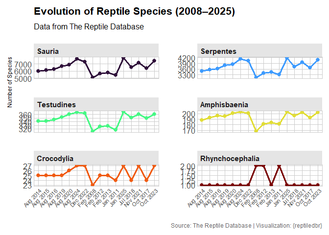
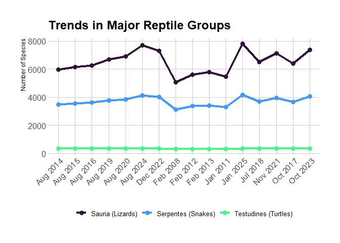

<!-- README.md is generated from README.Rmd. Please edit that file -->

# reptiledbr <a href='https://github.com/PaulESantos/reptiledbr'></a>

<!-- badges: start -->

[](https://lifecycle.r-lib.org/articles/stages.html#experimental)
[](https://CRAN.R-project.org/package=reptiledbr)
[](https://github.com/PaulESantos/reptiledbr/actions/workflows/R-CMD-check.yaml)
[](https://app.codecov.io/gh/PaulESantos/reptiledbr)
[](https://cran.r-project.org/package=reptiledbr)
[](https://cran.r-project.org/package=reptiledbr)
<!-- badges: end -->

## Overview

`reptiledbr` is an R package that provides programmatic access to data
from The Reptile Database, a comprehensive and curated source of
taxonomic information on all living reptiles. This includes snakes,
lizards, turtles, tuataras, amphisbaenians, and crocodiles—over 12,000
species and more than 2,800 subspecies.

The goal of reptiledbr is to facilitate access to reptile taxonomy,
nomenclature, distribution, and associated scientific literature in a
reproducible and efficient way for researchers, ecologists, educators,
and biodiversity data users.

## Installation

You can install the development version of `reptiledbr` from
[GitHub](https://github.com/) with:

``` r
# install.packages("pak")
pak::pak("PaulESantos/reptiledbr")
```

## Features

- Query species by scientific name

- Retrieve synonyms, type localities, and distributions

- Access bibliographic references for species descriptions

- Work online (direct server queries) or offline (local database)

- Fully integrated with the R environment for analysis

## Data Source

The package uses data from The Reptile Database, an open and
community-driven resource curated by herpetologists and volunteers
around the world. It focuses on taxonomic data including:

- Scientific names and synonyms

- Type specimens and distribution

- Original literature references

- The database was initiated by Peter Uetz in 1995 and is currently
  curated by a volunteer team. For more information, visit:
  www.reptile-database.org

> Note: This package is not officially affiliated with The Reptile
> Database. It provides an independent R interface to facilitate access
> to public data.



## Usage

### Online Access

Query data directly from The Reptile Database server:

``` r
library(reptiledbr)
#> Cargando paquete requerido: fuzzyjoin
#> Welcome to reptiledbr (0.0.1)
#> This package provides tools to access and query data from the Reptile Database:
#>   https://reptile-database.reptarium.cz/
#> Type ?reptiledbr to get started or visit the documentation for examples and guidance.
# Get detailed information for a specific species
reptiledb <- reptiledbr::get_reptiledb_data("Anolis carolinensis", quiet = FALSE)
#> Starting search for 1 species...
#> Maximum wait time per request: 10 seconds
#> ------------------------------------------------------------------------
#> Processing: Anolis carolinensis
#> SUCCESS: Data found for Anolis carolinensis
#> ------------------------------------------------------------------------
#> Search summary:
#>  Species found with data: 1
#>  Species not found: 0
#>  Total errors: 0
#> ------------------------------------------------------------------------
# Format the results in a user-friendly way
all_attributes <- reptiledb |> 
  reptiledbr::format_all_attributes()
#> Starting to format all attributes...
#> Attribute formatting successfully completed.

all_attributes$distribution
#> # A tibble: 11 × 4
#>    input_name          genus  species      distribution                         
#>    <chr>               <chr>  <chr>        <chr>                                
#>  1 Anolis carolinensis Anolis carolinensis USA (E Texas, SE Oklahoma, S Arkansa…
#>  2 Anolis carolinensis Anolis carolinensis Bahamas, Grand Cayman Islands (HR 33…
#>  3 Anolis carolinensis Anolis carolinensis Introduced to Hawaii (fide MCKEOWN 1…
#>  4 Anolis carolinensis Anolis carolinensis Introduced to Japan (Chichizima Is. …
#>  5 Anolis carolinensis Anolis carolinensis Introduced to Micronesia and Guam (G…
#>  6 Anolis carolinensis Anolis carolinensis May have been introduced to Tenerife…
#>  7 Anolis carolinensis Anolis carolinensis Introduced to Northern Mariana Islan…
#>  8 Anolis carolinensis Anolis carolinensis Introduced to Mexico (Nuevo León, Lu…
#>  9 Anolis carolinensis Anolis carolinensis Introduced to California fide Hansen…
#> 10 Anolis carolinensis Anolis carolinensis baccatus: Mexico; Type locality: Mex…
#> 11 Anolis carolinensis Anolis carolinensis seminolus: USA (Florida); Type local…
all_attributes$common_names
#> # A tibble: 3 × 4
#>   input_name          genus  species      common_name                           
#>   <chr>               <chr>  <chr>        <chr>                                 
#> 1 Anolis carolinensis Anolis carolinensis E: North American Green Anole, Green …
#> 2 Anolis carolinensis Anolis carolinensis S: Anolis Verde                       
#> 3 Anolis carolinensis Anolis carolinensis G: Rotkehlanolis
```

### Local/Offline Access

Perform taxonomic verification without internet connection:

``` r

library(reptiledbr)

# Define a vector of species names to verify
species_names <- c(
  "Lachesis muta",
  "Python bivittatus",
  "Crotalus atrox",
  "Lachesis mutta"  # Intentional typo
)

# Exact search (strict matching)
reptiledbr::reptiledbr_exact(species_names)
#> # A tibble: 4 × 10
#>      id input_name found species_match order family genus epithet author message
#>   <int> <chr>      <lgl> <chr>         <fct> <fct>  <fct> <fct>   <chr>  <chr>  
#> 1     1 Lachesis … TRUE  Lachesis muta Serp… Viper… Lach… muta    Linna… No sub…
#> 2     2 Python bi… TRUE  Python bivit… Serp… Pytho… Pyth… bivitt… Kuhl … Specie…
#> 3     3 Crotalus … TRUE  Crotalus atr… Serp… Viper… Crot… atrox   Baird… No sub…
#> 4     4 Lachesis … FALSE <NA>          <NA>  <NA>   <NA>  <NA>    <NA>   Specie…

# Partial/fuzzy search (finds matches despite typos)
reptiledbr::reptiledbr_partial(species_names)
#> # A tibble: 4 × 11
#>      id input_name        found species_match  order family genus epithet author
#>   <int> <chr>             <lgl> <chr>          <fct> <fct>  <fct> <fct>   <chr> 
#> 1     1 Lachesis muta     TRUE  Lachesis muta  Serp… Viper… Lach… muta    Linna…
#> 2     2 Python bivittatus TRUE  Python bivitt… Serp… Pytho… Pyth… bivitt… Kuhl …
#> 3     3 Crotalus atrox    TRUE  Crotalus atrox Serp… Viper… Crot… atrox   Baird…
#> 4     4 Lachesis mutta    TRUE  Lachesis muta  Serp… Viper… Lach… muta    Linna…
#> # ℹ 2 more variables: fuzzy_match <lgl>, message <chr>

# Flexible search with additional options
reptiledbr::search_reptiledbr(species_names, use_fuzzy = TRUE)
#> # A tibble: 4 × 12
#>      id input_name found species_match order family genus epithet author message
#>   <int> <chr>      <lgl> <chr>         <fct> <fct>  <fct> <fct>   <chr>  <chr>  
#> 1     1 Lachesis … TRUE  Lachesis muta Serp… Viper… Lach… muta    Linna… No sub…
#> 2     2 Python bi… TRUE  Python bivit… Serp… Pytho… Pyth… bivitt… Kuhl … Specie…
#> 3     3 Crotalus … TRUE  Crotalus atr… Serp… Viper… Crot… atrox   Baird… No sub…
#> 4     4 Lachesis … TRUE  Lachesis muta Serp… Viper… Lach… muta    Linna… No sub…
#> # ℹ 2 more variables: match_type <chr>, fuzzy_match <lgl>

# List subspecies for specific species
reptiledbr::search_reptiledbr(c("Anolis barahonae")) |> 
  reptiledbr::list_subspecies_reptiledbr()
#> # A tibble: 4 × 3
#>   species          subspecies_name               author                
#>   <chr>            <chr>                         <chr>                 
#> 1 Anolis barahonae Anolis barahonae barahonae    Williams 1962         
#> 2 Anolis barahonae Anolis barahonae albocellatus Schwartz 1974         
#> 3 Anolis barahonae Anolis barahonae ininquinatus Cullom & Schwartz 1980
#> 4 Anolis barahonae Anolis barahonae mulitus      Cullom & Schwartz 1980
```

### When to use each approach

- Online access: For retrieving the most up-to-date and complete
  information about specific taxa

- Offline access: For efficiently verifying large taxonomic datasets,
  working without internet connection, or reducing server load

## Citing the Data

Please cite the original Reptile Database if you use this package in
published work:

Uetz, P., Freed, P., & Hošek, J. (eds.) (2021). The Reptile Database.
Retrieved from <http://www.reptile-database.org>

## Contributing

Contributions, bug reports, and feature requests are welcome! Please use
the issue tracker to report problems or suggest improvements.

## License

This package is free and open source software, licensed under the MIT
License. See the LICENSE file for more details.

## Acknowledgments

Special thanks to the editors and contributors of The Reptile Database
for their dedication to herpetological taxonomy and for maintaining an
open-access scientific resource for the global community.
