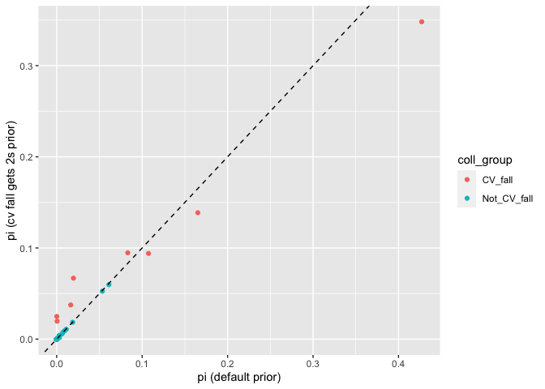
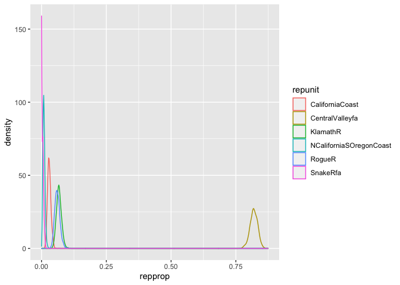
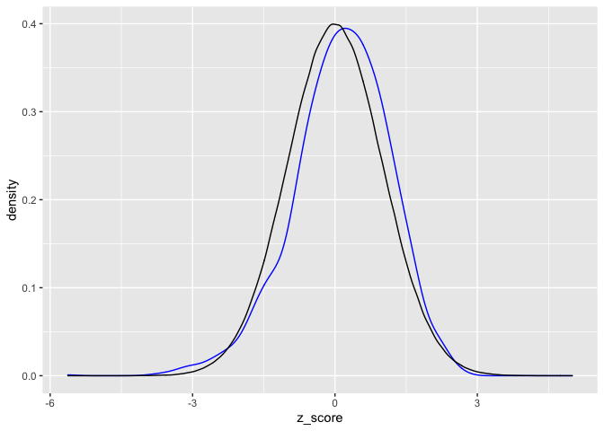
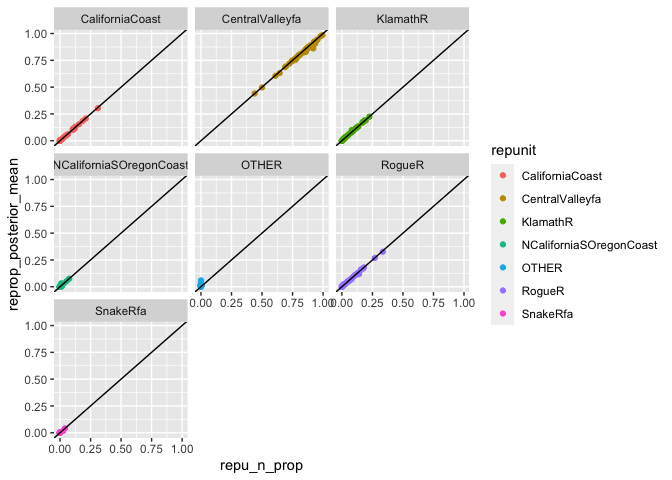
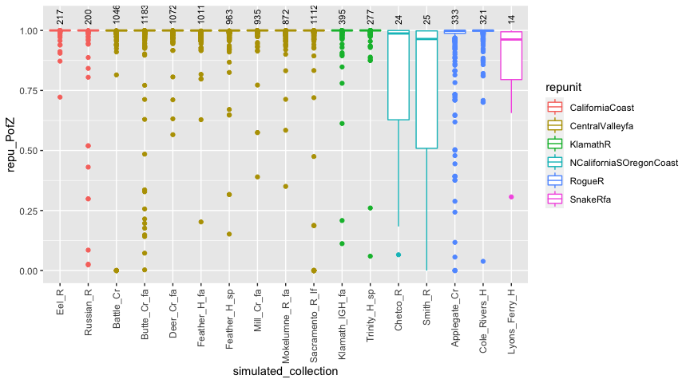
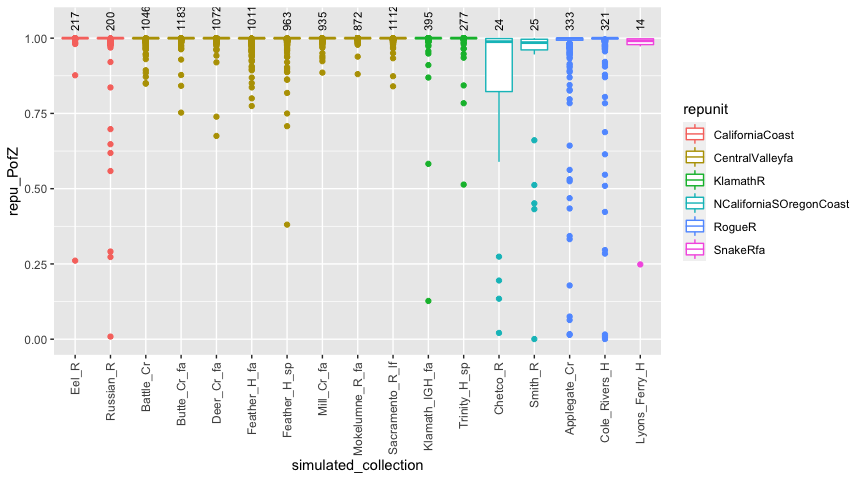

rubias — genetic stock identification (GSI) in the tidyverse
================
15 January, 2021

  - [Input Data](#input-data)
      - [How about haploid markers?](#how-about-haploid-markers)
      - [An example reference data
        file](#an-example-reference-data-file)
      - [An example mixture data file](#an-example-mixture-data-file)
      - [Preliminary good practice — check for duplicate
        individuals](#preliminary-good-practice-check-for-duplicate-individuals)
      - [How about known-origin individuals in the
        mixture?](#how-about-known-origin-individuals-in-the-mixture)
  - [Performing a Genetic Mixture
    Analysis](#performing-a-genetic-mixture-analysis)
      - [Setting the prior for the mixing
        proportions](#setting-the-prior-for-the-mixing-proportions)
      - [Aggregating collections into reporting
        units](#aggregating-collections-into-reporting-units)
      - [Creating posterior density curves from the
        traces](#creating-posterior-density-curves-from-the-traces)
      - [Computing Credible Intervals from the
        Traces](#computing-credible-intervals-from-the-traces)
      - [Assessing whether individuals are not from any of the reference
        populations](#assessing-whether-individuals-are-not-from-any-of-the-reference-populations)
      - [Individuals of known origin in the
        mixture](#individuals-of-known-origin-in-the-mixture)
      - [Fully Bayesian model (with updating of allele
        freqencies)](#fully-bayesian-model-with-updating-of-allele-freqencies)
  - [Assessment of Genetic
    References](#assessment-of-genetic-references)
      - [Self-assigning fish from the
        reference](#self-assigning-fish-from-the-reference)
      - [Simulated mixtures using a leave-one-out type of
        approach](#simulated-mixtures-using-a-leave-one-out-type-of-approach)
      - [Specifying mixture proportions in
        `assess_reference_loo()`](#specifying-mixture-proportions-in-assess_reference_loo)
      - [Retrieving the individual simulated fish
        posteriors](#retrieving-the-individual-simulated-fish-posteriors)
      - [Changing the resampling unit](#changing-the-resampling-unit)
      - [“sub-specifying” collection proportions or dirichlet
        parameters](#sub-specifying-collection-proportions-or-dirichlet-parameters)
      - [Multiple simulation scenarios and “100%
        Simulations”](#multiple-simulation-scenarios-and-100-simulations)
          - [Do it again with 100%
            collections](#do-it-again-with-100-collections)
  - [Bootstrap-Corrected Reporting Unit
    Proportions](#bootstrap-corrected-reporting-unit-proportions)
  - [References](#references)

<!-- README.md is generated from README.Rmd. Please edit that file -->

<!-- badges: start -->

[](https://CRAN.R-project.org/package=rubias)
<!-- badges: end -->

This is an R package for performing genetic stock identification (GSI)
and associated tasks. Additionally, it includes a method designed to
diagnose and correct a bias recently documented in genetic stock
identification. The bias occurs when mixture proportion estimates are
desired for groups of populations (reporting units) and the number of
populations within each reporting unit are uneven.

In order to run C++ implementations of MCMC, rubias requires the package
Rcpp (and now, also, RcppParallel for the baseline resampling option),
which in turn requires an Rtools installation (if you are on Windows) or
XCode (if you are on a Mac). After cloning into the repository with the
above dependencies installed, build & reload the package to view further
documentation.

The script “/R-main/coalescent\_sim” was used to generate coalescent
simulations for bias correction validation. This is unnecessary for
testing the applicability of our methods to any particular dataset,
which should be done using `assess_reference_loo()` and
`assess_pb_bias_correction()`. `coalescent_sim()` creates simulated
populations using the `ms` coalescent simulation program, available from
the Hudson lab at UChicago, and the `GSImulator` and `ms2geno` packages,
available at <https://github.com/eriqande>, and so requires more
dependencies than the rest of the package.

# Input Data

The functions for conducting genetic mixture analysis and for doing
simulation assessment to predict the accuracy of a set of genetic
markers for genetic stock identification require that genetic data be
input as a data frame in a specific format:

  - one row per individual
  - each locus is represented by two adjacent columns, one for each
    allele (this package is only configured for diploids, at the
    moment). Allelic types can be expressed as any number or character
  - missing data at a locus is expressed with NA values for each gene
    copy at the locus
  - if one gene copy is missing from a locus in an indivividual, then
    both gene copies must be missing at the locus.
  - the name of the locus is taken to be the column name of the *first*
    column of each pair of locus columns. The header on the second
    column is ignored.
  - the data frame must have four columns of meta data for each
    individual:
      - `sample_type`: a column telling whether the sample is a
        `reference` sample or a `mixture` sample.
      - `repunit`: the reporting unit that an individual/collection
        belongs to. This is required if sample\_type is `reference`. And
        if sample\_type is `mixture` then repunit must be `NA`.  
        This must be a character vector. Not a factor. The idea of a
        “reporting unit” is well-known amongst people doing genetic
        stock identfication of salmon, but might not be familiar
        elsewhere. Briefly, a reporting unit is a group of populations
        (which we call “collections”) that are typically closely related
        genetically, and which will likely be aggregrated in the results
        of the GSI exercise.
      - `collection`: for reference samples, the name of the population
        that the individual is from. For mixture samples, this is the
        name of the particular sample (i.e. stratum or port that is to
        be treated together in space and time). This must be a
        character, not a factor.
      - `indiv` a character vector with the ID of the fish. These must
        be unique.
  - When we started developing `rubias`, we intended to allow both the
    `repunit` and the `collection` columns to be either character
    vectors or factors. Having them as factors might be desirable if,
    for example, a certain sort order of the collections or repunits was
    desired. *However* at some point it became clear to Eric that, given
    our approach to converting all the data to a C++ data structure of
    integers, for rapid analyis, we would be exposing ourselves to
    greater opportunities for bugginess by allowing `repunit` and
    `collection` to be factors. Accordingly, they **must** be character
    vectors. If they are not, `rubias` will throw an error. **Note**: if
    you do have a specific sort order for your collections or repunits,
    you can always change them into factors after analysis with
    `rubias`. Additionally, you can keep extra columns in your original
    data frame (for example `repunit_f` or `collection_f`) in which the
    repunits or the collections are stored as factors. See, for example
    the data file `alewife`. Or you can just keep a character vector
    that has the sort order you would like, so as to use it when
    changing things to factors after `rubias` analysis. (See, for
    instance, `chinook_repunit_levels`.)
  - The file can have any number of other meta data columns; however,
    *they must all occur in the data frame **before** the columns of
    genetic data*.
  - When you pass a data frame into any of these functions, you have to
    tell it which column the genetic data starts in, and it is assumed
    that all the columns after that one contain genetic data.
  - If you are doing a mixture analysis, the data frame of mixture fish
    and of the reference fish must have the same column structure, i.e.,
    they must have exactly the same number of columns with exactly the
    same column names, in the same order and of the same type.

## How about haploid markers?

At the request of the good folks at ADFG, I introduced a few hacks to
allow the input to include markers that are haploid (for example mtDNA
haplotypes). To denote a marker as haploid you *still give it two
columns of data* in your data frame, but the second column of the
haploid marker must be entirely NAs. When `rubias` is processing the
data and it sees this, it assumes that the marker is haploid and it
treats it appropriately.

Note that if you have a diploid marker it typically does not make sense
to mark one of the gene copies as missing and the other as non-missing.
Accordingly, if you have a diploid marker that records just one of the
gene copies as missing in any individual, it is going to throw an error.
Likewise, if your haploid marker does not have every single individual
with and NA at the second gene copy, then it’s also going to throw an
error.

## An example reference data file

Here are the meta data columns and the first two loci for eight
individuals in the `chinook` reference data set that comes with the
package:

``` r
library(tidyverse)  # load up the tidyverse library, we will use it later...
#> ── Attaching packages ─────────────────────────────────────── tidyverse 1.3.0 ──
#> ✓ ggplot2 3.3.2     ✓ purrr   0.3.4
#> ✓ tibble  3.0.4     ✓ dplyr   1.0.2
#> ✓ tidyr   1.1.2     ✓ stringr 1.4.0
#> ✓ readr   1.4.0     ✓ forcats 0.5.0
#> ── Conflicts ────────────────────────────────────────── tidyverse_conflicts() ──
#> x dplyr::filter() masks stats::filter()
#> x dplyr::lag()    masks stats::lag()
library(rubias)
head(chinook[, 1:8])
#> # A tibble: 6 x 8
#>   sample_type repunit collection indiv Ots_94857.232 Ots_94857.232.1
#>   <chr>       <chr>   <chr>      <chr>         <int>           <int>
#> 1 reference   Centra… Feather_H… Feat…             2               2
#> 2 reference   Centra… Feather_H… Feat…             2               4
#> 3 reference   Centra… Feather_H… Feat…             2               4
#> 4 reference   Centra… Feather_H… Feat…             2               4
#> 5 reference   Centra… Feather_H… Feat…             2               2
#> 6 reference   Centra… Feather_H… Feat…             2               4
#> # … with 2 more variables: Ots_102213.210 <int>, Ots_102213.210.1 <int>
```

## An example mixture data file

Here is the same for the mixture data frame that goes along with that
reference data set:

``` r
head(chinook_mix[, 1:8])
#> # A tibble: 6 x 8
#>   sample_type repunit collection indiv Ots_94857.232 Ots_94857.232.1
#>   <chr>       <chr>   <chr>      <chr>         <int>           <int>
#> 1 mixture     <NA>    rec2       T124…             4               2
#> 2 mixture     <NA>    rec2       T124…             4               2
#> 3 mixture     <NA>    rec2       T124…             4               4
#> 4 mixture     <NA>    rec1       T124…             4               4
#> 5 mixture     <NA>    rec1       T124…             2               2
#> 6 mixture     <NA>    rec1       T124…             4               2
#> # … with 2 more variables: Ots_102213.210 <int>, Ots_102213.210.1 <int>
```

## Preliminary good practice — check for duplicate individuals

Sometimes, for a variety of reasons, an individual’s genotype might
appear more than once in a data set. `rubias` has a quick and dirty
function to spot pairs of individuals that share a large number of
genotypes. Clearly you only want to look at pairs that don’t have a
whole lot of missing data, so one parameter is the fraction of loci that
are non-missing in either fish. In our experience with Fluidigm assays,
if a fish is missing at \> 10% of the SNPs, the remaining genotypes are
likely to have a fairly high error rate. So, to look for matching
samples, let’s require 85% of the genotypes to be non-missing in both
members of the pair. The last parameter is the fraction of non-missing
loci at which the pair has the same genotype. We will set that to 0.94
first. Here we see it in action:

``` r
# combine chinook and chinook_mix into one big data frame,
# but drop the California_Coho collection because Coho all
# have pretty much the same genotype at these loci!
chinook_all <- bind_rows(chinook, chinook_mix) %>%
  filter(collection != "California_Coho")

# then toss them into a function.  This takes half a minute or so...
matchy_pairs <- close_matching_samples(D = chinook_all, 
                                       gen_start_col = 5, 
                                       min_frac_non_miss = 0.85, 
                                       min_frac_matching = 0.94
                                       )
#> Summary Statistics:
#> 
#> 9510 Individuals in Sample
#> 
#> 91 Loci: AldB1.122, AldoB4.183, OTNAML12_1.SNP1, Ots_100884.287, Ots_101119.381, Ots_101704.143, Ots_102213.210, Ots_102414.395, Ots_102420.494, Ots_102457.132, Ots_102801.308, Ots_102867.609, Ots_103041.52, Ots_104063.132, Ots_104569.86, Ots_105105.613, Ots_105132.200, Ots_105401.325, Ots_105407.117, Ots_106499.70, Ots_106747.239, Ots_107074.284, Ots_107285.93, Ots_107806.821, Ots_108007.208, Ots_108390.329, Ots_108735.302, Ots_109693.392, Ots_110064.383, Ots_110201.363, Ots_110495.380, Ots_110551.64, Ots_111312.435, Ots_111666.408, Ots_111681.657, Ots_112301.43, Ots_112419.131, Ots_112820.284, Ots_112876.371, Ots_113242.216, Ots_113457.40, Ots_117043.255, Ots_117242.136, Ots_117432.409, Ots_118175.479, Ots_118205.61, Ots_118938.325, Ots_122414.56, Ots_123048.521, Ots_123921.111, Ots_124774.477, Ots_127236.62, Ots_128302.57, Ots_128693.461, Ots_128757.61, Ots_129144.472, Ots_129170.683, Ots_129458.451, Ots_130720.99, Ots_131460.584, Ots_131906.141, Ots_94857.232, Ots_96222.525, Ots_96500.180, Ots_97077.179, Ots_99550.204, Ots_ARNT.195, Ots_AsnRS.60, Ots_aspat.196, Ots_CD59.2, Ots_CD63, Ots_EP.529, Ots_GDH.81x, Ots_HSP90B.385, Ots_MHC1, Ots_mybp.85, Ots_myoD.364, Ots_Ots311.101x, Ots_PGK.54, Ots_Prl2, Ots_RFC2.558, Ots_SClkF2R2.135, Ots_SWS1op.182, Ots_TAPBP, Ots_u07.07.161, Ots_u07.49.290, Ots_u4.92, OTSBMP.2.SNP1, OTSTF1.SNP1, S71.336, unk_526
#> 
#> 39 Reporting Units: CentralValleyfa, CentralValleysp, CentralValleywi, CaliforniaCoast, KlamathR, NCaliforniaSOregonCoast, RogueR, MidOregonCoast, NOregonCoast, WillametteR, DeschutesRfa, LColumbiaRfa, LColumbiaRsp, MidColumbiaRtule, UColumbiaRsufa, MidandUpperColumbiaRsp, SnakeRfa, SnakeRspsu, NPugetSound, WashingtonCoast, SPugetSound, LFraserR, LThompsonR, EVancouverIs, WVancouverIs, MSkeenaR, MidSkeenaR, LSkeenaR, SSEAlaska, NGulfCoastAlsekR, NGulfCoastKarlukR, TakuR, NSEAlaskaChilkatR, NGulfCoastSitukR, CopperR, SusitnaR, LKuskokwimBristolBay, MidYukon
#> 
#> 68 Collections: Feather_H_sp, Butte_Cr_Sp, Mill_Cr_sp, Deer_Cr_sp, UpperSacramento_R_sp, Feather_H_fa, Butte_Cr_fa, Mill_Cr_fa, Deer_Cr_fa, Mokelumne_R_fa, Battle_Cr, Sacramento_R_lf, Sacramento_H, Eel_R, Russian_R, Klamath_IGH_fa, Trinity_H_sp, Smith_R, Chetco_R, Cole_Rivers_H, Applegate_Cr, Coquille_R, Umpqua_sp, Nestucca_H, Siuslaw_R, Alsea_R, Nehalem_R, Siletz_R, N_Santiam_H, McKenzie_H, L_Deschutes_R, Cowlitz_H_fa, Cowlitz_H_sp, Kalama_H_sp, Spring_Cr_H, Hanford_Reach, PriestRapids_H, Wells_H, Wenatchee_R, CleElum, Lyons_Ferry_H, Rapid_R_H, McCall_H, Kendall_H_sp, Forks_Cr_H, Soos_H, Marblemount_H_sp, QuinaltLake_f, Harris_R, Birkenhead_H, Spius_H, Big_Qual_H, Robertson_H, Morice_R, Kitwanga_R, L_Kalum_R, LPW_Unuk_R, Goat_Cr, Karluk_R, LittleTatsamenie, Tahini_R, Situk_R, Sinona_Ck, Montana_Ck, George_R, Kanektok_R, Togiak_R, Kantishna_R
#> 
#> 3.85% of allelic data identified as missing

# see that that looks like:
matchy_pairs %>%
  arrange(desc(num_non_miss), desc(num_match))
#> # A tibble: 33 x 10
#>    num_non_miss num_match indiv_1 indiv_2 collection_1 collection_2
#>           <int>     <int> <chr>   <chr>   <chr>        <chr>       
#>  1           91        91 T124864 T124866 rec3         rec1        
#>  2           91        91 T124864 T125335 rec3         rec3        
#>  3           91        91 T124866 T125335 rec1         rec3        
#>  4           91        91 T126402 T126403 rec2         rec2        
#>  5           91        90 Mill_C… Mill_C… Mill_Cr_sp   Mill_Cr_sp  
#>  6           91        90 Cole_R… Cole_R… Cole_Rivers… Cole_Rivers…
#>  7           91        90 Cole_R… Cole_R… Cole_Rivers… Cole_Rivers…
#>  8           91        90 Umpqua… Umpqua… Umpqua_sp    Umpqua_sp   
#>  9           91        90 Umpqua… Umpqua… Umpqua_sp    Umpqua_sp   
#> 10           91        90 T125044 T125337 rec2         rec1        
#> # … with 23 more rows, and 4 more variables: sample_type_1 <chr>,
#> #   repunit_1 <chr>, sample_type_2 <chr>, repunit_2 <chr>
```

Check that out. This reveals 33 pairs in the data set that are likely
duplicate samples.

If we reduce the min\_frac\_matching, we get more matches, but these are
very unlikely to be the same individual, unless genotyping error rates
are very high.

``` r
# then toss them into a function.  This takes half a minute or so...
matchy_pairs2 <- close_matching_samples(D = chinook_all, 
                                       gen_start_col = 5, 
                                       min_frac_non_miss = 0.85, 
                                       min_frac_matching = 0.85
                                       )
#> Summary Statistics:
#> 
#> 9510 Individuals in Sample
#> 
#> 91 Loci: AldB1.122, AldoB4.183, OTNAML12_1.SNP1, Ots_100884.287, Ots_101119.381, Ots_101704.143, Ots_102213.210, Ots_102414.395, Ots_102420.494, Ots_102457.132, Ots_102801.308, Ots_102867.609, Ots_103041.52, Ots_104063.132, Ots_104569.86, Ots_105105.613, Ots_105132.200, Ots_105401.325, Ots_105407.117, Ots_106499.70, Ots_106747.239, Ots_107074.284, Ots_107285.93, Ots_107806.821, Ots_108007.208, Ots_108390.329, Ots_108735.302, Ots_109693.392, Ots_110064.383, Ots_110201.363, Ots_110495.380, Ots_110551.64, Ots_111312.435, Ots_111666.408, Ots_111681.657, Ots_112301.43, Ots_112419.131, Ots_112820.284, Ots_112876.371, Ots_113242.216, Ots_113457.40, Ots_117043.255, Ots_117242.136, Ots_117432.409, Ots_118175.479, Ots_118205.61, Ots_118938.325, Ots_122414.56, Ots_123048.521, Ots_123921.111, Ots_124774.477, Ots_127236.62, Ots_128302.57, Ots_128693.461, Ots_128757.61, Ots_129144.472, Ots_129170.683, Ots_129458.451, Ots_130720.99, Ots_131460.584, Ots_131906.141, Ots_94857.232, Ots_96222.525, Ots_96500.180, Ots_97077.179, Ots_99550.204, Ots_ARNT.195, Ots_AsnRS.60, Ots_aspat.196, Ots_CD59.2, Ots_CD63, Ots_EP.529, Ots_GDH.81x, Ots_HSP90B.385, Ots_MHC1, Ots_mybp.85, Ots_myoD.364, Ots_Ots311.101x, Ots_PGK.54, Ots_Prl2, Ots_RFC2.558, Ots_SClkF2R2.135, Ots_SWS1op.182, Ots_TAPBP, Ots_u07.07.161, Ots_u07.49.290, Ots_u4.92, OTSBMP.2.SNP1, OTSTF1.SNP1, S71.336, unk_526
#> 
#> 39 Reporting Units: CentralValleyfa, CentralValleysp, CentralValleywi, CaliforniaCoast, KlamathR, NCaliforniaSOregonCoast, RogueR, MidOregonCoast, NOregonCoast, WillametteR, DeschutesRfa, LColumbiaRfa, LColumbiaRsp, MidColumbiaRtule, UColumbiaRsufa, MidandUpperColumbiaRsp, SnakeRfa, SnakeRspsu, NPugetSound, WashingtonCoast, SPugetSound, LFraserR, LThompsonR, EVancouverIs, WVancouverIs, MSkeenaR, MidSkeenaR, LSkeenaR, SSEAlaska, NGulfCoastAlsekR, NGulfCoastKarlukR, TakuR, NSEAlaskaChilkatR, NGulfCoastSitukR, CopperR, SusitnaR, LKuskokwimBristolBay, MidYukon
#> 
#> 68 Collections: Feather_H_sp, Butte_Cr_Sp, Mill_Cr_sp, Deer_Cr_sp, UpperSacramento_R_sp, Feather_H_fa, Butte_Cr_fa, Mill_Cr_fa, Deer_Cr_fa, Mokelumne_R_fa, Battle_Cr, Sacramento_R_lf, Sacramento_H, Eel_R, Russian_R, Klamath_IGH_fa, Trinity_H_sp, Smith_R, Chetco_R, Cole_Rivers_H, Applegate_Cr, Coquille_R, Umpqua_sp, Nestucca_H, Siuslaw_R, Alsea_R, Nehalem_R, Siletz_R, N_Santiam_H, McKenzie_H, L_Deschutes_R, Cowlitz_H_fa, Cowlitz_H_sp, Kalama_H_sp, Spring_Cr_H, Hanford_Reach, PriestRapids_H, Wells_H, Wenatchee_R, CleElum, Lyons_Ferry_H, Rapid_R_H, McCall_H, Kendall_H_sp, Forks_Cr_H, Soos_H, Marblemount_H_sp, QuinaltLake_f, Harris_R, Birkenhead_H, Spius_H, Big_Qual_H, Robertson_H, Morice_R, Kitwanga_R, L_Kalum_R, LPW_Unuk_R, Goat_Cr, Karluk_R, LittleTatsamenie, Tahini_R, Situk_R, Sinona_Ck, Montana_Ck, George_R, Kanektok_R, Togiak_R, Kantishna_R
#> 
#> 3.85% of allelic data identified as missing

# see that that looks like:
matchy_pairs2 %>%
  arrange(desc(num_non_miss), desc(num_match))
#> # A tibble: 46 x 10
#>    num_non_miss num_match indiv_1 indiv_2 collection_1 collection_2
#>           <int>     <int> <chr>   <chr>   <chr>        <chr>       
#>  1           91        91 T124864 T124866 rec3         rec1        
#>  2           91        91 T124864 T125335 rec3         rec3        
#>  3           91        91 T124866 T125335 rec1         rec3        
#>  4           91        91 T126402 T126403 rec2         rec2        
#>  5           91        90 Mill_C… Mill_C… Mill_Cr_sp   Mill_Cr_sp  
#>  6           91        90 Cole_R… Cole_R… Cole_Rivers… Cole_Rivers…
#>  7           91        90 Cole_R… Cole_R… Cole_Rivers… Cole_Rivers…
#>  8           91        90 Umpqua… Umpqua… Umpqua_sp    Umpqua_sp   
#>  9           91        90 Umpqua… Umpqua… Umpqua_sp    Umpqua_sp   
#> 10           91        90 T125044 T125337 rec2         rec1        
#> # … with 36 more rows, and 4 more variables: sample_type_1 <chr>,
#> #   repunit_1 <chr>, sample_type_2 <chr>, repunit_2 <chr>
```

A more principled approach would be to use the allele frequencies in
each collection and take a likelihood based approach, but this is
adequate for finding obvious duplicates.

## How about known-origin individuals in the mixture?

In some cases, you might know (more or less unambiguously) the origin of
some fish in a particular mixture sample. For example, if 10% of the
individuals in a mixture carried coded wire tags, then you would want to
include them in the sample, but make sure that their collections of
origin were hard-coded to be what the CWTs said. Another scenario in
which this might occur is when the genetic data were used for
parentage-based tagging of the individuals in the mixture sample. In
that case, some individuals might be placed with very high confidence to
parents. Then, they should be included in the mixture as having come
from a known collection. The folks at the DFO in Nanaimo, Canada are
doing an amazing job with PBT and wondered if rubias could be modified
to deal with the latter situation.

We’ve made some small additions to accommodate this. rubias does not do
any actual inference of parentage, but if you know the origin of some
fish in the mixture, that can be included in the rubias analysis. The
way you do this with the function `infer_mixture()` is to include a
column called `known_collection` in both the reference data frame and
the mixture data frame. In the reference data frame, `known_collection`
should just be a copy of the `collection` column. However, in the
mixture data frame each entry in `known_collection` should be the
collection that the individual is known to be from (i.e. using parentage
inference or a CWT), or, if the individual is not known to be from any
collection, it should be NA. Note that the names of the collections in
`known_collection` must match those found in the `collection` column in
the reference data set.

These modifications are not allowed for the parametric bootstrap (PB)
method in `infer_mixture()`.

# Performing a Genetic Mixture Analysis

This is done with the `infer_mixture` function. In the example data
`chinook_mix` our data consist of fish caught in three different
fisheries, `rec1`, `rec2`, and `rec3` as denoted in the collection
column. Each of those collections is treated as a separate sample,
getting its own mixing proportion estimate. This is how it is run with
the default options:

``` r
mix_est <- infer_mixture(reference = chinook, 
                         mixture = chinook_mix, 
                         gen_start_col = 5)
#> Collating data; compiling reference allele frequencies, etc.   time: 1.64 seconds
#> Computing reference locus specific means and variances for computing mixture z-scores   time: 0.24 seconds
#> Working on mixture collection: rec2 with 772 individuals
#>   calculating log-likelihoods of the mixture individuals.   time: 0.12 seconds
#>   performing 2000 total sweeps, 100 of which are burn-in and will not be used in computing averages in method "MCMC"   time: 0.63 seconds
#>   tidying output into a tibble.   time: 0.25 seconds
#> Working on mixture collection: rec1 with 743 individuals
#>   calculating log-likelihoods of the mixture individuals.   time: 0.11 seconds
#>   performing 2000 total sweeps, 100 of which are burn-in and will not be used in computing averages in method "MCMC"   time: 0.61 seconds
#>   tidying output into a tibble.   time: 0.26 seconds
#> Working on mixture collection: rec3 with 741 individuals
#>   calculating log-likelihoods of the mixture individuals.   time: 0.11 seconds
#>   performing 2000 total sweeps, 100 of which are burn-in and will not be used in computing averages in method "MCMC"   time: 0.60 seconds
#>   tidying output into a tibble.   time: 0.29 seconds
```

The result comes back as a list of four tidy data frames:

1.  `mixing_proportions`: the mixing proportions. The column `pi` holds
    the estimated mixing proportion for each collection.
2.  `indiv_posteriors`: this holds, for each individual, the posterior
    means of group membership in each collection. Column `PofZ` holds
    those values. Column `log_likelihood` holds the log of the
    probability of the individuals genotype given it is from the
    collection. Also included are `n_non_miss_loci` and `n_miss_loci`
    which are the number of observed loci and the number of missing loci
    at the individual. A list column `missing_loci` contains vectors
    with the indices (and the names) of the loci that are missing in
    that individual. It also includes a column `z_score` which can be
    used to diagnose fish that don’t belong to any samples in the
    reference data base (see below).
3.  `mix_prop_traces:` MCMC traces of the mixing proportions for each
    collection. You will use these if you want to make density estimates
    of the posterior distribution of the mixing proportions or if you
    want to compute credible intervals.
4.  `bootstrapped_proportions`: This is NULL in the above example, but
    if we had chosen `method = "PB"` then this would be a tibble of
    bootstrap-corrected reporting unit mixing proportions.

These data frames look like this:

``` r
lapply(mix_est, head)
#> $mixing_proportions
#> # A tibble: 6 x 4
#>   mixture_collection repunit         collection                  pi
#>   <chr>              <chr>           <chr>                    <dbl>
#> 1 rec2               CentralValleyfa Feather_H_sp         0.0781   
#> 2 rec2               CentralValleysp Butte_Cr_Sp          0.0000448
#> 3 rec2               CentralValleysp Mill_Cr_sp           0.0000457
#> 4 rec2               CentralValleysp Deer_Cr_sp           0.0000509
#> 5 rec2               CentralValleysp UpperSacramento_R_sp 0.000310 
#> 6 rec2               CentralValleyfa Feather_H_fa         0.153    
#> 
#> $indiv_posteriors
#> # A tibble: 6 x 10
#>   mixture_collect… indiv repunit collection     PofZ log_likelihood z_score
#>   <chr>            <chr> <chr>   <chr>         <dbl>          <dbl>   <dbl>
#> 1 rec2             T124… Centra… Feather_H… 1.80e-28          -137.   -13.1
#> 2 rec2             T124… Centra… Feather_H… 1.01e-27          -136.   -12.6
#> 3 rec2             T124… Centra… Butte_Cr_… 1.57e-24          -130.   -10.5
#> 4 rec2             T124… Centra… Mill_Cr_fa 6.76e-30          -135.   -11.8
#> 5 rec2             T124… Centra… Deer_Cr_fa 1.49e-28          -134.   -11.6
#> 6 rec2             T124… Centra… Mokelumne… 1.91e-27          -134.   -12.3
#> # … with 3 more variables: n_non_miss_loci <int>, n_miss_loci <int>,
#> #   missing_loci <list>
#> 
#> $mix_prop_traces
#> # A tibble: 6 x 5
#>   mixture_collection sweep repunit         collection               pi
#>   <chr>              <int> <chr>           <chr>                 <dbl>
#> 1 rec2                   0 CentralValleyfa Feather_H_sp         0.0145
#> 2 rec2                   0 CentralValleysp Butte_Cr_Sp          0.0145
#> 3 rec2                   0 CentralValleysp Mill_Cr_sp           0.0145
#> 4 rec2                   0 CentralValleysp Deer_Cr_sp           0.0145
#> 5 rec2                   0 CentralValleysp UpperSacramento_R_sp 0.0145
#> 6 rec2                   0 CentralValleyfa Feather_H_fa         0.0145
#> 
#> $bootstrapped_proportions
#> # A tibble: 0 x 0
```

## Setting the prior for the mixing proportions

In some cases there might be a reason to explicitly set the parameters
of the Dirichlet prior on the mixing proportions of the collections. For
a contrived example, we could imagine that we wanted a Dirichlet prior
with all parameters equal to 1/(\# of collections), except for the
parameters for all the Central Valley Fall Run populations, to which we
would like to assign Dirichlet parameters of 2. That can be accomplished
with the `pi_prior` argument to the `infer_mixture()` function, which
will let you pass in a tibble in which one column named “collection”
gives the collection, and the other column, named “pi\_param” gives the
desired parameter.

Here we construct that kind of input:

``` r
prior_tibble <- chinook %>%
  count(repunit, collection) %>%
  filter(repunit == "CentralValleyfa") %>%
  select(collection) %>%
  mutate(pi_param = 2)

# see what it looks like:
prior_tibble
#> # A tibble: 8 x 2
#>   collection      pi_param
#>   <chr>              <dbl>
#> 1 Battle_Cr              2
#> 2 Butte_Cr_fa            2
#> 3 Deer_Cr_fa             2
#> 4 Feather_H_fa           2
#> 5 Feather_H_sp           2
#> 6 Mill_Cr_fa             2
#> 7 Mokelumne_R_fa         2
#> 8 Sacramento_R_lf        2
```

Then we can run that in infer\_mixture():

``` r
set.seed(12)
mix_est_with_prior <- infer_mixture(reference = chinook, 
                         mixture = chinook_mix, 
                         gen_start_col = 5,
                         pi_prior = prior_tibble)
#> Collating data; compiling reference allele frequencies, etc.   time: 1.56 seconds
#> Computing reference locus specific means and variances for computing mixture z-scores   time: 0.24 seconds
#> Working on mixture collection: rec2 with 772 individuals
#> Joining, by = "collection"
#>   calculating log-likelihoods of the mixture individuals.   time: 0.12 seconds
#>   performing 2000 total sweeps, 100 of which are burn-in and will not be used in computing averages in method "MCMC"   time: 0.62 seconds
#>   tidying output into a tibble.   time: 0.25 seconds
#> Working on mixture collection: rec1 with 743 individuals
#> Joining, by = "collection"
#>   calculating log-likelihoods of the mixture individuals.   time: 0.11 seconds
#>   performing 2000 total sweeps, 100 of which are burn-in and will not be used in computing averages in method "MCMC"   time: 0.61 seconds
#>   tidying output into a tibble.   time: 0.27 seconds
#> Working on mixture collection: rec3 with 741 individuals
#> Joining, by = "collection"
#>   calculating log-likelihoods of the mixture individuals.   time: 0.11 seconds
#>   performing 2000 total sweeps, 100 of which are burn-in and will not be used in computing averages in method "MCMC"   time: 0.59 seconds
#>   tidying output into a tibble.   time: 0.28 seconds
```

and now, for fun, we can compare the results for the mixing proportions
of different collections there with and without the prior for the
mixture collection rec1:

``` r
comp_mix_ests <- list(
  `pi (default prior)` = mix_est$mixing_proportions,
  `pi (cv fall gets 2s prior)` = mix_est_with_prior$mixing_proportions
) %>%
  bind_rows(.id = "prior_type") %>%
  filter(mixture_collection == "rec1") %>%
  select(prior_type, repunit, collection, pi) %>%
  spread(prior_type, pi) %>%
  mutate(coll_group = ifelse(repunit == "CentralValleyfa", "CV_fall", "Not_CV_fall"))

ggplot(comp_mix_ests, 
       aes(x = `pi (default prior)`, 
           y = `pi (cv fall gets 2s prior)`,
           colour = coll_group
           )) +
  geom_point() +
  geom_abline(slope = 1, intercept = 0, linetype = "dashed")
```

<!-- -->

Yep, slightly different than before. Let’s look at the sums of
everything:

``` r
comp_mix_ests %>% 
  group_by(coll_group) %>% 
  summarise(with_explicit_prior = sum(`pi (cv fall gets 2s prior)`), 
            with_default_prior = sum(`pi (default prior)`))
#> `summarise()` ungrouping output (override with `.groups` argument)
#> # A tibble: 2 x 3
#>   coll_group  with_explicit_prior with_default_prior
#>   <chr>                     <dbl>              <dbl>
#> 1 CV_fall                   0.824              0.819
#> 2 Not_CV_fall               0.176              0.181
```

We see that for the most part this change to the prior changed the
distribution of fish into different collections within the Central
Valley Fall reporting unit. This is not suprising—it is very hard to
tell apart fish from those different collections. However, it did not
greatly change the estimated proportion of the whole reporting unit.
This also turns out to make sense if you consider the effect that the
extra weight in the prior will have.

## Aggregating collections into reporting units

This is a simple operation in the
[tidyverse](https://www.tidyverse.org/):

``` r

# for mixing proportions
rep_mix_ests <- mix_est$mixing_proportions %>%
  group_by(mixture_collection, repunit) %>%
  summarise(repprop = sum(pi))  # adding mixing proportions over collections in the repunit
#> `summarise()` regrouping output by 'mixture_collection' (override with `.groups` argument)

# for individuals posteriors
rep_indiv_ests <- mix_est$indiv_posteriors %>%
  group_by(mixture_collection, indiv, repunit) %>%
  summarise(rep_pofz = sum(PofZ))
#> `summarise()` regrouping output by 'mixture_collection', 'indiv' (override with `.groups` argument)
```

## Creating posterior density curves from the traces

The full MCMC output for the mixing proportions is available by default
in the field `$mix_prop_traces`. This can be used to obtain an estimate
of the posterior density of the mixing proportions.

Here we plot kernel density estimates for the 6 most abundant repunits
from the `rec1` fishery:

``` r
# find the top 6 most abundant:
top6 <- rep_mix_ests %>%
  filter(mixture_collection == "rec1") %>% 
  arrange(desc(repprop)) %>%
  slice(1:6)

# check how many MCMC sweeps were done:
nsweeps <- max(mix_est$mix_prop_traces$sweep)

# keep only rec1, then discard the first 200 sweeps as burn-in,
# and then aggregate over reporting units
# and then keep only the top6 from above
trace_subset <- mix_est$mix_prop_traces %>%
  filter(mixture_collection == "rec1", sweep > 200) %>%
  group_by(sweep, repunit) %>%
  summarise(repprop = sum(pi)) %>% 
  filter(repunit %in% top6$repunit)
#> `summarise()` regrouping output by 'sweep' (override with `.groups` argument)


# now we can plot those:
ggplot(trace_subset, aes(x = repprop, colour = repunit)) +
  geom_density()
```

<!-- -->

## Computing Credible Intervals from the Traces

Following on from the above example, we will use `trace_subset` to
compute the equal-tail 95% credible intervals for the 6 most abundant
reporting units in the `rec1` fishery:

``` r
top6_cis <- trace_subset %>%
  group_by(repunit) %>%
  summarise(loCI = quantile(repprop, probs = 0.025),
            hiCI = quantile(repprop, probs = 0.975))
#> `summarise()` ungrouping output (override with `.groups` argument)

top6_cis
#> # A tibble: 6 x 3
#>   repunit                     loCI   hiCI
#>   <chr>                      <dbl>  <dbl>
#> 1 CaliforniaCoast         1.84e- 2 0.0443
#> 2 CentralValleyfa         7.88e- 1 0.847 
#> 3 KlamathR                4.98e- 2 0.0875
#> 4 NCaliforniaSOregonCoast 2.99e- 3 0.0184
#> 5 RogueR                  4.37e- 2 0.0826
#> 6 SnakeRfa                2.56e-89 0.0119
```

## Assessing whether individuals are not from any of the reference populations

Sometimes totally unexpected things happen. One situation we saw in the
California Chinook fishery was samples coming to us that were actually
coho salmon. Before we included coho salmon in the reference sample,
these coho always assigned quite strongly to Alaska populations of
Chinook, even though they don’t really look like Chinook at all.

In this case, it is useful to look at the raw log-likelihood values
computed for the individual, rather than the scaled posterior
probabilities. Because aberrantly low values of the genotype
log-likelihood can indicate that there is something wrong. However, the
raw likelihood that you get will depend on the number of missing loci,
etc. `rubias` deals with this by computing a *z-score* for each fish.
The Z-score is the Z statistic obtained from the fish’s log-likelihood
(by subtracting from it the expected log-likelihood and dividing by the
expected standard deviation). `rubias`’s implementation of the z-score
accounts for the pattern of missing data, but it does this without all
the simulation that [`gsi_sim`](https://github.com/eriqande/gsi_sim)
does. This makes it much, much, faster—fast enough that we can compute
it be default for every fish and every population.

Here, we will look at the z-score computed for each fish to the
population with the highest posterior. (It is worth noting that you
would **never** want to use the z-score to assign fish to different
populations—it is only there to decide whether it looks like it might
not have actually come from the population that it was assigned to, or
any other population in the reference data set.)

``` r
# get the maximum-a-posteriori population for each individual
map_rows <- mix_est$indiv_posteriors %>%
  group_by(indiv) %>%
  top_n(1, PofZ) %>%
  ungroup()
```

If everything is kosher, then we expect that the z-scores we see will be
roughly normally distributed. We can compare the distribution of
z-scores we see with a bunch of simulated normal random variables.

``` r
normo <- tibble(z_score = rnorm(1e06))
ggplot(map_rows, aes(x = z_score)) +
  geom_density(colour = "blue") +
  geom_density(data = normo, colour = "black")
```

<!-- -->

The normal density is in black and the distribution of our observed
z\_scores is in blue. They fit reasonably well, suggesting that there is
not too much weird stuff going on overall. (That is good\!)

The z\_score statistic is most useful as a check for individuals. It is
intended to be a quick way to identify aberrant individuals. If you see
a z-score to the maximum-a-posteriori population for an individual in
your mixture sample that is considerably less than z\_scores you saw in
the reference, then you might infer that the individual doesn’t actually
fit any of the populations in the reference well.

## Individuals of known origin in the mixture

Here I include a small, contrived example. We use the `small_chinook`
data set so that it goes fast.

First, we analyze the data with no fish in the mixture of known
collection

``` r
no_kc <- infer_mixture(small_chinook_ref, small_chinook_mix, gen_start_col = 5)
#> Collating data; compiling reference allele frequencies, etc.   time: 0.20 seconds
#> Computing reference locus specific means and variances for computing mixture z-scores   time: 0.02 seconds
#> Working on mixture collection: rec3 with 29 individuals
#>   calculating log-likelihoods of the mixture individuals.   time: 0.01 seconds
#>   performing 2000 total sweeps, 100 of which are burn-in and will not be used in computing averages in method "MCMC"   time: 0.03 seconds
#>   tidying output into a tibble.   time: 0.03 seconds
#> Working on mixture collection: rec1 with 36 individuals
#>   calculating log-likelihoods of the mixture individuals.   time: 0.01 seconds
#>   performing 2000 total sweeps, 100 of which are burn-in and will not be used in computing averages in method "MCMC"   time: 0.03 seconds
#>   tidying output into a tibble.   time: 0.03 seconds
#> Working on mixture collection: rec2 with 35 individuals
#>   calculating log-likelihoods of the mixture individuals.   time: 0.01 seconds
#>   performing 2000 total sweeps, 100 of which are burn-in and will not be used in computing averages in method "MCMC"   time: 0.03 seconds
#>   tidying output into a tibble.   time: 0.03 seconds
```

And look at the results for the mixing proportions:

``` r
no_kc$mixing_proportions %>% 
  arrange(mixture_collection, desc(pi))
#> # A tibble: 18 x 4
#>    mixture_collection repunit         collection          pi
#>    <chr>              <chr>           <chr>            <dbl>
#>  1 rec1               CentralValleyfa Feather_H_fa   0.849  
#>  2 rec1               CentralValleysp Deer_Cr_sp     0.0508 
#>  3 rec1               CaliforniaCoast Eel_R          0.0400 
#>  4 rec1               KlamathR        Klamath_IGH_fa 0.0305 
#>  5 rec1               MidOregonCoast  Umpqua_sp      0.0252 
#>  6 rec1               CentralValleywi Sacramento_H   0.00463
#>  7 rec2               CentralValleyfa Feather_H_fa   0.809  
#>  8 rec2               KlamathR        Klamath_IGH_fa 0.103  
#>  9 rec2               MidOregonCoast  Umpqua_sp      0.0733 
#> 10 rec2               CentralValleysp Deer_Cr_sp     0.00550
#> 11 rec2               CaliforniaCoast Eel_R          0.00479
#> 12 rec2               CentralValleywi Sacramento_H   0.00474
#> 13 rec3               CentralValleyfa Feather_H_fa   0.839  
#> 14 rec3               CaliforniaCoast Eel_R          0.0714 
#> 15 rec3               MidOregonCoast  Umpqua_sp      0.0496 
#> 16 rec3               KlamathR        Klamath_IGH_fa 0.0262 
#> 17 rec3               CentralValleysp Deer_Cr_sp     0.00875
#> 18 rec3               CentralValleywi Sacramento_H   0.00542
```

Now, we will do the same analysis, but pretend that we know that the
first 8 of the 36 fish in fishery rec1 are from the Deer\_Cr\_sp
collection.

First we have to add the known\_collection column to the reference.

``` r
# make reference file that includes the known_collection column
kc_ref <- small_chinook_ref %>%
  mutate(known_collection = collection) %>%
  select(known_collection, everything())

# see what that looks like
kc_ref[1:10, 1:8]
#> # A tibble: 10 x 8
#>    known_collection sample_type repunit collection indiv Ots_94857.232
#>    <chr>            <chr>       <chr>   <chr>      <chr>         <int>
#>  1 Deer_Cr_sp       reference   Centra… Deer_Cr_sp Deer…             2
#>  2 Deer_Cr_sp       reference   Centra… Deer_Cr_sp Deer…             2
#>  3 Deer_Cr_sp       reference   Centra… Deer_Cr_sp Deer…             2
#>  4 Deer_Cr_sp       reference   Centra… Deer_Cr_sp Deer…             4
#>  5 Deer_Cr_sp       reference   Centra… Deer_Cr_sp Deer…             2
#>  6 Deer_Cr_sp       reference   Centra… Deer_Cr_sp Deer…             4
#>  7 Deer_Cr_sp       reference   Centra… Deer_Cr_sp Deer…             2
#>  8 Deer_Cr_sp       reference   Centra… Deer_Cr_sp Deer…             4
#>  9 Deer_Cr_sp       reference   Centra… Deer_Cr_sp Deer…             2
#> 10 Deer_Cr_sp       reference   Centra… Deer_Cr_sp Deer…             2
#> # … with 2 more variables: Ots_94857.232.1 <int>, Ots_102213.210 <int>
```

Then we add the known collection column to the mixture. We start out
making it all NAs, and then we change that to Deer\_Cr\_sp for 8 of the
rec1 fish:

``` r
kc_mix <- small_chinook_mix %>%
  mutate(known_collection = NA) %>%
  select(known_collection, everything())

kc_mix$known_collection[kc_mix$collection == "rec1"][1:8] <- "Deer_Cr_sp"

# here is what that looks like now (dropping most of the genetic data columns)
kc_mix[1:20, 1:7]
#> # A tibble: 20 x 7
#>    known_collection sample_type repunit collection indiv Ots_94857.232
#>    <chr>            <chr>       <chr>   <chr>      <chr>         <int>
#>  1 <NA>             mixture     <NA>    rec3       T125…             4
#>  2 Deer_Cr_sp       mixture     <NA>    rec1       T127…             4
#>  3 <NA>             mixture     <NA>    rec2       T124…             4
#>  4 <NA>             mixture     <NA>    rec2       T127…             2
#>  5 <NA>             mixture     <NA>    rec3       T127…             4
#>  6 Deer_Cr_sp       mixture     <NA>    rec1       T127…             4
#>  7 <NA>             mixture     <NA>    rec3       T124…             4
#>  8 Deer_Cr_sp       mixture     <NA>    rec1       T126…             2
#>  9 <NA>             mixture     <NA>    rec3       T125…             4
#> 10 Deer_Cr_sp       mixture     <NA>    rec1       T127…             4
#> 11 Deer_Cr_sp       mixture     <NA>    rec1       T127…             2
#> 12 Deer_Cr_sp       mixture     <NA>    rec1       T127…             2
#> 13 <NA>             mixture     <NA>    rec2       T126…             4
#> 14 <NA>             mixture     <NA>    rec3       T126…             4
#> 15 <NA>             mixture     <NA>    rec2       T125…             4
#> 16 Deer_Cr_sp       mixture     <NA>    rec1       T126…             4
#> 17 <NA>             mixture     <NA>    rec2       T124…             4
#> 18 <NA>             mixture     <NA>    rec3       T124…             2
#> 19 Deer_Cr_sp       mixture     <NA>    rec1       T124…             4
#> 20 <NA>             mixture     <NA>    rec3       T125…             2
#> # … with 1 more variable: Ots_94857.232.1 <int>
```

And now we can do the mixture analysis:

``` r
# note that the genetic data start in column 6 now
with_kc <- infer_mixture(kc_ref, kc_mix, 6)
#> Collating data; compiling reference allele frequencies, etc.   time: 0.20 seconds
#> Computing reference locus specific means and variances for computing mixture z-scores   time: 0.02 seconds
#> Working on mixture collection: rec3 with 29 individuals
#>   calculating log-likelihoods of the mixture individuals.   time: 0.01 seconds
#>   performing 2000 total sweeps, 100 of which are burn-in and will not be used in computing averages in method "MCMC"   time: 0.03 seconds
#>   tidying output into a tibble.   time: 0.03 seconds
#> Working on mixture collection: rec1 with 36 individuals
#>   calculating log-likelihoods of the mixture individuals.   time: 0.01 seconds
#>   performing 2000 total sweeps, 100 of which are burn-in and will not be used in computing averages in method "MCMC"   time: 0.03 seconds
#>   tidying output into a tibble.   time: 0.03 seconds
#> Working on mixture collection: rec2 with 35 individuals
#>   calculating log-likelihoods of the mixture individuals.   time: 0.01 seconds
#>   performing 2000 total sweeps, 100 of which are burn-in and will not be used in computing averages in method "MCMC"   time: 0.03 seconds
#>   tidying output into a tibble.   time: 0.03 seconds
```

And, when we look at the estimated proportions, we see that for rec1
they reflect the fact that 8 of those fish were singled out as known
fish from Deer\_Ck\_sp:

``` r
with_kc$mixing_proportions %>% 
  arrange(mixture_collection, desc(pi))
#> # A tibble: 18 x 4
#>    mixture_collection repunit         collection          pi
#>    <chr>              <chr>           <chr>            <dbl>
#>  1 rec1               CentralValleyfa Feather_H_fa   0.546  
#>  2 rec1               CentralValleysp Deer_Cr_sp     0.355  
#>  3 rec1               CaliforniaCoast Eel_R          0.0411 
#>  4 rec1               KlamathR        Klamath_IGH_fa 0.0318 
#>  5 rec1               MidOregonCoast  Umpqua_sp      0.0220 
#>  6 rec1               CentralValleywi Sacramento_H   0.00438
#>  7 rec2               CentralValleyfa Feather_H_fa   0.806  
#>  8 rec2               KlamathR        Klamath_IGH_fa 0.104  
#>  9 rec2               MidOregonCoast  Umpqua_sp      0.0732 
#> 10 rec2               CentralValleysp Deer_Cr_sp     0.00688
#> 11 rec2               CaliforniaCoast Eel_R          0.00551
#> 12 rec2               CentralValleywi Sacramento_H   0.00456
#> 13 rec3               CentralValleyfa Feather_H_fa   0.835  
#> 14 rec3               CaliforniaCoast Eel_R          0.0732 
#> 15 rec3               MidOregonCoast  Umpqua_sp      0.0494 
#> 16 rec3               KlamathR        Klamath_IGH_fa 0.0281 
#> 17 rec3               CentralValleysp Deer_Cr_sp     0.00883
#> 18 rec3               CentralValleywi Sacramento_H   0.00565
```

The output from `infer_mixture()` in this case can be used just like it
was before without known individuals in the baseline.

## Fully Bayesian model (with updating of allele freqencies)

The default model in `rubias` is a conditional model in which inference
is done with the baseline allele counts fixed. In a fully Bayesian
version, fish from within the mixture that are allocated (on any
particular step of the MCMC) to one of the reference samples have their
alleles added to that reference sample, thus (one hopes) refining the
estimate of allele frequencies in that sample. This is more
computationally intensive, and, is done using parallel computation, by
default running one thread for every core on your machine.

The basic way to invoke the fully Bayesian model is to use the
`infer_mixture` function with the `method` option set to “BR”. For
example:

``` r
full_model_results <- infer_mixture(
  reference = chinook, 
  mixture = chinook_mix, 
  gen_start_col = 5, 
  method = "BR"
  )
```

More details about different options for working with the fully Bayesian
model are available in the vignette about the fully Bayesian model.

# Assessment of Genetic References

## Self-assigning fish from the reference

A standard analysis in molecular ecology is to assign individuals in the
reference back to the collections in the reference using a
*leave-one-out* procedure. This is taken care of by the `self_assign()`
function.

``` r
sa_chinook <- self_assign(reference = chinook, gen_start_col = 5)
#> Summary Statistics:
#> 
#> 7301 Individuals in Sample
#> 
#> 91 Loci: AldB1.122, AldoB4.183, OTNAML12_1.SNP1, Ots_100884.287, Ots_101119.381, Ots_101704.143, Ots_102213.210, Ots_102414.395, Ots_102420.494, Ots_102457.132, Ots_102801.308, Ots_102867.609, Ots_103041.52, Ots_104063.132, Ots_104569.86, Ots_105105.613, Ots_105132.200, Ots_105401.325, Ots_105407.117, Ots_106499.70, Ots_106747.239, Ots_107074.284, Ots_107285.93, Ots_107806.821, Ots_108007.208, Ots_108390.329, Ots_108735.302, Ots_109693.392, Ots_110064.383, Ots_110201.363, Ots_110495.380, Ots_110551.64, Ots_111312.435, Ots_111666.408, Ots_111681.657, Ots_112301.43, Ots_112419.131, Ots_112820.284, Ots_112876.371, Ots_113242.216, Ots_113457.40, Ots_117043.255, Ots_117242.136, Ots_117432.409, Ots_118175.479, Ots_118205.61, Ots_118938.325, Ots_122414.56, Ots_123048.521, Ots_123921.111, Ots_124774.477, Ots_127236.62, Ots_128302.57, Ots_128693.461, Ots_128757.61, Ots_129144.472, Ots_129170.683, Ots_129458.451, Ots_130720.99, Ots_131460.584, Ots_131906.141, Ots_94857.232, Ots_96222.525, Ots_96500.180, Ots_97077.179, Ots_99550.204, Ots_ARNT.195, Ots_AsnRS.60, Ots_aspat.196, Ots_CD59.2, Ots_CD63, Ots_EP.529, Ots_GDH.81x, Ots_HSP90B.385, Ots_MHC1, Ots_mybp.85, Ots_myoD.364, Ots_Ots311.101x, Ots_PGK.54, Ots_Prl2, Ots_RFC2.558, Ots_SClkF2R2.135, Ots_SWS1op.182, Ots_TAPBP, Ots_u07.07.161, Ots_u07.49.290, Ots_u4.92, OTSBMP.2.SNP1, OTSTF1.SNP1, S71.336, unk_526
#> 
#> 39 Reporting Units: CentralValleyfa, CentralValleysp, CentralValleywi, CaliforniaCoast, KlamathR, NCaliforniaSOregonCoast, RogueR, MidOregonCoast, NOregonCoast, WillametteR, DeschutesRfa, LColumbiaRfa, LColumbiaRsp, MidColumbiaRtule, UColumbiaRsufa, MidandUpperColumbiaRsp, SnakeRfa, SnakeRspsu, NPugetSound, WashingtonCoast, SPugetSound, LFraserR, LThompsonR, EVancouverIs, WVancouverIs, MSkeenaR, MidSkeenaR, LSkeenaR, SSEAlaska, NGulfCoastAlsekR, NGulfCoastKarlukR, TakuR, NSEAlaskaChilkatR, NGulfCoastSitukR, CopperR, SusitnaR, LKuskokwimBristolBay, MidYukon, CohoSp
#> 
#> 69 Collections: Feather_H_sp, Butte_Cr_Sp, Mill_Cr_sp, Deer_Cr_sp, UpperSacramento_R_sp, Feather_H_fa, Butte_Cr_fa, Mill_Cr_fa, Deer_Cr_fa, Mokelumne_R_fa, Battle_Cr, Sacramento_R_lf, Sacramento_H, Eel_R, Russian_R, Klamath_IGH_fa, Trinity_H_sp, Smith_R, Chetco_R, Cole_Rivers_H, Applegate_Cr, Coquille_R, Umpqua_sp, Nestucca_H, Siuslaw_R, Alsea_R, Nehalem_R, Siletz_R, N_Santiam_H, McKenzie_H, L_Deschutes_R, Cowlitz_H_fa, Cowlitz_H_sp, Kalama_H_sp, Spring_Cr_H, Hanford_Reach, PriestRapids_H, Wells_H, Wenatchee_R, CleElum, Lyons_Ferry_H, Rapid_R_H, McCall_H, Kendall_H_sp, Forks_Cr_H, Soos_H, Marblemount_H_sp, QuinaltLake_f, Harris_R, Birkenhead_H, Spius_H, Big_Qual_H, Robertson_H, Morice_R, Kitwanga_R, L_Kalum_R, LPW_Unuk_R, Goat_Cr, Karluk_R, LittleTatsamenie, Tahini_R, Situk_R, Sinona_Ck, Montana_Ck, George_R, Kanektok_R, Togiak_R, Kantishna_R, California_Coho
#> 
#> 4.18% of allelic data identified as missing
```

Now, you can look at the self assignment results:

``` r
head(sa_chinook, n = 100)
#> # A tibble: 100 x 11
#>    indiv collection repunit inferred_collec… inferred_repunit scaled_likeliho…
#>    <chr> <chr>      <chr>   <chr>            <chr>                       <dbl>
#>  1 Feat… Feather_H… Centra… Feather_H_sp     CentralValleyfa           0.629  
#>  2 Feat… Feather_H… Centra… Feather_H_fa     CentralValleyfa           0.161  
#>  3 Feat… Feather_H… Centra… Butte_Cr_fa      CentralValleyfa           0.0612 
#>  4 Feat… Feather_H… Centra… Mill_Cr_sp       CentralValleysp           0.0400 
#>  5 Feat… Feather_H… Centra… Mill_Cr_fa       CentralValleyfa           0.0288 
#>  6 Feat… Feather_H… Centra… UpperSacramento… CentralValleysp           0.0285 
#>  7 Feat… Feather_H… Centra… Deer_Cr_sp       CentralValleysp           0.0236 
#>  8 Feat… Feather_H… Centra… Butte_Cr_Sp      CentralValleysp           0.00852
#>  9 Feat… Feather_H… Centra… Battle_Cr        CentralValleyfa           0.00779
#> 10 Feat… Feather_H… Centra… Mokelumne_R_fa   CentralValleyfa           0.00592
#> # … with 90 more rows, and 5 more variables: log_likelihood <dbl>,
#> #   z_score <dbl>, n_non_miss_loci <int>, n_miss_loci <int>,
#> #   missing_loci <list>
```

The `log_likelihood` is the log probability of the fish’s genotype given
it is from the `inferred_collection` computed using leave-one-out. The
`scaled_likelihood` is the posterior prob of assigning the fish to the
`inferred_collection` given an equal prior on every collection in the
reference. Other columns are as in the output for `infer_mixture()`.
Note that the `z_score` computed here can be used to assess the
distribution of the `z_score` statistic for fish from known, reference
populations. This can be used to compare to values obtained in mixed
fisheries.

The output can be summarized by repunit as was done above:

``` r
sa_to_repu <- sa_chinook %>%
  group_by(indiv, collection, repunit, inferred_repunit) %>%
  summarise(repu_scaled_like = sum(scaled_likelihood))
#> `summarise()` regrouping output by 'indiv', 'collection', 'repunit' (override with `.groups` argument)

head(sa_to_repu, n = 200)
#> # A tibble: 200 x 5
#> # Groups:   indiv, collection, repunit [6]
#>    indiv        collection repunit      inferred_repunit repu_scaled_like
#>    <chr>        <chr>      <chr>        <chr>                       <dbl>
#>  1 Alsea_R:0001 Alsea_R    NOregonCoast CaliforniaCoast          3.72e- 8
#>  2 Alsea_R:0001 Alsea_R    NOregonCoast CentralValleyfa          1.54e-14
#>  3 Alsea_R:0001 Alsea_R    NOregonCoast CentralValleysp          8.12e-15
#>  4 Alsea_R:0001 Alsea_R    NOregonCoast CentralValleywi          1.22e-23
#>  5 Alsea_R:0001 Alsea_R    NOregonCoast CohoSp                   2.09e-52
#>  6 Alsea_R:0001 Alsea_R    NOregonCoast CopperR                  3.08e-20
#>  7 Alsea_R:0001 Alsea_R    NOregonCoast DeschutesRfa             3.81e-10
#>  8 Alsea_R:0001 Alsea_R    NOregonCoast EVancouverIs             1.02e- 8
#>  9 Alsea_R:0001 Alsea_R    NOregonCoast KlamathR                 1.11e-11
#> 10 Alsea_R:0001 Alsea_R    NOregonCoast LColumbiaRfa             8.52e- 8
#> # … with 190 more rows
```

## Simulated mixtures using a leave-one-out type of approach

If you want to know how much accuracy you can expect given a set of
genetic markers and a grouping of populations (`collection`s) into
reporting units (`repunit`s), there are two different functions you
might use:

1.  `assess_reference_loo()`: This function carries out simulation of
    mixtures using the leave-one-out approach of Anderson, Waples, and
    Kalinowski (2008).
2.  `assess_reference_mc()`: This functions breaks the reference data
    set into different subsets, one of which is used as the reference
    data set and the other the mixture. It is difficult to simulate very
    large mixture samples using this method, because it is constrained
    by the number of fish in the reference data set.  
    Additionally, there are constraints on the mixing proportions that
    can be simulated because of variation in the number of fish from
    each collection in the reference.

Both of the functions take two required arguments: 1) a data frame of
reference genetic data, and 2) the number of the column in which the
genetic data start.

Here we use the `chinook` data to simulate 50 mixture samples of size
200 fish using the default values (Dirichlet parameters of 1.5 for each
reporting unit, and Dirichlet parameters of 1.5 for each collection
within a reporting unit…)

``` r
chin_sims <- assess_reference_loo(reference = chinook, 
                     gen_start_col = 5, 
                     reps = 50, 
                     mixsize = 200)
```

Here is what the output looks like:

``` r
chin_sims
#> # A tibble: 3,450 x 9
#>    repunit_scenario collection_scen…  iter repunit collection true_pi     n
#>    <chr>            <chr>            <int> <chr>   <chr>        <dbl> <dbl>
#>  1 1                1                    1 Centra… Feather_H… 8.42e-4     0
#>  2 1                1                    1 Centra… Butte_Cr_… 6.55e-4     0
#>  3 1                1                    1 Centra… Mill_Cr_sp 1.37e-3     0
#>  4 1                1                    1 Centra… Deer_Cr_sp 4.41e-3     1
#>  5 1                1                    1 Centra… UpperSacr… 6.25e-4     0
#>  6 1                1                    1 Centra… Feather_H… 2.89e-3     2
#>  7 1                1                    1 Centra… Butte_Cr_… 8.50e-4     0
#>  8 1                1                    1 Centra… Mill_Cr_fa 2.86e-3     1
#>  9 1                1                    1 Centra… Deer_Cr_fa 6.53e-3     0
#> 10 1                1                    1 Centra… Mokelumne… 8.99e-4     0
#> # … with 3,440 more rows, and 2 more variables: post_mean_pi <dbl>,
#> #   mle_pi <dbl>
```

The columns here are:

  - `repunit_scenario` and integer that gives that repunit simulation
    parameters (see below about simulating multiple scenarios).
  - `collections_scenario` and integer that gives that collection
    simulation paramters (see below about simulating multiple
    scenarios).
  - `iter` the simulation number (1 up to `reps`)
  - `repunit` the reporting unit
  - `collection` the collection
  - `true_pi` the true simulated mixing proportion
  - `n` the actual number of fish from the collection in the simulated
    mixture.
  - `post_mean_pi` the posterior mean of mixing proportion.
  - `mle_pi` the maximum likelihood of `pi` obtained using an
    EM-algorithm.

## Specifying mixture proportions in `assess_reference_loo()`

By default, each iteration, the proportions of fish from each reporting
unit are simulated from a Dirichlet distribution with parameter
(1.5,…,1.5). And, within each reporting unit the mixing proportions
from different collections are drawn from a Dirichlet distribution with
parameter (1.5,…,1.5).

The value of 1.5 for the Dirichlet parameter for reporting units can be
changed using the `alpha_repunit`. The Dirichlet parameter for
collections can be set using the `alpha_collection` parameter.

Sometimes, however, more control over the composition of the simulated
mixtures is desired. This is achieved by passing a two-column
*data.frame* to either `alpha_repunit` or `alpha_collection` (or both).
If you are passing the data.frame in for `alpha_repunit`, the first
column must be named `repunit` and it must contain a character vector
specifying reporting units. In the data.frame for `alpha_collection` the
first column must be named `collection` and must hold a character vector
specifying different collections. It is an error if a repunit or
collection is specified that does not exist in the reference. However,
you do not need to specify a value for every reporting unit or
collection. (If they are absent, the value is assumed to be zero.)

The second column of the data frame must be one of `count`, `ppn` or
`dirichlet`. These specify, respectively,

1.  the exact count of individuals to be simulated from each repunit (or
    collection);
2.  the proportion of individuals from each repunit (or collection).
    These `ppn` values will be normalized to sum to one if they do not.
    As such, they can be regarded as weights.
3.  the parameters of a Dirichlet distribution from which the proportion
    of individuals should be simulated.

Let’s say that we want to simulate data that roughly have proportions
like what we saw in the Chinook `rec1` fishery. We have those estimates
in the variable `top6`:

``` r
top6
#> # A tibble: 6 x 3
#> # Groups:   mixture_collection [1]
#>   mixture_collection repunit                 repprop
#>   <chr>              <chr>                     <dbl>
#> 1 rec1               CentralValleyfa         0.819  
#> 2 rec1               KlamathR                0.0675 
#> 3 rec1               RogueR                  0.0608 
#> 4 rec1               CaliforniaCoast         0.0298 
#> 5 rec1               NCaliforniaSOregonCoast 0.00927
#> 6 rec1               SnakeRfa                0.00320
```

We could, if we put those `repprop` values into a `ppn` column, simulate
mixtures with exactly those proportions. Or if we wanted to simulate
exact numbers of fish in a sample of 346 fish, we could get those values
like this:

``` r
round(top6$repprop * 350)
#> [1] 287  24  21  10   3   1
```

and then put them in a `cnts` column.

However, in this case, we want to simulate mixtures that look similar to
the one we estimated, but have some variation. For that we will want to
supply Dirichlet random variable paramaters in a column named
`dirichlet`. If we make the values proportional to the mixing
proportions, then, on average that is what they will be. If the values
are large, then there will be little variation between simulated
mixtures. And if the the values are small there will be lots of
variation. We’ll scale them so that they sum to 10—that should give some
variation, but not too much. Accordingly the tibble that we pass in as
the `alpha_repunit` parameter, which describes the variation in
reporting unit proportions we would like to simulate would look like
this:

``` r
arep <- top6 %>%
  ungroup() %>%
  mutate(dirichlet = 10 * repprop) %>%
  select(repunit, dirichlet)

arep
#> # A tibble: 6 x 2
#>   repunit                 dirichlet
#>   <chr>                       <dbl>
#> 1 CentralValleyfa            8.19  
#> 2 KlamathR                   0.675 
#> 3 RogueR                     0.608 
#> 4 CaliforniaCoast            0.298 
#> 5 NCaliforniaSOregonCoast    0.0927
#> 6 SnakeRfa                   0.0320
```

Let’s do some simulations with those repunit parameters. By default, if
we don’t specify anything extra for the *collections*, they get
dirichlet parameters of 1.5.

``` r
chin_sims_repu_top6 <- assess_reference_loo(reference = chinook, 
                     gen_start_col = 5, 
                     reps = 50, 
                     mixsize = 200,
                     alpha_repunit = arep)
```

Now, we can summarise the output by reporting unit…

``` r
# now, call those repunits that we did not specify in arep "OTHER"
# and then sum up over reporting units
tmp <- chin_sims_repu_top6 %>%
  mutate(repunit = ifelse(repunit %in% arep$repunit, repunit, "OTHER")) %>%
  group_by(iter, repunit) %>%
  summarise(true_repprop = sum(true_pi), 
            reprop_posterior_mean = sum(post_mean_pi),
            repu_n = sum(n)) %>%
  mutate(repu_n_prop = repu_n / sum(repu_n))
#> `summarise()` regrouping output by 'iter' (override with `.groups` argument)
```

…and then plot it for the values we are interested in:

``` r
# then plot them
ggplot(tmp, aes(x = true_repprop, y = reprop_posterior_mean, colour = repunit)) +
  geom_point() +
  geom_abline(intercept = 0, slope = 1) +
  facet_wrap(~ repunit)
```

<!-- -->

Or plot comparing to their “n” value, which is the actual number of fish
from each reporting unit in the sample.

``` r
ggplot(tmp, aes(x = repu_n_prop, y = reprop_posterior_mean, colour = repunit)) +
  geom_point() +
  geom_abline(intercept = 0, slope = 1) +
  facet_wrap(~ repunit)
```

<!-- -->

## Retrieving the individual simulated fish posteriors

Quite often you might be curious about how much you can expect to be
able to trust the posterior for individual fish from a mixture like
this. You can retrieve all the posteriors computed for the fish
simulated in `assess_reference_loo()` using the
`return_indiv_posteriors` option. When you do this, the function returns
a list with components `mixture_proportions` (which holds a tibble like
`chin_sims_repu_top6` in the previous section) and `indiv_posteriors`,
which holds all the posteriors (`PofZ`s) for the simulated individuals.

``` r
set.seed(100)
chin_sims_with_indivs <- assess_reference_loo(reference = chinook, 
                     gen_start_col = 5, 
                     reps = 50, 
                     mixsize = 200,
                     alpha_repunit = arep,
                     return_indiv_posteriors = TRUE)
#> Warning: `as.tibble()` is deprecated as of tibble 2.0.0.
#> Please use `as_tibble()` instead.
#> The signature and semantics have changed, see `?as_tibble`.
#> This warning is displayed once every 8 hours.
#> Call `lifecycle::last_warnings()` to see where this warning was generated.

# print out the indiv posteriors
chin_sims_with_indivs$indiv_posteriors
#> # A tibble: 690,000 x 9
#>    repunit_scenario collection_scen…  iter indiv simulated_repun…
#>    <chr>            <chr>            <int> <int> <chr>           
#>  1 1                1                    1     1 CentralValleyfa 
#>  2 1                1                    1     1 CentralValleyfa 
#>  3 1                1                    1     1 CentralValleyfa 
#>  4 1                1                    1     1 CentralValleyfa 
#>  5 1                1                    1     1 CentralValleyfa 
#>  6 1                1                    1     1 CentralValleyfa 
#>  7 1                1                    1     1 CentralValleyfa 
#>  8 1                1                    1     1 CentralValleyfa 
#>  9 1                1                    1     1 CentralValleyfa 
#> 10 1                1                    1     1 CentralValleyfa 
#> # … with 689,990 more rows, and 4 more variables: simulated_collection <chr>,
#> #   repunit <chr>, collection <chr>, PofZ <dbl>
```

In this tibble: - `indiv` is an integer specifier of the simulated
individual - `simulated_repunit` is the reporting unit the individual
was simulated from - `simulated_collection` is the collection the
simulated genotype came from - `PofZ` is the mean over the MCMC of the
posterior probability that the individual originated from the
collection.

Now that we have done that, we can see what the distribution of
posteriors to the correct reporting unit is for fish from the different
simulated collections. We’ll do that with a boxplot, coloring by
repunit:

``` r
# summarise things
repu_pofzs <- chin_sims_with_indivs$indiv_posteriors %>%
  filter(repunit == simulated_repunit) %>%
  group_by(iter, indiv, simulated_collection, repunit) %>%  # first aggregate over reporting units
  summarise(repu_PofZ = sum(PofZ)) %>%
  ungroup() %>%
  arrange(repunit, simulated_collection) %>%
  mutate(simulated_collection = factor(simulated_collection, levels = unique(simulated_collection)))
#> `summarise()` regrouping output by 'iter', 'indiv', 'simulated_collection' (override with `.groups` argument)

# also get the number of simulated individuals from each collection
num_simmed <- chin_sims_with_indivs$indiv_posteriors %>%
  group_by(iter, indiv) %>%
  slice(1) %>%
  ungroup() %>%
  count(simulated_collection)
  
# note, the last few steps make simulated collection a factor so that collections within
# the same repunit are grouped together in the plot.

# now, plot it
ggplot(repu_pofzs, aes(x = simulated_collection, y = repu_PofZ)) +
  geom_boxplot(aes(colour = repunit)) +
  geom_text(data = num_simmed, mapping = aes(y = 1.025, label = n), angle = 90, hjust = 0, vjust = 0.5, size = 3) + 
  theme(axis.text.x = element_text(angle = 90, hjust = 1, size = 9, vjust = 0.5)) +
  ylim(c(NA, 1.05))
```

<!-- -->

Great. That is helpful.

## Changing the resampling unit

By default, individuals are simulated in `assess_reference_loo()` by
resampling full multilocus genotypes. This tends to be more realistic,
because it includes as missing in the simulations all the missing data
for individuals in the reference. However, as all the genes in
individuals that have been incorrectly placed in a reference stay
together, that individual might have a low value of PofZ to the
population it was simulated from. Due to the latter issue, it might also
yield a more pessimistic assessment’ of the power for GSI.

An alternative is to resample over gene copies—the CV-GC method of
Anderson, Waples, and Kalinowski (2008).

Let us do that and see how the simulated PofZ results change. Here we do
the simulations…

``` r
set.seed(101) # for reproducibility
# do the simulation
chin_sims_by_gc <- assess_reference_loo(reference = chinook, 
                     gen_start_col = 5, 
                     reps = 50, 
                     mixsize = 200,
                     alpha_repunit = arep,
                     return_indiv_posteriors = TRUE,
                     resampling_unit = "gene_copies")
```

and here we process the output and plot it:

``` r
# summarise things
repu_pofzs_gc <- chin_sims_by_gc$indiv_posteriors %>%
  filter(repunit == simulated_repunit) %>%
  group_by(iter, indiv, simulated_collection, repunit) %>%  # first aggregate over reporting units
  summarise(repu_PofZ = sum(PofZ)) %>%
  ungroup() %>%
  arrange(repunit, simulated_collection) %>%
  mutate(simulated_collection = factor(simulated_collection, levels = unique(simulated_collection)))
#> `summarise()` regrouping output by 'iter', 'indiv', 'simulated_collection' (override with `.groups` argument)

# also get the number of simulated individuals from each collection
num_simmed_gc <- chin_sims_by_gc$indiv_posteriors %>%
  group_by(iter, indiv) %>%
  slice(1) %>%
  ungroup() %>%
  count(simulated_collection)
  
# note, the last few steps make simulated collection a factor so that collections within
# the same repunit are grouped together in the plot.

# now, plot it
ggplot(repu_pofzs_gc, aes(x = simulated_collection, y = repu_PofZ)) +
  geom_boxplot(aes(colour = repunit)) +
  geom_text(data = num_simmed_gc, mapping = aes(y = 1.025, label = n), angle = 90, hjust = 0, vjust = 0.5, size = 3) + 
  theme(axis.text.x = element_text(angle = 90, hjust = 1, size = 9, vjust = 0.5)) +
  ylim(c(NA, 1.05))
```

<!-- -->

And in that, we find somewhat fewer fish that have low posteriors, but
there are still some. This reminds us that with this dataset, (rather)
occasionally it is possible to get individuals carrying genotypes that
make it difficult to correctly assign them to reporting unit.

## “sub-specifying” collection proportions or dirichlet parameters

If you are simulating the reporting unit proportions or numbers, and
want to have more control over which collections those fish are
simulated from, within the reporting units, then the `sub_ppn` and
`sub_dirichlet` settings are for you. These are given as column names in
the `alpha_collection` data frame.

For example, let’s say we want to simulate reporting unit proportions as
before, using `arep` from above:

``` r
arep
#> # A tibble: 6 x 2
#>   repunit                 dirichlet
#>   <chr>                       <dbl>
#> 1 CentralValleyfa            8.19  
#> 2 KlamathR                   0.675 
#> 3 RogueR                     0.608 
#> 4 CaliforniaCoast            0.298 
#> 5 NCaliforniaSOregonCoast    0.0927
#> 6 SnakeRfa                   0.0320
```

But, now, let’s say that within reporting unit we want specific weights
for different collections. Then we could specify those, for example,
like this:

``` r
arep_subs <- tribble(
  ~collection, ~sub_ppn,
  "Eel_R",   0.1,
  "Russian_R", 0.9,
  "Butte_Cr_fa", 0.7,
  "Feather_H_sp", 0.3
)
```

Collections that are not listed are given equal proportions *within
repunits that had no collections listed*. However, if a collection is
not listed, but other collections within its repunit are, then its
simulated proportion will be zero. (Technically, it is not zero, but it
is so small—like \(10^{-8}\) that is is effectively 0…doing that made
coding it up a lot easier…)

Now, we can simulate with that and see what the resulting proportion of
fish from each collection is:

``` r
chin_sims_sub_ppn <- assess_reference_loo(reference = chinook, 
                     gen_start_col = 5, 
                     reps = 50, 
                     mixsize = 200,
                     alpha_repunit = arep,
                     alpha_collection = arep_subs,
                     return_indiv_posteriors = FALSE)  # don't bother returning individual posteriors
```

Now observe the average proportions of the collections and repunits that
were simulated, and the average fraction, *within reporting units* of
each of the collection

``` r
chin_sims_sub_ppn %>%
  group_by(repunit, collection) %>%
  summarise(mean_pi = mean(true_pi)) %>%
  group_by(repunit) %>%
  mutate(repunit_mean_pi = sum(mean_pi),
         fract_within = mean_pi / repunit_mean_pi) %>%
  mutate(fract_within = ifelse(fract_within < 1e-06, 0, fract_within))  %>% # anything less than 1 in a million gets called 0
  filter(repunit_mean_pi > 0.0)
#> `summarise()` regrouping output by 'repunit' (override with `.groups` argument)
#> # A tibble: 17 x 5
#> # Groups:   repunit [6]
#>    repunit               collection         mean_pi repunit_mean_pi fract_within
#>    <chr>                 <chr>                <dbl>           <dbl>        <dbl>
#>  1 CaliforniaCoast       Eel_R              3.57e-3         0.0357         0.1  
#>  2 CaliforniaCoast       Russian_R          3.21e-2         0.0357         0.9  
#>  3 CentralValleyfa       Battle_Cr          8.28e-8         0.828          0    
#>  4 CentralValleyfa       Butte_Cr_fa        5.79e-1         0.828          0.700
#>  5 CentralValleyfa       Deer_Cr_fa         8.28e-8         0.828          0    
#>  6 CentralValleyfa       Feather_H_fa       8.28e-8         0.828          0    
#>  7 CentralValleyfa       Feather_H_sp       2.48e-1         0.828          0.300
#>  8 CentralValleyfa       Mill_Cr_fa         8.28e-8         0.828          0    
#>  9 CentralValleyfa       Mokelumne_R_fa     8.28e-8         0.828          0    
#> 10 CentralValleyfa       Sacramento_R_…     8.28e-8         0.828          0    
#> 11 KlamathR              Klamath_IGH_fa     3.11e-2         0.0622         0.5  
#> 12 KlamathR              Trinity_H_sp       3.11e-2         0.0622         0.5  
#> 13 NCaliforniaSOregonCo… Chetco_R           5.51e-3         0.0110         0.5  
#> 14 NCaliforniaSOregonCo… Smith_R            5.51e-3         0.0110         0.5  
#> 15 RogueR                Applegate_Cr       2.69e-2         0.0539         0.5  
#> 16 RogueR                Cole_Rivers_H      2.69e-2         0.0539         0.5  
#> 17 SnakeRfa              Lyons_Ferry_H      9.61e-3         0.00961        1
```

## Multiple simulation scenarios and “100% Simulations”

In the fisheries world, “100% simulations” have been a staple. In these
simulations, mixtures are simulated in which 100% of the individuals are
from one collection (or reporting unit, I suppose). Eric has never been
a big fan of these since they don’t necessarily tell you how you might
do inferring actual mixtures that you might encounter. Nonetheless,
since they have been such a mainstay in the field, it is worthwile
showing how to do 100% simulations using `rubias`. Furthermore, when
people asked for this feature it made it clear that Eric had to provide
a way to simulate multiple different scenarios without re-processing the
reference data set each time. So this is what I came up with: the way we
do it is to pass a *list* of scenarios to the `alpha_repunit` or
`alpha_collection` option in `assess_reference_loo()`. These can be
named lists, if desired. So, for example, let’s do 100% simulations for
each of the repunits in `arep`:

``` r
arep$repunit
#> [1] "CentralValleyfa"         "KlamathR"               
#> [3] "RogueR"                  "CaliforniaCoast"        
#> [5] "NCaliforniaSOregonCoast" "SnakeRfa"
```

We will let the collections within them just be drawn from a dirichlet
distribution with parameter 10 (so, pretty close to equal proportions).

So, to do this, we make a list of data frames with the proportions.
We’ll give it some names too:

``` r
six_hundy_scenarios <- lapply(arep$repunit, function(x) tibble(repunit = x, ppn = 1.0))
names(six_hundy_scenarios) <- paste("All", arep$repunit, sep = "-")
```

Then, we use it, producing only 5 replicates for each scenario:

``` r
repu_hundy_results <- assess_reference_loo(reference = chinook, 
                     gen_start_col = 5, 
                     reps = 5, 
                     mixsize = 50,
                     alpha_repunit = six_hundy_scenarios,
                     alpha_collection = 10)
#> ++++ Starting in on repunit_scenario All-CentralValleyfa with collection scenario 1 ++++
#> Doing LOO simulations rep 1 of 5
#> Doing LOO simulations rep 2 of 5
#> Doing LOO simulations rep 3 of 5
#> Doing LOO simulations rep 4 of 5
#> Doing LOO simulations rep 5 of 5
#> ++++ Starting in on repunit_scenario All-KlamathR with collection scenario 1 ++++
#> Doing LOO simulations rep 1 of 5
#> Doing LOO simulations rep 2 of 5
#> Doing LOO simulations rep 3 of 5
#> Doing LOO simulations rep 4 of 5
#> Doing LOO simulations rep 5 of 5
#> ++++ Starting in on repunit_scenario All-RogueR with collection scenario 1 ++++
#> Doing LOO simulations rep 1 of 5
#> Doing LOO simulations rep 2 of 5
#> Doing LOO simulations rep 3 of 5
#> Doing LOO simulations rep 4 of 5
#> Doing LOO simulations rep 5 of 5
#> ++++ Starting in on repunit_scenario All-CaliforniaCoast with collection scenario 1 ++++
#> Doing LOO simulations rep 1 of 5
#> Doing LOO simulations rep 2 of 5
#> Doing LOO simulations rep 3 of 5
#> Doing LOO simulations rep 4 of 5
#> Doing LOO simulations rep 5 of 5
#> ++++ Starting in on repunit_scenario All-NCaliforniaSOregonCoast with collection scenario 1 ++++
#> Doing LOO simulations rep 1 of 5
#> Doing LOO simulations rep 2 of 5
#> Doing LOO simulations rep 3 of 5
#> Doing LOO simulations rep 4 of 5
#> Doing LOO simulations rep 5 of 5
#> ++++ Starting in on repunit_scenario All-SnakeRfa with collection scenario 1 ++++
#> Doing LOO simulations rep 1 of 5
#> Doing LOO simulations rep 2 of 5
#> Doing LOO simulations rep 3 of 5
#> Doing LOO simulations rep 4 of 5
#> Doing LOO simulations rep 5 of 5
repu_hundy_results
#> # A tibble: 2,070 x 9
#>    repunit_scenario collection_scen…  iter repunit collection true_pi     n
#>    <chr>            <chr>            <int> <chr>   <chr>        <dbl> <dbl>
#>  1 All-CentralVall… 1                    1 Centra… Feather_H…   0.100     5
#>  2 All-CentralVall… 1                    1 Centra… Butte_Cr_…   0         0
#>  3 All-CentralVall… 1                    1 Centra… Mill_Cr_sp   0         0
#>  4 All-CentralVall… 1                    1 Centra… Deer_Cr_sp   0         0
#>  5 All-CentralVall… 1                    1 Centra… UpperSacr…   0         0
#>  6 All-CentralVall… 1                    1 Centra… Feather_H…   0.141     5
#>  7 All-CentralVall… 1                    1 Centra… Butte_Cr_…   0.100     5
#>  8 All-CentralVall… 1                    1 Centra… Mill_Cr_fa   0.140     5
#>  9 All-CentralVall… 1                    1 Centra… Deer_Cr_fa   0.193    14
#> 10 All-CentralVall… 1                    1 Centra… Mokelumne…   0.102     5
#> # … with 2,060 more rows, and 2 more variables: post_mean_pi <dbl>,
#> #   mle_pi <dbl>
```

### Do it again with 100% collections

Just to make sure that it is clear how to do this with collections
(rather than reporting units) as well, lets do 100% simulations for a
handful of the collections. Let’s just randomly take 5 of them, and do 6
reps for each:

``` r
set.seed(10)
hundy_colls <- sample(unique(chinook$collection), 5)
hundy_colls
#> [1] "Deer_Cr_fa"  "Kitwanga_R"  "Morice_R"    "Wenatchee_R" "Russian_R"
```

So, now make a list of those with 100% specifications in the tibbles:

``` r
hundy_coll_list <- lapply(hundy_colls, function(x) tibble(collection = x, ppn = 1.0)) %>%
  setNames(paste("100%", hundy_colls, sep = "_"))
```

Then, do it:

``` r
hundy_coll_results <- assess_reference_loo(reference = chinook, 
                     gen_start_col = 5, 
                     reps = 6, 
                     mixsize = 50,
                     alpha_collection = hundy_coll_list)
hundy_coll_results
#> # A tibble: 2,070 x 9
#>    repunit_scenario collection_scen…  iter repunit collection true_pi     n
#>    <chr>            <chr>            <int> <chr>   <chr>        <dbl> <dbl>
#>  1 1                100%_Deer_Cr_fa      1 Centra… Feather_H…       0     0
#>  2 1                100%_Deer_Cr_fa      1 Centra… Butte_Cr_…       0     0
#>  3 1                100%_Deer_Cr_fa      1 Centra… Mill_Cr_sp       0     0
#>  4 1                100%_Deer_Cr_fa      1 Centra… Deer_Cr_sp       0     0
#>  5 1                100%_Deer_Cr_fa      1 Centra… UpperSacr…       0     0
#>  6 1                100%_Deer_Cr_fa      1 Centra… Feather_H…       0     0
#>  7 1                100%_Deer_Cr_fa      1 Centra… Butte_Cr_…       0     0
#>  8 1                100%_Deer_Cr_fa      1 Centra… Mill_Cr_fa       0     0
#>  9 1                100%_Deer_Cr_fa      1 Centra… Deer_Cr_fa       1    50
#> 10 1                100%_Deer_Cr_fa      1 Centra… Mokelumne…       0     0
#> # … with 2,060 more rows, and 2 more variables: post_mean_pi <dbl>,
#> #   mle_pi <dbl>
```

# Bootstrap-Corrected Reporting Unit Proportions

These are obtained using `method = "PB"` in `infer_mixture()`. When
invoked, this will return the regular MCMC results as before, but also
will population the `bootstrapped_proportions` field of the output.
Doing so takes a little bit longer, computationally, because there is a
good deal of simulation involved:

``` r
mix_est_pb <- infer_mixture(reference = chinook, 
                         mixture = chinook_mix, 
                         gen_start_col = 5,
                         method = "PB")
```

And now we can compare the estimates, showing here the 10 most prevalent
repunits, in the `rec1` fishery:

``` r
mix_est_pb$mixing_proportions %>%
  group_by(mixture_collection, repunit) %>%
  summarise(repprop = sum(pi)) %>%
  left_join(mix_est_pb$bootstrapped_proportions) %>%
  ungroup() %>%
  filter(mixture_collection == "rec1") %>%
  arrange(desc(repprop)) %>%
  slice(1:10)
```

It gives us a result that we expect: no appreciable difference, because
the reporting units are already very well resolved, so we don’t expect
that the parametric bootstrap procedure would find any benefit in
correcting them.

# References

<div id="refs" class="references">

<div id="ref-Andersonetal2008">

Anderson, Eric C, Robin S Waples, and Steven T Kalinowski. 2008. “An
Improved Method for Predicting the Accuracy of Genetic Stock
Identification.” *Can J Fish Aquat Sci* 65: 1475–86.

</div>

</div>
