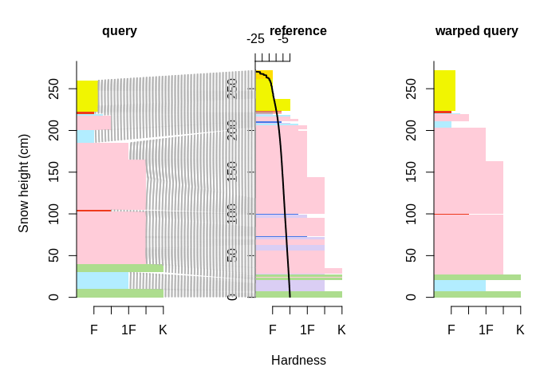
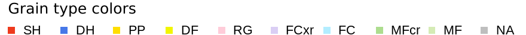
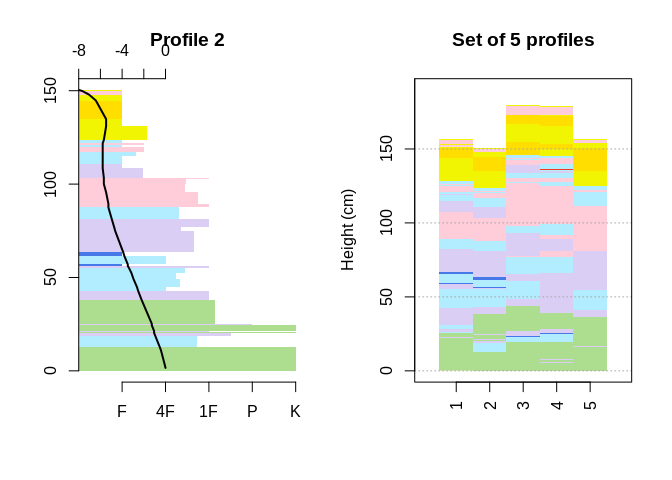
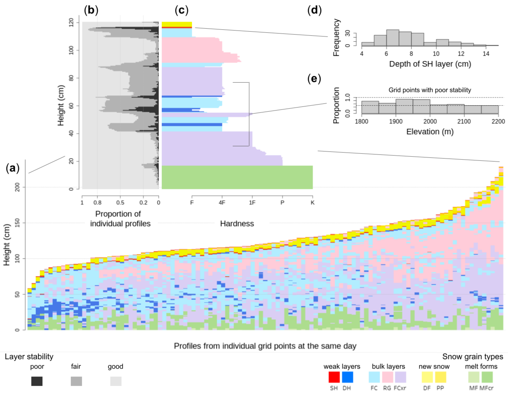
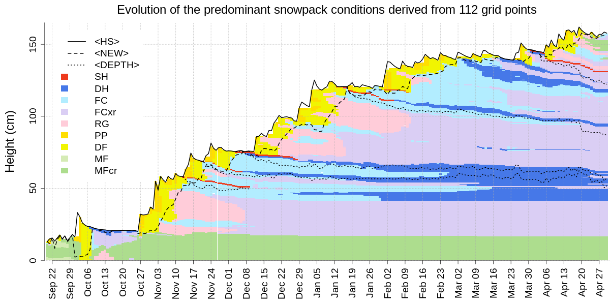

# sarp.snowprofile.alignment

The goal of sarp.snowprofile.alignment is to

-   align snow stratigraphy profiles by matching their individual layers
    based on Dynamic Time Warping (DTW)
-   assess the similarity of the aligned profiles with an independent
    similarity measure that is geared towards avalanche hazard
    assessment
-   cluster sets of snow profiles according to similar conditions based
    on the independent similarity measure, and
-   aggregate clusters of snow profiles to summarize the conditions by
    an average profile derived with DTW Barycenter Averaging (DBA),
    thereby facilitating the computation of individual layer
    distributions that are relevant for avalanche forecasting purposes.

**Background:** Snow profiles describe the vertical (1D) stratigraphy of
layered snow with different layer characteristics, such as grain type,
hardness, deposition/burial date, and many more. Hence, they represent a
data format similar to multi-variate time series containing categorical,
ordinal, and numerical data types.

## Installation

You can install the CRAN release of this package with
`install_packages('sarp.snowprofile.alignment')` or get the most recent
version from our bitbucket repository with:

``` r
devtools::install_bitbucket('sfu-arp/sarp.snowprofile.alignment', ref = 'master')
```

## Examples

### Aligning pairs of snow profiles

``` r
library(sarp.snowprofile.alignment)
#> Loading required package: sarp.snowprofile

plotSPalignment(SPpairs$A_manual, SPpairs$A_modeled)
```




The corresponding layers between the two snow profiles `query` and
`reference` have been matched, and the layer thicknesses of the `query`
profile have been adjusted, so that the `warped query` is optimally
aligned with the `query`.

### Clustering snow profiles and finding a representative medoid profile

Consider a (very) short list of 5 snow profiles:

``` r
setSP <- SPgroup[c(1, 2, 5, 6, 7)]
par(mfrow = c(1, 2))
plot(setSP[[2]], main = "Profile 2")
plot(setSP, SortMethod = 'unsorted', xticklabels = "originalIndices", main = "Set of 5 profiles")
```



Compute the medoid snow profile that represents the group the best by
aligning the profiles and assessing their similarity:

``` r
idxMedoid <- medoidSP(setSP)
paste("The most representative (medoid) profile is Profile", idxMedoid)
#> [1] "The most representative (medoid) profile is Profile 2"
```

The last computation told us the most **representative profile** from
within the group is **Profile 2**, which we have plotted earlier.

## Averaging snow profiles with DTW Barycenter Averaging



The figure shows (a) a snow profile set from an avalanche forecast
region with 112 simulated profiles from the same day, (c) which is
summarized by the average profile. The average profile provides access
to distributions of layer and profile properties, such as e.g. (b) the
distribution of layer stabilities derived from threshold sums, (d) the
depth distribution of a SH layer that is starting to get buried, (e) the
elevation distribution of the proportion of profiles that contain layers
with poor stability in mid snowpack.



Time series of the average snow profile that illustrates the
space-averaged evolution of the snow stratigraphy (visualized by snow
grain types). The algorithm captures the median total snow height (solid
line, <HS>), the median amount of new snow (dashed line, <NEW>), and the
median depth of several persistent weak layers (dotted lines, <DEPTH>).

Check out the functions `averageSP`, `averageSPalongSeason`, and
`backtrackLayers`.

## Getting started

A broader and deeper overview of the package is provided in the
vignettes, cf. `browseVignettes("sarp.snowprofile.alignment"))`. For a
quick start, see `?sarp.snowprofile.alignment`. This package builds on
top of the general package `sarp.snowprofile` for data import/export and
manipulation, cf. `browseVignettes("sarp.snowprofile"))`.
