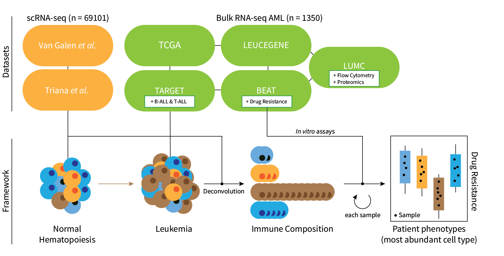

# seAMLess

## Overview

`seAMLess` is a wrapper function which deconvolutes bulk Acute Myeloid
Leukemia (AML) RNA-seq samples with a healthy single cell reference
atlas.



## Installation

<!-- badges: start -->

[](https://cran.r-project.org/package=seAMLess)
[](https://cran.r-project.org/package=seAMLess?color=orange)

<!-- badges: end -->

```r
# CRAN mirror
install.packages("seAMLess")
```

### Development version

To get bug fix and use a feature from the development version:

```r
# install.packages("devtools")
devtools::install_github("eonurk/seAMLess")
```

### Bioconda


`seAMLess` is also available in Bioconda and can be installed via:

```r
conda install -c bioconda r-seamless
```

Next, install the `seAMLessData` package inside of R, this will take a few minutes:

```r
install.packages("seAMLessData", repos = "https://eonurk.github.io/drat/")
```

## Usage

```r
library(seAMLess)
library(xbioc) # required

data(exampleTCGA)
head(exampleTCGA)[,1:4]
```

    ##                    X TCGA.AB.2856.03A TCGA.AB.2849.03A TCGA.AB.2971.03A
    ## 1 ENSG00000000003.13                7                9                1
    ## 2  ENSG00000000005.5                0                1                0
    ## 3 ENSG00000000419.11              689              661              555
    ## 4 ENSG00000000457.12              633             1434              855
    ## 5 ENSG00000000460.15              372             1211              519
    ## 6 ENSG00000000938.11            14712              405             6076

```r
# Now run the function
res <- seAMLess(exampleTCGA)
```

    ## >> Human ensembl ids are converted to symbols...

    ## >> Deconvoluting samples...

    ## >> Deconvolution completed...

    ## >> Predicting Venetoclax resistance...

    ## >> Done...

```r
# AML deconvolution
head(res$Deconvolution)[,1:4]
```

    ##                  CD14 Mono       GMP     T Cells      pre B
    ## TCGA.AB.2856.03A 0.1495886 0.7079107 0.022868623 0.00000000
    ## TCGA.AB.2849.03A 0.0000000 0.0000000 0.000000000 0.00000000
    ## TCGA.AB.2971.03A 0.5494418 0.4462562 0.002898678 0.00000000
    ## TCGA.AB.2930.03A 0.0000000 0.4698555 0.000000000 0.00000000
    ## TCGA.AB.2891.03A 0.0000000 0.6189622 0.018645484 0.01384012
    ## TCGA.AB.2872.03A 0.0000000 0.9950150 0.000000000 0.00000000

```r
# Create ternary plot
ternaryPlot(res)
```

<!-- -->

```r
# Venetoclax resistance
res$Venetoclax.resistance[1:4]
```

    ## TCGA.AB.2856.03A TCGA.AB.2849.03A TCGA.AB.2971.03A TCGA.AB.2930.03A
    ##        0.5070113        0.3242576        0.6678995        0.3305996

## Contribution

You can send pull requests to make your contributions.

## Author

- [E Onur Karakaslar](https://eonurk.com)

## License

- GNU General Public License v3.0
