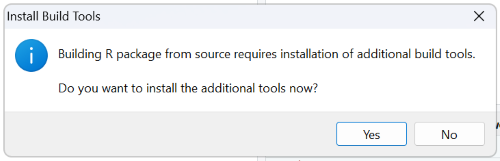

serocalculator
================

<!-- README.md is generated from README.Rmd. Please edit that file -->

------------------------------------------------------------------------

<!-- badges: start -->

[](https://github.com/UCD-SERG/serocalculator/actions)
<!-- badges: end -->

Antibody levels measured in a cross–sectional population sample can be
translated into an estimate of the frequency with which seroconversions
(infections) occur in the sampled population. In other words, the
presence of many high antibody titers indicates that many individuals
likely experienced infection recently and the burden of disease is high
in the population, while low titers indicate a low frequency of
infections in the sampled population and therefore a lower burden of
disease.

The **serocalculator** package was designed to use the longitudinal
response characteristics using a set of modeled parameters
characterizing the longitudinal response of the selected serum
antibodies. More details on the underlying methods can be found in
[Getting
Started](https://ucd-serg.github.io/serocalculator/articles/serocalculator.html).

## Installing R

The **serocalculator** package is written in R, a free, open-source
software program. The end user of this package must have access to a
working installation of the R software. We recommend installing [base
R](https://cran.r-project.org/) and a Graphical User Interfaces (GUI)
for R such as [RStudio](https://posit.co/products/open-source/rstudio/).

If you need to download and install R and/or RStudio, we recommend
following the tutorial below from *Hands On Programming in R* by Garrett
Grolemund:

**Installing R and RStudio**:
<https://rstudio-education.github.io/hopr/starting.html>

## Installing the Serocalculator Package

The **serocalculator** package must be installed in R before first use.

``` r
# Install package
install.packages("serocalculator")
```

### Post-installation

Successful installation can be confirmed by loading the package into the
RStudio workspace and exploring help files and manuals distributed with
the package:

``` r
# Load package "seroincidence".
library(serocalculator)

# Show R help for the package.
?serocalculator
```

Additionally, most package details can be found when executing the
following commands:

``` r
# Show description.
packageDescription("serocalculator")

# Show citation.
citation("serocalculator")
```

### Development Version

To install the development version, you must install the **devtools** R
package and then download **serocalculator** from
[GitHub](https://github.com/). Enter the code below into the R console
to install both packages.

``` r
# Install the devtools package and the development version of serocalculator
install.packages("devtools")
devtools::install_github("ucd-serg/serocalculator")
```

#### A Note for Windows Users

Before launching the development version of **serocalculator**, Windows
users will need to install Rtools, which contains a collection of tools
for building and employing R packages that are still in development.
This can be done either during the *devtools* package installation, or
independently if *devtools* is already installed.

##### During devtools installation:

When prompted to install additional build tools, select “Yes” and Rtools
will be installed.

<figure>

<figcaption aria-hidden="true">Click Yes to install Rtools along with
the <em>devtools</em> package</figcaption>
</figure>

##### Independently:

1.  Download Rtools from
    <https://cran.r-project.org/bin/windows/Rtools/>

2.  Run the installer

    - During the Rtools installation you may see a window asking you to
      “Select Additional Tasks”.
    - Do **not** select the box for “Edit the system PATH”. devtools and
      RStudio should put Rtools on the PATH automatically when it is
      needed.
    - **Do** select the box for “Save version information to registry”.
      It should be selected by default.

## Getting Help

If you need assistance or encounter a clear bug, please file an issue
with a minimal reproducible example on
[GitHub](https://github.com/UCD-SERG/serocalculator/issues).

Another great resource is **The Epidemiologist R Handbook**, which
includes an introductory page on asking for help with R packages via
GitHub: <https://epirhandbook.com/en/getting-help.html>

## Serocalculator App

An app that takes the 5 curve parameters as inputs and runs
`autoplot.curve_params()`

<iframe src="https://ucdserg.shinyapps.io/shiny_decay_curve/?showcase=0" width="100%" height="600px" data-external="1">
</iframe>
