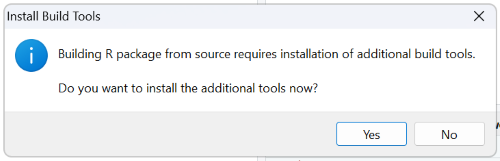

`{serocalculator}`
================

<!-- README.md is generated from README.Rmd. Please edit that file -->
<!-- badges: start -->

[](https://github.com/UCD-SERG/serocalculator/actions/workflows/R-CMD-check.yaml)
[](https://app.codecov.io/gh/UCD-SERG/serocalculator)
[](https://www.codefactor.io/repository/github/ucd-serg/serocalculator)
[](https://CRAN.R-project.org/package=serocalculator)
<!-- badges: end -->

Antibody levels measured in a cross–sectional population sample can be
translated into an estimate of the frequency with which seroconversions
(infections) occur in the sampled population. In other words, the
presence of many high antibody titers indicates that many individuals
likely experienced infection recently and the burden of disease is high
in the population, while low titers indicate a low frequency of
infections in the sampled population and therefore a lower burden of
disease.

The `{serocalculator}` package was designed to use the longitudinal
response characteristics using a set of modeled parameters
characterizing the longitudinal response of the selected serum
antibodies. More details on the underlying methods can be found in
[Getting
Started](https://ucd-serg.github.io/serocalculator/articles/serocalculator.html).

## Installing R

The `{serocalculator}` package is designed to be used in
[R](https://www.r-project.org/), which is a free, open-source software
environment for statistical computing and graphics. The end user of this
package must have access to a working installation of the R software. We
recommend installing [base R](https://cran.r-project.org/) and a
Graphical User Interface (GUI) for R such as
[RStudio](https://posit.co/products/open-source/rstudio/).

If you need to download and install R and/or RStudio, we recommend
following the tutorial below from *Hands On Programming in R* by Garrett
Grolemund:

**Installing R and RStudio**:
<https://rstudio-education.github.io/hopr/starting.html>

## Installing the `{serocalculator}` Package

The `{serocalculator}` package must be installed in R before first use.

``` r
# Install package
install.packages("serocalculator")
```

### Installing the Development Version

To install the latest development version, you must install the
[`{devtools}`](https://devtools.r-lib.org/) R package and then download
`{serocalculator}` from [GitHub](https://github.com/). Enter the code
below into the R console to install both packages.

``` r
# Install the devtools package and the development version of serocalculator
install.packages("devtools")
devtools::install_github(
  repo = "ucd-serg/serocalculator", 
  build_manual = TRUE)
```

#### A Note for Windows Users

Before installing the development version of `{serocalculator}`, Windows
users will need to install Rtools, which contains a collection of tools
for building and employing R packages that are still in development.
This can be done either:

1)  [during the *devtools* package
    installation](#during-devtools-installation), **or**

2)  [independently](#independently), if *devtools* is already installed.

##### During devtools installation

When prompted to install additional build tools, select “Yes”, and
Rtools will be installed.

<figure>

<figcaption aria-hidden="true">Click Yes to install Rtools along with
the <em>devtools</em> package</figcaption>
</figure>

**Note: After installing Rtools, you may need to restart RStudio before
continuing to install `serocalculator`.**

##### Independently:

1.  Download Rtools from
    <https://cran.r-project.org/bin/windows/Rtools/>

2.  Run the installer

    - During the Rtools installation you may see a window asking you to
      “Select Additional Tasks”.
    - Do **not** select the box for “Edit the system PATH”. devtools and
      RStudio should put Rtools on the PATH automatically when it is
      needed.
    - **Do** select the box for “Save version information to registry”.
      It should be selected by default.

## Learning to use `{serocalculator}`

Successful installation can be confirmed by loading the package into
your R workspace and exploring help files and manuals distributed with
the package:

``` r
# Load package "seroincidence".
library(serocalculator)

# Show R help for the package.
?serocalculator
```

Additionally, most package details can be found when executing the
following commands:

``` r
# Show description.
packageDescription("serocalculator")

# Show citation.
citation("serocalculator")
```

The full documentation for the current CRAN release version of
`{serocalculator}` can be accessed at
<https://ucd-serg.github.io/serocalculator/>, and the the documentation
for the [`main`](https://github.com/UCD-SERG/serocalculator/tree/main)
in-development version can be accessed at
<https://ucd-serg.github.io/serocalculator/dev/>.

## Getting Help

If you have questions about using this software package, please use the
[Q&A
forum](https://github.com/UCD-SERG/serocalculator/discussions/categories/q-a).

If you encounter a clear bug, please file an issue with a [minimal
reproducible example](https://reprex.tidyverse.org/) on
[GitHub](https://github.com/UCD-SERG/serocalculator/issues).

Another great resource is **The Epidemiologist R Handbook**, which
includes an introductory page on asking for help with R packages via
GitHub: <https://epirhandbook.com/en/new_pages/help.html>

## Contributing to this project

We welcome contributions to this project - anything from typo
corrections to new features. Please see our [Contributor
guide](https://ucd-serg.github.io/serocalculator/CONTRIBUTING.html#fixing-typos)
for more information.

## QR code

This QR code is a direct link to the latest-release version of the
package website:

    #> Warning: package 'qrcode' was built under R version 4.4.2

<figure id="fig-website-QR">

<figcaption aria-hidden="true">QR code for <code>serocalculator</code>
website</figcaption>
</figure>
