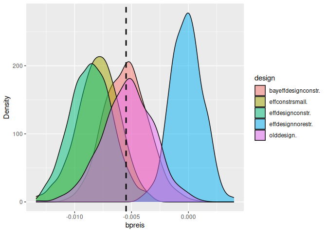
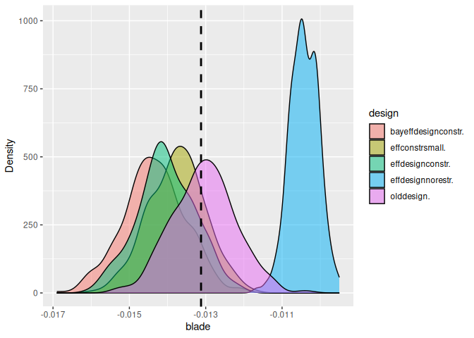
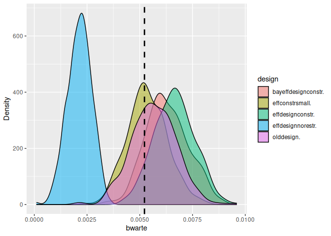

<!-- README.md is generated from README.Rmd. Please edit that file -->

# simulateDCE

<!-- badges: start -->

[](https://CRAN.R-project.org/package=simulateDCE)

[](https://github.com/sagebiej/simulatedce/actions/workflows/R-CMD-check.yaml)
<!-- badges: end -->

The goal of simulateDCE is to make it easy to simulate choice experiment
datasets using designs from NGENE, `idefix` or `spdesign`. You have to
store the design file(s) in a subfolder and need to specify certain
parameters and the utility functions for the data generating process.
The package is useful for:

1.  Test different designs in terms of statistical power, efficiency and
    unbiasedness

2.  To test the effects of deviations from RUM, e.g. heuristics, on
    model performance for different designs.

3.  In teaching, using simulated data is useful, if you want to know the
    data generating process. It helps to demonstrate Maximum likelihood
    and choice models, knowing exactly what you should expect.

4.  You can use simulation in pre-registration to justify your sample
    size and design choice.

5.  Before data collection, you can use simulated data to estimate the
    models you plan to use in the actual analysis. You can thus make
    sure, you can estimate all effects for given sample sizes.

## Installation

You can install simulateDCE directly from cran by

``` r
install.packages("simulateDCE") 
```

For the latest development version use this:

``` r
install.packages("devtools")
devtools::install_git('https://github.com/sagebiej/simulateDCE', ref = "devel")
```

## Example

This is a basic example for a simulation:

``` r
rm(list = ls())
library(simulateDCE)
library(rlang)
library(formula.tools)
#> 
#> Attaching package: 'formula.tools'
#> The following object is masked from 'package:rlang':
#> 
#>     env


designpath <- system.file("extdata", "SE_DRIVE", package = "simulateDCE")

resps <- 120 # number of respondents
nosim <- 4 # number of simulations to run (about 500 is minimum)


decisiongroups <- c(0, 0.7, 1)

# place b coefficients into an r list:
bcoeff <- list(
  bpreis = -0.01,
  blade = -0.07,
  bwarte = 0.02
)

manipulations <- list(
  alt1.x2 = expr(alt1.x2 / 10),
  alt1.x3 = expr(alt1.x3 / 10),
  alt2.x2 = expr(alt2.x2 / 10),
  alt2.x3 = expr(alt2.x3 / 10)
)


# place your utility functions here
ul <- list(
  u1 =

    list(
      v1 = V.1 ~ bpreis * alt1.x1 + blade * alt1.x2 + bwarte * alt1.x3,
      v2 = V.2 ~ bpreis * alt2.x1 + blade * alt2.x2 + bwarte * alt2.x3
    ),
  u2 = list(
    v1 = V.1 ~ bpreis * alt1.x1,
    v2 = V.2 ~ bpreis * alt2.x1
  )
)


destype <- "ngene"

sedrive <- sim_all(
  nosim = nosim, resps = resps, destype = destype,
  designpath = designpath, u = ul, bcoeff = bcoeff, decisiongroups = decisiongroups
)
#> 'simple' is deprecated and will be removed in the future. Use 'exact' instead.
#> bcoeff_lookup already exists; skipping modification.
#> 
#> Utility function used in simulation (true utility):
#> $u1
#> $u1$v1
#> V.1 ~ bpreis * alt1.x1 + blade * alt1.x2 + bwarte * alt1.x3
#> <environment: 0x5fd289ec7eb8>
#> 
#> $u1$v2
#> V.2 ~ bpreis * alt2.x1 + blade * alt2.x2 + bwarte * alt2.x3
#> <environment: 0x5fd289e68760>
#> 
#> 
#> $u2
#> $u2$v1
#> V.1 ~ bpreis * alt1.x1
#> <environment: 0x5fd289dccb80>
#> 
#> $u2$v2
#> V.2 ~ bpreis * alt2.x1
#> <environment: 0x5fd289d6a748>
#> 'destype' is deprecated. Please use 'designtype' instead.
#> New names:
#> • `Choice situation` -> `Choice.situation`
#> • `` -> `...10`
#> assign keys for bcoeff): 0 sec elapsed
#> user entered manipulations: 0.01 sec elapsed
#> split dataframe into groups: 0.005 sec elapsed
#> for each group calculate utility: 0.891 sec elapsed
#> add random component: 0.058 sec elapsed
#> whole simulate choices: 0.974 sec elapsed
#> 
#>  No preprocess function provided. Proceeding without additional preprocessing.
#> 
#> 
#>  dataset preprossed_data exists: FALSE
#> 
#> 
#>  decisiongroups exists: TRUE
#> 
#> Group counts:
#> 
#>    1    2 
#> 1007  433 
#> 
#>  data has been created 
#> 
#> 
#> First few observations of the dataset
#>   ID Choice_situation alt1_x1 alt1_x2 alt1_x3 alt2_x1 alt2_x2 alt2_x3 Block
#> 1  1                7      80      25     100      60     200     100     1
#> 2  1               19      20      25      50      60      25       0     1
#> 3  1               30      20     100      50      80      50     100     1
#> 4  1               32      40     200      25      80      25       0     1
#> 5  1               39      40     200       0      80     100     100     1
#> 6  1               48      60      50      25      20      50     100     1
#>   group    V_1    V_2        e_1          e_2         U_1         U_2 CHOICE
#> 1     1  -0.55 -12.60  0.7017091 -0.004845669   0.1517091 -12.6048457      1
#> 2     1  -0.95  -2.35 -0.7570334 -0.314662810  -1.7070334  -2.6646628      1
#> 3     1  -6.20  -2.30  0.5284701  0.765330842  -5.6715299  -1.5346692      2
#> 4     1 -13.90  -2.55  0.6972737  1.276552182 -13.2027263  -1.2734478      2
#> 5     1 -14.40  -5.80  2.3723773  3.840028537 -12.0276227  -1.9599715      2
#> 6     1  -3.60  -1.70  0.7219891  0.900484573  -2.8780109  -0.7995154      2
#> assign keys for bcoeff): 0 sec elapsed
#> user entered manipulations: 0.012 sec elapsed
#> split dataframe into groups: 0.004 sec elapsed
#> for each group calculate utility: 1.17 sec elapsed
#> add random component: 0.063 sec elapsed
#> whole simulate choices: 1.259 sec elapsed
#> 
#>  No preprocess function provided. Proceeding without additional preprocessing.
#> 
#> 
#>  dataset preprossed_data exists: FALSE
#> 
#> 
#>  decisiongroups exists: TRUE
#> 
#> Group counts:
#> 
#>    1    2 
#> 1007  433 
#> 
#>  data has been created 
#> 
#> 
#> First few observations of the dataset
#>   ID Choice_situation alt1_x1 alt1_x2 alt1_x3 alt2_x1 alt2_x2 alt2_x3 Block
#> 1  1                7      80      25     100      60     200     100     1
#> 2  1               19      20      25      50      60      25       0     1
#> 3  1               30      20     100      50      80      50     100     1
#> 4  1               32      40     200      25      80      25       0     1
#> 5  1               39      40     200       0      80     100     100     1
#> 6  1               48      60      50      25      20      50     100     1
#>   group    V_1    V_2         e_1         e_2         U_1        U_2 CHOICE
#> 1     1  -0.55 -12.60  2.75514992 -0.66469500   2.2051499 -13.264695      1
#> 2     1  -0.95  -2.35  0.00533537 -0.04035054  -0.9446646  -2.390351      1
#> 3     1  -6.20  -2.30  0.74855512  0.39861844  -5.4514449  -1.901382      2
#> 4     1 -13.90  -2.55  0.23703861  0.51413370 -13.6629614  -2.035866      2
#> 5     1 -14.40  -5.80  1.63619258 -0.12188201 -12.7638074  -5.921882      2
#> 6     1  -3.60  -1.70 -0.32856943 -1.04084037  -3.9285694  -2.740840      2
#> assign keys for bcoeff): 0 sec elapsed
#> user entered manipulations: 0.011 sec elapsed
#> split dataframe into groups: 0.005 sec elapsed
#> for each group calculate utility: 1.115 sec elapsed
#> add random component: 0.053 sec elapsed
#> whole simulate choices: 1.195 sec elapsed
#> 
#>  No preprocess function provided. Proceeding without additional preprocessing.
#> 
#> 
#>  dataset preprossed_data exists: FALSE
#> 
#> 
#>  decisiongroups exists: TRUE
#> 
#> Group counts:
#> 
#>    1    2 
#> 1007  433 
#> 
#>  data has been created 
#> 
#> 
#> First few observations of the dataset
#>   ID Choice_situation alt1_x1 alt1_x2 alt1_x3 alt2_x1 alt2_x2 alt2_x3 Block
#> 1  1                7      80      25     100      60     200     100     1
#> 2  1               19      20      25      50      60      25       0     1
#> 3  1               30      20     100      50      80      50     100     1
#> 4  1               32      40     200      25      80      25       0     1
#> 5  1               39      40     200       0      80     100     100     1
#> 6  1               48      60      50      25      20      50     100     1
#>   group    V_1    V_2        e_1          e_2         U_1        U_2 CHOICE
#> 1     1  -0.55 -12.60 -0.1655165  0.333722053  -0.7155165 -12.266278      1
#> 2     1  -0.95  -2.35 -0.5967960  0.047598095  -1.5467960  -2.302402      1
#> 3     1  -6.20  -2.30  0.1815357  0.151706904  -6.0184643  -2.148293      2
#> 4     1 -13.90  -2.55  1.0162094 -0.003073446 -12.8837906  -2.553073      2
#> 5     1 -14.40  -5.80  1.9017193 -1.307206385 -12.4982807  -7.107206      2
#> 6     1  -3.60  -1.70  3.0272325  0.101946794  -0.5727675  -1.598053      1
#> assign keys for bcoeff): 0 sec elapsed
#> user entered manipulations: 0.016 sec elapsed
#> split dataframe into groups: 0.007 sec elapsed
#> for each group calculate utility: 0.871 sec elapsed
#> add random component: 0.041 sec elapsed
#> whole simulate choices: 0.949 sec elapsed
#> 
#>  No preprocess function provided. Proceeding without additional preprocessing.
#> 
#> 
#>  dataset preprossed_data exists: FALSE
#> 
#> 
#>  decisiongroups exists: TRUE
#> 
#> Group counts:
#> 
#>    1    2 
#> 1007  433 
#> 
#>  data has been created 
#> 
#> 
#> First few observations of the dataset
#>   ID Choice_situation alt1_x1 alt1_x2 alt1_x3 alt2_x1 alt2_x2 alt2_x3 Block
#> 1  1                7      80      25     100      60     200     100     1
#> 2  1               19      20      25      50      60      25       0     1
#> 3  1               30      20     100      50      80      50     100     1
#> 4  1               32      40     200      25      80      25       0     1
#> 5  1               39      40     200       0      80     100     100     1
#> 6  1               48      60      50      25      20      50     100     1
#>   group    V_1    V_2        e_1        e_2         U_1         U_2 CHOICE
#> 1     1  -0.55 -12.60  1.6738036 -1.5621745   1.1238036 -14.1621745      1
#> 2     1  -0.95  -2.35  1.4617051  2.8739225   0.5117051   0.5239225      2
#> 3     1  -6.20  -2.30 -1.1041301  1.1893797  -7.3041301  -1.1106203      2
#> 4     1 -13.90  -2.55 -0.1083358 -0.6587746 -14.0083358  -3.2087746      2
#> 5     1 -14.40  -5.80  0.8077831 -0.7007500 -13.5922169  -6.5007500      2
#> 6     1  -3.60  -1.70  1.5490572  0.3438886  -2.0509428  -1.3561114      2
#> 
#> 
#> 
#> Transformed utility function (type: simple):
#> [1] "U_1 = @bpreis * $alt1_x1 + @blade * $alt1_x2 + @bwarte * $alt1_x3 ;U_2 = @bpreis * $alt2_x1 + @blade * $alt2_x2 + @bwarte * $alt2_x3 ;"
#> Initial function value: -998.1319 
#> Initial gradient value:
#> bpreis  blade bwarte 
#>   6360 -39600   7025 
#> initial  value 998.131940 
#> iter   2 value 800.504025
#> iter   3 value 786.395435
#> iter   4 value 784.242446
#> iter   5 value 750.719727
#> iter   6 value 742.063100
#> iter   7 value 740.790227
#> iter   8 value 740.763095
#> iter   9 value 740.763059
#> iter   9 value 740.763050
#> iter   9 value 740.763044
#> final  value 740.763044 
#> converged
#> Initial function value: -998.1319 
#> Initial gradient value:
#> bpreis  blade bwarte 
#>   6200 -37900   7650 
#> initial  value 998.131940 
#> iter   2 value 821.888191
#> iter   3 value 809.241040
#> iter   4 value 808.473296
#> iter   5 value 769.609504
#> iter   6 value 761.231597
#> iter   7 value 759.946167
#> iter   8 value 759.922557
#> iter   9 value 759.922524
#> iter   9 value 759.922513
#> iter   9 value 759.922506
#> final  value 759.922506 
#> converged
#> Initial function value: -998.1319 
#> Initial gradient value:
#> bpreis  blade bwarte 
#>   6160 -38625   6950 
#> initial  value 998.131940 
#> iter   2 value 815.623636
#> iter   3 value 802.757357
#> iter   4 value 800.768673
#> iter   5 value 764.276430
#> iter   6 value 755.754107
#> iter   7 value 754.402132
#> iter   8 value 754.373606
#> iter   9 value 754.373562
#> iter   9 value 754.373551
#> iter   9 value 754.373545
#> final  value 754.373545 
#> converged
#> Initial function value: -998.1319 
#> Initial gradient value:
#> bpreis  blade bwarte 
#>   6620 -38900   6025 
#> initial  value 998.131940 
#> iter   2 value 815.994858
#> iter   3 value 806.153552
#> iter   4 value 804.395555
#> iter   5 value 768.518125
#> iter   6 value 759.936308
#> iter   7 value 758.360035
#> iter   8 value 758.320822
#> iter   9 value 758.320725
#> iter  10 value 758.320713
#> iter  10 value 758.320710
#> iter  10 value 758.320705
#> final  value 758.320705 
#> converged
#> start_estimation: 0.212 sec elapsed
#> 
#> Summary table:
#> 
#> 
#> ================  ====  ===  =====  ====  ======  =====  =====  =====  ====  ========  ====
#> \                 vars    n   mean    sd  median    min    max  range  skew  kurtosis    se
#> ================  ====  ===  =====  ====  ======  =====  =====  =====  ====  ========  ====
#> est_bpreis           1    4  -0.01  0.00   -0.01  -0.01   0.00   0.00  0.38     -2.01  0.00
#> est_blade            2    4  -0.01  0.00   -0.01  -0.02  -0.01   0.00  0.11     -1.89  0.00
#> est_bwarte           3    4   0.01  0.00    0.01   0.01   0.01   0.00  0.15     -1.88  0.00
#> rob_pval0_bpreis     4    4   0.05  0.04    0.03   0.02   0.11   0.09  0.69     -1.72  0.02
#> rob_pval0_blade      5    4   0.00  0.00    0.00   0.00   0.00   0.00  0.75     -1.69  0.00
#> rob_pval0_bwarte     6    4   0.00  0.00    0.00   0.00   0.00   0.00  0.75     -1.69  0.00
#> ================  ====  ===  =====  ====  ======  =====  =====  =====  ====  ========  ====
#> 
#> Power results:
#> 
#> FALSE  TRUE 
#>    25    75 
#> 'simple' is deprecated and will be removed in the future. Use 'exact' instead.
#> bcoeff_lookup already exists; skipping modification.
#> 
#> Utility function used in simulation (true utility):
#> $u1
#> $u1$v1
#> V.1 ~ bpreis * alt1.x1 + blade * alt1.x2 + bwarte * alt1.x3
#> <environment: 0x5fd28c1b5a60>
#> 
#> $u1$v2
#> V.2 ~ bpreis * alt2.x1 + blade * alt2.x2 + bwarte * alt2.x3
#> <environment: 0x5fd28c199d60>
#> 
#> 
#> $u2
#> $u2$v1
#> V.1 ~ bpreis * alt1.x1
#> <environment: 0x5fd28c16e850>
#> 
#> $u2$v2
#> V.2 ~ bpreis * alt2.x1
#> <environment: 0x5fd28c14bb58>
#> 
#> 
#> 'destype' is deprecated. Please use 'designtype' instead.
#> New names:
#> assign keys for bcoeff): 0.001 sec elapsed
#> user entered manipulations: 0.011 sec elapsed
#> split dataframe into groups: 0.006 sec elapsed
#> for each group calculate utility: 0.966 sec elapsed
#> add random component: 0.057 sec elapsed
#> whole simulate choices: 1.053 sec elapsed
#> 
#>  No preprocess function provided. Proceeding without additional preprocessing.
#> 
#> 
#>  dataset preprossed_data exists: FALSE
#> 
#> 
#>  decisiongroups exists: TRUE
#> 
#> Group counts:
#> 
#>    1    2 
#> 1007  433 
#> 
#>  data has been created 
#> 
#> 
#> First few observations of the dataset
#>   ID Choice_situation alt1_x1 alt1_x2 alt1_x3 alt2_x1 alt2_x2 alt2_x3 Block
#> 1  1               12      60      25       0      20     200     100     1
#> 2  1               16      20     100      50      40      50       0     1
#> 3  1               17      20     200       0      80     100     100     1
#> 4  1               25      60      50     100      20     200      50     1
#> 5  1               29      20      50     100      80      50       0     1
#> 6  1               32      40     100      25      80      25      50     1
#>   group    V_1    V_2        e_1        e_2        U_1        U_2 CHOICE
#> 1     1  -2.35 -12.20  0.7348289  2.8760442  -1.615171  -9.323956      1
#> 2     1  -6.20  -3.90 -0.4325068 -1.1036864  -6.632507  -5.003686      2
#> 3     1 -14.20  -5.80 -0.6013954 -0.6508939 -14.801395  -6.450894      2
#> 4     1  -2.10 -13.20 -0.7730537  2.5897688  -2.873054 -10.610231      1
#> 5     1  -1.70  -4.30 -0.8569517  2.3587195  -2.556952  -1.941280      2
#> 6     1  -6.90  -1.55  1.9317262 -1.4418899  -4.968274  -2.991890      2
#> assign keys for bcoeff): 0 sec elapsed
#> user entered manipulations: 0.012 sec elapsed
#> split dataframe into groups: 0.005 sec elapsed
#> for each group calculate utility: 1.133 sec elapsed
#> add random component: 0.056 sec elapsed
#> whole simulate choices: 1.217 sec elapsed
#> 
#>  No preprocess function provided. Proceeding without additional preprocessing.
#> 
#> 
#>  dataset preprossed_data exists: FALSE
#> 
#> 
#>  decisiongroups exists: TRUE
#> 
#> Group counts:
#> 
#>    1    2 
#> 1007  433 
#> 
#>  data has been created 
#> 
#> 
#> First few observations of the dataset
#>   ID Choice_situation alt1_x1 alt1_x2 alt1_x3 alt2_x1 alt2_x2 alt2_x3 Block
#> 1  1               12      60      25       0      20     200     100     1
#> 2  1               16      20     100      50      40      50       0     1
#> 3  1               17      20     200       0      80     100     100     1
#> 4  1               25      60      50     100      20     200      50     1
#> 5  1               29      20      50     100      80      50       0     1
#> 6  1               32      40     100      25      80      25      50     1
#>   group    V_1    V_2        e_1         e_2         U_1        U_2 CHOICE
#> 1     1  -2.35 -12.20 -1.3863937  0.01166719  -3.7363937 -12.188333      1
#> 2     1  -6.20  -3.90 -0.7563038  0.81627154  -6.9563038  -3.083728      2
#> 3     1 -14.20  -5.80 -0.8547753  0.83640581 -15.0547753  -4.963594      2
#> 4     1  -2.10 -13.20  0.1376063 -0.20383194  -1.9623937 -13.403832      1
#> 5     1  -1.70  -4.30  0.8143902  0.31880374  -0.8856098  -3.981196      1
#> 6     1  -6.90  -1.55  0.7225187 -0.56312651  -6.1774813  -2.113127      2
#> assign keys for bcoeff): 0 sec elapsed
#> user entered manipulations: 0.011 sec elapsed
#> split dataframe into groups: 0.007 sec elapsed
#> for each group calculate utility: 1.184 sec elapsed
#> add random component: 0.052 sec elapsed
#> whole simulate choices: 1.266 sec elapsed
#> 
#>  No preprocess function provided. Proceeding without additional preprocessing.
#> 
#> 
#>  dataset preprossed_data exists: FALSE
#> 
#> 
#>  decisiongroups exists: TRUE
#> 
#> Group counts:
#> 
#>    1    2 
#> 1007  433 
#> 
#>  data has been created 
#> 
#> 
#> First few observations of the dataset
#>   ID Choice_situation alt1_x1 alt1_x2 alt1_x3 alt2_x1 alt2_x2 alt2_x3 Block
#> 1  1               12      60      25       0      20     200     100     1
#> 2  1               16      20     100      50      40      50       0     1
#> 3  1               17      20     200       0      80     100     100     1
#> 4  1               25      60      50     100      20     200      50     1
#> 5  1               29      20      50     100      80      50       0     1
#> 6  1               32      40     100      25      80      25      50     1
#>   group    V_1    V_2         e_1        e_2         U_1        U_2 CHOICE
#> 1     1  -2.35 -12.20  0.06710733  0.1285654  -2.2828927 -12.071435      1
#> 2     1  -6.20  -3.90 -1.32075517  2.0607289  -7.5207552  -1.839271      2
#> 3     1 -14.20  -5.80 -0.72258548 -0.1480184 -14.9225855  -5.948018      2
#> 4     1  -2.10 -13.20  2.27096778  1.1434050   0.1709678 -12.056595      1
#> 5     1  -1.70  -4.30  0.91051706 -0.4674794  -0.7894829  -4.767479      1
#> 6     1  -6.90  -1.55  1.53679884  3.0082291  -5.3632012   1.458229      2
#> assign keys for bcoeff): 0 sec elapsed
#> user entered manipulations: 0.009 sec elapsed
#> split dataframe into groups: 0.003 sec elapsed
#> for each group calculate utility: 1.052 sec elapsed
#> add random component: 0.044 sec elapsed
#> whole simulate choices: 1.118 sec elapsed
#> 
#>  No preprocess function provided. Proceeding without additional preprocessing.
#> 
#> 
#>  dataset preprossed_data exists: FALSE
#> 
#> 
#>  decisiongroups exists: TRUE
#> 
#> Group counts:
#> 
#>    1    2 
#> 1007  433 
#> 
#>  data has been created 
#> 
#> 
#> First few observations of the dataset
#>   ID Choice_situation alt1_x1 alt1_x2 alt1_x3 alt2_x1 alt2_x2 alt2_x3 Block
#> 1  1               12      60      25       0      20     200     100     1
#> 2  1               16      20     100      50      40      50       0     1
#> 3  1               17      20     200       0      80     100     100     1
#> 4  1               25      60      50     100      20     200      50     1
#> 5  1               29      20      50     100      80      50       0     1
#> 6  1               32      40     100      25      80      25      50     1
#>   group    V_1    V_2         e_1       e_2        U_1        U_2 CHOICE
#> 1     1  -2.35 -12.20 -1.28989396 0.9484000 -3.6398940 -11.251600      1
#> 2     1  -6.20  -3.90  0.74918818 0.1249138 -5.4508118  -3.775086      2
#> 3     1 -14.20  -5.80  5.69606611 1.1375340 -8.5039339  -4.662466      2
#> 4     1  -2.10 -13.20  2.90516321 0.2937650  0.8051632 -12.906235      1
#> 5     1  -1.70  -4.30  2.77751745 1.5906729  1.0775174  -2.709327      1
#> 6     1  -6.90  -1.55 -0.01728414 3.3229082 -6.9172841   1.772908      2
#> 
#> 
#> 
#> Transformed utility function (type: simple):
#> [1] "U_1 = @bpreis * $alt1_x1 + @blade * $alt1_x2 + @bwarte * $alt1_x3 ;U_2 = @bpreis * $alt2_x1 + @blade * $alt2_x2 + @bwarte * $alt2_x3 ;"
#> Initial function value: -998.1319 
#> Initial gradient value:
#> bpreis  blade bwarte 
#>   5360 -37200   7650 
#> initial  value 998.131940 
#> iter   2 value 842.455891
#> iter   3 value 830.557321
#> iter   4 value 830.235796
#> iter   5 value 790.231947
#> iter   6 value 781.816563
#> iter   7 value 780.429591
#> iter   8 value 780.381041
#> iter   9 value 780.380266
#> iter  10 value 780.380038
#> iter  11 value 780.379732
#> iter  12 value 780.379533
#> iter  12 value 780.379533
#> iter  12 value 780.379533
#> final  value 780.379533 
#> converged
#> Initial function value: -998.1319 
#> Initial gradient value:
#> bpreis  blade bwarte 
#>   4100 -37475   7400 
#> initial  value 998.131940 
#> iter   2 value 839.617713
#> iter   3 value 834.663927
#> iter   4 value 829.106636
#> iter   5 value 778.893518
#> iter   6 value 769.219181
#> iter   7 value 767.652744
#> iter   8 value 767.626805
#> iter   9 value 767.626779
#> iter  10 value 767.626763
#> iter  10 value 767.626761
#> iter  10 value 767.626757
#> final  value 767.626757 
#> converged
#> Initial function value: -998.1319 
#> Initial gradient value:
#> bpreis  blade bwarte 
#>   4760 -37675   8175 
#> initial  value 998.131940 
#> iter   2 value 832.730149
#> iter   3 value 832.267432
#> iter   4 value 830.145207
#> iter   5 value 778.690334
#> iter   6 value 769.072881
#> iter   7 value 767.565134
#> iter   8 value 767.540015
#> iter   9 value 767.539640
#> iter  10 value 767.539493
#> iter  11 value 767.539455
#> iter  12 value 767.539374
#> iter  12 value 767.539374
#> iter  12 value 767.539374
#> final  value 767.539374 
#> converged
#> Initial function value: -998.1319 
#> Initial gradient value:
#> bpreis  blade bwarte 
#>   4840 -37450   8225 
#> initial  value 998.131940 
#> iter   2 value 835.537197
#> iter   3 value 821.095140
#> iter   4 value 820.186712
#> iter   5 value 780.436158
#> iter   6 value 772.106098
#> iter   7 value 770.910821
#> iter   8 value 770.861700
#> iter   9 value 770.860779
#> iter  10 value 770.860582
#> iter  11 value 770.860346
#> iter  12 value 770.860168
#> iter  12 value 770.860168
#> iter  12 value 770.860168
#> final  value 770.860168 
#> converged
#> start_estimation: 0.128 sec elapsed
#> 
#> Summary table:
#> 
#> 
#> ================  ====  ===  =====  ====  ======  =====  =====  =====  =====  ========  ====
#> \                 vars    n   mean    sd  median    min    max  range   skew  kurtosis    se
#> ================  ====  ===  =====  ====  ======  =====  =====  =====  =====  ========  ====
#> est_bpreis           1    4  -0.01  0.00   -0.01  -0.01   0.00   0.01  -0.37     -1.85  0.00
#> est_blade            2    4  -0.01  0.00   -0.01  -0.01  -0.01   0.00  -0.17     -1.92  0.00
#> est_bwarte           3    4   0.01  0.00    0.01   0.00   0.01   0.00  -0.73     -1.70  0.00
#> rob_pval0_bpreis     4    4   0.02  0.03    0.00   0.00   0.07   0.07   0.75     -1.69  0.02
#> rob_pval0_blade      5    4   0.00  0.00    0.00   0.00   0.00   0.00   0.66     -1.74  0.00
#> rob_pval0_bwarte     6    4   0.00  0.00    0.00   0.00   0.00   0.00   0.75     -1.69  0.00
#> ================  ====  ===  =====  ====  ======  =====  =====  =====  =====  ========  ====
#> 
#> Power results:
#> 
#> FALSE  TRUE 
#>    25    75
#> total time for simulation and estimation: 18.547 sec elapsed
#> $tic
#> elapsed 
#>   1.131 
#> 
#> $toc
#> elapsed 
#>  19.678 
#> 
#> $msg
#> [1] "total time for simulation and estimation"
#> 
#> $callback_msg
#> [1] "total time for simulation and estimation: 18.547 sec elapsed"
#> 
#> Trying tidyr::pivot_longer for reshaping...
```


