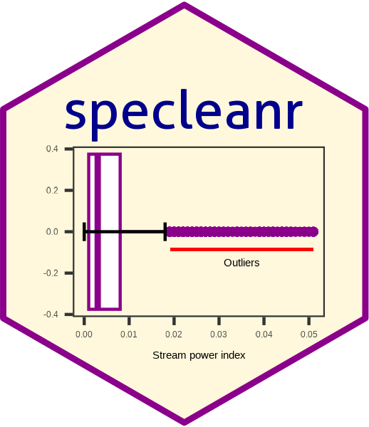
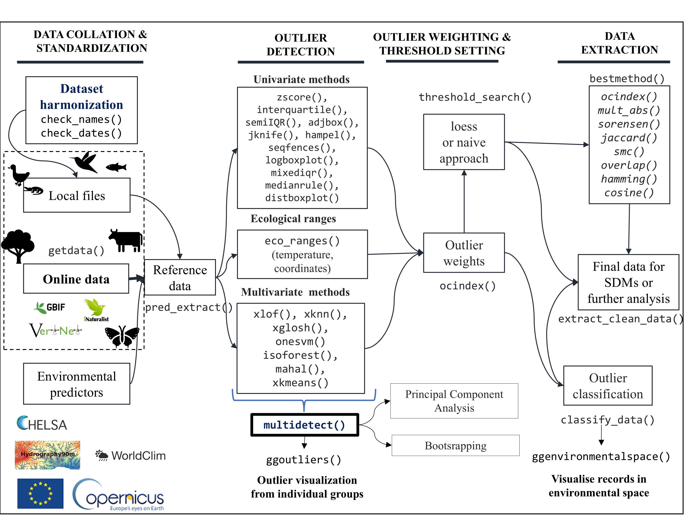

specleanr package for outlier detection
================

<!-- README.md is generated from README.Rmd. Please edit that file -->
<!-- badges: start -->

[](http://www.gnu.org/licenses/gpl-3.0.html)
[](https://github.com/AnthonyBasooma/specleanr/actions/workflows/R-CMD-check.yaml)
[](https://app.codecov.io/gh/AnthonyBasooma/specleanr)
[](https://github.com/AnthonyBasooma/specleanr/releases/tag/v1.0.0.0)

<!-- badges: end -->



`specleanr` The package aims to improve the reliability and
acceptability of biogeographical models, including species distribution
models, ecological niche models, and bioclimatic envelope models, by
detecting outliers in the environmental predictors. In the package, we
collate **20 outlier detection methods**, which a user can collectively
apply (ensemble outlier detection) and determine whether the species
records are in a suitable environmental space. The package complements
other packages that address geographical, taxonomic, and temporal
checks.

## Installation

``` r
# install.packages("remotes")

#remotes::install_github("AnthonyBasooma/specleanr")
```

### Process of identifying environmental outliers.

The process of identifying environmental outliers is generally
classified into **four steps** as detailed below (Figure 1);

<figure>

<figcaption aria-hidden="true">Figure 1. Workflow for processing species
occurrence data within the specleanr R-package for environmental outlier
detection, removal, and evaluation.</figcaption>
</figure>

<!--()-->

1.  **Arranging of species records and environmental data**.

This includes collecting species data from either online sources or
locally stored data. The user can check for species records for
geographical, taxonomic, or temporal inconsistencies such as missing
coordinates, interchanged coordinates, species name spelling mistakes,
and wrong event dates. Environmental data, mainly in the raster format,
is based chiefly on user needs, but numerous sources include WORLDCLIM
(Fick & Hijmans, 2017) and CHELSA (Karger et al., 2017) for bioclimatic
variables; Hydrography90m for stream or river-based hydromorphological
parameters such as stream order, flow accumulation, stream power index,
and stream transportation index (Amatulli et al., 2022); and Copernicus
for land use changes. A comprehensive database for environmental
predictors can be accessed at
<https://hydrography.org/environment90m/environment90m_layers>.

2.  **Extracting the environmental predictors**.

The environmental predictors are extracted from points where the species
was recorded present or absent. The extracted dataset forms the species
**reference dataset** for environmental outlier checks. In the package
we included **`pred_extract()`** to extract the environmental
predictors.

3.  **Ensemble multiple methods for outlier detection**.

Multiple outlier detection methods are used; each method flags outliers
in the same dataset. These outliers are then compared among methods to
determine records, which are flagged by several methods called
**absolute outliers** or **true outliers**. The total number of methods
that a user can ensemble is user-based; however, we expect the user to
set at least **three** outlier detection methods. The methods should be
also at least from different categories, which include **1) univariate
methods**, **2) multivariate methods**, and **3) ecological ranges**.
The must set all the methods using **`multidetect()`** function and not
individual method functions to allow seamless comparison.

**Univariate methods**

These methods only detect outliers in one environmental predictor. It is
strongly advisable that the user selects an environmental predictor
which directly affects the species distribution, for example, minimum
temperature of the coldest month (IUCN 2012; Logez et al., 2012).

| Function           | Method implemented                     | Userword in **`multidetect()`** |
|:-------------------|:---------------------------------------|--------------------------------:|
| `zscore()`         | Z-score                                |                          zscore |
| `semiIQR()`        | Semi interquartile range               |                          semiqr |
| `adjustboxplots()` | Adjusted boxplot-robust boxplot method |                          adjbox |
| `interquartile()`  | Interquartile range (IQR)              |                             iqr |
| `medianrule()`     | Median rule method                     |                      medianrule |
| `logboxplot()`     | Logarithmic boxplot                    |                      logboxplot |
| `seqfences()`      | Sequential fences                      |                       seqfences |
| `mixediqr()`       | Mixed semi and interquartile range     |                        mixediqr |
| `distboxplot()`    | distribution-based boxplots            |                     distboxplot |
| `rjknife()`        | Reverse jackknifing                    |                          jknife |
| `hampel()`         | The Hampel filter method               |                          hampel |

**Multivariate methods**

These methods detect outliers in multiple environmental predictors
(multidimensional space). User should exclude unnecessary columns such
as the coordinates such that they are not included in the computation.

| Function      | Method used to fit and detect outliers       | Userword in **`multidetect()`** |
|:--------------|:---------------------------------------------|--------------------------------:|
| `isoforest()` | Isolation forest                             |                         iforest |
| `onesvm()`    | One-class support vector machine             |                         onvesvm |
| `xglosh()`    | Global-Local Outlier Score from Hierarchies. |                           glosh |
| `xknn()`      | k-nearest neighbor                           |                             knn |
| `xlof()`      | Local outlier factor                         |                             lof |
| `xkmeans()`   | k-means clustering                           |                          kmeans |
| `xkmedoids()` | Partitioning around the kmedoids             |                         kmedoid |
| `mahal()`     | Mahalanobis distances both robust and simple |                           mahal |

**Ecological ranges**

The user collates the species optimal ecological ranges to identify the
species records outside the known optimal ranges. In the package, for a
single species, the optimal ranges (minimum, maximum, or mean values)
are provided manually, and the user is required to set the environmental
predictor to be used for flagging the outliers. A dataset with the
minimum and maximum values (optimal ranges) is allowed for multiple
species. **Note** If the taxa is fish, we included the
**`thermal_ranges()`** and **`geo_ranges()`** functions, which a user
can set to flag records exceeding the FishBase collated temperature and
latitudinal/longitudinal ranges. The user word **optimal** **`must`** be
used in the **`multidetect()`** function for seamless comparisons with
other methods.

4.  **Extract species environmental without outliers**

**Threshold identification**

After outlier removal, the threshold to classify a record as an absolute
outlier that necessitates the user to do so objectively is pivotal in
this workflow. Therefore, we have developed three options for obtaining
a threshold. A threshold is the proportion of methods that flagged a
record as an outlier to the total number of techniques used. For
example, if a user includes ten methods and sets a threshold of 0.7, it
implies that an absolute outlier will be flagged in at least seven
methods. In this package, we developed three ways to identify the
optimal threshold.

- **Naive method**: where the user sets a value between 0.1 and 1. The
  process is subjective, but using this method, it is advisable to use a
  threshold beyond 0.6 to highlight records flagged in at least 50% of
  the methods.

- **loess method**: we apply local regression (locally
  estimated/weighted scatterplot smoothing) to identify the optimal
  threshold, a non-parametric smoothing method that uses local
  variability in the data (Cleveland & Loader, 1996; Loader, 2004).

The **reference dataset** in **Step 2** and lists or outliers flagged by
each method in **Step 3** are then used to retain the **clean dataset**.
Under the hood, two approaches are implemented **1) absolute method**:
where absolute outliers are removed at a particular threshold or **2)
suitable or best outlier detection method** where a method with highest
proportion of absolute outliers and has highest similarity with other
methods (in terms of the outliers flagged) can be used.

- `extract_clean_data()` to extract clean data using the reference data
  and outliers for single species.

5.  **Post-environmental outlier removal**

- `ggoutliers()` to visualize the outliers flagged by each method. If
  multiple species are considered, then the index or species name should
  be provided.
  <p>
  After environmental outlier removal, the user can examine the
  improvement in the model performance before and after environmental
  outlier removal. The following function can be used.
  </p>

**Package website** To access the details of this package, please check
it website on [specleanr](https://AnthonyBasooma.github.io/specleanr/)

### Package citation

Basooma, A., Schmidt-Kloiber, A., Domisch, S., Torres-Cambas, Y.,
Smederevac-Lalić, M., Bremerich, V., Meulenbroek, P., Tschikof, M.,
Funk, A., Hein, T. and Borgwardt, F. 2025. ‘specleanr’: an R package for
automated flagging of environmental outliers in ecological data for
modeling workflows. Ecography 2025: e08221 (ver. 1.0).

### References

1.  Amatulli, G., Garcia Marquez, J., Sethi, T., Kiesel, J.,
    Grigoropoulou, A., Üblacker, M. M., Shen, L. Q., & Domisch, S.
    (2022). Hydrography90m: A new high-resolution global hydrographic
    dataset. Earth System Science Data, 14(10), 4525–4550.
    <https://doi.org/10.5194/essd-14-4525-2022>

2.  Cleveland, W. S., & Loader, C. (1996). Smoothing by local
    regression: Principles and methods. In Statistical Theory and
    Computational Aspects of Smoothing: Proceedings of the COMPSTAT’94
    Satellite Meeting Held in Semmering, Austria, 27-28, 10–49.

3.  Fick, S. E., & Hijmans, R. J. (2017). WorldClim 2: new 1-km spatial
    resolution climate surfaces for global land areas. International
    Journal of Climatology, 37(12), 4302–4315.
    <https://doi.org/10.1002/joc.5086>

4.  Karger, D. N., Conrad, O., Böhner, J., Kawohl, T., Kreft, H.,
    Soria-Auza, R. W., Zimmermann, N. E., Linder, H. P., & Kessler, M.
    (2017). Climatologies at high resolution for the earth’s land
    surface areas. Scientific Data, 4.
    <https://doi.org/10.1038/sdata.2017.122>

5.  Loader, C. (2004). Smoothing: local regression techniques. Handbook
    of Computational Statistics: Concepts and Methods, Art. 12.

6.  Logez, M., Belliard, J., Melcher, A., Kremser, H., Pletterbauer, F.,
    Schmutz, S., Gorges, G., Delaigue, O., & Pont, D. (2012).
    Deliverable D5.1-3: BQEs sensitivity to global/climate change in
    European rivers: implications for reference conditions and
    pressure-impact-recovery chains.

7.  IUCN Standards and Petitions Committee. (2022). THE IUCN RED LIST OF
    THREATENED SPECIESTM Guidelines for Using the IUCN Red List
    Categories and Criteria Prepared by the Standards and Petitions
    Committee of the IUCN Species Survival Commission.
    <https://cmsdocs.s3.amazonaws.com/RedListGuidelines.pdf>.
