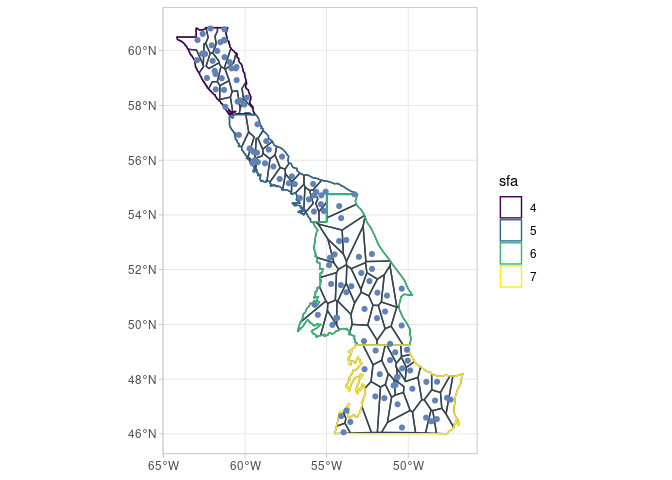
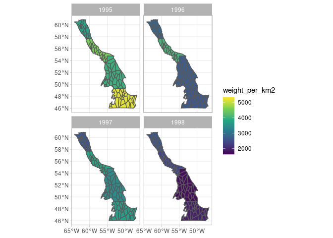
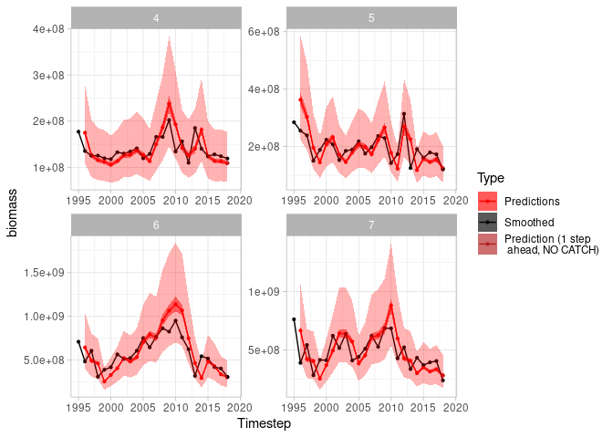

<!-- README.md is generated from README.Rmd. Please edit that file -->

# sspm


<!-- badges: start -->

[](https://opensource.org/license/MIT)
[](https://github.com/pedersen-fisheries-lab/sspm/actions)
[](https://app.codecov.io/gh/pedersen-fisheries-lab/sspm)
[](https://CRAN.R-project.org/package=sspm/)
[](https://github.com/pedersen-fisheries-lab/sspm/releases/latest)
[](https://CRAN.R-project.org/package=sspm)
[](https://github.com/pedersen-fisheries-lab/sspm/blob/main/DESCRIPTION)
[](https://www.doi.org/)

<!-- badges: end -->

The goal of `sspm` is to implement a gam-based spatial surplus
production model, aimed at modeling northern shrimp population in Canada
but potentially to any stock in any location. The package is opinionated
in its implementation of SPMs as it internally makes the choice to use
penalized spatial gams with time lags based on Pedersen et al. (2020).
However, it also aims to provide options for the user to customize their
model.

## Installation

You can install the released version of sspm from
[CRAN](https://CRAN.R-project.org) with:

``` r
install.packages("sspm")
```

You can install the development version from
[GitHub](https://github.com/) with:

``` r
# install.packages("devtools")
devtools::install_github("pedersen-fisheries-lab/sspm")
# if you wish to build the vignettes:
devtools::install_github("pedersen-fisheries-lab/sspm", build_vignettes = TRUE)
```

## Purpose

The `sspm` package follows a strict workflow, where spatial boundaries
need to be defined and discretized into patches, so that we can apply a
spatial GAM to the data. You can either use of of our built in methods
for discretization or implement your own. Below is an example of a
discretized set of patches:



Then, we provide a framework to ingest trawling and fishing data, and
smoothing the model spatially:



Finally, the package allows for calculating the surplus production on a
yearly basis, and model the impact of different variables on that
productivity. You can then produce **one step ahead predictions** for
the biomass.



For an overview of the package design, please see our [workflow
diagram](https://pedersen-fisheries-lab.github.io/sspm/articles/Package_and_workflow_design.html).

### Getting started

See the example vignette for an introduction to the `sspm` workflow.

``` r
browseVignettes("sspm")
```

## See also

`sspm` is opinionanted in its workflow and its use of GAMS, but other
frameworks exist to make use of surplus production models (usually not
in spatial capacity, however):

- [`openmse`](https://openmse.com/features-assessment-models/3-sp/)
- [`TropFishR`](https://github.com/tokami/TropFishR)

## Issues and support

If you have found an issue with this package or are seeking support,
open an issue on this repository describing the problem and including a
minimal reproducible example.

## Cite this package

You can cite this package like this “we ran a spatial surplus production
model using the the R package sspm (Lucet & Pedersen 2022)”. Here is the
full bibliographic reference to include in your reference list
(publication pending, don’t forget to update the ‘last accessed’ date):

> Lucet, V., E. Pedersen (2022). The sspm R package: spatial surplus
> production models for the management of northern shrimp fisheries. The
> Journal of Open Source Software
> (<https://joss.theoj.org/papers/10.21105/joss.04724>)

Or see the [package citation
page](https://pedersen-fisheries-lab.github.io/sspm/authors.html#citation).

## Code of Conduct

Please note that the sspm project is released with a [Contributor Code
of
Conduct](https://contributor-covenant.org/version/2/1/CODE_OF_CONDUCT.html).\](<https://contributor-covenant.org/version/2/1/CODE_OF_CONDUCT.html>).)
By contributing to this project, you agree to abide by its terms.
