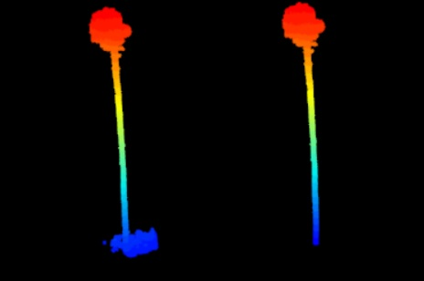
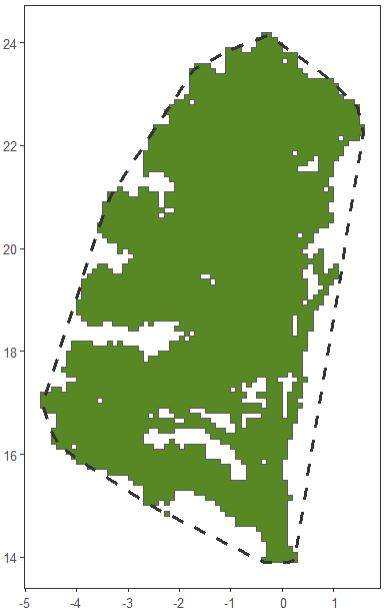
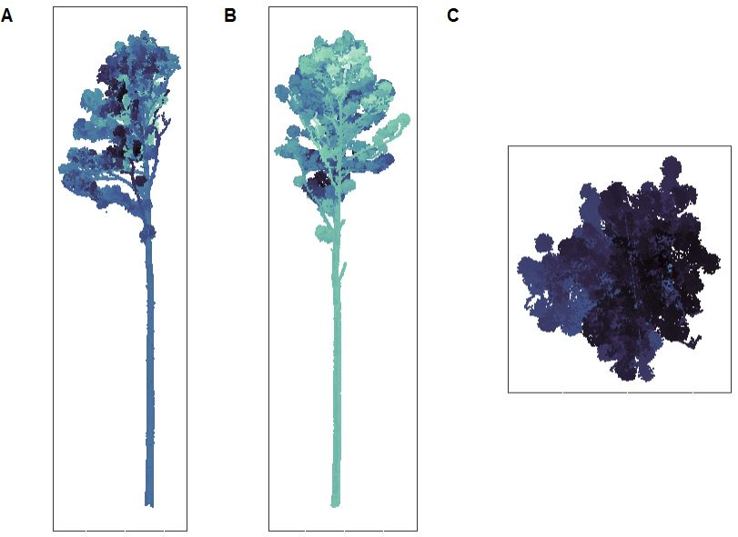
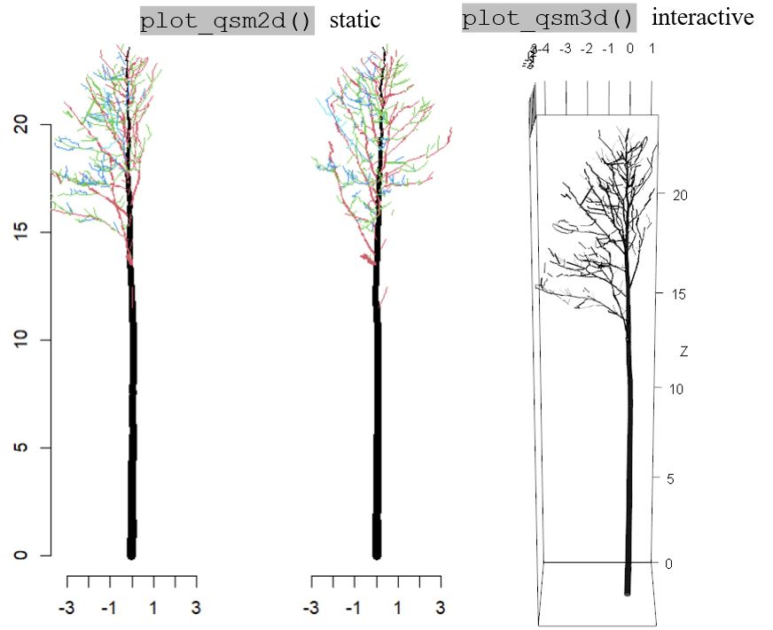
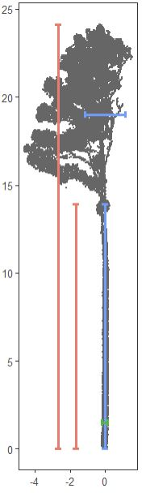

# 🌲📐tReeTraits 📐🌲

**An R Package to generate data on tree architecture from terrestrial lidar scans**

`tReeTraits` helps quantify tree architecture, especially traits relevant to windfirmness (e.g., crown area, volume, stem taper, branch size distribution), from individually segmented trees in terrestrial lidar datasets.

It combines functionality from multiple tools including [TreeQSM](https://github.com/InverseTampere/TreeQSM/), [PyTLidar](https://github.com/Landscape-CV/PyTLiDAR), [lidR](https://r-lidar.github.io/lidRbook/), [spanner](https://github.com/bi0m3trics/spanner), and follows methods described in Cannon et al. (in prep).

------------------------------------------------------------------------

## ✨ Features

-   **Preprocessing**: Recenter, normalize, rotate trees, and clean surrounding vegetation.
-   **Point Cloud Metrics**: Crown width, height, volume, DBH, crown base height, lever arm, lacunarity, etc.
-   **QSM Integration**: Run [TreeQSM](https://github.com/InverseTampere/TreeQSM/) from R via [PyTLiDAR](https://github.com/Landscape-CV/PyTLiDAR) to compute stem and branching traits.
-   **QSM Metrics**: Center of mass, trunk taper, branch diameter distributions, branching patterns
-   **Visualization**: Built-in diagnostic plots for inspection and reporting.

## 📦 Installation

This package depends on CRAN and GitHub packages:

```{r}
install.packages("lidR")
install.packages("remotes")  # For GitHub installation

# Install tReeTraits itself
install.packages("tReetraits") #latest CRAN release
devtools::install_github("jbcannon/tReeTraits") #development version
```

## 🔧 Requirements (for QSM features)

### PyTLidar Setup (Run once per machine)

To use the TreeQSM functionality, you must have a conda environment named 
`r-reticulate-pytlidar`, running **Python 3.11** with the **PyTLidar** 
package and its dependencies installed. 
This is handled automatically by the `setup_pytlidar()` function which must
be run once on each new machine.  Once installed the environment 
is automatically detected when the package is loaded.

To enable TreeQSM functionality, run:

```{r}
setup_pytlidar()
```

This installs miniconda if needed, creates a dedicated Python environment, 
and installs PyTLidar and required dependencies.

### Routine usage

The environment is automatically checked with each call to the `run_treeqsm`
function. If the environment is missing, you will be prompted to run
`setup_pytlidar()`.

## 🚀 Getting Started

### Pre-processing an Example tree

```{r}

library(tReeTraits)
library(lidR)

# load example data
las_filename = system.file("extdata", "tree_0744.laz", package = "tReeTraits")
#las_filename = "C:/path/to/data/myfile.las" #or your own data
las <- readLAS(las_filename)

# Clean and preprocess: recenter, normalize, remove understory vegetation
las_clean <- clean_las(las, bole_height = 2)

# Plot tree from 3 angles
plot_tree(las_clean)
```



Pine tree with vegetation around bole removed.

### Basic Trait Calcuation

```{r}
height <- get_height(las_clean)
width  <- get_width(las_clean)[1]
dbh    <- get_dbh(las_clean, select_n = 30)
cbh    <- get_crown_base(las_clean, threshold = 0.25, sustain = 2)
```

### Crown Structure and Volume

```{r}
# first detect crown points with `segment_crown()`
las_crown <- segment_crown(las_clean, crown_base_height = cbh)

# calculate crown size statistics
area_convex <- st_area(convex_hull_2D(las_crown))
area_voxel  <- st_area(voxel_hull_2D(las_crown))
lacunarity  <- get_lacunarity(las_crown)
volume_alpha <- get_crown_volume_alpha(las_crown)
volume_voxel <- get_crown_volume_voxel(las_crown)

```



Illustration of convex hull (dashed line) and voxel hull (green feature) from example tree. The proportion of whitespace within the convex hull represents lacunarity (\~20%)

### 🌲 Example: Running TreeQSM from tReeTraits to generate a Quantitative Structure Model (QSM)

This example shows how to generate a Quantitative Structure Model (QSM) from a single-tree point cloud using TreeQSM via `tReeTraits`.

#### Step 0. Ensure PyTLidar is available

```{r}
library(tReeTraits)

# Creates and manages an isolated Python environment if needed
setup_pytlidar()
# Note that you may need to Restart R to complete installation
# Only need to run once per machine
```
#### Step 1. Define input file

```{r}
# Input file
file <- system.file("extdata", "tree_0744.laz", package = "tReeTraits")
tree_id <- tools::file_path_sans_ext(basename(file))
```
#### Step 2. Run TreeQSM

Multiple parameter combinations can be supplied. 
TreeQSM optimizes across them

```{r}
qsm_result <- run_treeqsm(
  file = file,
  intensity_threshold = 40000,
  resolution = 0.02,
  patch_diam1 = c(0.05, 0.1),
  patch_diam2min = c(0.04, 0.05),
  patch_diam2max = c(0.12, 0.14),
  verbose = TRUE
)
```

####  Step 3. View results 

```{r}
# View the parameters of the best model
params = qsm_result$qsm_pars
print(params)

# Plot the qsm in 2d or 3d (Note 3d drawing is slow)
qsm = qsm_result$qsm
plot_qsm2d(qsm, scale=40)
#plot_qsm3d(qsm)
```

####  Step 4. Save results 

```{r}
write_qsm(
  qsm_result,
  name = tree_id,
  output_dir = tempdir()
)

```

### 📐 Tree Geometry traits from QSM

These functions analyze tree geometry and volume from Quantitative Structure Models (QSMs), enabling detailed trait extraction and modeling.

```{r}
qsm_file = system.file("extdata", "tree_0744_qsm.txt", package='tReeTraits')
qsm = load_qsm(qsm_file)
```

Using the generated QSM, you can use the following functions for tree geometry traits

`branch_volume_weighted_stats(qsm, breaks=NULL, FUN = mean)` Calculates volume-weighted branch diameter statistics using outputs from `branch_size_distribution()`.

`get_primary_branches(qsm)` Extracts primary branches (branching order = 1 attached to trunk) from the QSM.

`qsm_volume_distribution(qsm, terminus_diam_cm=4, segment_size=0.5)` Estimates tree volume and vertical distribution by separating trunk, terminus (top trunk \< terminus_diam_cm), and primary branches. Returns diameters, heights, and volumes by section for further biomass or mass-volume modeling.

`fit_taper_Kozak(qsm, dbh, terminus_diam_cm=4, segment_size=0.25, plot=TRUE)` Fits Kozak’s taper equation to trunk segments, modeling diameter as a function of relative height:

$$ d(h)/D = a_0 +a_1(h/H)+a_2(h/H)^2+a_3(h/H)^3 $$

Outputs model coefficients, R², RMSE, and an optional plot.

`get_stem_sweep(qsm, terminus_diam_cm=4, plot=TRUE)` Computes tree sweep by measuring deviations of trunk points from a straight idealized line between the top and bottom QSM trunk segments. Returns sweep distances by height for quantifying stem curvature. Optionally plots sweep vs. height.

`get_stem_tilt(qsm, terminus_diam_cm=4)` Calculates overall stem tilt as the angle between the straight line connecting the lowest and highest trunk points and the vertical axis. Outputs tilt angle in degrees, quantifying tree lean.

### 🩺 Diagnostic Plots

This section provides functions to generate diagnostic plots that help visualize tree point clouds, QSMs, and related metrics to identify potential errors or assess data quality.

#### Plot Tree Point Cloud

Creates a 3-panel plot showing two vertical profiles (X-Z and Y-Z) and an overhead (X-Y) view of the tree crown point cloud. Useful for spotting stray points or segmentation errors.

```{r}
plot_tree(las, res = 0.05, plot = TRUE)
```



Figure illustrating 3 views of tree_0129

#### Plot Quantitative Structure Model (QSM)

Displays a simple base R plot of the QSM colored by branching order, optionally showing two rotated views.

```{r}
qsm_file = system.file("extdata", "tree_0744_qsm.txt", package='tReeTraits')
qsm = load_qsm(qsm_file)
plot_qsm2d(qsm)
plot_qsm3d(qsm)
```



`plot_qsm2d()` and `plot_qsm3d()` output for tree-0744

### Basic Tree Measurements Diagnostic Plot

Visualizes basic tree measurements (height, crown base height, crown width, DBH) overlaid on a voxel-thinned point cloud.

```{r}
las_file = system.file("extdata", "tree_0744.laz", package="tReeTraits")
las = lidR::readLAS(las_file)
las = clean_las(las)
basics_diagnostic_plot(las, height=24.1, cbh=13.9, crown_width=2.29, dbh=0.329, res = 0.1)
```



`basics_diagnostic_plot()` output for tree-0129

#### See also

-   Crown Hull Diagnostic Plot `hull_diagnostic_plot(las, res = 0.1)`
-   Taper Diagnostic Plot `taper_diagnostic_plot(qsm, dbh)`
-   Branch Diameter Distribution Plot `branch_distribution_plot(qsm)`
-   Full Diagnostic Plot `full_diagnostic_plot(las, qsm, height, cbh, crown_width, dbh, res = 0.1)`

------------------------------------------------------------------------

## 📖 Citation

The `treeTraits` package is associated with Cannon et al. (in press) XXXX. Please return at a later date for a full citation.
