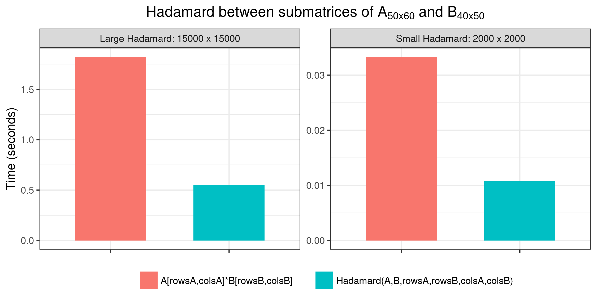

```{r initialsetup, include=FALSE}
knitr::opts_chunk$set(cache=FALSE)
library(tensorEVD)
```

### Definition

For any two matrices $\textbf{A} = \{a_{ij}\}$ and $\textbf{B} = \{b_{ij}\}$ of the same dimensions $m\times n$, the Hadamard product between them is defined as the element-wise or entry-wise product

$$
\textbf{A}\odot\textbf{B} = \{a_{ij}b_{ij}\}
$$

This can be performed using the R's product operator (`*`). Alternatively, the `Hadamard()` function from the 'tensorEVD' R-package can be used.

### Examples

#### Example 1
Direct product of compatible matrices, i.e., having the same dimension.
```{r eval=TRUE, echo=TRUE}
# Simulating matrices A and B
m = 100; n = 150
A <- matrix(rnorm(m*n), ncol=n)
B <- matrix(rnorm(m*n), ncol=n)

# Making the Hadamard product
K1 <- A*B
K2 <- Hadamard(A, B)

all.equal(K1, K2) # should be equal
```

#### Example 2
**Simple scalar multiplication**. Let $a$ be a scalar and $\textbf{B}$ any matrix. Then, using the R's product operator (`*`) will multiply $\textbf{B}$ by the scalar. However, the `Hadamard()` function will produce an error because incompatibility.

```{r eval=TRUE, echo=TRUE}
a <- 10
B <- matrix(1:6, ncol=2)

a*B    # using the product operator
try(Hadamard(a, B), silent=TRUE)[[1]] # using the Hadamard function
```

Making the product is possible using `IDrowA` and `IDcolA` arguments (see next section)

```{r eval=TRUE, echo=TRUE}
Hadamard(a, B, IDrowA=rep(1,nrow(B)), IDcolA=rep(1,ncol(B)))
```

In this scalar-matrix case, an easier alternative will be using a Kronecker product, see `help(Kronecker)`

```{r eval=TRUE, echo=TRUE}
Kronecker(a, B)
```

### Hadamard with incompatible matrices

If $\textbf{A}$ and $\textbf{B}$ are not of the same dimensions (e.g., $\textbf{A}$ is $m \times n$ and $\textbf{B}$ is $p \times q$), the Hadamard product is not defined

```{r eval=TRUE, echo=TRUE}
# Simulating A and B of different dimensions
m = 100; n = 150
p = 200; q = 120
A <- matrix(rnorm(m*n), ncol=n)  # m x n
B <- matrix(rnorm(p*q), ncol=q)  # p x q

try(A*B, silent=TRUE)[[1]]
```

However, a Hadamard product can be still performed between $\textbf{A}$ and $\textbf{B}$ using incidence matrices of appropriate dimensions

#### Subsetting one matrix

A Hadamard product between $\textbf{B}$ and a sub-matrix of $\textbf{A}$ can be performed by doing

$$
(\textbf{R}\textbf{A}\textbf{C}') \odot \textbf{B}
$$

where $\textbf{R}$ and $\textbf{C}$ are incidence matrices mapping, respectively, from rows and columns of $\textbf{A}$ to rows and columns of the sub-matrix.

Product matrix $\textbf{R}\textbf{A}\textbf{C}'$ can be obtained by matrix indexing using, for instance, integer vectors `IDrowA` and `IDcolA`, as `A[IDrowA,IDcolA]`. Therefore, the Hadamard product can be obtained by doing `A[IDrowA,IDcolA]*B`. This Hadamard will be of the same dimensions as $\textbf{B}$.

The `Hadamard()` function computes this Hadamard product directly from $\textbf{A}$ without forming `A[IDrowA,IDcolA]` matrices. For example

```{r eval=TRUE, echo=TRUE}
# Subsetting rows and columns of A each of length 
# equal to nrow(B) and ncol(B), respectively
IDrowA <- sample(seq(nrow(A)), nrow(B), replace=TRUE)
IDcolA <- sample(seq(ncol(A)), ncol(B), replace=TRUE)

# Making the Hadamard product
K1 <- Hadamard(A, B, IDrowA=IDrowA, IDcolA=IDcolA)
K2 <- A[IDrowA,IDcolA]*B

all.equal(K1, K2)
```

Likewise, a Hadamard product between $\textbf{A}$ and a sub-matrix of $\textbf{B}$, say `B[IDrowB,IDcolB]`, can be performed. For example,

```{r eval=TRUE, echo=TRUE}
IDrowB <- sample(seq(nrow(B)), nrow(A), replace=TRUE)
IDcolB <- sample(seq(ncol(B)), ncol(A), replace=TRUE)

K1 <- Hadamard(A, B, IDrowB=IDrowB, IDcolB=IDcolB)
K2 <- A*B[IDrowB,IDcolB]

all.equal(K1, K2)
```

#### Hadamard between two sub-matrices

A Hadamard product between a sub-matrix of $\textbf{A}$ and a sub-matrix of $\textbf{B}$ can be computed if the indexed matrices `A[IDrowA,IDcolA]` and `B[IDrowB,IDcolB]` are compatible, i.e., as long as, `length(IDrowA)` = `length(IDrowB)` and `length(IDcolA)` = `length(IDcolB).` Therefore, this allows to obtain a Hadamard product of any desirable dimension different from that of $\textbf{A}$ or $\textbf{B}$.

```{r eval=TRUE, echo=TRUE}
dm <- c(1000, 2000)  # a Hadamard of 1000 x 2000

# Obtaining a sub-matrix from A
IDrowA <- sample(seq(nrow(A)), dm[1], replace=TRUE)
IDcolA <- sample(seq(ncol(A)), dm[2], replace=TRUE)

# Obtaining a sub-matrix from B
IDrowB <- sample(seq(nrow(B)), dm[1], replace=TRUE)
IDcolB <- sample(seq(ncol(B)), dm[2], replace=TRUE)

# Making the Hadamard product
K1 <- Hadamard(A, B, IDrowA=IDrowA, IDrowB=IDrowB, IDcolA=IDcolA, IDcolB=IDcolB)
K2 <- A[IDrowA,IDcolA]*B[IDrowB,IDcolB]

all.equal(K1, K2)
```

#### Benchmark

Here we compare the speed performance of the `Hadamard()` function and of the product operator (`*`) on calculating small and large Hadamard products by subsetting from matrices $\textbf{A}$ and $\textbf{B}$. The following benchmark was performed using the code provided in this [script](https://raw.githubusercontent.com/MarcooLopez/tensorEVD/main/misc/code_doc/hadamard_bm1.R) run on a Linux environment based on the following system settings:

- Machine: Intel(R) Xeon(R) Gold 6148 CPU @ 2.40GHz
- Memory: 64 GB in RAM
- R version 4.1.1 (2021-08-10)

<p style="text-align: center">
{ width=95% }`
</p>

### Extras

#### Inplace calculation

If $\textbf{A}$ is used as such (i.e., is not indexed), the resulting Hadamard will be of the same dimension as $\textbf{A}$; therefore, we could overwrite the result on the memory occupied by $\textbf{A}$ 

Usually, assigning an output to an object will occupy a different memory address than inputs:

```{r eval=TRUE, echo=TRUE}
A <- matrix(rnorm(30), ncol=5)
B <- matrix(rnorm(30), ncol=5)

K1 <- A[]                     # copy of A to be used as input
add  <- pryr::address(K1)     # address of K on entry
K1 <- Hadamard(K1, B)
pryr::address(K1) == add      # on exit, K was moved to a different address
```

The argument `inplace` can be used to store the output at the same address as the input:

```{r eval=TRUE, echo=TRUE}
K2 = A[]   
add  = pryr::address(K2)
K2 <- Hadamard(K2, B, inplace=TRUE)
pryr::address(K2) == add     # on exit, K remains at the same address
all.equal(K1, K2)       
```

#### Making dimension names

Row and column names for the Hadamard product can be retrieved using the `make.dimnames` argument. Attribute `dimnames` of the Hadamard will be produced by crossing `rownames` and `colnames` of input $\textbf{A}$ with those of input $\textbf{B}$. For instance,

```{r eval=TRUE, echo=TRUE}
A <- matrix(1:16, ncol=4)
B <- matrix(10*(1:16), ncol=4)

dimnames(A) <- list(paste("week",1:4), month.abb[1:4])
dimnames(B) <- list(c("chicken","beef","pork","fish"), LETTERS[1:4])

Hadamard(A, B, make.dimnames=TRUE)
Hadamard(A, B, make.dimnames=TRUE, IDcolA=c(1,1,1,1), IDrowB=c(2,3,2,3))
```

