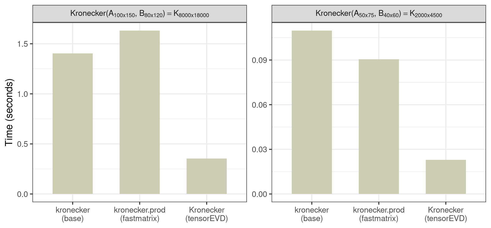
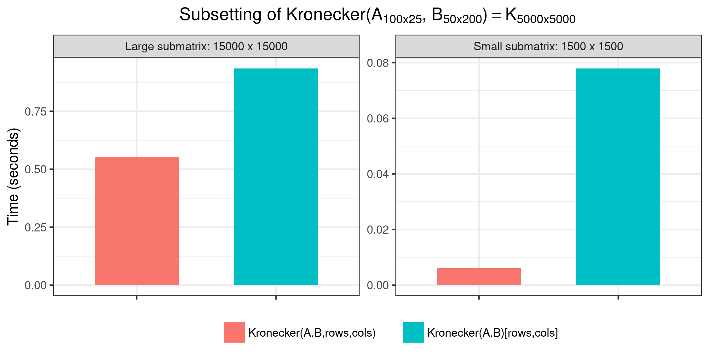

```{r initialsetup, include=FALSE}
knitr::opts_chunk$set(cache=FALSE)
library(tensorEVD)
```

### Definition

For any two matrices $\textbf{A} = \{a_{ij}\}$ of dimensions $m\times n$ and $\textbf{B} = \{b_{ij}\}$ of dimensions $p\times q$, the direct Kronecker product between them is the matrix of dimensions $mp\times nq$ defined as the block matrix

$$
\textbf{A}\otimes\textbf{B} = \{a_{ij}\textbf{B}\}
$$

This can be computed using the `kronecker()` function from the 'base' R-package. Alternatively, the `Kronecker()` function from the 'tensorEVD' R-package can be used.

### Examples

#### Example 1
**Simple scalar multiplication**. Let $a$ be a scalar and $\textbf{B}$ any matrix. Then, computing their Kronecker product is the same as multiplying $\textbf{B}$ by the scalar:

```{r eval=TRUE, echo=TRUE}
a <- 10
( B <- matrix(1:6, ncol=2) )
Kronecker(a, B)
# In this case, should be equal to Kronecker(B, a)
Kronecker(B, a)
```

#### Example 2
**Block diagonal matrix**. A block diagonal matrix can be formed using the Kronecker product with a diagonal matrix

```{r eval=TRUE, echo=TRUE}
D <- diag(1, 2)
Kronecker(D, B)
# Is not equal to
Kronecker(B, D)    # this a 'striped' matrix
```

#### Example 3
**Outer product**. Let $\textbf{a}$ and $\textbf{b}$ be any two vectors. Then, the Kronecker product between $\textbf{a}$ and the transpose of $\textbf{b}$ form an outer product:

```{r eval=TRUE, echo=TRUE}
a <- c(1,2,3)
b <- c(4,5)
Kronecker(a, t(b))
# Should be equal to the product a b'
tcrossprod(a, b)
```

### Performance

Here we compare tensorEVD's `Kronecker()` function with the `kronecker()` function from the 'base' R-package in the computation of a Kronecker product of two general matrices $\textbf{A}$ and $\textbf{B}$.  

```{r eval=TRUE, echo=TRUE}
# Simulating matrices A and B
m = 20; n = 20
p = 40; q = 30
A <- matrix(rnorm(m*n), ncol=n)
B <- matrix(rnorm(p*q), ncol=q)

# Making the Kronecker product
K1 <- kronecker(A, B)                    
K2 <- Kronecker(A, B)                   

# Should be equal
all.equal(K1,K2)
```

#### Benchmark

Here we compare these methods in terms of computational speed in scenarios with small and large matrices. We included in the benchmark the `kronecker.prod()` function from the 'fastmatrix' R-package. The following benchmark was performed using the code provided in this [script](https://raw.githubusercontent.com/MarcooLopez/tensorEVD/main/misc/code_doc/kronecker_bm1.R) run on a Linux environment based on the following system settings:

- Machine: Intel(R) Xeon(R) Gold 6148 CPU @ 2.40GHz
- Memory: 64 GB in RAM
- R version 4.1.1 (2021-08-10)

<center>
{ width=95% }
</center>

### Subsetting a Kronecker

A sub-matrix formed by selecting specific rows and columns from the Kronecker can be done by pre- and post- multiplication with incidence matrices, for instance

$$
\textbf{R}(\textbf{A}\otimes\textbf{B})\textbf{C}'
$$

where $\textbf{R}$ and $\textbf{C}$ are an incidence matrices mapping, respectively, from rows and columns of the Kronecker to rows and columns of the sub-matrix.

This sub-matrix can be obtained by indexing rows or columns using, for instance, integer vectors `rows` and `cols` as `Kronecker(A, B)[rows,cols]`. However, this approach computes first the Kronecker product then makes the subsetting.

This approach can be inefficient if a relatively small number of rows and columns are to be selected. The `Kronecker()` function can derive this sub-matrix directly from $\textbf{A}$ and $\textbf{B}$ on the fly without forming the full Kronecker product using `rows` and `cols` as arguments. For example,

```{r eval=TRUE, echo=TRUE}
dm <- c(nrow(A)*nrow(B), ncol(A)*ncol(B))    # dimension of the Kronecker

# Subsetting a matrix with 30% of rows/columns
rows <- sample(seq(dm[1]), 0.3*dm[1])
cols <- sample(seq(dm[2]), 0.3*dm[2])

K1 <- Kronecker(A, B)[rows,cols]
K2 <- Kronecker(A, B, rows=rows, cols=cols)

all.equal(K1, K2)
```

#### Benchmark

Here we show some benchmark results on the time performance of subsetting a Kronecker matrix using `Kronecker(A, B, rows, cols)` and `Kronecker(A, B)[rows,cols]`, for small (30% of the rows/columns) and large (300% of the rows/columns) sub-matrices scenarios, from a Kronecker product matrix of dimension $5000\times 5000$. The code to perform this benchmark is provided in this [script](https://raw.githubusercontent.com/MarcooLopez/tensorEVD/main/misc/code_doc/kronecker_bm2.R).

<center>
{ width=95% }
</center>

### Extras

#### Inplace calculation

If $\textbf{A}$ is a matrix and $\textbf{B}$ is a scalar, the resulting Kronecker will be of the same dimensions as $\textbf{A}$; therefore, we could overwrite the result on the memory occupied by $\textbf{A}$.

Usually, assigning an output to an object will occupy a different memory address than inputs:

```{r eval=TRUE, echo=TRUE}
B <- rnorm(1) # B is a scalar
K1 = A[]                     # copy of A to be used as input
add  = pryr::address(K1)     # address of K on entry
K1 = Kronecker(K1, B)
pryr::address(K1) == add     # on exit, K was moved to a different address
```

The parameter `inplace` can be used to overwrite the output at the same address as the input:

```{r eval=TRUE, echo=TRUE}
K2 = A[]   
add  = pryr::address(K2)
K2 = Kronecker(K2, B, inplace=TRUE)
pryr::address(K2) == add     # on exit, K remains at the same address
all.equal(K1, K2)
```

#### Making dimension names

Row and column names for the Kronecker product can be retrieved using the `make.dimnames` argument. Attribute `dimnames` of the Kronecker will be produced by crossing `rownames` and `colnames` of input $\textbf{A}$ with those of input $\textbf{B}$. For instance,

```{r eval=TRUE, echo=TRUE}
A <- matrix(1:9, ncol=3)
B <- matrix(10*(1:4), ncol=2)

dimnames(A) <- list(paste("week",1:3), month.abb[1:3])
dimnames(B) <- list(c("office","home"), LETTERS[1:2])

Kronecker(A, B, make.dimnames=TRUE)
```
